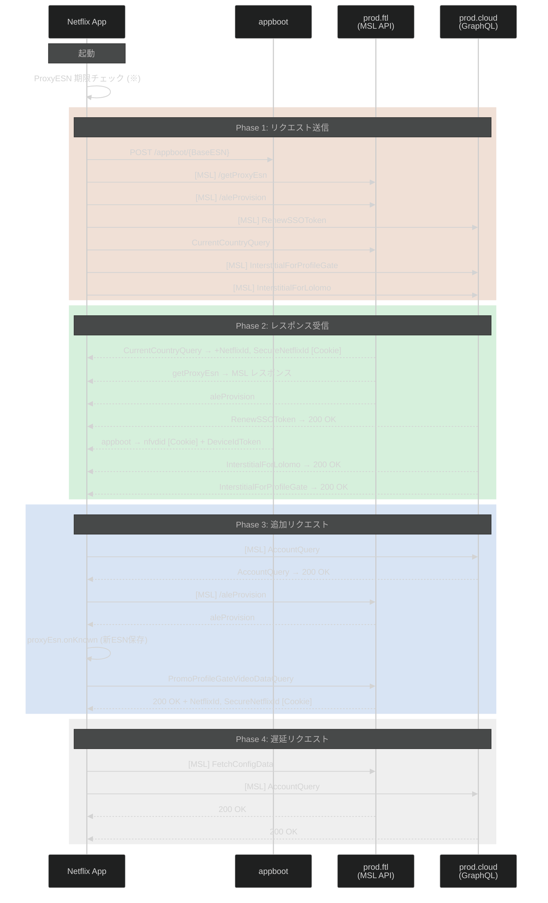
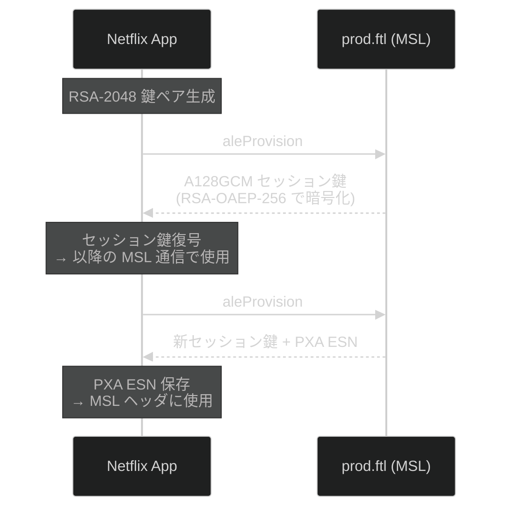
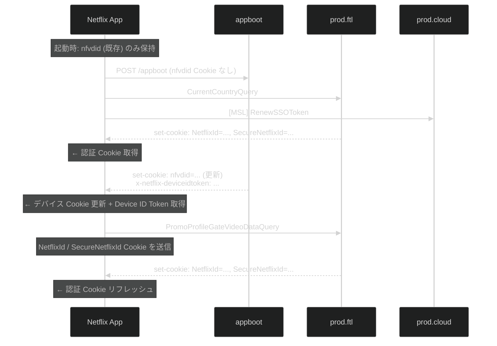
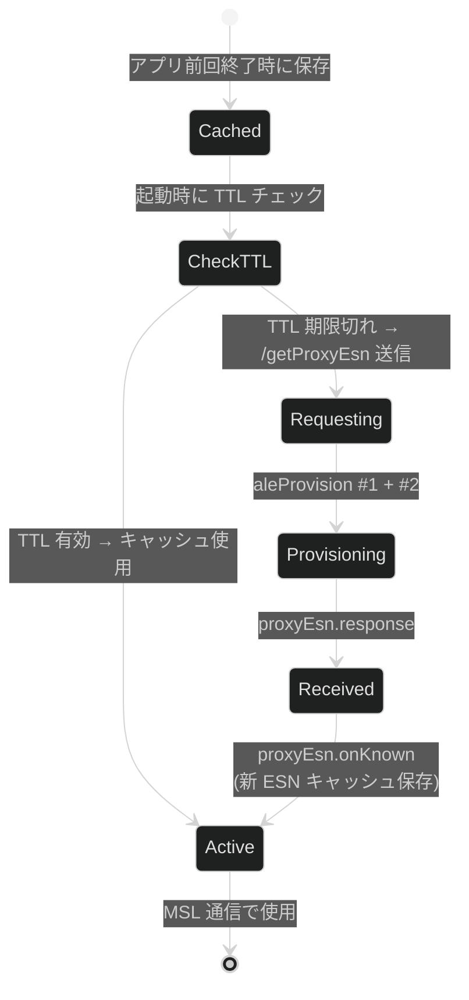

# Netflix Android 起動時認証フロー

> **対象:** Netflix Android v9.57.0 (build 63928)
> **デバイス:** Pixel 4a (5G) / bramble / Android 14
> **取得方法:** Frida フック (`hook_netflix_android.js`) + `run.py` による JSONL キャプチャ
> **キャプチャ日:** 2026-03-14

---

## 1. 概要

Netflix Android アプリの起動時に発生する認証・プロビジョニングフローを、キャプチャしたトラフィックから再構成した。

各 API のリクエスト・レスポンス詳細は [auth_flow_android_api.md](auth_flow_android_api.md) を参照。

### 1.1 通信先エンドポイント

| エンドポイント | 略称 | プロトコル | 用途 |
|---|---|---|---|
| `android14.appboot.netflix.com` | **appboot** | HTTPS (MSL レスポンス) | デバイス登録・`nfvdid` Cookie 発行 |
| `android14.prod.ftl.netflix.com` | **prod.ftl** | HTTPS + MSL | MSL API (`/nq/androidui/samurai/`) + GraphQL |
| `android14.prod.cloud.netflix.com` | **prod.cloud** | HTTPS + MSL | GraphQL via MSL |

### 1.2 通信の分類

| 分類 | Content-Encoding | ボディ形式 | 認証方式 |
|---|---|---|---|
| **MSL API** | `msl_v1` | CBOR → GZIP → JSON | MSL トークン (Master Token + User Auth Data) |
| **Non-MSL GraphQL** | なし | JSON | Cookie (`NetflixId` / `SecureNetflixId`) |
| **Appboot** | なし (レスポンスは `application/x-msl+json`) | Query String | `nfvdid` Cookie |

---

## 2. 認証フロー全体像

---

## 3. フェーズ概要

### 3.1 Phase 0: ProxyESN 期限チェック

アプリ起動時、`ProxyEsn.$init` でキャッシュ済み PXA ESN の期限がチェックされる。期限切れの場合はサーバーから新しい PXA ESN を取得する。

> **※ キャプチャ時の注意:** 今回のキャプチャでは Frida フック (`hook_msl.js`) が `ProxyEsn.$init` で `expired` フラグを強制的に `true` に書き換えているため、TTL が残っていても必ず再取得が発生する。通常の動作では TTL が有効ならキャッシュがそのまま使用される。

### 3.2 Phase 1: リクエスト送信

起動後、以下のリクエストが並列に送信される:

1. **Appboot** — デバイス登録・Cookie 発行
2. **getProxyEsn** (MSL) — PXA ESN 取得
3. **aleProvision #1** (MSL) — RSA-OAEP-256 鍵交換
4. **RenewSSOToken** (MSL → GraphQL) — SSO トークン更新
5. **CurrentCountryQuery** — 国情報取得 + 認証 Cookie 発行
6. **InterstitialForProfileGate / InterstitialForLolomo** (MSL → GraphQL) — UI 中間画面チェック

### 3.3 Phase 2: レスポンス受信

Phase 1 のレスポンスが順次到着する。主要なデータ:

- **CurrentCountryQuery** のレスポンスで `NetflixId` / `SecureNetflixId` Cookie が発行される
- **appboot** のレスポンスで `nfvdid` Cookie が更新され、`x-netflix-deviceidtoken` が発行される

### 3.4 Phase 3: 追加リクエスト

Phase 2 のレスポンスを受けて追加リクエストが送信される:

1. **AccountQuery** (MSL → GraphQL) — アカウント情報取得
2. **aleProvision #2** (MSL) — 再鍵交換 → PXA ESN 確定
3. **PromoProfileGateVideoDataQuery** — プロフィール画面データ取得

### 3.5 Phase 4: 遅延リクエスト

起動から約 30 秒後、バックグラウンドで送信される:

1. **FetchConfigData** (MSL → Samurai) — デバイス・ストリーミング設定取得
2. **AccountQuery #2** (MSL → GraphQL) — アカウント情報再取得

---

## 4. 鍵交換と暗号化フロー

### 4.1 ALE Provision パラメータ

| パラメータ | 値 | 説明 |
|---|---|---|
| `keyx.scheme` | `RSA-OAEP-256` | 鍵交換暗号化方式 (RSA with OAEP padding, SHA-256) |
| `keyx.data.pubkey` | Base64 RSA 2048-bit | クライアントが生成する使い捨て公開鍵 |
| `scheme` | `A128GCM` | セッション暗号化方式 (AES-128-GCM) |
| `type` | `SOCKETROUTER` | プロビジョニング種別 |
| `ver` | `1` | プロトコルバージョン |

### 4.2 aleProvision が 2 回呼ばれる理由

1. **#1:** 起動直後に即座に鍵交換を開始。他のリクエストと並列。
2. **#2:** getProxyEsn のレスポンスを受けた後に再度鍵交換。PXA ESN の発行と紐づく。

同一の RSA 公開鍵を使うが、サーバー側で新しいセッション鍵が発行される。

---

## 5. Cookie フロー

### 5.1 Cookie 一覧

| Cookie 名 | 発行元 | 用途 | 発行タイミング |
|---|---|---|---|
| `nfvdid` | appboot | デバイス識別子 | appboot レスポンス (set-cookie) |
| `NetflixId` | prod.ftl | ユーザー認証 | CurrentCountryQuery レスポンス |
| `SecureNetflixId` | prod.ftl | セキュア認証 (HTTPS only) | CurrentCountryQuery レスポンス |

### 5.2 重要な観察

- **MSL リクエストは Cookie に依存しない。** MSL は独自の Master Token + User Auth Data で認証を行う。
- **Non-MSL GraphQL は Cookie で認証する。** `NetflixId` / `SecureNetflixId` が必要。
- **`nfvdid` は全リクエストに付与される**が、認証には直接使われない (デバイストラッキング用)。

---

## 6. ProxyESN ライフサイクル

### 6.1 ESN の変化

| タイミング | ESN |
|---|---|
| 起動時 (キャッシュ) | `NFANDROID1-PXA-P-L3-GOOGLPIXEL=4A==5G=-22594-02025HJ6UHN1D...` |
| 更新後 | `NFANDROID1-PXA-P-L3-GOOGLPIXEL=4A==5G=-22594-0202DQTKQKE1UP...` |

- `22594` = Widevine System ID (固定)
- 末尾の HMAC 部分のみが変化 (サーバー側で新規生成)

---

## 7. セキュリティ上の観察

1. **二重認証メカニズム:** MSL (Master Token ベース) と Cookie (NetflixId ベース) の 2 系統が並行して使われる。
2. **PXA ESN ローテーション:** PXA ESN は TTL ベースで管理され、期限切れ時にサーバーから新しい ESN を取得する。今回のキャプチャでは Frida が強制失効させているため、毎回再取得が発生している。
3. **鍵の使い捨て:** aleProvision の RSA 鍵ペアはセッション単位で生成される (2048-bit)。
4. **Persisted Query:** GraphQL クエリ本文をネットワーク上で送信しないため、API スキーマの隠蔽に寄与。
5. **Cookie の分離:** `SecureNetflixId` は Secure 属性付きで HTTPS でのみ送信される。
6. **並列リクエスト:** 起動時間を最小化するため、認証に必要な全リクエストが並列に送信される。
7. **トークンの用途限定:** `ssoToken` は `RenewSSOToken` のみ、`x-netflix-deviceidtoken` は appboot レスポンスでのみ観測された。これらのトークンが HTTP レベルで他の API に転送される様子はなく、MSL レイヤー内部での使用またはローカル保持が示唆される。
