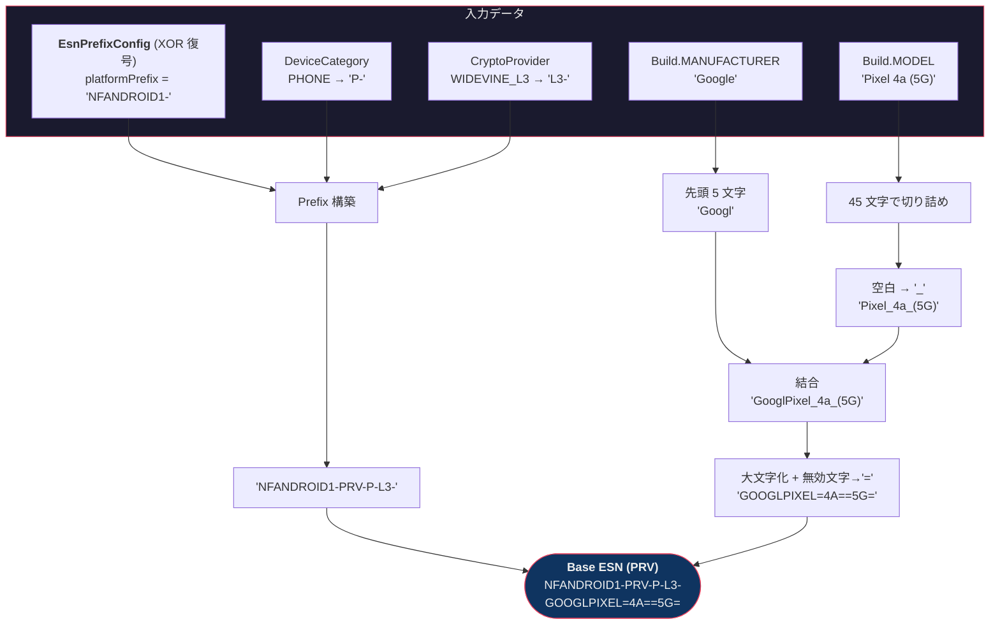
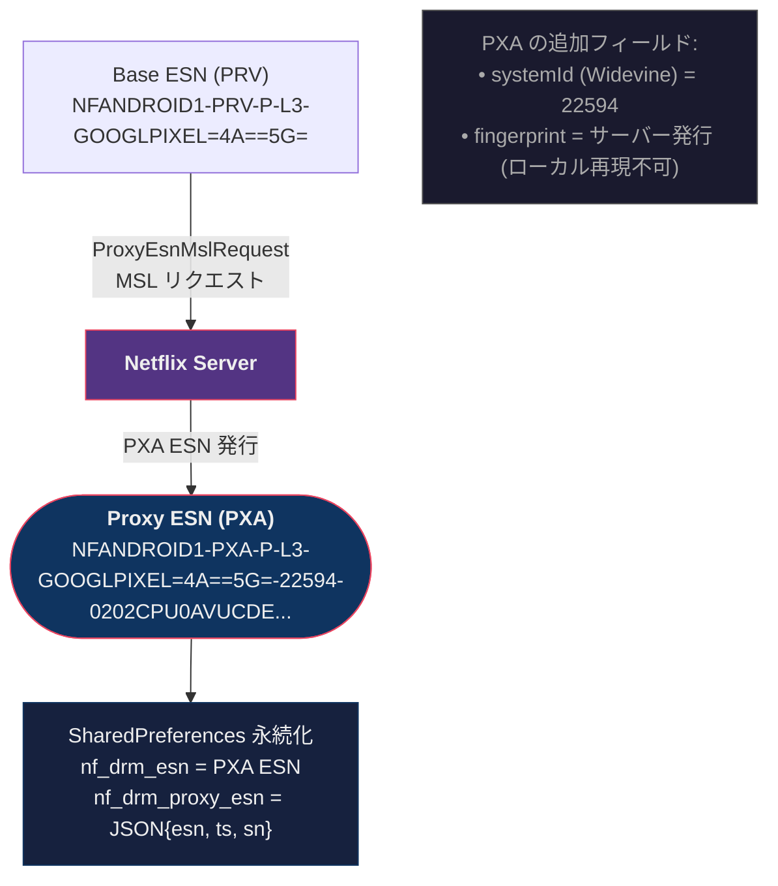
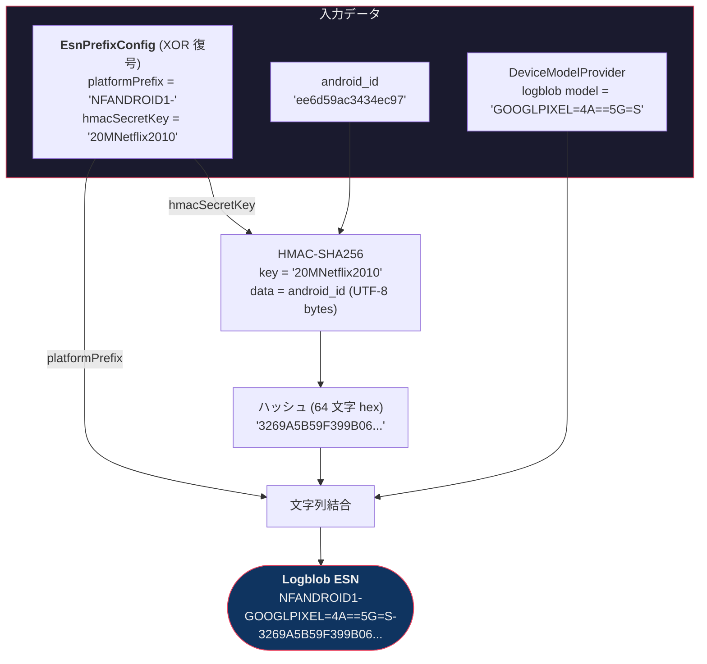
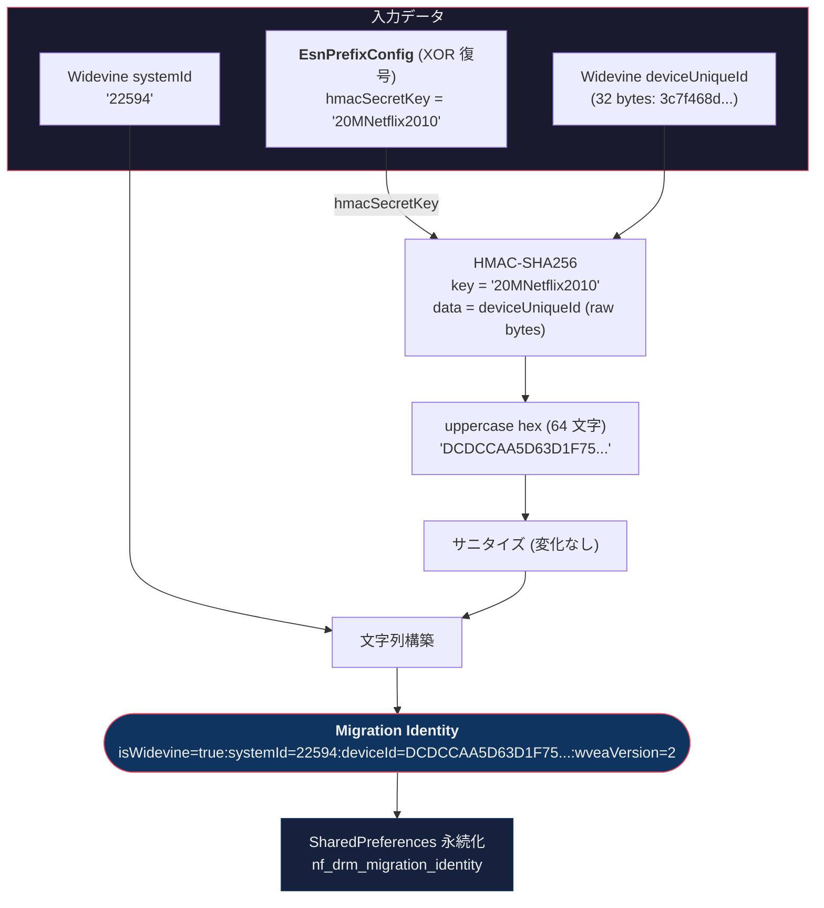

# ESN (Electronic Serial Number) — Android 生成アルゴリズム

> **対象:** Netflix Android v9.57.0 (build 63928)
> **デバイス:** Pixel 4a (5G) / bramble / Android 14
> **取得方法:** Frida ヒープダンプ (`hook_esn.js` → `Java.choose()`)

---

## 1. ESN の種類

Netflix Android では **4 種類の ESN** が使い分けられる。

| 種類 | メソッド | 用途 | 例 |
|---|---|---|---|
| **Base ESN (PRV)** | `b()` | デバイス登録・鍵交換 | `NFANDROID1-PRV-P-L3-GOOGLPIXEL=4A==5G=` |
| **Proxy ESN (PXA)** | `d()` | MSL 通信 (API コール) | `NFANDROID1-PXA-P-L3-GOOGLPIXEL=4A==5G=-22594-0202C...` |
| **Logblob ESN** | `j()` | テレメトリ・ログ | `NFANDROID1-GOOGLPIXEL=4A==5G=S-3269A5B5...` |
| **Migration Identity** | `getMigrationIdentity()` | アカウント移行 | `isWidevine=true:systemId=22594:deviceId=DCDC...:wveaVersion=2` |

---

## 2. ESN 構造

### 2.1 Base ESN (PRV)

```
NFANDROID1-PRV-P-L3-GOOGLPIXEL=4A==5G=
│          │   │ │  └─ sanitized(manufacturer_5 + model)
│          │   │ └─ Widevine Security Level (L1 or L3)
│          │   └─ Device Category (P=Phone, T=Tablet, B=TV, C=ChromeOS, E=Display)
│          └─ Type: PRV = Private (ローカル生成)
└─ Platform prefix (XOR 暗号化定数から復号)
```

### 2.2 Proxy ESN (PXA)

```
NFANDROID1-PXA-P-L3-GOOGLPIXEL=4A==5G=-22594-0202CPU0AVUCDE...
│          │   │ │  │                   │      └─ サーバー発行 fingerprint
│          │   │ │  │                   └─ Widevine systemId
│          │   │ │  └─ sanitized model (PRV と同じ)
│          │   │ └─ Security Level
│          │   └─ Device Category
│          └─ Type: PXA = Proxy (サーバー発行)
└─ Platform prefix
```

PXA ESN はサーバーから MSL レスポンスで受信し、`SharedPreferences` に永続化される。

### 2.3 Logblob ESN

```
NFANDROID1-GOOGLPIXEL=4A==5G=S-3269A5B59F399B066558C80DCB36AE97...
│          │                    └─ HMAC-SHA256(android_id, hmacKey)
│          └─ logblob model (末尾に 'S' suffix)
└─ Platform prefix
```

### 2.4 Migration Identity

```
isWidevine=true:systemId=22594:deviceId=DCDCCAA5D63D1F75...:wveaVersion=2
                │               └─ sanitize(hex(HMAC-SHA256(deviceUniqueId, hmacKey)))
                └─ Widevine systemId
```

---

## 3. 構築アルゴリズム

### 3.1 入力値

#### デバイス固有値

| 値 | 取得元 | 実測値 |
|---|---|---|
| `Build.MANUFACTURER` | `android.os.Build` | `Google` |
| `Build.MODEL` | `android.os.Build` | `Pixel 4a (5G)` |
| `android_id` | `Settings.Secure.getString()` | `ee6d59ac3434ec97` |
| Widevine `systemId` | `MediaDrm.getPropertyString("systemId")` | `22594` |
| Widevine `deviceUniqueId` | `MediaDrm.getPropertyByteArray("deviceUniqueId")` | `3c7f468d...` (32 bytes) |
| Widevine `securityLevel` | `MediaDrm.getPropertyString("securityLevel")` | `L3` (強制) |

#### XOR 暗号化定数 (`o.feO` / jadx: `C12892feO`)

`o.feO` クラスのコンストラクタで XOR 暗号 (`g()` メソッド) により復号される。

| フィールド | XOR seed | 文字数 | 復号値 | 用途 |
|---|---|---|---|---|
| `this.a` → `a()` | 263 | 11 | `NFANDROID1-` | Platform prefix |
| `this.d` → `e()` | 42043 | 14 | `20MNetflix2010` | HMAC-SHA256 秘密鍵 |
| `this.e` | 51941 | 52 | `amzn1.ask.skill.{uuid}` | Alexa skill ID |
| `this.b` → `b()` | 18671 | 124 | Base64 EC P-256 公開鍵 | 検証鍵 |

> **XOR 復号アルゴリズム** (`g()` メソッド):
> ```
> xor_base = -953881096168740883L ^ 7437109050103546004L
> for i in range(len(char_array)):
>     long_val = (char_array[i] ^ (i * seed)) ^ xor_base
>     result[i] = chr(long_val & 0xFFFF)
> ```

### 3.2 文字列サニタイズ

2 段階のサニタイズが適用される。

#### Step 1: `jNY.c(str)` — 空白→アンダースコア

```
"Pixel 4a (5G)" → "Pixel_4a_(5G)"
```

- `str.trim().replaceAll("\\s", "_")`

#### Step 2: `o.fkW.d(str)` (jadx: `C13218fkW.d`) — 大文字化 + 無効文字→`=`

```
"GooglPixel_4a_(5G)" → "GOOGLPIXEL=4A==5G="
```

- `str.toUpperCase(Locale.US)`
- `[^A-Z0-9\\-=]` にマッチする文字を `=` に置換

#### 実例

```
Build.MANUFACTURER = "Google"
Build.MODEL        = "Pixel 4a (5G)"

manufacturer_5 = "Google"[:5] = "Googl"
model_sanitized = jNY.c("Pixel 4a (5G)") = "Pixel_4a_(5G)"
combined = "Googl" + "Pixel_4a_(5G)" = "GooglPixel_4a_(5G)"
esn_model = fkW.d("GooglPixel_4a_(5G)") = "GOOGLPIXEL=4A==5G="
```

### 3.3 Base ESN 構築 (`b()`)

```java
// WidevineEntityAuthEsnProviderImpl.b()
String prefix = i();                    // "NFANDROID1-PRV-P-L3-"
String model = Build.MODEL;             // "Pixel 4a (5G)"
if (model.length() > 45) model = model.substring(0, 45);
String mfr = deviceModelProvider.e();   // "Googl" (first 5 chars)
String sanitizedModel = jNY.c(model);   // "Pixel_4a_(5G)"
String combined = mfr + sanitizedModel; // "GooglPixel_4a_(5G)"
return prefix + fkW.d(combined);        // "NFANDROID1-PRV-P-L3-GOOGLPIXEL=4A==5G="
```

### 3.4 Prefix 構築 (`i()`)

```java
// WidevineEntityAuthEsnProviderImpl.i()
StringBuilder sb = new StringBuilder(esnPrefixConfig.a());  // "NFANDROID1-"
sb.append("PRV-");

switch (deviceCategory) {
    case PHONE:     sb.append("P-"); break;
    case TABLET:    sb.append("T-"); break;
    case CHROMEOS:  sb.append("C-"); break;
    case TV:
    case STB:       sb.append("B-"); break;
    case DISPLAY:   sb.append("E-"); break;
}

if (cryptoProvider == WIDEVINE_L3) {
    sb.append("L3-");
}

// 6番目の '-' までで切り詰め
return sb.toString().substring(0, indexOf6thDash + 1);
// → "NFANDROID1-PRV-P-L3-"
```

### 3.5 Migration Identity 構築

```java
// WidevineEntityAuthEsnProviderImpl.getMigrationIdentity()
String systemId = widevineSupport.b();        // "22594"
byte[] deviceUid = widevineSupport.d();       // 32 bytes
String hmacKey = esnPrefixConfig.e();         // "20MNetflix2010"

Mac mac = Mac.getInstance("HmacSHA256");
mac.init(new SecretKeySpec(hmacKey.getBytes(UTF_8), "HmacSHA256"));
byte[] hmacResult = mac.doFinal(deviceUid);
String hexHash = toUpperHex(hmacResult);      // uppercase hex (64 chars)
String sanitized = fkW.d(hexHash);            // already valid, no change

return "isWidevine=true:systemId=" + systemId
     + ":deviceId=" + sanitized
     + ":wveaVersion=2";
```

### 3.6 Logblob ESN 構築 (`j()`)

```java
// WidevineEntityAuthEsnProviderImpl.j()
String platform = esnPrefixConfig.a();        // "NFANDROID1-"
String logModel = deviceModelProvider.a();    // "GOOGLPIXEL=4A==5G=S"
String hashId = deviceModelProvider.c();      // HMAC-SHA256(android_id, hmacKey)
return platform + logModel + "-" + hashId;
```

---

## 4. HMAC 計算の詳細

### 4.1 Migration Identity 用 (deviceUniqueId ベース)

```
Key:   "20MNetflix2010" (UTF-8 bytes: 32304d4e6574666c697832303130)
Input: deviceUniqueId bytes (32 bytes from MediaDrm)
       3c7f468d8a9a78c0609acd65b0660b61a1178ec9978d9e4bcb71e53ff190d974

HMAC-SHA256 → DCDCCAA5D63D1F757C7B1D16C1D3AAA873112C30C1448E8E0510D78C9AA17DD4
```

### 4.2 Logblob ESN 用 (android_id ベース)

```
Key:   "20MNetflix2010" (UTF-8 bytes)
Input: android_id string as UTF-8 bytes
       "ee6d59ac3434ec97" → 65653664353961633334333465633937

HMAC-SHA256 → 3269A5B59F399B066558C80DCB36AE97F9A8B477F8854DFED2C14C8453D6F556
```

> **注意:** `deviceUniqueId` はバイナリ (MediaDrm 直接取得)、
> `android_id` は文字列の UTF-8 バイト列として HMAC に渡される。

---

## 5. 永続化 (SharedPreferences)

| キー | 値 |
|---|---|
| `nf_drm_esn` | PXA ESN (文字列) |
| `nf_drm_proxy_esn` | JSON: `{"esn": "...", "ts": epoch_ms, "sn": serial_number}` |
| `nf_drm_migration_identity` | Migration Identity 文字列 |

---

## 6. クラスマッピング

| 実行時クラス名 | jadx リネーム名 | 役割 |
|---|---|---|
| `o.feO` | `C12892feO` | EsnPrefixConfig — XOR 暗号化定数 |
| `o.fkW` | `C13218fkW` | EsnProviderUtils — 文字列サニタイズ |
| `o.fkn` | `C13235fkn` | DeviceModelProvider — モデル文字列加工 |
| `o.fey` | `InterfaceC12928fey` | EsnPrefixConfig interface |
| `o.jNK` | — | SharedPreferences ヘルパー |
| `o.jNY` | — | 文字列ユーティリティ (空白→`_`) |
| `o.jMn` | `C20944jMn` | Hex エンコーダ (uppercase) |
| `o.fkX` | `C13219fkX` | MigrationIdentity 文字列ビルダー |
| — | `WidevineEntityAuthEsnProviderImpl` | ESN 組み立て本体 |
| — | `WidevineSupportImpl` | Widevine DRM メタデータ |
| — | `DeviceIdentityUtils` | android_id → HMAC fingerprint |
| — | `ProxyEsn` | PXA ESN 管理 |

---

## 7. プラットフォームプレフィックス一覧

今回のリバースエンジニアリング対象（Android APK + iOS IPA）から判明したプレフィックスは **3 種類のみ**。
他プラットフォーム (Chromecast, Roku, Smart TV, PlayStation, Xbox 等) のプレフィックスは本調査範囲では発見されておらず、存在するかどうかも不明。

### 7.1 プラットフォームプレフィックス

| プレフィックス | プラットフォーム | 発見元 | 備考 |
|---|---|---|---|
| `NFANDROID1-` | Android (Google Play) | `o.feO` の XOR 定数 (seed=263) | 主要 Android 向け |
| `NFANDROIDD-` | Android (非 GMS / デバッグ) | `jNG.java`, `CryptoProviderFactoryImpl.java` | L3 チェック条件にのみ出現 |
| `NFAPPL-` | iOS (Apple) | ログ / MSL トラフィック / `docs/msl_ios.md` | FairPlay ベース |

> **`NFANDROIDD-` について:**
> `jNG.c()` と `CryptoProviderFactoryImpl.shouldKeepDeviceOnWidevineL3()` で
> `NFANDROID1-PRV-S-L3-` と並列でチェックされている。
> `S` は特殊なプロビジョニング状態を示すと推測される（通常のトラフィックでは `P-` / `T-` 等のみ確認）。

### 7.2 デバイスカテゴリコード

`DeviceCategory` enum から ESN の第 3 セグメントへのマッピング:

| enum 値 | 文字列表現 | ESN コード | 備考 |
|---|---|---|---|
| `UNKNOWN` | `"unknown"` | *(なし)* | switch 文にマッチなし → コード付与されない |
| `PHONE` | `"phone"` | `P-` | |
| `TABLET` | `"tablet"` | `T-` | |
| `GOOGLE_TV` | `"google-tv"` | *(なし)* | switch 文にマッチなし |
| `ANDROID_TV` | — | `B-` | Box 系として統合 |
| `CHROME_OS` | — | `C-` | |
| `ANDROID_STB` | — | `B-` | ANDROID_TV と同じ `B-` |
| `SMART_DISPLAY` | `"smart-display"` | `E-` | |

> **検出優先順位** (高→低): `CHROME_OS` → `ANDROID_STB` → `ANDROID_TV` → `TABLET` → `PHONE` (フォールバック)

### 7.3 セキュリティレベルサフィックス

`CryptoProvider` enum から ESN prefix 末尾へのマッピング:

| enum 値 | ESN サフィックス | NCCP 値 | 備考 |
|---|---|---|---|
| `WIDEVINE_L1` | *(なし)* | 1 | L3 マーカーなし = L1 を暗示 |
| `WIDEVINE_L3` | `L3-` | 3 | 明示的に `L3-` が付与される |
| `NONE` | *(なし)* | 0 | |
| `OEM_CRYPTO` | *(なし)* | 4 | |
| `NATIVE` | *(なし)* | 5 | |

### 7.4 プラットフォーム間の ESN 構造比較

| 属性 | Android | iOS |
|---|---|---|
| **プレフィックス** | `NFANDROID1-` / `NFANDROIDD-` | `NFAPPL-` |
| **DRM バージョン** | なし | `02` (FairPlay v2) |
| **ESN タイプ** | `PRV-` / `PXA-` (第 2 セグメント) | Base にはなし; PXA はモデル後に `-PXA-` |
| **デバイスカテゴリ** | `P-`/`T-`/`B-`/`C-`/`E-` (第 3 セグメント) | なし |
| **セキュリティレベル** | `L3-` or 省略 (=L1) | なし (FairPlay に L1/L3 区別なし) |
| **モデルエンコード** | `GOOGLPIXEL=4A==5G=` (mfr5 + model) | `IPHONE9=1` (hw model, `,`→`=`) |
| **システム ID** | Widevine `systemId` (PXA に付与) | なし |
| **ハッシュ/fingerprint** | 64 文字 hex (HMAC-SHA256) | 64 文字 hex (SHA-256) |

### 7.5 全 ESN パターン一覧

```
== Android ==
Base (L1):      NFANDROID1-PRV-P-{MODEL}
Base (L3):      NFANDROID1-PRV-P-L3-{MODEL}
Proxy (L3):     NFANDROID1-PXA-P-L3-{MODEL}-{systemId}-{fingerprint}
Logblob:        NFANDROID1-{MODEL}S-{hmac_hash}
Migration:      isWidevine=true:systemId={id}:deviceId={hash}:wveaVersion=2
Debug L3 Check: NFANDROIDD-PRV-S-L3-...

== iOS ==
Base:           NFAPPL-02-{MODEL}-{hash}
Proxy (PXA):    NFAPPL-02-{MODEL}-PXA-{fingerprint}
device_type:    NFAPPL-02-
```

---

## 8. セキュリティ上の所見

1. **HMAC 秘密鍵がハードコード:** `20MNetflix2010` は XOR 難読化されているのみで、静的解析で復元可能
2. **XOR 暗号は脆弱:** 既知平文攻撃に対して脆弱。`g()` メソッドのシードと XOR base が判明すれば全定数を復号可能
3. **ESN は再生成可能:** `android_id`、`Build.*` プロパティ、Widevine DRM 情報があれば ESN を再構築できる
4. **L3 強制:** ハードウェアが L1 対応でも `CryptoProvider.WIDEVINE_L3` でアプリは L3 モードで動作する
5. **PXA ESN の fingerprint:** サーバー発行であり、ローカルでは再現不可。`ProxyEsnMslRequest` で MSL 経由取得

---

## 9. ESN 生成フロー図

### 9.1 Base ESN (PRV) — ローカル生成

デバイス登録・鍵交換に使用される基本 ESN。全てローカルで生成される。



### 9.2 Proxy ESN (PXA) — サーバー発行

MSL 通信 (API コール) で使用される ESN。サーバーが systemId と fingerprint を付与して発行する。



### 9.3 Logblob ESN — テレメトリ用

ログ送信時に使用される ESN。android_id から HMAC で生成。



### 9.4 Migration Identity — アカウント移行用

デバイス間のアカウント移行に使用される識別子。ESN 形式ではなくキーバリュー形式。


