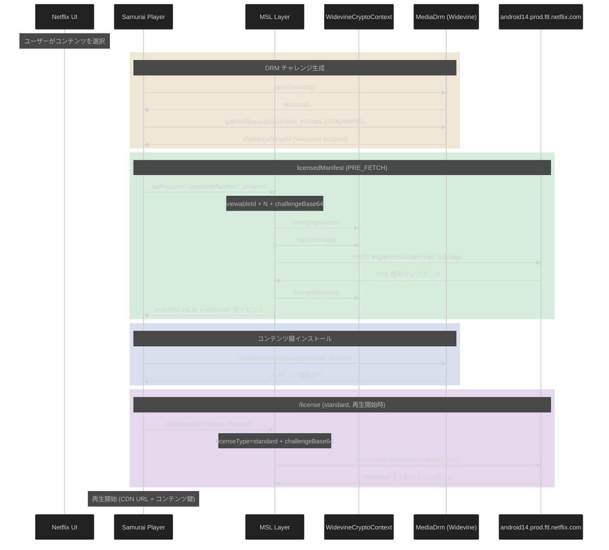
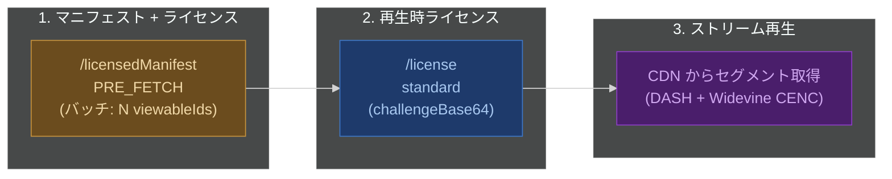
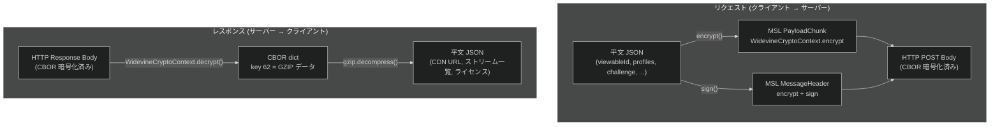
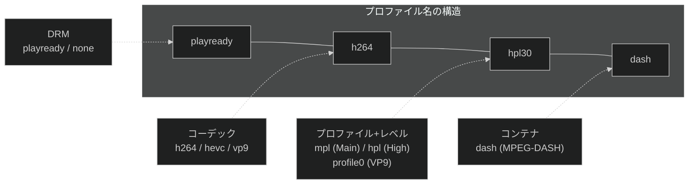

# Netflix licensedManifest API — Android ストリーミングプロファイル・画質指定

Netflix Android アプリが動画再生に必要なストリーム情報と DRM ライセンスを一括取得する `/licensedManifest` API の仕様。Frida フック (L3 強制環境) で取得した平文リクエストに基づく。

> **iOS との違い**: iOS 版では `/manifest` (マニフェスト) と `/license` (DRM ライセンス) が別リクエストだが、Android 版では `/licensedManifest` として**統合**されている。

---

## 1. 概要

`/licensedManifest` は MSL (Message Security Layer) で暗号化された API エンドポイント。マニフェスト取得と Widevine ライセンス取得を 1 リクエストで行う。バッチリクエストにより複数の `viewableId` を同時に指定可能。

---

## 2. 通信フロー



### 全体の流れ



---

## 3. 暗号化

`/licensedManifest` のリクエスト・レスポンスは **MSL プロトコル (Widevine CryptoContext)** で暗号化されている。



| 項目 | 暗号化 | 状態 |
|---|---|---|
| リクエスト (profiles, viewableId, challenge 等) | MSL (Widevine CryptoContext) | **平文取得済み** — `apiRequest` フックで暗号化前に捕捉 |
| レスポンス (CDN URL, ストリーム一覧) | MSL + GZIP 圧縮 | **L3: 復元可能** — decrypt 平文 → CBOR → GZIP で復元 / L1: 未取得 |
| HTTP トランスポート | TLS 1.2/1.3 | TLS 上に MSL が重ねられている (二重暗号化) |
| 動画セグメント本体 | Widevine CENC (Common Encryption) | コンテンツ鍵は `/license` レスポンスから取得 |

---

## 4. リクエストパラメータ

`ApiHandlerImpl.apiRequest("/licensedManifest", params)` で送信される JSON。

### 4.1 全パラメータ一覧

```json
{
  "version": 2,
  "url": "/licensedManifest",
  "languages": ["en-JP"],
  "common": {
    "challenge": "<Widevine CDM protobuf (common challenge)>"
  },
  "params": [
    {
      "viewableId": "81756595",
      "profiles": [ ... ],
      "profileGroups": [ ... ],
      "challenges": {
        "primary": [{
          "challengeBase64": "<Widevine CDM protobuf>",
          "drmSessionId": 1,
          "clientTime": 1773373148
        }]
      },
      "method": "licensedManifest",
      "flavor": "PRE_FETCH",
      "drmType": "widevine",
      "manifestVersion": "v2",
      "licenseType": "limited",
      "cellularCap": "auto",
      "netType": "wifi",
      "useHttpsStreams": true,
      "useBetterTextUrls": true,
      "supportsWatermark": true,
      "supportsPreReleasePin": true,
      "requestEligibleABTests": true,
      "supportsUnequalizedDownloadables": true,
      "supportsAdBreakHydration": true,
      "supportsPartialHydration": true,
      "supportsAuxiliaryManifestDeduplication": true,
      "supportsNetflixMediaEvents": true,
      "supportsVideoTrackSwitching": false,
      "prefersVerticalVideo": false,
      "liveAdsCapability": "dynamic",
      "liveMetadataFormat": "INDEXED_SEGMENT_TEMPLATE",
      "maxSupportedLanguages": -1,
      "contentPlaygraph": ["v2"],
      "osName": "android",
      "osVersion": "34",
      "application": "samurai",
      "clientVersion": "9.57.0",
      "uiVersion": "9.57.0",
      "uiPlatform": "android",
      "player": "streaming",
      "hardware": "lito",
      "uiContext": {
        "uiFlavor": "android",
        "clientAppVersion": "9.57.0",
        "deviceTier": "AndroidDeviceTier",
        "adCanvasUICapabilities": ["SlotBasedUI"]
      }
    }
  ]
}
```

### 4.2 主要パラメータの意味

| パラメータ | 型 | 説明 |
|---|---|---|
| `version` | number | API バージョン。`2` |
| `url` | string | MSL 内部パス。`"/licensedManifest"` |
| `languages` | string[] | 優先言語。`["en-JP"]` |
| `common.challenge` | string | **共通 Widevine チャレンジ** — 全 viewableId で共有される CDM protobuf |
| `params` | array | **バッチリクエスト** — 複数の viewableId を同時に指定可能 |
| `viewableId` | string | コンテンツ ID。Netflix の各作品/エピソードに割り当てられた一意の番号 |
| `profiles` | string[] | クライアントが対応するコーデック・画質プロファイルの一覧 |
| `profileGroups` | object[] | profiles をグループ分けした構造 |
| `challenges.primary` | array | **個別 Widevine チャレンジ** — viewableId ごとの CDM protobuf + `drmSessionId` |
| `method` | string | `"licensedManifest"` |
| `flavor` | string | `"PRE_FETCH"` = 先読み |
| `drmType` | string | `"widevine"` (iOS では `"fairplay"`) |
| `manifestVersion` | string | `"v2"` |
| `licenseType` | string | `"limited"` (PRE_FETCH) / `"standard"` (再生時) |
| `cellularCap` | string | セルラー回線時の帯域制限。`"auto"` |
| `netType` | string | 接続種別。`"wifi"` / `"cellular"` |
| `liveAdsCapability` | string | ライブ広告対応。`"dynamic"` |
| `liveMetadataFormat` | string | ライブメタデータ形式。`"INDEXED_SEGMENT_TEMPLATE"` (iOS: `"HLS"`) |
| `contentPlaygraph` | string[] | 再生グラフバージョン。`["v2"]` (iOS: `["start"]`) |
| `hardware` | string | SoC 名。`"lito"` (Qualcomm Snapdragon 765G) |
| `uiContext.deviceTier` | string | `"AndroidDeviceTier"` |
| `uiContext.adCanvasUICapabilities` | string[] | 広告 UI 対応。`["SlotBasedUI"]` |
| `maxSupportedLanguages` | number | `-1` = 無制限 |

### 4.3 iOS 版にないパラメータ

| パラメータ | 説明 |
|---|---|
| `common.challenge` | 共通チャレンジ (iOS では各リクエストに個別の SPC) |
| `challenges.primary[].drmSessionId` | Widevine DRM セッション ID |
| `challenges.primary[].clientTime` | クライアントタイムスタンプ |
| `method` | MSL 内部メソッド名 |
| `useBetterTextUrls` | 字幕 URL の改善版使用 |
| `requestEligibleABTests` | A/B テスト適格性リクエスト |
| `liveAdsCapability` | ライブ広告対応レベル |
| `supportsAuxiliaryManifestDeduplication` | 補助マニフェスト重複排除 |
| `supportsNetflixMediaEvents` | Netflix メディアイベント対応 |
| `supportsVideoTrackSwitching` | ビデオトラック切替対応 |

---

## 5. プロファイル (profiles) — L3 環境

L3 (ソフトウェア) 強制環境で送信されるプロファイル一覧。L1 (TEE) 環境ではより多くの高解像度プロファイルが含まれる。

### 5.1 映像プロファイル

#### H.264 (AVC)

| プロファイル名 | コーデック | Level | 最大解像度目安 | 備考 |
|---|---|---|---|---|
| `none-h264mpl30-dash` | H.264 Main Profile | 3.0 | SD (~720x480) | DRM なし |
| `playready-h264mpl30-dash` | H.264 Main Profile | 3.0 | SD | PlayReady |
| `playready-h264hpl22-dash` | H.264 High Profile | 2.2 | ~352x288 | PlayReady |
| `playready-h264hpl30-dash` | H.264 High Profile | 3.0 | SD | PlayReady |
| `h264hpl22-dash-playready-live` | H.264 High Profile | 2.2 | 低解像度 | PlayReady (live) |
| `h264hpl30-dash-playready-live` | H.264 High Profile | 3.0 | SD | PlayReady (live) |

> **L1 環境で追加されるプロファイル** (推定): `playready-h264mpl31-dash`, `playready-h264mpl40-dash`, `playready-h264hpl31-dash`, `playready-h264hpl40-dash`, `h264hpl31-dash-playready-live`, `h264hpl40-dash-playready-live`

#### VP9

| プロファイル名 | コーデック | Level | 最大解像度目安 |
|---|---|---|---|
| `vp9-profile0-L21-dash-cenc` | VP9 Profile 0 | 2.1 | ~480x360 |
| `vp9-profile0-L30-dash-cenc` | VP9 Profile 0 | 3.0 | ~720x480 (SD) |

> **L1 環境で追加されるプロファイル** (推定): `vp9-profile0-L31-dash-cenc`, `vp9-profile0-L40-dash-cenc`

#### HEVC (H.265) — L1 環境のみ (推定)

L3 環境ではキャプチャされていないが、L1 環境では以下が追加される:

| プロファイル名 | コーデック | Level | 備考 |
|---|---|---|---|
| `hevc-hdr-main10-L30-dash-cenc` | HEVC HDR10 Main 10 | 3.0 | HDR |
| `hevc-hdr-main10-L31-dash-cenc` | HEVC HDR10 Main 10 | 3.1 | HDR |
| `hevc-hdr-main10-L40-dash-cenc` | HEVC HDR10 Main 10 | 4.0 | HDR |
| `hevc-hdr-main10-L41-dash-cenc` | HEVC HDR10 Main 10 | 4.1 | HDR |

#### その他

| プロファイル名 | 用途 |
|---|---|
| `iso_23001_18-dash-live` | ISO 23001-18 ライブストリーミング |

### 5.2 音声プロファイル

| プロファイル名 | コーデック | チャンネル | 備考 |
|---|---|---|---|
| `heaac-2-dash` | HE-AAC v1 | 2ch (ステレオ) | 標準音声 |
| `xheaac-dash` | xHE-AAC | 2ch | 低ビットレート対応 |

> **iOS との違い**: iOS では `heaac-2hq-dash` (HQ), `dd-5.1-dash` (Dolby Digital 5.1), `ddplus-5.1-dash` / `ddplus-5.1hq-dash` (Dolby Digital Plus), `ddplus-atmos-dash` (Dolby Atmos) も含まれる。Android L3 では Dolby 系プロファイルが含まれていない。

### 5.3 字幕・その他

| プロファイル名 | 種別 | 説明 |
|---|---|---|
| `imsc1.1` | 字幕 | IMSC 1.1 (Timed Text) |
| `nflx-cmisc` | メタデータ | Netflix 制御メタデータ (チャプター、スキップ情報等) |
| `BIF320` | サムネイル | BIF (Base Index Frames) 320px — シークバーのプレビュー |

> **iOS との違い**: iOS では `webvtt-lssdh-ios13` / `webvtt-lssdh-ios8` (WebVTT), `BIF240` も含まれる。

### 5.4 プロファイルグループ (profileGroups)

L3 環境では全プロファイルが単一の `primary` グループに属する:

| グループ名 | 対象プロファイル |
|---|---|
| `primary` | 全プロファイル (映像 + 音声 + 字幕 + その他) |

> **iOS との違い**: iOS では `live` (ライブ用), `ce3` (H.264 PlayReady), `ce4` (HEVC PRK) の 3 グループに分かれる。

---

## 6. バッチリクエスト

iOS 版と異なり、Android 版では **複数の viewableId を 1 リクエストで同時に送信** できる。

キャプチャでは 3 つの viewableId が同時にリクエストされた:

| viewableId | 用途 |
|---|---|
| `81756595` | コンテンツ 1 |
| `80243261` | コンテンツ 2 |
| `81774276` | コンテンツ 3 |

各エントリは同一の `profiles`, `profileGroups`, `challenges` を含むが、`viewableId` のみ異なる。`common.challenge` で共通のチャレンジを 1 つ指定し、`params[].challenges.primary` で viewableId ごとの個別チャレンジも指定する構造。

---

## 7. 画質制御パラメータ

| パラメータ | 値 | 画質への影響 |
|---|---|---|
| `profiles` | (上記一覧) | **対応コーデック/画質の上限**。サーバーはこの一覧に基づいてストリームを返す |
| `cellularCap` | `"auto"` | セルラー回線時の帯域上限。`auto` = アダプティブ |
| `netType` | `"wifi"` / `"cellular"` | ネットワーク種別。wifi 時は帯域制限が緩和される |
| `hardware` | `"lito"` | SoC 名。サーバー側でハードウェアデコード能力を判定 |
| `prefersVerticalVideo` | `false` | 縦動画優先 |
| `licenseType` | `"limited"` / `"standard"` | `limited` = プリフェッチ (制限付き), `standard` = 本再生 |

### L1 vs L3 の画質差

| 項目 | L1 (TEE) | L3 (ソフトウェア) |
|---|---|---|
| 最大解像度 | FHD (1920x1080) 以上 | SD (~720x480) |
| HEVC HDR10 | 利用可能 | 利用不可 |
| VP9 最大 Level | L40 | L30 |
| H.264 最大 Level | HPL40 (FHD) | HPL30 (SD) |
| Dolby Audio | 利用可能 (推定) | 利用不可 |

---

## 8. レスポンス

### 8.1 取得状況

| 方法 | 状態 |
|---|---|
| `BaseHandler.processRequest` (直接取得) | **失敗** — `response: null` (ProGuard フィールド名不一致) |
| `WidevineCryptoContext.decrypt` (L3) | **復元済み** — CBOR (key 62) → GZIP → JSON で完全復元 |
| `WidevineCryptoContext.decrypt` (L1) | **不可** — TEE 内で処理されるため |

### 8.2 レスポンス構造 (実データ)

L3 Widevine decrypt → CBOR → GZIP 展開で復元。8 チャンク、合計 456KB。

```json
{
  "id": 1,
  "version": 2,
  "serverTime": 1773373149628,
  "result": [
    {
      "movieId": "81756595",
      "packageId": "2596051",
      "duration": 8523000,
      "drmContextId": "2596051",
      "playbackContextId": "E3-Bgj5tevc...",
      "video_tracks": [{ "..." }],
      "audio_tracks": [{ "..." }],
      "timedtexttracks": [{ "..." }],
      "servers": [{ "..." }],
      "links": { "events": {}, "ldl": {}, "license": {} }
    }
  ]
}
```

> **バッチ**: `result` は配列。リクエストの `params` に含まれる viewableId ごとに 1 エントリ。キャプチャでは 3 件。

### 8.3 result エントリ詳細

| フィールド | 型 | 値 (例) | 説明 |
|---|---|---|---|
| `movieId` | string | `"81756595"` | コンテンツ ID |
| `packageId` | string | `"2596051"` | DRM パッケージ ID (`drmContextId` と対応) |
| `duration` | number | `8523000` | 再生時間 (ms)。8523 秒 = 2h22m3s |
| `drmContextId` | string | `"2596051"` | DRM コンテキスト ID |
| `playbackContextId` | string | `"E3-Bgj5tevc..."` | 再生セッション ID (後続 API URL に埋め込み) |

### 8.4 video_tracks

```json
{
  "trackType": "PRIMARY",
  "new_track_id": "V:2:1;2;;primary;-1;none;-1;",
  "dimensionsLabel": "2D",
  "streams": [
    {
      "content_profile": "playready-h264hpl30-dash",
      "bitrate": 1050,
      "peakBitrate": 2250,
      "res_w": 960,
      "res_h": 540,
      "framerate_value": 24000,
      "framerate_scale": 1001,
      "size": 1181780966,
      "downloadable_id": "1496730611",
      "vmaf": 87,
      "isDrm": true,
      "urls": [
        {"cdn_id": 140368, "url": "https://ipv4-c062-osa001-ix.1.oca.nflxvideo.net/?o=1&v=23&e=..."},
        {"cdn_id": 140566, "url": "https://ipv4-c010-osa003-ix.1.oca.nflxvideo.net/?o=1&v=18&e=..."}
      ],
      "moov": {"offset": 108, "size": 1048},
      "sidx": {"offset": 1156, "size": 37036}
    }
  ]
}
```

L3 環境での映像ストリーム一覧:

| content_profile | bitrate (kbps) | 解像度 | vmaf | isDrm |
|---|---|---|---|---|
| `playready-h264hpl22-dash` | 80 | 480x270 | 32 | true |
| `playready-h264hpl22-dash` | 100 | 480x270 | 39 | true |
| `playready-h264hpl30-dash` | 200 | 608x342 | 52 | true |
| `playready-h264hpl30-dash` | 350 | 608x342 | 64 | true |
| `playready-h264hpl30-dash` | 560 | 768x432 | 74 | true |
| `playready-h264hpl30-dash` | 750 | 768x432 | 79 | true |
| `playready-h264hpl30-dash` | 1050 | 960x540 | 87 | true |

> **L3 制限**: 最大解像度 960x540 (SD)。L1 環境では 1920x1080 以上、HEVC HDR10 プロファイルも含まれる。

### 8.5 audio_tracks

```json
{
  "trackType": "PRIMARY",
  "channels": "2.0",
  "language": "ja",
  "languageDescription": "Japanese [Original]",
  "profile": "xheaac-dash",
  "bitrates": [32, 64, 96, 192],
  "streams": [
    {
      "content_profile": "xheaac-dash",
      "bitrate": 192,
      "size": 216960714,
      "downloadable_id": "1758195596",
      "channels": "2.0",
      "isDrm": false,
      "tags": ["SpeakerSpatialAudio"]
    }
  ]
}
```

| 言語 | プロファイル | ビットレート (kbps) | チャンネル |
|---|---|---|---|
| ja (Original) | xheaac-dash, heaac-2-dash | 32, 64, 96, 192 | 2.0 |
| en | xheaac-dash, heaac-2-dash | 32, 64, 96, 192 | 2.0 |
| pt-BR, es, es-ES, fr, de, it, pl, fil, hu | 同上 | 同上 | 2.0 |

合計 19 トラック (11 言語 × xheaac-dash / heaac-2-dash、一部言語は片方のみ)。

### 8.6 timedtexttracks (字幕)

```json
{
  "trackType": "PRIMARY",
  "rawTrackType": "subtitles",
  "language": "en",
  "languageDescription": "Off",
  "downloadableIds": {"imsc1.1": "945969240"},
  "ttDownloadables": {
    "imsc1.1": {
      "size": 16270,
      "hashValue": "6uq3FARi9emju1mN/qygW1nd/fg=",
      "hashAlgo": "sha1",
      "urls": [
        {"cdn_id": 140368, "url": "https://ipv4-c062-osa001-ix.1.oca.nflxvideo.net/?o=1&v=23&e=..."}
      ],
      "isImage": false
    }
  },
  "isForcedNarrative": true
}
```

合計 57 トラック。フォーマットは全て `imsc1.1`。言語: en, ja, de, es, es-ES, fr, fil, hu, it, pl, pt-BR。
種別: subtitles, closedcaptions。

### 8.7 servers (CDN)

```json
{
  "id": 140368,
  "key": "1-17676-high",
  "name": "c062.osa001.ix.nflxvideo.net",
  "rank": 1,
  "type": "OPEN_CONNECT_APPLIANCE",
  "lowgrade": false,
  "dns": {
    "host": "ipv4-c062-osa001-ix.1.oca.nflxvideo.net",
    "ipv4": "45.57.82.139",
    "ipv6": null,
    "forceLookup": false
  }
}
```

| rank | サーバー名 | IPv4 | ロケーション |
|---|---|---|---|
| 1 | c062.osa001.ix.nflxvideo.net | 45.57.82.139 | 大阪 (osa001) |
| 2 | c010.osa003.ix.nflxvideo.net | 23.246.52.11 | 大阪 (osa003) |
| 3 | c106.osa001.ix.nflxvideo.net | 45.57.84.3 | 大阪 (osa001) |

全て `OPEN_CONNECT_APPLIANCE` タイプ。`rank` でフェイルオーバー優先度を指定。

### 8.8 links

```json
{
  "events": {
    "href": "/events?playbackContextId=E3-Bgj5tevc...&esn=NFANDROID1-PRV-P-L3-GOOGLPIXEL%3D4A%3D%3D5G%3D-22594-...",
    "rel": "events"
  },
  "ldl": {
    "href": "/license?licenseType=limited&playbackContextId=...&esn=...&drmContextId=2596051",
    "rel": "license"
  },
  "license": {
    "href": "/license?licenseType=standard&playbackContextId=...&esn=...&drmContextId=2596051",
    "rel": "license"
  }
}
```

| リンク | 用途 | 説明 |
|---|---|---|
| `events` | 再生イベント報告 | `playbackContextId` + `esn` を含む。keepAlive 等 |
| `ldl` | Limited Duration License | ビットレート変更時等の追加ライセンス取得 |
| `license` | Standard License | 再生開始時の本ライセンス取得 |

> **ESN に L3 マーカー**: `esn` パラメータに `L3` が含まれる (`NFANDROID1-PRV-P-L3-...`)。L1 環境では `L1` になる。

---

## 9. /license リクエスト (再生開始時)

PRE_FETCH 後、実際の再生開始時に `standard` ライセンスを個別に取得する。

### リクエスト URL

```
https://android14.prod.ftl.netflix.com/nq/androidui/samurai/~9.0.0/api
  ?licenseType=standard
  &playbackContextId=<JWT-like token>
  &esn=NFANDROID1-PRV-P-GOOGLPIXEL%3D4A%3D%3D5G%3D-{userId}-{fingerprint}
  &drmContextId=2596051
```

### パラメータ

| パラメータ | 値 | 説明 |
|---|---|---|
| `licenseType` | `"standard"` | 本再生用ライセンス |
| `playbackContextId` | JWT-like トークン | PRE_FETCH で取得した再生コンテキスト |
| `esn` | `NFANDROID1-PRV-P-...` | デバイス ESN |
| `drmContextId` | `2596051` | DRM コンテキスト ID |
| `challengeBase64` | Widevine CDM protobuf (~4KB) | ライセンスチャレンジ |
| `xid` | `"7616568730841682443"` | リクエストトレーシング ID |

---

## 10. プロファイル名の命名規則

```
{drm}-{codec}{profile}{level}-{container}[-{encryption}][-{variant}]
```



| 略称 | 意味 |
|---|---|
| `hpl` | High Profile Level (H.264) |
| `mpl` | Main Profile Level (H.264) |
| `profile0` | Profile 0 (VP9, 8bit) |
| `hdr-main10` | Main 10 Profile (HEVC, 10bit HDR) |
| `L21`〜`L41` | コーデックレベル (解像度・ビットレート上限) |
| `dash` | MPEG-DASH コンテナ |
| `cenc` | Common Encryption (ISO 23001-7) |
| `playready` | Microsoft PlayReady DRM |
| `none` | DRM なし |
| `live` | ライブストリーミング |

---

## 11. 画質を変更するには

profiles 配列の内容を変更することで、サーバーから返されるストリームの種類が変わる。

| やりたいこと | profiles の変更 |
|---|---|
| H.264 のみにする | `vp9-*`, `hevc-*` プロファイルを全て削除 |
| VP9 のみにする | `*h264*`, `hevc-*` プロファイルを全て削除 |
| 最低画質に制限 | `none-h264mpl30-dash` + `heaac-2-dash` のみ残す |
| xHE-AAC を無効化 | `xheaac-dash` を削除 |
| 字幕を除外 | `imsc1.1` を削除 |
| サムネイルを除外 | `BIF320` を削除 |

> **注意**: profiles を書き換えるには `apiRequest` フック内で `params` オブジェクトの profiles 配列を操作する必要がある。MSL 暗号化前のアプリ層で介入する。

---

## 12. iOS 版との比較

| 項目 | iOS (`/manifest`) | Android (`/licensedManifest`) |
|---|---|---|
| **API パス** | `/manifest` + `/license` (分離) | `/licensedManifest` (統合) |
| **バッチ** | 1 viewableId/リクエスト | 複数 viewableId/リクエスト |
| **DRM** | `fairplay` (SPC/CKC) | `widevine` (CDM protobuf) |
| **チャレンジ** | 個別の `challengeBase64` | `common.challenge` + 個別 `challenges.primary` |
| **映像コーデック** | H.264, HEVC Main 10 | H.264, VP9, HEVC HDR10 (L1 のみ) |
| **音声コーデック** | HE-AAC, DD 5.1, DD+ 5.1, Atmos | HE-AAC, xHE-AAC |
| **字幕** | WebVTT (LSSDH) | IMSC 1.1 |
| **サムネイル** | BIF240, BIF320 | BIF320 |
| **プロファイルグループ** | `live`, `ce3`, `ce4` (3グループ) | `primary` (単一グループ) |
| **画質ターゲット** | `desiredVmaf: "phone_plus_lts"` | なし (profiles のみ) |
| **ライブメタデータ** | `"HLS"` | `"INDEXED_SEGMENT_TEMPLATE"` |
| **再生グラフ** | `["start"]` | `["v2"]` |
| **広告対応** | `supportsAdBreakHydration` | `liveAdsCapability: "dynamic"` + `adCanvasUICapabilities` |
| **レスポンス** | 未取得 | L3: decrypt 経由で **復元済み** (456KB) |
