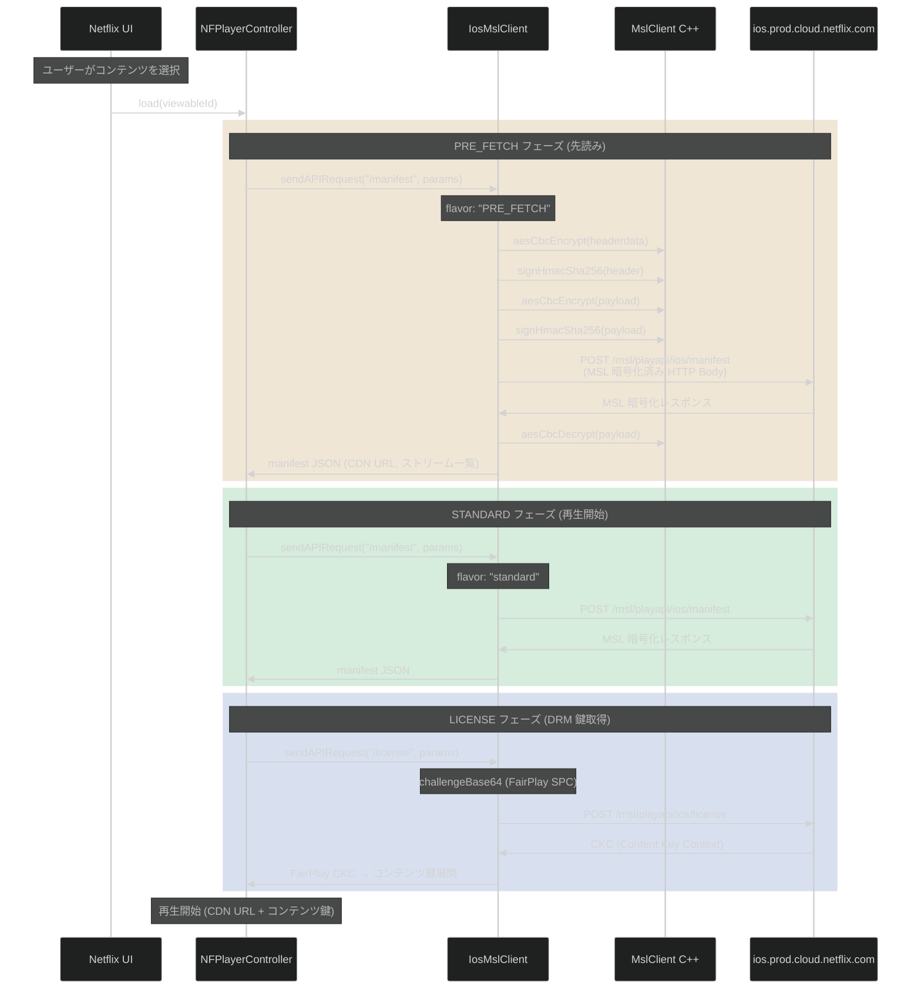
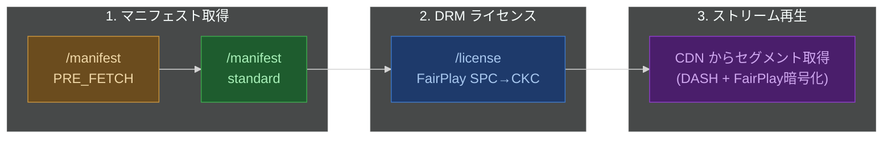
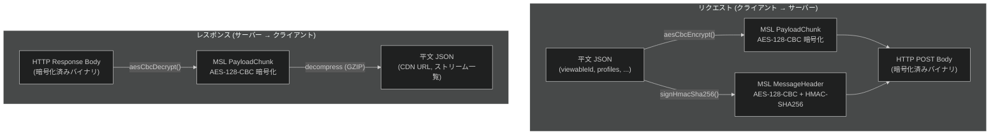
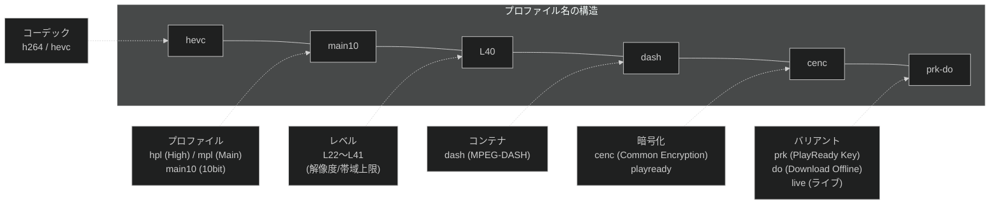

# Netflix Manifest API — ストリーミングプロファイル・画質指定

Netflix iOS アプリが動画再生に必要なストリーム情報を取得する `/manifest` API の仕様。Frida フックで取得した平文リクエストに基づく。

---

## 1. 概要

`/manifest` は MSL (Message Security Layer) で暗号化された API エンドポイント。クライアントが再生可能なコーデック・画質・音声・字幕のプロファイル一覧をサーバーに送信し、サーバーはそれに基づいて利用可能なストリームと CDN URL を返す。

---

## 2. 通信フロー



### 全体の流れ



---

## 3. 暗号化

`/manifest` のリクエスト・レスポンスは **MSL プロトコルで暗号化** されている。



| 項目 | 暗号化 | 状態 |
|---|---|---|
| リクエスト (profiles, viewableId 等) | MSL (AES-128-CBC + HMAC-SHA256) | **平文取得済み** — `sendAPIRequest` フックで暗号化前に捕捉 |
| レスポンス (CDN URL, ストリーム一覧) | MSL (AES-128-CBC + HMAC-SHA256) + GZIP 圧縮 | **未取得** — `sendAPIRequest` コールバックフック実装済みだが manifest レスポンスのログが出ていない (logblob の ACK のみ) |
| HTTP トランスポート | TLS 1.2/1.3 | TLS 上に MSL が重ねられている (二重暗号化) |
| 動画セグメント本体 | FairPlay CBCS (Common encryption) | コンテンツ鍵は `/license` CKC から取得 |

---

## 4. リクエストパラメータ

`IosMslClient.sendAPIRequest("/manifest", params)` で送信される JSON。

### 4.1 全パラメータ一覧

```json
{
  "viewableId": 81774276,
  "flavor": "PRE_FETCH",
  "profiles": [ ... ],
  "profileGroups": [ ... ],
  "drmType": "fairplay",
  "manifestVersion": "v2",
  "desiredVmaf": "phone_plus_lts",
  "cellularCap": "auto",
  "netType": "wifi",
  "useHttpsStreams": true,
  "supportsWatermark": true,
  "supportsUnequalizedDownloadables": true,
  "supportsPartialHydration": true,
  "supportsAdBreakHydration": true,
  "supportsSecureStop": false,
  "supportsPreReleasePin": true,
  "unletterboxed": false,
  "liveMetadataFormat": "HLS",
  "contentPlaygraph": ["start"],
  "requiresAudioTrackGroups": true,
  "preferAssistiveAudio": false,
  "prefersClosedCaptions": false,
  "hardware": "IPHONE9-1",
  "osName": "iOS",
  "osVersion": "15.8.3",
  "uiPlatform": "ios",
  "clientVersion": "15.48.1",
  "platform": "2012.4",
  "sdk": "2012.4",
  "build": "24",
  "xid": "7114306196730548973"
}
```

### 4.2 主要パラメータの意味

| パラメータ | 型 | 説明 |
|---|---|---|
| `viewableId` | number | コンテンツ ID。Netflix の各作品/エピソードに割り当てられた一意の番号 |
| `flavor` | string | `"PRE_FETCH"` = UI 表示時に先読み、`"standard"` = 実際の再生開始時 |
| `profiles` | string[] | **クライアントが対応するコーデック・画質プロファイルの一覧** (後述) |
| `profileGroups` | object[] | profiles をグループ分けした構造 (DRM スキーム別) |
| `drmType` | string | DRM 方式。iOS では常に `"fairplay"` |
| `manifestVersion` | string | マニフェストバージョン。`"v2"` |
| `desiredVmaf` | string | **画質ターゲット**。VMAF (Video Multi-method Assessment Fusion) ベースの品質スコア指定。`"phone_plus_lts"` = スマホ向け長期安定画質モード |
| `cellularCap` | string | **セルラー回線時の帯域制限**。`"auto"` = ネットワーク状況に応じて自動判定 |
| `netType` | string | 現在の接続種別。`"wifi"` or `"cellular"` |
| `useHttpsStreams` | boolean | ストリーム URL に HTTPS を使うか |
| `supportsWatermark` | boolean | フォレンジックウォーターマーク対応 |
| `supportsUnequalizedDownloadables` | boolean | 非均一品質のダウンロード可能セグメント対応 |
| `supportsPartialHydration` | boolean | 部分的なマニフェスト補完対応 |
| `unletterboxed` | boolean | レターボックス除去。`false` = そのまま |
| `liveMetadataFormat` | string | ライブコンテンツのメタデータ形式。`"HLS"` |
| `contentPlaygraph` | string[] | 再生グラフの状態。`["start"]` = 再生開始 |
| `xid` | string | リクエスト一意ID (トレーシング用) |
| `hardware` | string | デバイスモデル。例: `"IPHONE9-1"` (iPhone 7) |

---

## 5. プロファイル (profiles) — コーデック・画質指定

`profiles` 配列がサーバーに「このデバイスはこれらのコーデック・画質に対応している」と伝える。サーバーはこの一覧に基づいて利用可能なストリームを返す。

### 5.1 映像プロファイル

#### H.264 (AVC) — `profileGroups.name: "ce3"` および `"live"`

| プロファイル名 | コーデック | Level | 最大解像度目安 | DRM |
|---|---|---|---|---|
| `h264hpl22-dash-playready-live` | H.264 High Profile | 2.2 | ~352x288 | PlayReady (live) |
| `h264hpl30-dash-playready-live` | H.264 High Profile | 3.0 | ~720x480 (SD) | PlayReady (live) |
| `h264hpl31-dash-playready-live` | H.264 High Profile | 3.1 | ~1280x720 (HD) | PlayReady (live) |
| `h264hpl40-dash-playready-live` | H.264 High Profile | 4.0 | ~1920x1080 (FHD) | PlayReady (live) |
| `playready-h264mpl30-dash` | H.264 Main Profile | 3.0 | SD | PlayReady |
| `playready-h264mpl31-dash` | H.264 Main Profile | 3.1 | HD | PlayReady |
| `playready-h264mpl40-dash` | H.264 Main Profile | 4.0 | FHD | PlayReady |
| `playready-h264hpl22-dash` | H.264 High Profile | 2.2 | 低解像度 | PlayReady |
| `playready-h264hpl30-dash` | H.264 High Profile | 3.0 | SD | PlayReady |
| `playready-h264hpl31-dash` | H.264 High Profile | 3.1 | HD | PlayReady |
| `playready-h264hpl40-dash` | H.264 High Profile | 4.0 | FHD | PlayReady |

#### HEVC (H.265) — `profileGroups.name: "ce4"`

| プロファイル名 | コーデック | Level | 最大解像度目安 | 備考 |
|---|---|---|---|---|
| `hevc-main10-L30-dash-cenc-live` | HEVC Main 10 | 3.0 | SD | ライブ |
| `hevc-main10-L31-dash-cenc-live` | HEVC Main 10 | 3.1 | HD | ライブ |
| `hevc-main10-L40-dash-cenc-live` | HEVC Main 10 | 4.0 | FHD | ライブ |
| `hevc-main10-L41-dash-cenc-live` | HEVC Main 10 | 4.1 | FHD+ | ライブ |
| `hevc-main10-L30-dash-cenc-prk` | HEVC Main 10 | 3.0 | SD | PlayReady Key |
| `hevc-main10-L31-dash-cenc-prk` | HEVC Main 10 | 3.1 | HD | PlayReady Key |
| `hevc-main10-L40-dash-cenc-prk` | HEVC Main 10 | 4.0 | FHD | PlayReady Key |
| `hevc-main10-L41-dash-cenc-prk` | HEVC Main 10 | 4.1 | FHD+ | PlayReady Key |
| `hevc-main10-L30-dash-cenc-prk-do` | HEVC Main 10 | 3.0 | SD | PRK + Download Offline |
| `hevc-main10-L31-dash-cenc-prk-do` | HEVC Main 10 | 3.1 | HD | PRK + Download Offline |
| `hevc-main10-L40-dash-cenc-prk-do` | HEVC Main 10 | 4.0 | FHD | PRK + Download Offline |
| `hevc-main10-L41-dash-cenc-prk-do` | HEVC Main 10 | 4.1 | FHD+ | PRK + Download Offline |

> **Note**: `Main 10` は 10bit 色深度 (HDR 対応)。iPhone 7 (IPHONE9-1) は HEVC ハードウェアデコード対応。

### 5.2 音声プロファイル

| プロファイル名 | コーデック | チャンネル | 備考 |
|---|---|---|---|
| `heaac-2-dash` | HE-AAC v1 | 2ch (ステレオ) | 標準音声 |
| `heaac-2hq-dash` | HE-AAC v1 | 2ch (ステレオ) | 高品質 (ビットレート高) |
| `dd-5.1-dash` | Dolby Digital (AC-3) | 5.1ch | サラウンド |
| `ddplus-5.1-dash` | Dolby Digital Plus (E-AC-3) | 5.1ch | サラウンド (効率的) |
| `ddplus-5.1hq-dash` | Dolby Digital Plus (E-AC-3) | 5.1ch | 高品質サラウンド |
| `ddplus-atmos-dash` | Dolby Atmos (E-AC-3 JOC) | オブジェクト | 空間オーディオ |

### 5.3 字幕・その他

| プロファイル名 | 種別 | 説明 |
|---|---|---|
| `webvtt-lssdh-ios13` | 字幕 | WebVTT (iOS 13+, LSSDH 対応) |
| `webvtt-lssdh-ios8` | 字幕 | WebVTT (iOS 8+ レガシー) |
| `BIF240` | サムネイル | BIF (Base Index Frames) 240px — シークバーのプレビュー用 |
| `BIF320` | サムネイル | BIF 320px — シークバーのプレビュー用 |
| `nflx-cmisc` | メタデータ | Netflix 制御メタデータ (チャプター、スキップ情報等) |

> `LSSDH` = Limited Streams for Simple Device Handling

### 5.4 プロファイルグループ (profileGroups)

profiles をDRM/暗号化方式ごとにグループ分けしたもの。サーバー側でストリーム選択時に使用される。

| グループ名 | 対象プロファイル | DRM 方式 |
|---|---|---|
| `live` | `h264hpl*-live`, `hevc-*-live` | ライブ/リアルタイム配信用 |
| `ce3` | `playready-h264*-dash` | PlayReady Content Encryption 3.0 (H.264) |
| `ce4` | `hevc-main10-*-prk`, `*-prk-do` | PlayReady Key (HEVC), Download Offline 含む |

---

## 6. 画質制御パラメータ

| パラメータ | 値 | 画質への影響 |
|---|---|---|
| `desiredVmaf` | `"phone_plus_lts"` | **VMAF 品質ターゲット**。サーバー側でエンコード品質 (ビットレート配分) を決定する基準。`phone_plus_lts` = スマホ画面向け + 長期安定 (Long Term Stable) |
| `cellularCap` | `"auto"` | セルラー回線時の帯域上限。`auto` = アダプティブ |
| `netType` | `"wifi"` / `"cellular"` | ネットワーク種別。wifi 時は帯域制限が緩和される |
| `profiles` | (上記一覧) | **対応コーデック/画質の上限**。ここに無いプロファイルのストリームはサーバーから返されない |
| `unletterboxed` | `false` | `true` にするとレターボックス (黒帯) を除去した映像が返される |
| `hardware` | `"IPHONE9-1"` | デバイスモデル。サーバー側でハードウェアデコード能力を判定 |

### desiredVmaf の値 (推定)

| 値 | 対象デバイス |
|---|---|
| `phone_plus_lts` | スマートフォン (小画面) |
| `tablet_plus_lts` | タブレット (中画面) |
| `tv_plus_lts` | テレビ/大画面 |

> VMAF (Video Multi-method Assessment Fusion) は Netflix が開発した知覚品質メトリクス。同じビットレートでもコンテンツの複雑さに応じてエンコード品質を調整する (Per-Title Encoding / Dynamic Optimizer)。

---

## 7. リクエスト例 (実データ)

```json
{
  "viewableId": 81774276,
  "flavor": "PRE_FETCH",
  "drmType": "fairplay",
  "manifestVersion": "v2",
  "desiredVmaf": "phone_plus_lts",
  "cellularCap": "auto",
  "netType": "wifi",
  "useHttpsStreams": true,
  "supportsWatermark": true,
  "supportsUnequalizedDownloadables": true,
  "supportsPartialHydration": true,
  "supportsAdBreakHydration": true,
  "supportsSecureStop": false,
  "supportsPreReleasePin": true,
  "unletterboxed": false,
  "liveMetadataFormat": "HLS",
  "contentPlaygraph": ["start"],
  "requiresAudioTrackGroups": true,
  "preferAssistiveAudio": false,
  "prefersClosedCaptions": false,
  "hardware": "IPHONE9-1",
  "osName": "iOS",
  "osVersion": "15.8.3",
  "uiPlatform": "ios",
  "clientVersion": "15.48.1",
  "platform": "2012.4",
  "sdk": "2012.4",
  "build": "24",
  "xid": "7114306196730548973",
  "profiles": [
    "h264hpl22-dash-playready-live",
    "h264hpl30-dash-playready-live",
    "h264hpl31-dash-playready-live",
    "h264hpl40-dash-playready-live",
    "hevc-main10-L30-dash-cenc-live",
    "hevc-main10-L31-dash-cenc-live",
    "hevc-main10-L40-dash-cenc-live",
    "hevc-main10-L41-dash-cenc-live",
    "playready-h264mpl30-dash",
    "playready-h264mpl31-dash",
    "playready-h264mpl40-dash",
    "playready-h264hpl22-dash",
    "playready-h264hpl30-dash",
    "playready-h264hpl31-dash",
    "playready-h264hpl40-dash",
    "hevc-main10-L30-dash-cenc-prk",
    "hevc-main10-L31-dash-cenc-prk",
    "hevc-main10-L40-dash-cenc-prk",
    "hevc-main10-L41-dash-cenc-prk",
    "hevc-main10-L30-dash-cenc-prk-do",
    "hevc-main10-L31-dash-cenc-prk-do",
    "hevc-main10-L40-dash-cenc-prk-do",
    "hevc-main10-L41-dash-cenc-prk-do",
    "heaac-2-dash",
    "heaac-2hq-dash",
    "dd-5.1-dash",
    "ddplus-5.1-dash",
    "ddplus-5.1hq-dash",
    "ddplus-atmos-dash",
    "webvtt-lssdh-ios13",
    "nflx-cmisc",
    "webvtt-lssdh-ios8",
    "BIF240",
    "BIF320"
  ],
  "profileGroups": [
    {
      "name": "live",
      "profiles": [
        "h264hpl22-dash-playready-live",
        "h264hpl30-dash-playready-live",
        "h264hpl31-dash-playready-live",
        "h264hpl40-dash-playready-live",
        "hevc-main10-L30-dash-cenc-live",
        "hevc-main10-L31-dash-cenc-live",
        "hevc-main10-L40-dash-cenc-live",
        "hevc-main10-L41-dash-cenc-live"
      ]
    },
    {
      "name": "ce3",
      "profiles": [
        "playready-h264mpl30-dash",
        "playready-h264mpl31-dash",
        "playready-h264mpl40-dash",
        "playready-h264hpl22-dash",
        "playready-h264hpl30-dash",
        "playready-h264hpl31-dash",
        "playready-h264hpl40-dash"
      ]
    },
    {
      "name": "ce4",
      "profiles": [
        "hevc-main10-L30-dash-cenc-prk",
        "hevc-main10-L31-dash-cenc-prk",
        "hevc-main10-L40-dash-cenc-prk",
        "hevc-main10-L41-dash-cenc-prk",
        "hevc-main10-L30-dash-cenc-prk-do",
        "hevc-main10-L31-dash-cenc-prk-do",
        "hevc-main10-L40-dash-cenc-prk-do",
        "hevc-main10-L41-dash-cenc-prk-do"
      ]
    }
  ]
}
```

---

## 8. レスポンス (推定構造)

manifest レスポンスはまだ捕捉できていないが、プロファイル名とリクエスト構造から以下の構造が推定される。

```json
{
  "version": 2,
  "playbackContextId": "...",
  "drmContextId": "...",
  "urls": [
    {
      "url": "https://ipv4-*.oca.nflxvideo.net/...",
      "cdn_id": 12345
    }
  ],
  "video_tracks": [
    {
      "type": "video",
      "profile": "hevc-main10-L40-dash-cenc-prk",
      "bitrate": 4500000,
      "width": 1920,
      "height": 1080,
      "vmaf": 93.5,
      "downloadable_id": "...",
      "urls": [{ "url": "...", "cdn_id": 12345 }]
    }
  ],
  "audio_tracks": [
    {
      "type": "audio",
      "profile": "ddplus-5.1-dash",
      "bitrate": 640000,
      "language": "en",
      "channels": "5.1",
      "downloadable_id": "..."
    }
  ],
  "timedtexttracks": [
    {
      "type": "text",
      "profile": "webvtt-lssdh-ios13",
      "language": "en",
      "isForced": false,
      "downloadable_id": "..."
    }
  ],
  "drmHeader": {
    "keyId": "...",
    "initData": "..."
  }
}
```

> **Note**: 実際のレスポンスを取得するには `sendAPIRequest` のコールバックフック (`ObjC.Block(args[7])`) で manifest レスポンスを捕捉する必要がある。現在 logblob の ACK レスポンスのみ取得されている状態。

---

## 9. プロファイル名の命名規則

```
{codec}-{profile}-{level}-{container}-{encryption}[-{variant}]
```



| 略称 | 意味 |
|---|---|
| `hpl` | High Profile Level (H.264) |
| `mpl` | Main Profile Level (H.264) |
| `main10` | Main 10 Profile (HEVC, 10bit HDR 対応) |
| `L30`〜`L41` | コーデックレベル (解像度・ビットレート上限を規定) |
| `dash` | MPEG-DASH コンテナ |
| `cenc` | Common Encryption (ISO 23001-7) |
| `playready` | Microsoft PlayReady DRM |
| `prk` | PlayReady Key |
| `do` | Download Offline (オフライン再生用) |
| `live` | ライブ/リアルタイムストリーミング |
| `hq` | High Quality (高ビットレート) |
| `lssdh` | Limited Streams for Simple Device Handling |

---

## 10. 画質を変更するには

profiles 配列の内容を変更することで、サーバーから返されるストリームの種類が変わる。

| やりたいこと | profiles の変更 |
|---|---|
| H.264 のみにする | `hevc-*` プロファイルを全て削除 |
| 720p 以下に制限 | `*L40*`, `*L41*` プロファイルを削除 |
| SD のみにする | `*L31*`, `*L40*`, `*L41*` を削除 |
| Dolby Atmos を無効化 | `ddplus-atmos-dash` を削除 |
| ステレオ音声のみ | `dd-*`, `ddplus-*` を全て削除 |
| ダウンロード用を除外 | `*-do` プロファイルを削除 |

> **注意**: profiles を書き換えるには `sendAPIRequest` フック内で `params` オブジェクトの profiles 配列を操作する必要がある。MSL 暗号化前のアプリ層で介入する。
