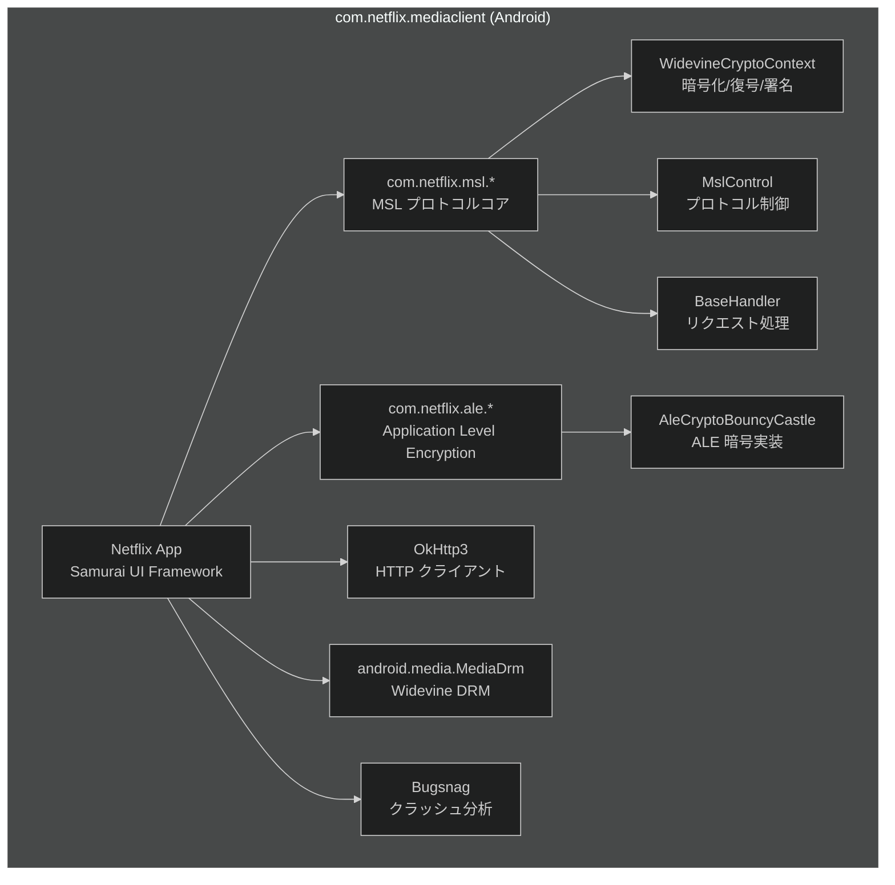
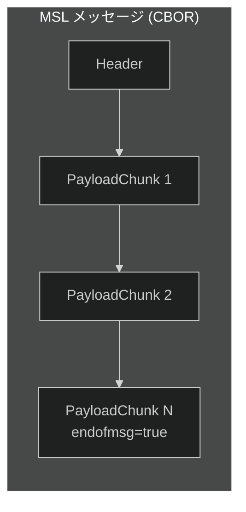
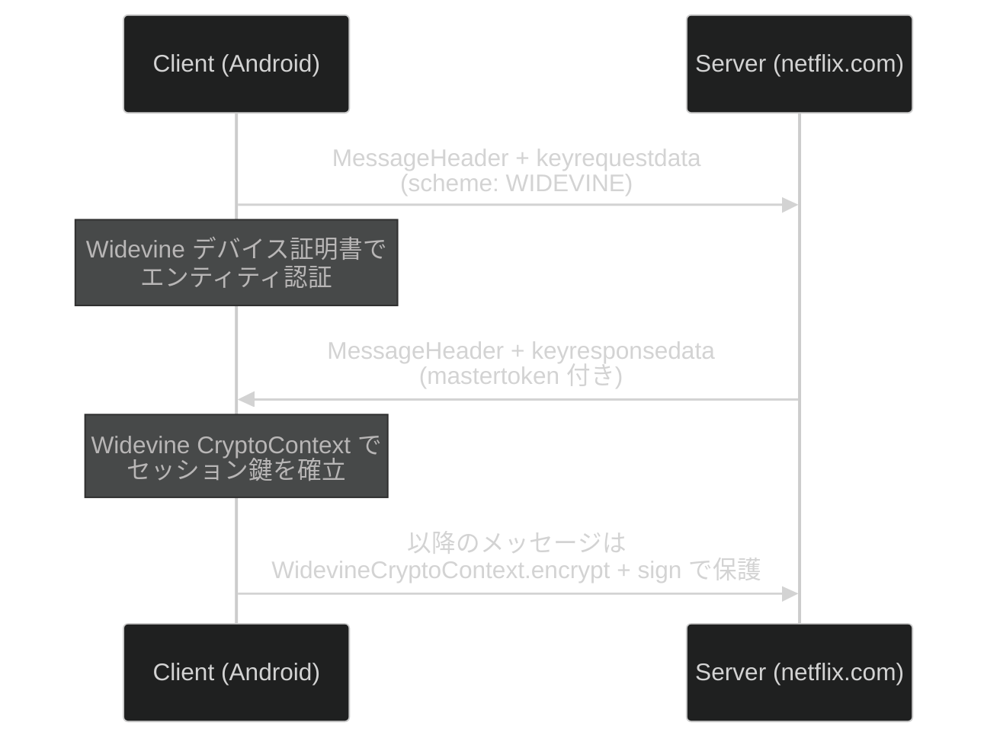
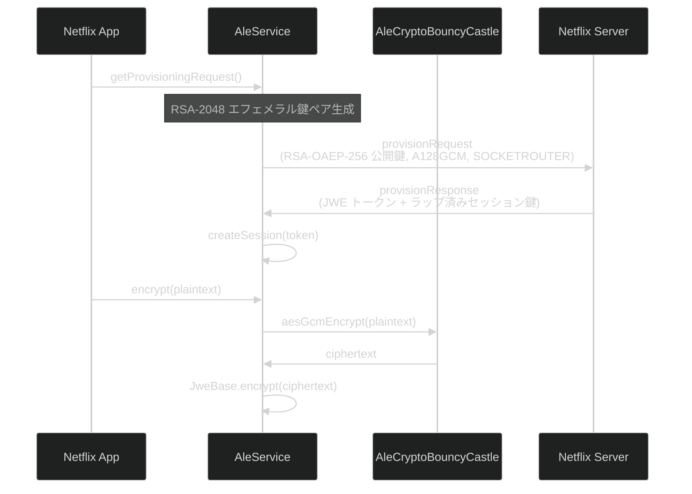
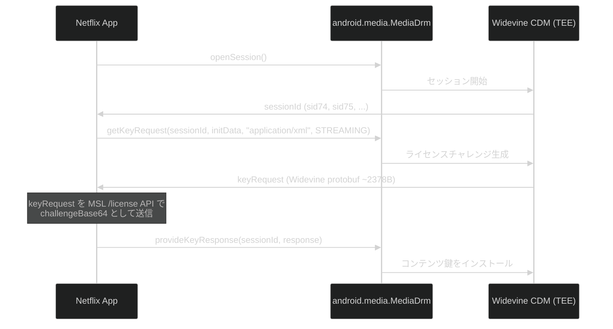
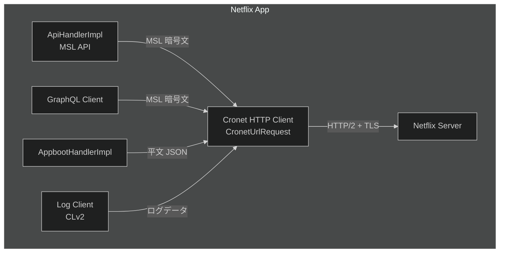
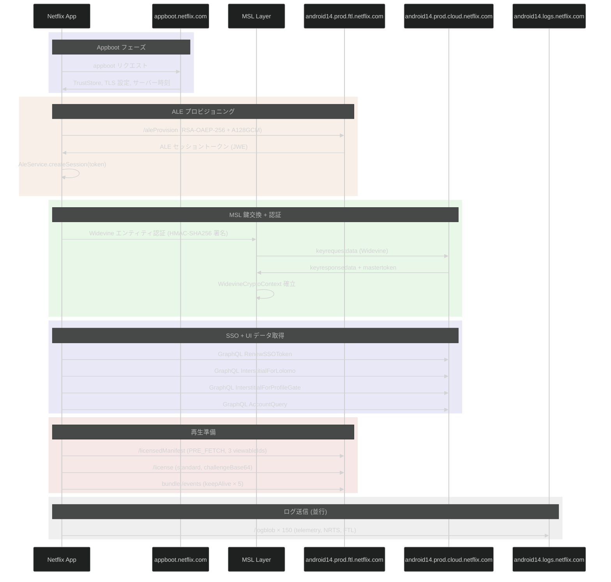
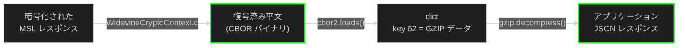

# Netflix Message Security Layer (MSL) — Android 動的解析レポート

Netflix Android アプリ (`com.netflix.mediaclient` v9.57.0 / build 63928) を Frida で動的フックし、MSL 通信データをキャプチャした結果をまとめる。ProGuard 難読化済み Java バイトコードをランタイムでインターセプトしている。

> **キャプチャ環境**: Widevine セキュリティレベルを **L3 (ソフトウェア)** に強制変更した状態で取得。L1 (TEE) 環境でのキャプチャデータは未取得。L3 では暗号処理がソフトウェアで実行されるため、Frida による decrypt 平文の取得が可能になっている。

---

## 1. MSL プロトコル概要

MSL (Message Security Layer) は Netflix が独自開発した TLS 上のアプリケーション層セキュリティプロトコル。iOS 版と同一の仕様だが、Android 版では Widevine ベースの暗号コンテキストを使用する。

### プロトコルの目的

- **エンティティ認証**: デバイス (ESN) をサーバーに証明する (Widevine デバイス証明書)
- **ユーザー認証**: Netflix アカウントの認証 (SSO Token, UserIdToken 等)
- **鍵交換**: Widevine 鍵交換によるセッション鍵の安全な確立
- **メッセージ保護**: ペイロードの暗号化 (Widevine CryptoContext) と署名 (HMAC-SHA256)
- **トークン管理**: MasterToken / UserIdToken / ServiceToken によるセッション維持
- **ALE (Application Level Encryption)**: ソケットレベル暗号化 (RSA-OAEP-256 + A128GCM)

---

## 2. アーキテクチャ

### 2.1 アプリ構成



### 2.2 ProGuard 難読化マッピング

Android アプリは ProGuard により難読化されており、暗号メソッド名が短縮されている:

| 元メソッド名 | 難読化名 | クラス |
|---|---|---|
| `encrypt` | (元のまま) | `WidevineCryptoContext` |
| `decrypt` | `c` (2引数: `[B, MslEncoderFactory`) | `WidevineCryptoContext` |
| `sign` | `b` (3引数) | `WidevineCryptoContext` |
| `verify` | `c` (3引数, 戻り値 `boolean`) | `WidevineCryptoContext` |
| `wrap` | `c` (3引数, 戻り値 `[B`) | `JsonWebEncryptionCryptoContext` |
| `unwrap` | `d` | `JsonWebEncryptionCryptoContext` |

### 2.3 デバイス情報

| 項目 | 値 |
|---|---|
| **ESN** | `NFANDROID1-PRV-P-GOOGLPIXEL=4A==5G=-{userId}-{fingerprint}` |
| **デバイス** | Google Pixel 4a (5G), codename `bramble` |
| **SoC** | Qualcomm `lito` |
| **Android** | 14 (API 34), build `UP1A.231005.007` |
| **アプリバージョン** | 9.57.0 (build 63928) |
| **プラットフォーム** | Android Tanto (Samurai UI) |
| **Widevine CDM** | v17.0.0 |
| **セキュリティレベル** | L3 (ソフトウェア) に強制変更済み — 本来は L1 (TEE), OEMCrypto v1.56 |
| **Bugsnag** | v6.25.0 |
| **jailbroken** | `true` (root 検出) |

---

## 3. MSL メッセージ構造

iOS 版と同一仕様。ただしエンコーディングは CBOR を使用。

### 3.1 全体構造



### 3.2 CBOR エンコーディング

キャプチャされた Widevine encrypt の平文データから、MSL メッセージが CBOR (Concise Binary Object Representation) でエンコードされていることを確認:

- プレフィックス `d9d9f7` = CBOR Self-Described Tag (RFC 8949)
- 埋め込みフィールド:
  - `profileidx`: ユーザープロファイル ID (例: `ZEULH5S2GNGCRAABCSG6J2EGGA`)
  - 圧縮アルゴリズム: `GZIP`
  - エンコーダ: `CBOR`
  - 発行者: `Netflix`
  - `maxpayloadchunksize`: 最大ペイロードチャンクサイズ

### 3.3 CBOR 整数キーマッピング

CBOR エンコード時、JSON の文字列キーはプロトコル仕様で定義された**固定の整数キー**に置換される。完全なマッピングは `userauthdata_android.md` §6 を参照。主要キー:

| CBOR キー | JSON フィールド名 | 使用箇所 |
|---|---|---|
| `15` | `tokendata` | MasterToken, UserIdToken, keyrequestdata |
| `16` | `signature` | 同上 |
| `17` | `mastertoken` | MessageHeader |
| `18` | `useridtoken` | MessageHeader |
| `19` | `renewable` | MessageHeader |
| `20` | `sender` | MessageHeader |
| `21` | `handshake` | MessageHeader |
| `22` | `messageid` | MessageHeader, PayloadChunk |
| `24` | `timestamp` | MessageHeader |
| `30` | `scheme` | keyrequestdata, userauthdata |
| `36` | `capabilities` | MessageHeader |
| `42` | `keyrequestdata` | MessageHeader |
| `47` | `userauthdata` | MessageHeader |
| `14` | `sequencenumber` | PayloadChunk |
| `44` | `compressionalgo` | PayloadChunk |
| `62` | `data` | PayloadChunk |
| `63` | `endofmsg` | PayloadChunk |

### 3.4 MessageHeader / PayloadChunk / ErrorHeader

構造は iOS 版 (`msl_ios.md` §3) と同一。暗号化アルゴリズムが AES-CBC から Widevine CryptoContext に変更されている点のみ異なる。

---

## 4. 暗号スタック

### 4.1 鍵交換フロー



### 4.2 暗号コンテキスト

iOS 版が C++ の `aesCbcEncrypt` / `signHmacSha256` を使用するのに対し、Android 版は Java の `WidevineCryptoContext` を通じて Widevine CDM に暗号処理を委譲する。

> **L1 vs L3**: L1 (TEE) では暗号処理がハードウェアセキュアエレメント内で行われ、Frida から平文を取得できない。本キャプチャでは L3 (ソフトウェア) に強制変更しており、`encrypt` / `decrypt` の平文を Frida で捕捉可能になっている。

| コンポーネント | クラス | 用途 | キャプチャ数 |
|---|---|---|---|
| **Widevine 暗号化** | `WidevineCryptoContext.encrypt` | MSL ペイロード暗号化 | 322 |
| **Widevine 復号** | `WidevineCryptoContext.c` (2引数) | MSL レスポンス復号 | 36 |
| **Widevine 署名** | `WidevineCryptoContext.b` (3引数) | MSL メッセージ HMAC 署名 | 322 |
| **HMAC-SHA256** | `HmacSha256Signer.a` | エンティティ認証データ署名 | 1 |
| **AES-CBC** | `AesCbcEncryptor` | (Widevine 使用時は不使用) | 0 |
| **JWE** | `JsonWebEncryptionCryptoContext` | (未観測) | 0 |

### 4.3 Widevine 署名の詳細

キャプチャされた `msl.widevine.sign` イベントから:

- **データ**: CBOR エンコードされた MSL メッセージヘッダー/ペイロード (典型的に ~1247 バイト)
- **署名サイズ**: 32 バイト (HMAC-SHA256 相当)
- 全送信メッセージに対して `encrypt` と `sign` が 1:1 で呼ばれる (322:322)

### 4.4 初回エンティティ認証

`msl.hmacSha256.sign` が 1 回だけ呼ばれ、ESN (`NFANDROID1-PRV-P-GOOGLPIXEL=4A==5G=`) で始まるデータ (2722 バイト) を署名。これは Widevine デバイス証明書を含むエンティティ認証データ。

---

## 5. ALE (Application Level Encryption)

iOS 版には存在しない Android 固有の暗号化レイヤー。ソケットレベルの通信を追加で暗号化する。

### 5.1 アーキテクチャ



### 5.2 プロビジョニングリクエスト

キャプチャから確認された構造:

```json
{
  "provisionRequest": {
    "keyx": {
      "data": { "pubkey": "<RSA-2048 公開鍵 base64url>" },
      "scheme": "RSA-OAEP-256"
    },
    "scheme": "A128GCM",
    "type": "SOCKETROUTER",
    "ver": 1
  }
}
```

- **鍵交換**: RSA-OAEP-256 でセッション鍵を安全に交換
- **対称暗号**: A128GCM (AES-128-GCM)
- **セッションタイプ**: `SOCKETROUTER`
- 2 回のプロビジョニング呼び出しを観測 (それぞれ異なるエフェメラル RSA-2048 鍵)

### 5.3 セッション作成

プロビジョニング応答で受け取った JWE トークンでセッションを確立:

- **JWE ヘッダー**: `alg: A128GCMKW`, `enc: A128GCM`, `ver: 1`
- **セッション TTL**: 1800 秒
- **更新ウィンドウ**: 600 秒
- **鍵交換**: `RSA-OAEP-256` でラップされたセッション鍵

### 5.4 暗号パイプライン

同一の 24 バイト平文が 3 つのレイヤーを通過するのを確認:

1. `ale.encrypt` — `AleSession.encrypt(String)` で暗号化開始
2. `ale.aesGcmEncrypt` — `AleCryptoBouncyCastle.aesGcmEncrypt` で AES-GCM 暗号化
3. `ale.jwe.encrypt` — `JweBase.encrypt(byte[])` で JWE 形式にラップ

---

## 6. Widevine DRM

### 6.1 DRM セッション管理



### 6.2 デバイス証明書情報

`drm.keyRequest` の Widevine protobuf から抽出 (L3 強制環境):

> **L1 との差異**: L1 環境では OEMCrypto がハードウェア TEE 内で動作し、`oem_crypto_build_information` に `OEMCrypto Level1` と表示される。L3 では `OEMCrypto Level3 Code` となり、暗号処理がユーザー空間で実行されるため Frida によるインターセプトが可能。ストリーミングプロファイルも L1 では HEVC HDR10 / 高解像度が利用可能だが、L3 では H.264 / VP9 の低解像度に制限される。

| 項目 | 値 |
|---|---|
| **CDM バージョン** | 17.0.0 |
| **OEMCrypto API** | v16.3 |
| **LibOEMCrypto** | v1.56 |
| **TA バージョン** | 1.1382 |
| **セキュリティレベル** | L3 (ソフトウェア) — 本来は L1 (TEE) |
| **ベンダー** | Google |
| **デバイス名** | bramble |
| **アーキテクチャ** | arm64-v8a |
| **ビルド** | `google/bramble/bramble:14/UP1A.231005.007/10754064:user/release-keys` |

### 6.3 キャプチャされた DRM イベント

| イベント | 件数 | 内容 |
|---|---|---|
| `drm.openSession` | 4 | セッション ID: sid74, sid75, sid77, sid78 |
| `drm.keyRequest` | 4 | keyType=STREAMING, mimeType=application/xml |
| `drm.keyResponse` | 2 | ライセンスメタデータ (ESN, movieId, issuetime) |
| `drm.propertyString` | 6 | securityLevel=L1, vendor=Google, description=Widevine CDM |
| `drm.property` | 1 | deviceUniqueId (32 バイト) |

---

## 7. 通信先ドメイン

### 7.1 Appboot — 初回起動

#### `appboot.netflix.com`

| 項目 | 内容 |
|---|---|
| **プロトコル** | HTTPS (非 MSL) |
| **通信内容** | アプリ起動時に MSL TrustStore、JS TrustStore、TLS 設定を取得 |
| **復号状況** | **レスポンス: 取得済み** — `AppbootHandlerImpl.appbootExecute` フックで完全捕捉 |

キャプチャされた Appboot レスポンス:

```json
{
  "jtruststore": {
    "keys": { "CHB4+ATbieuZVWvMdlu3Ow==": "<RSA-2048 公開鍵 PEM>" },
    "jsVerificationEnabled": true
  },
  "msltruststore": {
    "keys": { "MSL_TRUSTED_NETWORK_SERVER_KEY": "<RSA-2048 公開鍵 PEM>" }
  },
  "tls_cipher_suites": "ECDHE-ECDSA-AES128-GCM-SHA256:...",
  "tls_cipher_suites_by_version": {
    "1.2": "ECDHE-ECDSA-AES128-GCM-SHA256:...",
    "1.3": "TLS_AES_256_GCM_SHA384:TLS_AES_128_GCM_SHA256"
  },
  "servertime_seconds": 1773370561
}
```

- **`msltruststore`**: MSL 鍵交換で使用するサーバー RSA 公開鍵
- **`jtruststore`**: JavaScript 検証用の公開鍵
- **`tls_cipher_suites`**: TLS 1.2/1.3 で使用する暗号スイート一覧

### 7.2 MSL API エンドポイント

#### `android14.prod.ftl.netflix.com` — FTL (低遅延) エンドポイント

| 項目 | 内容 |
|---|---|
| **プロトコル** | HTTPS + MSL |
| **メソッド** | POST |
| **通信内容** | MSL で暗号化されたペイロードを送受信。DRM・マニフェスト・再生イベント系 |

MSL API (`ApiHandlerImpl.apiRequest` 経由):

| MSL パス / URL | 用途 | 詳細 | 復号状況 |
|---|---|---|---|
| `/aleProvision` | **ALE プロビジョニング** | RSA-OAEP-256 公開鍵と A128GCM スキームを送信し、ALE セッション鍵を取得。`netflixClientPlatform: androidNative` | **リクエスト: 取得済み** (2件) |
| `/licensedManifest` | **マニフェスト + ライセンス一括取得** | `viewableId` を指定し、ストリームプロファイル一覧と Widevine ライセンスチャレンジを同時送信。`drmType: "widevine"`, `flavor: "PRE_FETCH"`, `manifestVersion: "v2"` | **リクエスト: 取得済み** (1件、3 viewableIds 同時) |
| `/license` | **DRM ライセンス取得** | Widevine `challengeBase64` (CDM ライセンスチャレンジ ~4KB) を送信。`licenseType=standard`, `playbackContextId`, `drmContextId`, `esn` をクエリパラメータで指定 | **リクエスト: 取得済み** (1件) |
| `bundle` (`/events`) | **再生イベント送信** | keepAlive イベントを ~60秒間隔で送信。position (再生位置), trackId, mediaId, playTimes, CDN 情報を含む | **リクエスト: 取得済み** (5件) |
| `config` (Falcor) | **設定取得** | `/nq/androidui/samurai/v1/config` — deviceConfig, hendrixConfig, networkScoreConfig, streamingConfig2 等 | **リクエスト: 取得済み** (1件) |

#### `android14.prod.cloud.netflix.com` — Cloud (AWS) エンドポイント

| 項目 | 内容 |
|---|---|
| **プロトコル** | HTTPS + MSL |
| **メソッド** | POST |
| **パス** | `/graphql` |
| **通信内容** | GraphQL API による UI データ取得。FTL のフォールバック先 |

GraphQL オペレーション:

| オペレーション名 | Persisted Query ID | 用途 | 件数 |
|---|---|---|---|
| `RenewSSOToken` | `a4d00303-b02d-47c9-a53f-776b6a63b001` | SSO トークン更新 | 1 |
| `InterstitialForLolomo` | `3658ef5b-0c6d-4c7d-a5c0-6ae11405ee1d` | ホーム画面インタースティシャル | 1 |
| `InterstitialForProfileGate` | `18f3ae27-a0f1-45c9-88e6-c6bd39159ecb` | プロフィール選択画面 | 1 |
| `AccountQuery` | `4043dd89-0ed5-4d7f-ac5c-40c7ffcec7ae` | アカウント情報取得 | 2 |
| `InterstitialForPlayback` | `07d88886-1ec5-4115-98f2-7b6a20dbeae6` | 再生前インタースティシャル | 1 |

#### `android14.logs.netflix.com` — ログエンドポイント

| 項目 | 内容 |
|---|---|
| **プロトコル** | HTTPS + MSL |
| **メソッド** | POST |
| **パス** | `/log/android/logblob/1` |
| **通信内容** | クライアントログ (telemetry, FTL ステータス, NRTS サブスクリプション等) の送信 |
| **件数** | 150 件 |

ログエントリの例:

```json
{
  "clver": "9.57.0-63928 R android-34-EXO",
  "type": "nrts",
  "ftlstatus": {
    "target": "primary",
    "hostname": "android14.prod.ftl.netflix.com",
    "targets": ["primary", "fallback-aws", "fallback-ftl-anycast"]
  },
  "nrtsSubscriptionResponses": [
    {"topic": {"name": "LIVE_EVENT_STATE_CHANGE", "parameters": {"country": "JP", "videoId": 82146341}}}
  ]
}
```

### 7.3 FTL ターゲット構成

| ターゲット名 | ホスト |
|---|---|
| `primary` | `android14.prod.ftl.netflix.com` |
| `fallback-aws` | `android14.prod.cloud.netflix.com` |
| `fallback-ftl-anycast` | (Anycast FTL エンドポイント) |

### 7.4 その他のドメイン

| ドメイン | 用途 | 復号状況 |
|---|---|---|
| `android14.push.prod.netflix.com` | プッシュ通知 (WebSocket?) | URL のみ。リクエスト/レスポンスは空 |
| `android14.ws.prod.cloud.netflix.com` | WebSocket 通信 | URL のみ。リクエスト/レスポンスは空 |
| `sessions.bugsnag.com` | クラッシュ分析セッション報告 | **取得済み** (HTTP 202 accepted) |

### 7.5 Cronet HTTP トランスポート

Netflix Android は **全 HTTP 通信を Chromium Cronet ネットワークスタック** (`org.chromium.net.impl.CronetUrlRequest`) 経由で行っている。OkHttp はヘッダーレベルの処理に使われるが、実際のソケット通信は Cronet が担当する。

`hook_cronet.js` で `CronetUrlRequest.start()` と `VersionSafeCallbacks.i` (コールバックラッパー) をフックし、全 Cronet HTTP リクエスト/レスポンスをキャプチャした結果:

#### キャプチャ結果

| # | メソッド | URL | ステータス | プロトコル | 用途 |
|---|---|---|---|---|---|
| 1 | POST | `https://android14.appboot.netflix.com/appboot/NFANDROID1-PRV-P-?keyVersion=1&suspended=false` | 200 | HTTP/1.1 | Appboot (初期設定取得) |
| 2 | POST | `https://android14.prod.ftl.netflix.com/nq/androidui/samurai/~9.0.0/api` | 200 | h2 | MSL API (Samurai UI) |
| 3 | POST | `https://android14.prod.cloud.netflix.com/graphql` ×3 | 200 | h2 | GraphQL (UI データ、Cloud エンドポイント) |
| 4 | POST | `https://android14.prod.ftl.netflix.com/graphql` ×2 | 200 | h2 | GraphQL (FTL プライマリ) |
| 5 | POST | `https://android14.prod.ftl.netflix.com/nq/androidui/samurai/v1/config` | 200 | h2 | Samurai Config (Falcor) |
| 6 | POST | `https://android14.logs.netflix.com/log/android/cl/2?TAG=LOG_CLV2` ×3 | FAIL | — | クライアントログ (CLv2) — DNS 解決失敗 |

#### ドメイン別集計

| ドメイン | リクエスト数 | プロトコル | 状態 |
|---|---|---|---|
| `android14.prod.ftl.netflix.com` | 4 | HTTP/2 | 全成功 |
| `android14.prod.cloud.netflix.com` | 3 | HTTP/2 | 全成功 |
| `android14.logs.netflix.com` | 3 | — | 全失敗 (`ERR_NAME_NOT_RESOLVED`) |
| `android14.appboot.netflix.com` | 1 | HTTP/1.1 | 成功 |

#### 発見事項

1. **全通信が Cronet 経由**: Appboot、MSL API、GraphQL、Config、ログ送信すべてが `CronetUrlRequest.start()` を通過
2. **HTTP/2 がデフォルト**: Appboot (HTTP/1.1) を除き、全エンドポイントで HTTP/2 を使用
3. **MSL 暗号化は Cronet の上位**: Cronet は純粋な HTTP トランスポートを担当し、MSL の暗号化/署名は `WidevineCryptoContext` / `ApiHandlerImpl` で行われた後に Cronet に渡される
4. **新規ログエンドポイント**: `android14.logs.netflix.com/log/android/cl/2?TAG=LOG_CLV2` — CLv2 (Client Log version 2) 形式。MSL 経由の `/logblob` とは別系統
5. **Cronet 設定**: `enableHttpCache(0, 0L)` (キャッシュ無効), `enableHttp2(true)` (HTTP/2 有効)

#### Cronet アーキテクチャ



#### フック構成 (`hook_cronet.js`)

| フック対象 | クラス / メソッド | 取得データ |
|---|---|---|
| リクエスト開始 | `CronetUrlRequest.start()` | URL, HTTP メソッド, UploadData 有無 |
| レスポンス受信 | `VersionSafeCallbacks.i.onResponseStarted()` | ステータスコード, プロトコル, URL |
| リダイレクト | `VersionSafeCallbacks.i.onRedirectReceived()` | リダイレクト先 URL |
| 完了 | `VersionSafeCallbacks.i.onSucceeded()` | 受信バイト数 |
| 失敗 | `VersionSafeCallbacks.i.onFailed()` | エラーメッセージ |
| キャンセル | `VersionSafeCallbacks.i.onCanceled()` | — |

---

## 8. アプリ起動フロー



---

## 9. /licensedManifest リクエスト詳細

iOS 版の `/manifest` + `/license` が Android 版では `/licensedManifest` として統合されている。

### 9.1 サポートするストリームプロファイル (L3 環境)

L3 強制環境でキャプチャされた `profiles` フィールドから。L1 環境では HEVC HDR10 (`hevc-hdr-main10-*`) や高解像度 H.264 (`playready-h264mpl40-dash`, `playready-h264hpl40-dash`) など追加のプロファイルが含まれる。

**動画:**

| プロファイル | コーデック |
|---|---|
| `playready-h264mpl30-dash`, `playready-h264mpl31-dash`, `playready-h264mpl40-dash` | H.264 Main Profile |
| `playready-h264hpl22-dash`, `playready-h264hpl30-dash`, `playready-h264hpl31-dash`, `playready-h264hpl40-dash` | H.264 High Profile |
| `hevc-hdr-main10-L30-dash-cenc`, `hevc-hdr-main10-L31-dash-cenc`, `hevc-hdr-main10-L40-dash-cenc`, `hevc-hdr-main10-L41-dash-cenc` | HEVC HDR10 |
| `vp9-profile0-L21-dash-cenc`, `vp9-profile0-L30-dash-cenc`, `vp9-profile0-L31-dash-cenc`, `vp9-profile0-L40-dash-cenc` | VP9 Profile 0 |

**音声:**

| プロファイル | コーデック |
|---|---|
| `heaac-2-dash`, `heaac-2hq-dash` | HE-AAC |
| `xheaac-dash` | xHE-AAC (低ビットレート) |

**字幕・その他:**

| プロファイル | 用途 |
|---|---|
| `imsc1.1`, `simplesdh`, `nflx-cmisc` | 字幕 (IMSC 1.1, SDH) |
| `BIF320` | トリックプレイサムネイル |

### 9.2 DRM 設定

```json
{
  "drmType": "widevine",
  "flavor": "PRE_FETCH",
  "manifestVersion": "v2",
  "licenseType": "limited",
  "challenges": {
    "primary": [{
      "challengeBase64": "<Widevine CDM protobuf (L3)>",
      "drmSessionId": 1
    }]
  }
}
```

### 9.3 iOS 版との主な違い

| 項目 | iOS | Android |
|---|---|---|
| API パス | `/manifest` + `/license` (別リクエスト) | `/licensedManifest` (統合) |
| DRM タイプ | `fairplay` | `widevine` |
| チャレンジ形式 | FairPlay SPC | Widevine CDM protobuf |
| 動画コーデック | H.264, HEVC | H.264, HEVC HDR10, VP9 |
| Manifest バージョン | 不明 | `v2` |
| ライセンスタイプ | `limited` | `limited` (PRE_FETCH), `standard` (再生時) |

---

## 10. フックスクリプト構成

`hook_netflix_android.js` (約 1853 行) は以下の 8 つのフック関数で構成:

| フック関数 | 対象 | フックするクラス/メソッド |
|---|---|---|
| `hookSSLPinning()` | SSL ピン留め無効化 | `X509TrustManager`, `CertificatePinner` |
| `hookSSL()` | ネイティブ SSL 通信 | `SSL_write`, `SSL_read` (libssl.so 等) |
| `hookMSL()` | MSL プロトコル層 | `ApiHandlerImpl.apiRequest`, `BaseHandler.processRequest`, `PayloadChunk.$init`, `MessageInputStream.read`, `AppbootHandlerImpl.appbootExecute` |
| `hookMSLCrypto()` | MSL 暗号化 | `WidevineCryptoContext`, `HmacSha256Signer`, `AesCbcEncryptor`, `SymmetricCryptoContext`, `JsonWebEncryptionCryptoContext` |
| `hookHTTP()` | OkHttp 通信 | `RealCall.getResponseWithInterceptorChain`, `URL.openConnection` |
| `hookWidevineKeyExchange()` | 鍵交換 (列挙のみ) | `WidevineKeyExchange`, `DiffieHellmanExchange` 等 |
| `hookALE()` | ALE 暗号化 | `AleService`, `AleSession`, `AleCryptoBouncyCastle`, `JweBase` |
| `hookWidevineDRM()` | Widevine DRM | `android.media.MediaDrm` |

`hook_cronet.js` — Cronet HTTP トランスポート専用フック:

| フック関数 | 対象 | フックするクラス/メソッド |
|---|---|---|
| `hookSSLPinning()` | SSL ピン留め無効化 | `TrustManagerImpl`, `CertificatePinner` |
| `hookCronetStart()` | Cronet リクエスト開始 | `CronetUrlRequest.start()` |
| `hookCronetCallbacks()` | Cronet コールバック | `VersionSafeCallbacks.i` (onResponseStarted, onRedirectReceived, onSucceeded, onFailed, onCanceled) |

---

## 11. 復号状況サマリー

### 11.1 レイヤー別取得状況

| レイヤー | 取得方法 | 状態 | 件数 | 備考 |
|---|---|---|---|---|
| **MSL リクエスト平文** | `ApiHandlerImpl.apiRequest` フック | **取得済み** | 160 | 暗号化前のパラメータ JSON を完全捕捉 |
| **MSL レスポンス平文** | `BaseHandler.processRequest` フック | **未取得** | 14 (全て null) | フック発火するがフィールド抽出に失敗 |
| **Widevine encrypt 平文** | `WidevineCryptoContext.encrypt` フック | **取得済み** | 322 | CBOR エンコード済み MSL コンテンツ |
| **Widevine decrypt 平文** | `WidevineCryptoContext.c` フック | **取得済み** | 36 | CBOR バイナリ (MSL レスポンスデータ) |
| **Widevine sign データ** | `WidevineCryptoContext.b` フック | **取得済み** | 322 | MSL メッセージバイト |
| **HMAC-SHA256 sign** | `HmacSha256Signer.a` フック | **取得済み** | 1 | エンティティ認証データ |
| **Appboot レスポンス** | `AppbootHandlerImpl.appbootExecute` フック | **取得済み** | 1 | TrustStore, TLS 設定を完全捕捉 |
| **ALE プロビジョニング** | `AleService` フック | **取得済み** | 2+2 | provisionRequest + createSession |
| **ALE 暗号化** | `AleSession` + `AleCryptoBouncyCastle` フック | **取得済み** | 3 | encrypt → aesGcmEncrypt → jwe.encrypt |
| **ALE 復号** | `AleSession.decrypt` 等 | **未取得** | 0 | フック実装済みだがイベント未発生 |
| **Widevine DRM** | `android.media.MediaDrm` フック | **取得済み** | 17 | 全イベントタイプ捕捉済み |
| **HTTP (OkHttp)** | `RealCall` フック | **部分的** | 6 | Netflix 外ドメイン (Bugsnag) のみ |
| **SSL (native)** | `SSL_write` フック | **部分的** | 27 | バイナリデータのみ (HTTP/2 フレーム) |
| **Cronet HTTP** | `CronetUrlRequest.start()` + `VersionSafeCallbacks.i` | **取得済み** | 28 | 全 HTTP リクエスト/レスポンスの URL, ステータス, プロトコルを捕捉 |

### 11.2 API パス別取得状況

| API パス | ドメイン | リクエスト | レスポンス |
|---|---|---|---|
| `/aleProvision` | FTL | **取得済み** | **復元済み** (L3 decrypt → CBOR → GZIP) — provisionResponse (JWE トークン) |
| `/licensedManifest` | FTL | **取得済み** | **復元済み** (L3 decrypt → CBOR → GZIP) — 456KB、CDN URL + ストリーム一覧 + DRM |
| `/license` | FTL | **取得済み** | **復元済み** (L3 decrypt → CBOR → GZIP) — licenseResponseBase64 (Widevine protobuf) |
| `/events` (bundle) | FTL | **取得済み** | **未取得** |
| `config` (Falcor) | FTL | **取得済み** | **復元済み** (L3 decrypt → CBOR → GZIP) — deviceConfig, streamingConfig2 等 |
| `/graphql` (6 ops) | Cloud | **取得済み** | **復元済み** (L3 decrypt → CBOR → GZIP) — AccountQuery 等 |
| `/logblob` | Logs | **取得済み** | **復元済み** (L3 decrypt → CBOR → GZIP) — logblob ACK |
| appboot | appboot.netflix.com | N/A (GET) | **取得済み** (直接フック) |

---

## 12. 復号済みレスポンスの復元可能性

### 12.1 現在の状況

`BaseHandler.processRequest` フックによる MSL API レスポンスの直接取得は失敗している (全件 `response: null`)。これは難読化フィールド名の問題であり、L1/L3 に関係しない。

一方、**L3 環境では Widevine decrypt フックで復号後の平文データが取得可能**であり、CBOR デコード → GZIP 展開により MSL レスポンスの平文 JSON を完全に復元できることを確認済み。

> **L1 環境での制約**: L1 (TEE) では `WidevineCryptoContext.decrypt` の平文が Widevine CDM のセキュアメモリ内で処理されるため、Frida からの `plaintext_b64` 取得は不可能と推定される。レスポンス復元には `BaseHandler.processRequest` のフィールド抽出修正、または `MessageInputStream.read` の蓄積が必要。

### 12.2 復元パイプライン



### 12.3 CBOR PayloadChunk の構造

キャプチャされた `msl.widevine.decrypt` の `plaintext_b64` を CBOR デコードすると、**数値キー** の dict が得られる:

| CBOR キー | 値 | 意味 |
|---|---|---|
| `62` | `bytes` (GZIP 圧縮データ) | **ペイロード本体** — GZIP 展開するとアプリケーション層 JSON |
| `22` | `int` (例: `1214369777020027`) | メッセージ ID |
| `44` | `"GZIP"` | 圧縮アルゴリズム |
| `63` | `true` / `false` | `endofmsg` — 最終チャンクフラグ |
| `14` | `int` (例: `1`, `2`, ...) | チャンクシーケンス番号 |

> **注**: フィールド名が文字列 (`"data"`) ではなく数値 (`62`) になっている。これは MSL の CBOR エンコーディングが整数キーを使用するため。

### 12.4 復元の検証結果

実際にキャプチャデータで CBOR → GZIP 復元を実行し、以下のレスポンスを確認:

| URL / API | チャンク数 | 復元サイズ | 復元内容 |
|---|---|---|---|
| `.../samurai/v1/config` | 3 | 26,953B | `deviceConfig`, `streamingConfig2`, `accountConfig` (Falcor JSON Graph) |
| `.../samurai/~9.0.0/api` | 3 | 9,208B | `AccountQuery` レスポンス — `memberSince`, `countryOfSignUp: JP` 等 |
| `/licensedManifest` | 8 | 456KB | **マニフェスト完全復元** — 3 viewableIds, video/audio/text トラック, CDN URL, DRM |
| `/license` (standard) | 1 | 1.9KB | Widevine ライセンスレスポンス — `licenseResponseBase64`, `drmGroupId`, `expiration` |
| `/aleProvision` | 1 | 1.3KB | ALE provisionResponse (JWE トークン + セッション鍵) |
| `.../log/android/logblob/1` | 10 | ~60KB/chunk | logblob ACK (サーバー確認応答) |

復元例 (config レスポンス):
```json
{
  "paths": [["deviceConfig", "hendrixConfig", "networkScoreConfig", "accountConfig"]],
  "jsonGraph": {
    "accountConfig": {
      "$type": "atom",
      "value": {
        "thumbRatingActive": true,
        "videoBufferSize": 96468992,
        "streamingCodecPrefData": {
          "isAVCHighCodecEnabled": true,
          "isVP9HWCodecEnabled": true,
          "isAV1CodecEnabled": false,
          "isXHEAACCodecEnabled": true
        }
      }
    }
  }
}
```

### 12.5 復元手順

```python
import cbor2, gzip, base64, json

# 1. plaintext_b64 を Base64 デコード
plaintext = base64.b64decode(event["plaintext_b64"])

# 2. CBOR デコード (数値キーの dict)
chunk = cbor2.loads(plaintext)

# 3. キー 62 の GZIP データを展開
payload_json = gzip.decompress(chunk[62])

# 4. アプリケーション層 JSON を取得
response = json.loads(payload_json)
```

### 12.6 復元対象の分布

| ドメイン | decrypt 件数 | 復元可能 | 主な内容 |
|---|---|---|---|
| `android14.prod.ftl.netflix.com` | ~8 | **6 件** | config, API レスポンス (AccountQuery 等) |
| `android14.prod.cloud.netflix.com` | ~2 | **要検証** | GraphQL レスポンス |
| `android14.logs.netflix.com` | ~26 | **10 件** | logblob ACK (大量チャンク) |

> **結論**: `BaseHandler.processRequest` は失敗しているが、**Widevine decrypt の平文データから CBOR (key 62) → GZIP 展開で MSL レスポンスの平文 JSON が完全に復元できる**。config, AccountQuery, `/licensedManifest` (456KB), `/license` 等の全主要 API レスポンスを復元済み。復元結果は `logs/android_20260313/decrypted/` に保存。

---

## 13. レスポンス復元結果

### 13.1 復元済みレスポンス一覧

L3 Widevine decrypt → CBOR (key 62) → GZIP 展開で復元。`logs/android_20260313/decrypted/` に保存。

| ファイル | API パス | サイズ | 内容 |
|---|---|---|---|
| `01_config_msgid*.json` | appboot | 1.6KB | MSL TrustStore, TLS cipher suites, サーバー時刻 |
| `02_config_msgid*.json` | `/aleProvision` | 1.3KB | ALE provisionResponse (JWE トークン) |
| `03_config_msgid*.json` | config (Falcor) | 39KB | deviceConfig, streamingConfig2, accountConfig |
| `04_api_msgid*.json` | `/graphql` | 15KB | AccountQuery (memberSince, countryOfSignUp 等) |
| `05_api_msgid*.json` | `/aleProvision` | 1.3KB | ALE provisionResponse (2nd) |
| `06_logblob_msgid*.json` | `/graphql` | 15KB | AccountQuery (logs ドメイン経由) |
| `07_logblob_msgid*.json` | config | 39KB | config (logs ドメイン経由) |
| `08_logblob_msgid*.json` | `/licensedManifest` | 622KB | **マニフェスト完全復元** — 3 viewableIds, CDN URL, ストリーム一覧, DRM |
| `09_api_msgid*.json` | `/license` | 1.9KB | standard ライセンスレスポンス (licenseResponseBase64) |

### 13.2 BaseHandler.processRequest の問題 (未解決)

`msl.api.response` は全 14 件で `response: null, size: 0`。原因:

- `BaseHandler.processRequest` の戻り値 `o.jRP` クラスからフィールドを抽出しようとしているが:
  - フィールド `c` (byte[] レスポンスボディ) → `null` を返す
  - フィールド `e` (Map レスポンスヘッダー) → フィールド未発見
- 難読化により実際のフィールド名が異なる可能性
- **回避策**: 方法2 (Widevine decrypt 平文の CBOR デコード) で全主要レスポンスを復元済み。`BaseHandler` の修正は優先度低。

### 13.3 復元パイプライン

```python
import cbor2, gzip, base64, json

# 1. plaintext_b64 を Base64 デコード
plaintext = base64.b64decode(event["plaintext_b64"])

# 2. CBOR デコード (数値キーの dict)
chunk = cbor2.loads(plaintext)

# 3. キー 62 の GZIP データを展開
payload_json = gzip.decompress(chunk[62])

# 4. アプリケーション層 JSON を取得
response = json.loads(payload_json)
```

> 複数チャンクの場合は `messageid` (キー 22) でグルーピングし、`sequencenumber` (キー 14) 順に結合してから GZIP 展開する。

---

## 14. iOS 版との主要な違い

| 観点 | iOS | Android |
|---|---|---|
| **バイナリ形式** | `MslClient.framework` (C++, Mach-O) | Java APK (ProGuard 難読化) |
| **暗号エンジン** | C++ `aesCbcEncrypt` / `signHmacSha256` | Java `WidevineCryptoContext` (TEE 委譲) |
| **DRM** | FairPlay (SPC/CKC) | Widevine CDM v17.0.0 (本キャプチャは L3) |
| **鍵交換** | Diffie-Hellman, JWE/JWK Ladder | Widevine ベース |
| **ALE** | なし | あり (RSA-OAEP-256 + A128GCM) |
| **エンコーディング** | JSON + CBOR (RapidJSON) | CBOR (CBOR self-described tag) |
| **MSL ドメイン** | `ios.prod.cloud.netflix.com` | `android14.prod.cloud.netflix.com` |
| **FTL ドメイン** | `ios.prod.ftl.netflix.com` | `android14.prod.ftl.netflix.com` |
| **ログドメイン** | (cloud と共有) | `android14.logs.netflix.com` (専用) |
| **マニフェスト API** | `/manifest` + `/license` (分離) | `/licensedManifest` (統合) |
| **動画コーデック** | H.264, HEVC | H.264, HEVC HDR10, VP9 |
| **Appboot レスポンス** | **未取得** | **取得済み** |
| **MSL レスポンス** | **未取得** | **L3: decrypt 経由で復元済み** (9 API レスポンス) / L1: 未取得 |
| **GraphQL** | cloud のリクエスト取得済み | cloud のリクエスト取得済み (Persisted Query) |
| **SSL ピン留め** | ObjC TrustManager | `CertificatePinner` + `X509TrustManager` |
| **UI フレームワーク** | Falcor + FTLProbeClient | Samurai (Tanto) + NRTS |
| **クラッシュ分析** | (未検出) | Bugsnag 6.25.0 |

---

## 15. キャプチャ統計

### セッション: `android_20260313`

| 項目 | 値 |
|---|---|
| 総イベント数 | ~943 ファイル |
| MSL API リクエスト | 160 |
| MSL API レスポンス | 14 (全て response=null) |
| Widevine encrypt | 322 |
| Widevine sign | 322 |
| Widevine decrypt | 36 |
| DRM イベント | 17 |
| ALE イベント | 7 |
| HTTP イベント | 6 |
| SSL write (raw) | 27 |
| Appboot レスポンス | 1 |
| ドメイン数 | 9 |

### ドメイン別イベント数

| ドメイン | イベント数 | 主な通信 |
|---|---|---|
| `android14.logs.netflix.com` | 421 | logblob (150), widevine encrypt/decrypt |
| `crypto/` (ドメインなし) | 334 | widevine.sign (333), hmacSha256.sign (1) |
| `_other/` (ドメインなし) | 78 | DRM, ALE, ssl.write |
| `android14.prod.cloud.netflix.com` | 68 | GraphQL (6), widevine encrypt/decrypt |
| `android14.prod.ftl.netflix.com` | 55 | aleProvision, licensedManifest, license, bundle |
| `msl.netflix.com` | 18 | msl.api.response (全て null) |
| `appboot.netflix.com` | 1 | appboot レスポンス |
| その他 | 6 | Bugsnag, push, WebSocket |
