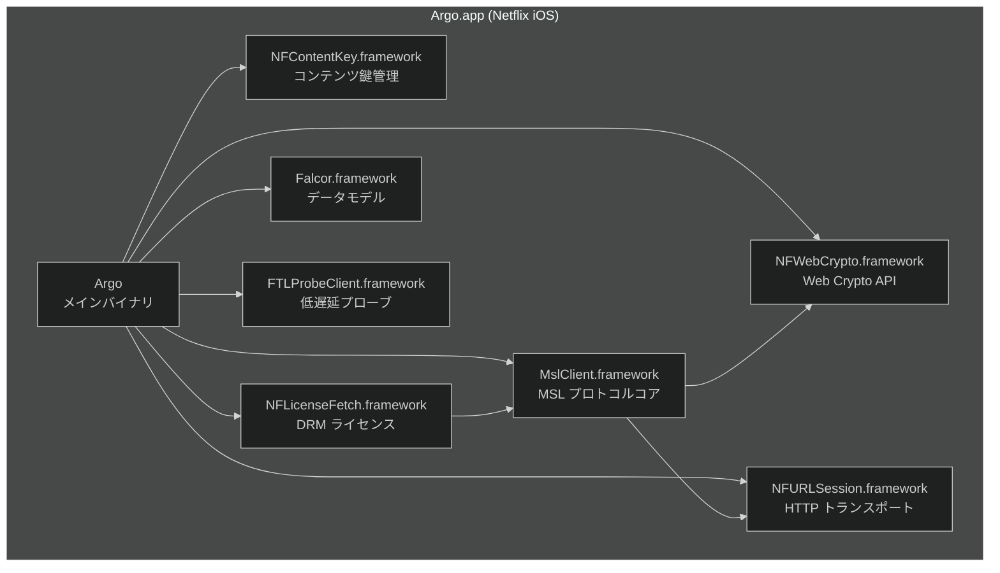
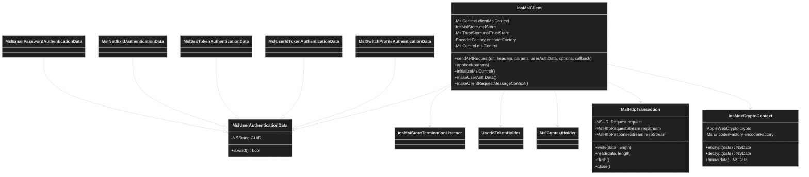
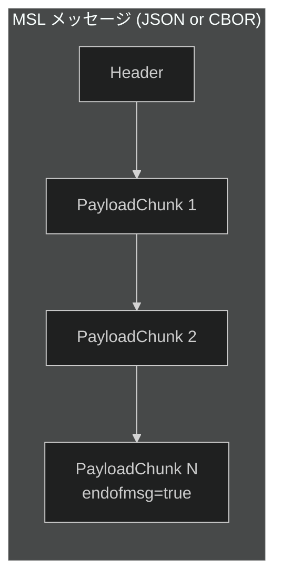
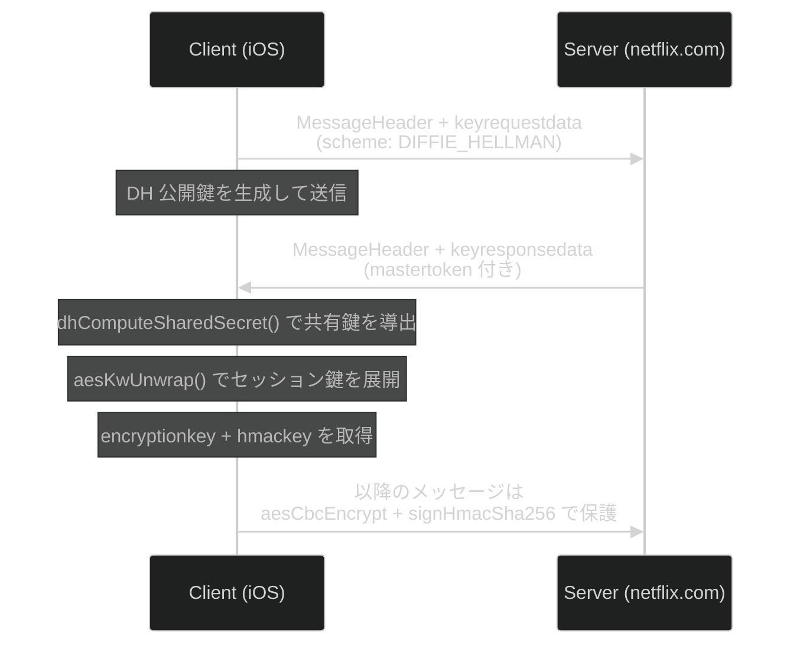
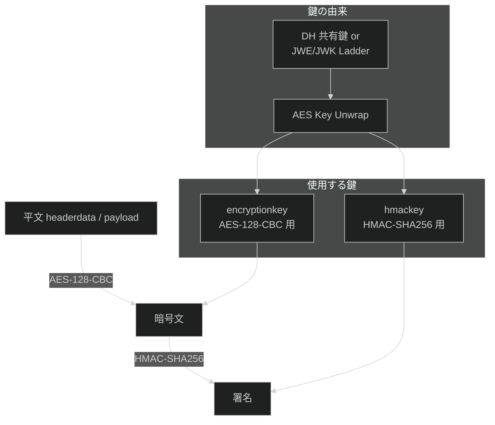
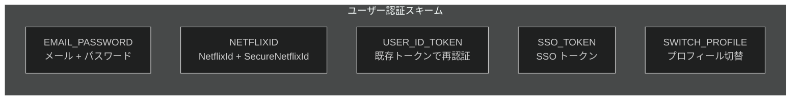
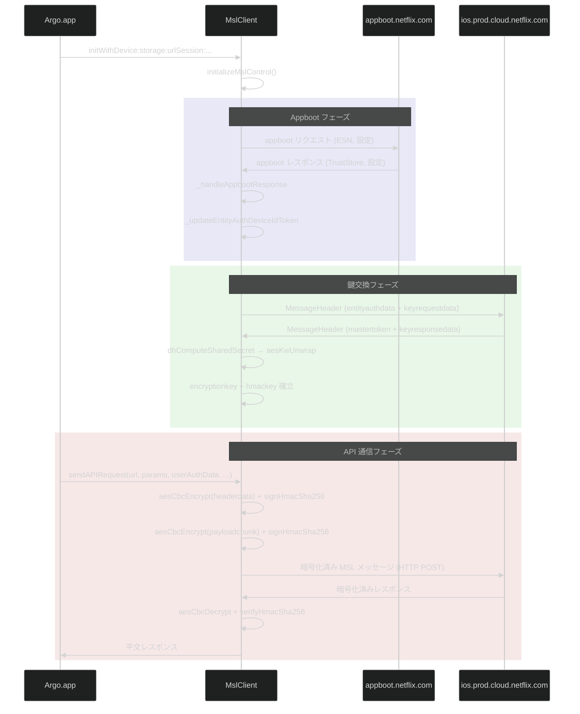

# Netflix Message Security Layer (MSL) — iOS 動的解析レポート

Netflix iOS アプリ (`Netflix-15.48.1.ipa` / `Argo.app`) のバイナリ `MslClient.framework` を静的解析し、Frida による動的フックで得られた通信データと突合した結果をまとめる。

---

## 1. MSL プロトコル概要

MSL (Message Security Layer) は Netflix が独自開発した TLS 上のアプリケーション層セキュリティプロトコル。エンドポイント間の認証・鍵交換・メッセージの暗号化と完全性検証を担う。

### プロトコルの目的

- **エンティティ認証**: デバイス (ESN) をサーバーに証明する
- **ユーザー認証**: Netflix アカウントの認証 (メール/パスワード, Cookie, SSO, UserIdToken)
- **鍵交換**: セッション鍵の安全な確立 (DH, JWE/JWK Ladder 等)
- **メッセージ保護**: ペイロードの暗号化 (AES-CBC) と署名 (HMAC-SHA256)
- **トークン管理**: MasterToken / UserIdToken / ServiceToken によるセッション維持

---

## 2. アーキテクチャ

### 2.1 フレームワーク構成



### 2.2 MslClient 内部クラス構成



---

## 3. MSL メッセージ構造

### 3.1 全体構造



Header は `MessageHeader` (正常時) または `ErrorHeader` (エラー時) のいずれか。

### 3.2 MessageHeader

```
{
  "headerdata": "<Base64 暗号文>",       // AES-CBC で暗号化された JSON
  "signature": "<Base64 HMAC-SHA256>",
  "mastertoken": { ... }                 // または "entityauthdata": { ... }
}
```

`headerdata` を復号すると以下の JSON が得られる:

| フィールド | 型 | 説明 |
|---|---|---|
| `messageid` | number | メッセージ一意ID |
| `sender` | string | 送信者 (ESN) |
| `recipient` | string | 受信先 |
| `renewable` | boolean | トークン更新要求 |
| `handshake` | boolean | ハンドシェイクメッセージか |
| `nonreplayableid` | number | リプレイ防止ID |
| `timestamp` | number | Unix タイムスタンプ |
| `capabilities` | object | 対応する圧縮アルゴリズム等 |
| `keyrequestdata` | array | 鍵交換リクエスト |
| `keyresponsedata` | object | 鍵交換レスポンス |
| `userauthdata` | object | ユーザー認証データ |
| `useridtoken` | object | UserIdToken |

### 3.3 MasterToken

```
{
  "mastertoken": {
    "tokendata": "<Base64>",       // サーバー鍵で暗号化
    "signature": "<Base64>"
  }
}
```

`tokendata` (サーバーのみ復号可能) の内部:

| フィールド | 説明 |
|---|---|
| `renewalwindow` | 更新可能開始時刻 |
| `expiration` | 有効期限 |
| `sequencenumber` | シーケンス番号 |
| `serialnumber` | シリアル番号 |
| `sessiondata` | 暗号化されたセッションデータ (encryptionkey, hmackey, identity) |

### 3.4 PayloadChunk

```
{
  "payloadchunk": {
    "payload": "<Base64 暗号文>",         // AES-CBC
    "signature": "<Base64 HMAC-SHA256>"
  }
}
```

`payload` を復号すると:

| フィールド | 説明 |
|---|---|
| `messageid` | メッセージID (Header と一致) |
| `sequencenumber` | チャンク番号 |
| `endofmsg` | 最終チャンクか |
| `compressionalgo` | `GZIP` (圧縮時) |
| `data` | Base64 エンコードされたアプリケーションデータ (圧縮時は展開が必要) |

### 3.5 ErrorHeader

```
{
  "errordata": "<Base64>",
  "signature": "<Base64>"
}
```

---

## 4. 暗号スタック

### 4.1 鍵交換フロー



### 4.2 鍵交換スキーム

バイナリから抽出された `keyrequestdata.scheme` の値:

| スキーム | 説明 |
|---|---|
| `DIFFIE_HELLMAN` | DH 鍵交換。`dhComputeSharedSecret()` で共有鍵を導出 |
| `JWE_LADDER` | JWE ベースのラダー方式鍵交換 |
| `JWK_LADDER` | JWK ベースのラダー方式鍵交換 |
| `ASYMMETRIC_WRAPPED` | RSA 等の非対称鍵でセッション鍵をラップ |
| `SYMMETRIC_WRAPPED` | 対称鍵でセッション鍵をラップ |

### 4.3 メッセージ暗号化/署名



### 4.4 C++ 暗号関数 (namespace `netflix::msl::crypto`)

| 関数 | シグネチャ | 用途 |
|---|---|---|
| `aesCbcEncrypt` | `(key, iv, plaintext) → ciphertext` | ペイロード暗号化 |
| `aesCbcDecrypt` | `(key, iv, ciphertext) → plaintext` | ペイロード復号 |
| `signHmacSha256` | `(key, data) → signature` | メッセージ署名 |
| `verifyHmacSha256` | `(key, data, signature) → bool` | 署名検証 |
| `aesKwWrap` | `(kek, key) → wrapped` | セッション鍵ラップ |
| `aesKwUnwrap` | `(kek, wrapped) → unwrapped` | セッション鍵アンラップ |
| `dhComputeSharedSecret` | `(priv, pub, prime) → shared` | DH 共有鍵導出 |
| `rsaEncrypt` | `(EVP_PKEY*, input) → output` | RSA 暗号化 |
| `rsaDecrypt` | `(EVP_PKEY*, input) → output` | RSA 復号 |
| `hmacSha` | `(alg, key, data) → mac` | 汎用 HMAC |

引数はすべて `std::vector<uint8_t>` (arm64 レイアウト: `+0x00` begin ptr, `+0x08` end ptr)。

---

## 5. 認証スキーム

### 5.1 エンティティ認証

デバイスをサーバーに証明する。バイナリからは `NONE` スキームのみ確認。

### 5.2 ユーザー認証



| ObjC クラス | スキーム | 保持データ |
|---|---|---|
| `MslEmailPasswordAuthenticationData` | `EMAIL_PASSWORD` | email, password |
| `MslNetflixIdAuthenticationData` | `NETFLIXID` | netflixId, secureNetflixId |
| `MslUserIdTokenAuthenticationData` | `USER_ID_TOKEN` | UIT (UserIdToken) |
| `MslSsoTokenAuthenticationData` | `SSO_TOKEN` | ssoToken |
| `MslSwitchProfileAuthenticationData` | `SWITCH_PROFILE` | switchGUID, originalGUID |

---

## 6. 通信先ドメイン

### 6.1 ライセンス・MSL 関連ドメイン

#### `appboot.netflix.com` — 初回起動・エンティティ認証

| 項目 | 内容 |
|---|---|
| **プロトコル** | HTTPS (非 MSL) |
| **メソッド** | GET |
| **パス** | `/appboot/{ESN}?keyVersion=1` |
| **通信内容** | アプリ起動時にデバイスの ESN (例: `NFAPPL-02-IPHONE9=1-`) をパスに含めてリクエスト。レスポンスで MSL TrustStore、サーバー設定、FTL ターゲットホスト一覧を受け取る。MSL 鍵交換の前段階として必須 |
| **タイミング** | アプリ起動時 (coldstart)、および定期的な再取得 |
| **復号状況** | URL のみ取得済み (`NSURL URLWithString` フック)。リクエストボディは無い (GET)。**レスポンスボディは未取得** — `_handleAppbootResponse` のフックが未実装のため、TrustStore・設定の中身は見えていない |

#### `ios.prod.cloud.netflix.com` — MSL API メインエンドポイント

| 項目 | 内容 |
|---|---|
| **プロトコル** | HTTPS + MSL (アプリケーション層で MSL 暗号化) |
| **メソッド** | POST |
| **通信内容** | MSL で暗号化されたペイロードを送受信。以下の主要 API を確認: |

MSL API (`IosMslClient.sendAPIRequest` 経由):

| MSL パス | 用途 | 詳細 | 復号状況 |
|---|---|---|---|
| `/manifest` | **ストリーミングマニフェスト取得** | `viewableId` (コンテンツID) を指定し、利用可能なストリームプロファイル (H.264/HEVC/Audio/字幕) の一覧と CDN URL を取得。`flavor` は `PRE_FETCH` (プリフェッチ) と `standard` (再生開始時) の2種。`drmType: "fairplay"` で DRM 方式を指定 | **リクエスト平文: 取得済み** — `sendAPIRequest` フックで暗号化前の全パラメータ (viewableId, profiles, drmType 等) を捕捉。**レスポンス: 未取得** — サーバー返却の manifest JSON (CDN URL、ストリーム一覧) は `aesCbcDecrypt` で復号されるが、アプリ層での復号後データの捕捉フックが無い |
| `/license` | **DRM ライセンス取得** | FairPlay の `challengeBase64` (SPC: Server Playback Context) を送信し、CKC (Content Key Context) を受け取る。`licenseType=limited`、`playbackContextId`、`drmContextId`、`esn` をクエリパラメータで指定 | **リクエスト平文: 取得済み** — `challengeBase64` (SPC)、`drmSessionId`、`xid` 等を捕捉。SPC 自体は FairPlay が生成したバイナリの Base64 であり、中の鍵素材は取り出せていない。**レスポンス (CKC): 未取得** |
| `/logblob` | ログ送信 | クライアントログ (再生状態、エラー、ネットワーク統計等) をサーバーに送信 | **リクエスト平文: 取得済み** — ログ内容 (type, msg, ftlstatus, ネットワーク統計等) を完全に捕捉 |
| `/syncDeactivateLinks` | デバイスリンク同期 | デバイスの無効化リンクを同期 | **リクエスト平文: 取得済み** |

HTTP API (非 MSL、GraphQL/Falcor 経由):

| HTTP パス | 用途 | 詳細 | 復号状況 |
|---|---|---|---|
| `/graphql` | GraphQL API | ブラウズデータ、マイリスト操作等の UI データ取得。`operationName` でクエリを指定 (例: `myListActions`) | **リクエスト: 取得済み** — `setHTTPBody` フックで URL エンコードされたクエリ全文 (operationName, query, variables, esn 等) を捕捉。**レスポンス: 未取得** |
| `/msl/playapi/ios/logblob` | 再生ログ送信 | MSL ラップされた再生関連ログ (FTL ステータス、プローブ結果等) | **リクエスト: 部分的** — URL とメタデータ (size, content_type) は取得済みだが、ボディは MSL 暗号化済みのため `body: null`。平文は `/logblob` MSL API 側で捕捉済み |
| `/nq/iosplatform/pbo_license/~1.0.0/router` | **ライセンスルーター** | DRM ライセンス取得のルーティングエンドポイント | **リクエスト: 部分的** — URL とメタデータ (size: 2321) は取得済みだが、ボディは MSL 暗号化済みのため `body: null`。平文は `/license` MSL API 側で捕捉済み |

#### `ios.prod.ftl.netflix.com` — FTL (低遅延) エンドポイント

| 項目 | 内容 |
|---|---|
| **プロトコル** | HTTPS |
| **メソッド** | POST |
| **パス** | `/graphql` |
| **通信内容** | `ios.prod.cloud.netflix.com` と同等の GraphQL API を提供する低遅延パス。FTL (Faster Than Light) はNetflix の独自エッジネットワーク (Open Connect) 上のプロキシで、AWS 経由より近いエッジから応答する。フォールバック先として `ios.prod.cloud.netflix.com` (AWS) と `ios-anycast.prod.ftl.netflix.com` (FTL Anycast) が設定されている |
| **タイミング** | UI 操作時のデータ取得全般 |
| **復号状況** | **リクエスト: 部分的** — URL と HTTP メタデータ (method, content_type) は取得済みだが `body: null` (size: 0)。FTL 経由の GraphQL ボディは `setHTTPBody` フックで捕捉できていない (FTL 専用のリクエスト構築パスを使用している可能性)。**レスポンス: 未取得** |

### 6.2 コンテンツ配信ドメイン

#### `occ-*.nflxso.net` — Open Connect CDN (画像)

| 項目 | 内容 |
|---|---|
| **プロトコル** | HTTPS |
| **メソッド** | GET |
| **パス** | `/dnm/api/v6/{apiKey}/{imageHash}.{png,jpg,webp}?r={resolution}` |
| **通信内容** | ボックスアート、サムネイル等の画像アセットをCDN から取得。`occ-0-7146-8934.1.nflxso.net` のようなパターンで、数字部分は CDN ノードを示す。大量の並列リクエストが発生 (1セッションで50件以上) |
| **復号状況** | **URL: 取得済み** — 画像 URL のフルパスとクエリパラメータを捕捉 (50件以上)。画像自体は暗号化されていない通常の HTTPS のため復号不要。**レスポンス (画像バイナリ): 未取得** — `SSL_read` フックは無効化中 |

> **Note**: 動画・音声ストリーム本体の CDN ドメイン (`ipv4-*.1.oca.nflxvideo.net` 等) は `/manifest` レスポンスに含まれる URL から配信されるが、manifest レスポンスが未取得のためストリーム URL 自体を把握できていない。また DASH セグメントは DRM (FairPlay) で暗号化されており、コンテンツ鍵は `/license` レスポンス (CKC) から取得される。

### 6.3 その他

| ドメイン | 用途 | 通信内容 | 復号状況 |
|---|---|---|---|
| `ichnaea-web.netflix.com` | 地域判定 | `POST /cl2` (application/json) でクライアントの地理的位置を判定。コンテンツのリージョン制限に使用 | URL のみ。`body: null`、レスポンスも未取得 |

### 6.4 復号状況サマリー

| レイヤー | 取得方法 | 状態 | 備考 |
|---|---|---|---|
| **MSL リクエスト平文** | `IosMslClient.sendAPIRequest` フック | **取得済み** | 暗号化前のパラメータ JSON を完全捕捉 (`/manifest`, `/license`, `/logblob` 等) |
| **MSL レスポンス平文** | `aesCbcDecrypt` フック (実装済み) | **未取得** | `hookMslCrypto()` に実装済みだが `crypto/` ディレクトリにログが無い。`MslClient` モジュールがロードされていないか、C++ シンボルの解決に失敗した可能性 |
| **HTTP リクエストボディ** | `setHTTPBody` フック | **部分的** | GraphQL (cloud) は取得済み。FTL 経由・MSL ラップ済みリクエストは `body: null` |
| **HTTP レスポンスボディ** | `SSL_read` フック (無効化中) | **未取得** | `hookSSL()` がコメントアウトされているため全レスポンスが未捕捉 |
| **MSL 暗号鍵素材** | `aesKwUnwrap` / `dhComputeSharedSecret` フック | **未取得** | MslClient C++ フックからのログが出力されていない |
| **FairPlay SPC/CKC** | `/license` MSL API フック | **SPC のみ** | `challengeBase64` (SPC) は Base64 で取得済みだが中身は FairPlay バイナリ。CKC (レスポンス) は未取得 |
| **コンテンツ鍵** | `NFContentKey.framework` (未フック) | **未取得** | DRM コンテンツ鍵の取得にはさらなるフックが必要 |

---

## 7. アプリ起動フロー



---

## 8. エンコード形式

バイナリ内に `mslcbor_decode_` シンボルが存在することから、JSON と CBOR の両方をサポート:

- **JSON**: デフォルトのエンコード形式。`MslEncoderFactory` + `JsonMslArray` で処理
- **CBOR**: バイナリエンコード形式。`mslcbor_decode_negint` 等のシンボルあり。libcbor (`configuration.h.in`) を同梱
- **JSON パーサー**: RapidJSON (Tencent 製, MIT ライセンス) を使用 (`license.txt` から確認)

---

## 9. 解析に使ったツール

| ツール | 用途 |
|---|---|
| `unzip` | IPA (ZIP) の展開 |
| `strings` | バイナリからの文字列抽出 |
| `nm --demangle` | C++ シンボルのデマングル・一覧取得 |
| Frida + Gadget | 動的フックによる実行時データ取得 |
| `hook_netflix.js` | MSL 暗号関数・API 呼び出しのインターセプト |
| `run.py` | Frida ログの JSONL パース・ドメイン別ファイル保存 |

---

## 10. 未取得レスポンス一覧

以下は MSL 暗号化されているため現在のフック構成では平文を捕捉できていないレスポンス。いずれも `ios.prod.cloud.netflix.com` から MSL (AES-CBC + HMAC-SHA256) で暗号化されて返される。

| API パス | レスポンス内容 | 重要度 | 取得に必要なアプローチ |
|---|---|---|---|
| `/manifest` | ストリーミングマニフェスト JSON — CDN URL 一覧 (`urls`)、ストリーム情報 (`video_tracks`, `audio_tracks`, `timedtexttracks`)、DRM 初期化データ (`drmHeader`)、セッション情報 (`playbackContextId`) 等 | **高** | MSL レスポンス復号の捕捉が必要 |
| `/license` | FairPlay CKC (Content Key Context) — `licenseResponseBase64` として返される。コンテンツ復号鍵が含まれる | **高** | MSL レスポンス復号 + FairPlay CKC パース |
| `/logblob` | ログ送信の ACK — ステータスコード程度 | 低 | — |
| `/syncDeactivateLinks` | デバイス無効化リンクの同期結果 | 低 | — |
| `/nq/iosplatform/pbo_license/~1.0.0/router` | ライセンスルーティング結果 — 実際の `/license` エンドポイントへのリダイレクト情報 | 中 | MSL レスポンス復号 |
| `/graphql` (cloud) | GraphQL レスポンス JSON — UI データ (lolomo、ビデオ詳細、マイリスト等) | 中 | `SSL_read` フック有効化 or レスポンスコールバックのフック |
| `/graphql` (ftl) | 同上 (FTL 経由) | 中 | 同上 |
| `/appboot/{ESN}` | Appboot 設定 JSON — TrustStore、FTL ターゲット、機能フラグ等 | 中 | `SSL_read` フック有効化 or `_handleAppbootResponse` のフック |

### 復号に向けたアプローチ

```
方法1: hookSSL() を有効化して SSL_read をフック
  → HTTP レスポンスを丸ごと取得
  → MSL 暗号化されたレスポンスはバイナリ (Base64 JSON) として見える
  → 暗号化された headerdata / payload をそのまま保存

方法2: MslClient C++ の aesCbcDecrypt フックを修正
  → hookMslCrypto() は実装済みだが MslClient モジュールのロード検知に問題あり
  → Module.findModuleByName("MslClient") の戻り値を確認
  → MslClient.framework 内の aesCbcDecrypt で復号後の平文を直接取得

方法3: ObjC コールバック層でレスポンスを捕捉
  → IosMslClient の sendAPIRequest の callback 引数をフック
  → MSL 復号後の平文 JSON がコールバックに渡されるため最も確実
  → 実装: ObjC.Block(args[7]) の invocation をラップして引数をログ
```

**最も効果的な手法**: 方法3 (コールバックフック) が MSL 復号済みの平文を直接取得でき、暗号鍵の管理が不要。`/manifest` と `/license` のレスポンスを取得できれば、CDN URL 一覧と FairPlay CKC を入手できる。
