# 1. アーキテクチャ概要

[← 目次に戻る](specification.md)

---

## 1.1 通信スタック

Netflix クライアントは TLS の上に独自の MSL (Message Security Layer) を実装し、二重暗号化による通信保護を行う。

```mermaid
%%{init: {'theme':'dark'}}%%
graph TB
    subgraph Stack["通信スタック"]
        direction TB
        A["Netflix Application"]
        B["MSL (Message Security Layer)<br/>暗号化: AES-CBC / AES-GCM<br/>署名: HMAC-SHA256<br/>エンコード: JSON (iOS) / CBOR (Android)"]
        C["TLS 1.2 / 1.3"]
        D["HTTP/2<br/>Cronet (Android) / NSURLSession (iOS)"]
    end

    A --> B --> C --> D

    style Stack fill:#1a1a2e,stroke:#e94560
```

## 1.2 プラットフォーム別実装

```mermaid
%%{init: {'theme':'dark'}}%%
graph LR
    subgraph Android
        A_MSL["WidevineCryptoContext<br/>(Java)"]
        A_HTTP["Cronet<br/>(Chromium)"]
        A_DRM["Widevine<br/>L1/L3"]
        A_ENC["CBOR<br/>(バイナリ)"]
        A_OBF["ProGuard"]
        A_ALE["ALE<br/>(追加暗号化)"]
    end

    subgraph iOS
        I_MSL["MslClient.framework<br/>(C++)"]
        I_HTTP["NFURLSession.framework"]
        I_DRM["FairPlay<br/>Streaming"]
        I_ENC["JSON<br/>(テキスト)"]
    end

    style Android fill:#1a472a,stroke:#2d6a4f
    style iOS fill:#1a1a4e,stroke:#4a4ae0
```

| 項目 | Android | iOS |
|---|---|---|
| MSL 実装 | Java (`WidevineCryptoContext`) | C++ (`MslClient.framework`) |
| HTTP スタック | Cronet (Chromium) | `NFURLSession.framework` |
| DRM | Widevine (L1/L3) | FairPlay Streaming |
| MSL エンコード | CBOR (バイナリ) | JSON (テキスト) |
| 難読化 | ProGuard | — |
| 追加暗号化層 | ALE (Application Level Encryption) | なし |

## 1.3 通信先エンドポイント

### Android

```mermaid
%%{init: {'theme':'dark'}}%%
graph LR
    App["Netflix<br/>Android"]

    AB["android14.appboot.netflix.com<br/>HTTPS"]
    FTL["android14.prod.ftl.netflix.com<br/>HTTPS + MSL"]
    Cloud["android14.prod.cloud.netflix.com<br/>HTTPS + MSL"]
    Logs["android14.logs.netflix.com<br/>HTTPS + MSL"]

    App -->|デバイス登録<br/>nfvdid Cookie| AB
    App -->|MSL API + GraphQL| FTL
    App -->|MSL GraphQL| Cloud
    App -->|テレメトリ| Logs

    style App fill:#e94560,stroke:#fff
    style AB fill:#0f3460,stroke:#16213e
    style FTL fill:#0f3460,stroke:#16213e
    style Cloud fill:#0f3460,stroke:#16213e
    style Logs fill:#0f3460,stroke:#16213e
```

| エンドポイント | プロトコル | 用途 |
|---|---|---|
| `android14.appboot.netflix.com` | HTTPS | デバイス登録・`nfvdid` Cookie 発行 |
| `android14.prod.ftl.netflix.com` | HTTPS + MSL | MSL API (`/nq/androidui/samurai/`) + Non-MSL GraphQL |
| `android14.prod.cloud.netflix.com` | HTTPS + MSL | MSL GraphQL |
| `android14.logs.netflix.com` | HTTPS + MSL | テレメトリ (`/logblob`) |

### iOS

| エンドポイント | プロトコル | 用途 |
|---|---|---|
| `appboot.netflix.com` | HTTPS | デバイス登録・TLS 設定 |
| `ios.prod.cloud.netflix.com` | HTTPS + MSL | MSL API (`/manifest`, `/license`, `/logblob`) |
| `ios.prod.ftl.netflix.com` | HTTPS | GraphQL (低遅延) |
| `occ-*.nflxso.net` | HTTPS | CDN 画像配信 |

## 1.4 FTL (Faster Than Light)

FTL は Netflix のエッジネットワークであり、低遅延アクセスを提供する。Android では `prod.ftl` が主要な MSL API エンドポイントとして使用され、`prod.cloud` (AWS) はフォールバック・GraphQL 用途に使用されると推定される。

---

[次章: MSL プロトコル →](02_msl_protocol.md)
