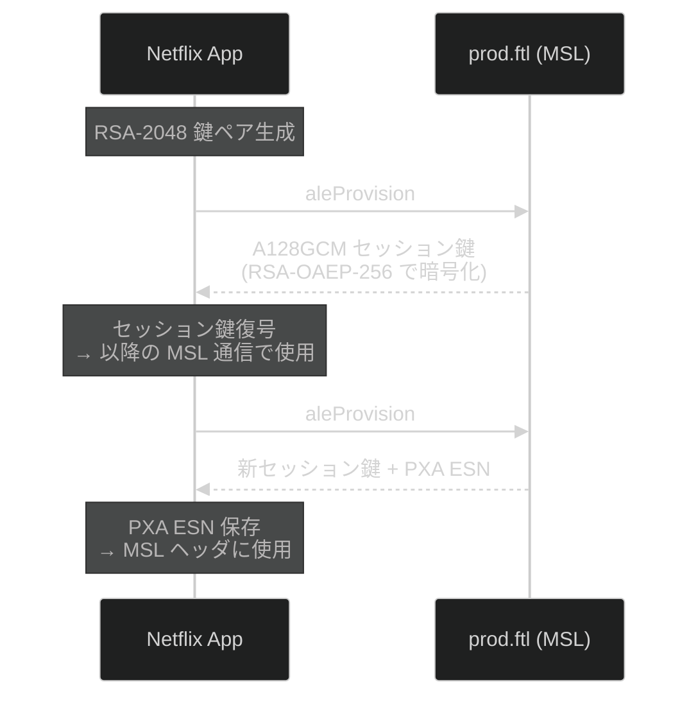
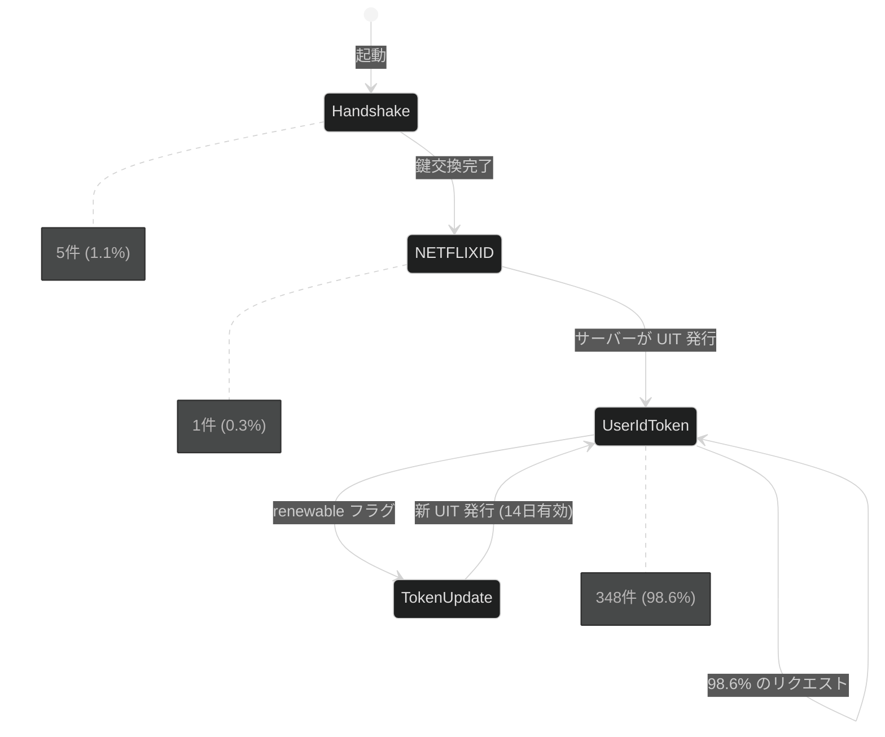

# 2. MSL (Message Security Layer) プロトコル

[← 目次に戻る](specification.md)

---

## 2.1 概要

MSL は Netflix 独自のアプリケーション層セキュリティプロトコルである。TLS による経路暗号化に加え、エンドツーエンドのメッセージ保護を提供する。

```mermaid
%%{init: {'theme':'dark'}}%%
graph TB
    subgraph MSL["MSL 主要機能"]
        EA["エンティティ認証<br/>(デバイス識別)"]
        UA["ユーザー認証<br/>(アカウント認証)"]
        KE["鍵交換<br/>(セッション鍵確立)"]
        MP["メッセージ保護<br/>(暗号化 + 署名)"]
        TM["トークン管理<br/>(MasterToken / UserIdToken)"]
    end

    EA --> KE
    UA --> TM
    KE --> MP

    style MSL fill:#1a1a2e,stroke:#e94560
```



## 2.2 メッセージ構造

```mermaid
%%{init: {'theme':'dark'}}%%
graph TB
    subgraph Message["MSL Message"]
        direction TB
        MH["MessageHeader<br/>暗号化された headerdata + HMAC 署名"]
        PC1["PayloadChunk #1<br/>暗号化された payload + HMAC 署名"]
        PC2["PayloadChunk #2"]
        PCN["PayloadChunk #N<br/>endofmsg = true"]
    end

    MH --> PC1 --> PC2 -->|...| PCN

    style Message fill:#0f3460,stroke:#16213e
```



### MessageHeader

| フィールド | CBOR キー | 型 | 説明 |
|---|---|---|---|
| `mastertoken` | 17 | object | MasterToken (セッション識別) |
| `useridtoken` | 18 | object | UserIdToken (ユーザー識別) |
| `renewable` | 19 | boolean | トークン更新許可フラグ |
| `sender` | 20 | string | 送信者 ESN |
| `handshake` | 21 | boolean | ハンドシェイクメッセージフラグ |
| `messageid` | 22 | number | メッセージ ID |
| `timestamp` | 24 | number | Unix タイムスタンプ (秒) |
| `capabilities` | 36 | object | 圧縮・言語・エンコーダー |
| `peer` | 40 | boolean | ピア接続フラグ |
| `nonreplayableid` | 41 | number | リプレイ防止 ID |
| `keyrequestdata` | 42 | array | 鍵交換リクエスト |
| `userauthdata` | 47 | object | ユーザー認証データ |

### PayloadChunk

| フィールド | CBOR キー | 型 | 説明 |
|---|---|---|---|
| `sequencenumber` | 14 | number | チャンクシーケンス番号 |
| `messageid` | 22 | number | 対応する MessageHeader の ID |
| `compressionalgo` | 44 | string | 圧縮アルゴリズム (通常 GZIP) |
| `data` | 62 | bytes | ペイロードデータ (GZIP 圧縮) |
| `endofmsg` | 63 | boolean | 最終チャンクフラグ |

### MasterToken

| フィールド | CBOR キー | 型 | 説明 |
|---|---|---|---|
| `tokendata` | 15 | bytes | 暗号化されたトークンデータ |
| `signature` | 16 | bytes | HMAC-SHA256 署名 |
| `sequencenumber` | 43 | number | シーケンス番号 |
| `serialnumber` | 25 | number | トークンシリアル番号 |
| `renewable` | 26 | boolean | 更新可能フラグ |
| `issuer` | 27 | string | 発行者 |
| `identity` | 28 | string | エンティティ ID |

### UserIdToken

| フィールド | CBOR キー | 型 | 説明 |
|---|---|---|---|
| `tokendata` | 15 | bytes | 暗号化されたトークンデータ |
| `signature` | 16 | bytes | HMAC-SHA256 署名 (44 バイト) |
| `issuedate` | 11 | number | 発行日時 (Unix 秒) |
| `mtserialnum` | 12 | number | 紐づく MasterToken のシリアル番号 |
| `expiration` | 13 | number | 有効期限 (発行から **14 日間**) |
| `serialnumber` | 25 | number | トークンシリアル番号 |
| `userdata` | 29 | bytes | 暗号化されたユーザーデータ |

文字列キー (CBOR 整数マッピングなし):
- `maxpayloadchunksize` — PayloadChunk 最大サイズ
- `profileid` — プロファイル GUID
- `duid` — デバイスユニーク ID

### MessageHeader ツリー構造

```mermaid
%%{init: {'theme':'dark'}}%%
graph TB
    MH["MessageHeader"]
    MT["17: mastertoken"]
    UIT["18: useridtoken"]
    RN["19: renewable"]
    SD["20: sender (ESN)"]
    HS["21: handshake"]
    MI["22: messageid"]
    TS["24: timestamp"]
    CAP["36: capabilities"]
    PR["40: peer"]
    NR["41: nonreplayableid"]
    KRD["42: keyrequestdata"]
    UAD["47: userauthdata"]

    MT_TD["15: tokendata"]
    MT_SG["16: signature"]
    MT_SN["25: serialnumber"]

    UIT_TD["15: tokendata"]
    UIT_SG["16: signature"]
    UIT_ID["11: issuedate"]
    UIT_MS["12: mtserialnum"]
    UIT_EX["13: expiration"]

    CAP_C["37: compressionalgos"]
    CAP_L["38: languages"]
    CAP_E["39: encoders"]

    KRD_S["30: scheme"]
    KRD_K["31: keydata"]

    UAD_S["30: scheme"]
    UAD_A["35: authdata"]
    UAD_NI["56: netflixid"]
    UAD_SI["60: securenetflixid"]

    MH --> MT & UIT & RN & SD & HS & MI & TS & CAP & PR & NR & KRD & UAD

    MT --> MT_TD & MT_SG & MT_SN
    UIT --> UIT_TD & UIT_SG
    UIT_TD --> UIT_ID & UIT_MS & UIT_EX

    CAP --> CAP_C & CAP_L & CAP_E
    KRD --> KRD_S & KRD_K
    UAD --> UAD_S & UAD_A
    UAD_A --> UAD_NI & UAD_SI

    style MH fill:#e94560,stroke:#fff
    style MT fill:#0f3460,stroke:#16213e
    style UIT fill:#0f3460,stroke:#16213e
    style CAP fill:#533483,stroke:#16213e
    style KRD fill:#533483,stroke:#16213e
    style UAD fill:#533483,stroke:#16213e
```



## 2.3 CBOR エンコーディング (Android)

Android では MSL メッセージを CBOR (Concise Binary Object Representation) でエンコードする。CBOR self-described tag `d9d9f7` がメッセージ先頭に付与される。

JSON フィールド名は帯域削減のため整数キーにマッピングされる。353 の MessageHeader と 403 の PayloadChunk を解析し、35 個の整数キーマッピングを確認した。

**完全な CBOR 整数キー一覧:**

| キー | JSON フィールド | コンテキスト |
|---|---|---|
| 11 | `issuedate` | UserIdToken.tokendata |
| 12 | `mtserialnum` | UserIdToken.tokendata |
| 13 | `expiration` | UserIdToken.tokendata |
| 14 | `sequencenumber` | PayloadChunk |
| 15 | `tokendata` | MasterToken / UserIdToken / keyrequestdata |
| 16 | `signature` | 共通トークン署名 |
| 17 | `mastertoken` | MessageHeader |
| 18 | `useridtoken` | MessageHeader |
| 19 | `renewable` | MessageHeader |
| 20 | `sender` | MessageHeader |
| 21 | `handshake` | MessageHeader |
| 22 | `messageid` | MessageHeader / PayloadChunk |
| 24 | `timestamp` | MessageHeader |
| 25 | `serialnumber` | トークン識別 |
| 26 | `renewable` | MasterToken.tokendata |
| 27 | `issuer` | MasterToken.tokendata |
| 28 | `identity` | MasterToken.tokendata |
| 29 | `userdata` | UserIdToken.tokendata |
| 30 | `scheme` | keyrequestdata / userauthdata |
| 31 | `keydata` | keyrequestdata |
| 35 | `authdata` | userauthdata |
| 36 | `capabilities` | MessageHeader |
| 37 | `compressionalgos` | capabilities |
| 38 | `languages` | capabilities |
| 39 | `encoders` | capabilities |
| 40 | `peer` | MessageHeader |
| 41 | `nonreplayableid` | MessageHeader |
| 42 | `keyrequestdata` | MessageHeader |
| 43 | `sequencenumber` | MasterToken.tokendata |
| 44 | `compressionalgo` | PayloadChunk |
| 47 | `userauthdata` | MessageHeader |
| 50 | `cdmsg` | keyrequestdata.keydata (Widevine) |
| 56 | `netflixid` | userauthdata.authdata |
| 60 | `securenetflixid` | userauthdata.authdata |
| 62 | `data` | PayloadChunk |
| 63 | `endofmsg` | PayloadChunk |

## 2.4 暗号化・署名

### iOS (`MslClient.framework` — C++)

名前空間 `netflix::msl::crypto` 配下の関数:

| 関数 | 用途 |
|---|---|
| `aesCbcEncrypt(key, iv, plaintext)` | AES-128-CBC ペイロード暗号化 |
| `aesCbcDecrypt(key, iv, ciphertext)` | AES-128-CBC ペイロード復号 |
| `signHmacSha256(key, data)` | メッセージ HMAC 署名 |
| `verifyHmacSha256(key, data, signature)` | 署名検証 |
| `aesKwWrap(kek, key)` | セッション鍵ラッピング |
| `aesKwUnwrap(kek, wrapped)` | セッション鍵アンラッピング |
| `dhComputeSharedSecret(priv, pub, prime)` | Diffie-Hellman 共有秘密計算 |

### Android (`WidevineCryptoContext` — Java)

ProGuard による難読化マッピング:

| メソッド | 難読化名 | 呼出回数 | 用途 |
|---|---|---|---|
| `encrypt` | (原名) | 322 | MSL ペイロード暗号化 |
| `decrypt` (2引数) | `c` | 36 | MSL レスポンス復号 |
| `sign` (3引数) | `b` | 322 | MSL メッセージ HMAC |
| `verify` (3引数, bool) | `c` | — | 署名検証 |

## 2.5 鍵交換方式

### 共通 (iOS / Android)

| 方式 | 説明 |
|---|---|
| `DIFFIE_HELLMAN` | DH 鍵交換 |
| `JWE_LADDER` | JWE ベースラダー交換 |
| `JWK_LADDER` | JWK ベースラダー交換 |
| `ASYMMETRIC_WRAPPED` | RSA ラッピング |
| `SYMMETRIC_WRAPPED` | 対称鍵ラッピング |
| `WIDEVINE` | Widevine CDM 鍵交換 (Android 固有) |

### ALE (Application Level Encryption) — Android 固有

Android には MSL の上に追加の暗号化層 ALE が実装されている。



**プロビジョニングパラメータ:**

| パラメータ | 値 | 説明 |
|---|---|---|
| `keyx.scheme` | `RSA-OAEP-256` | 鍵交換暗号化方式 |
| `keyx.data.pubkey` | Base64 RSA 2048-bit | クライアント生成の使い捨て公開鍵 |
| `scheme` | `A128GCM` | セッション暗号化方式 (AES-128-GCM) |
| `type` | `SOCKETROUTER` | プロビジョニング種別 |
| `ver` | `1` | プロトコルバージョン |

**ALE セッション:**
- JWE ラッピング: `alg: A128GCMKW`, `enc: A128GCM`, `ver: 1`
- TTL: 1800 秒
- 更新ウィンドウ: 600 秒
- 暗号化チェーン: `ale.encrypt` → `ale.aesGcmEncrypt` → `ale.jwe.encrypt`

**aleProvision が 2 回呼ばれる理由:**
1. **#1:** 起動直後に即座に鍵交換を開始 (他リクエストと並列)
2. **#2:** `getProxyEsn` のレスポンス受信後に再鍵交換 (PXA ESN の発行と紐づく)

同一の RSA 公開鍵を使用するが、サーバー側で新しいセッション鍵が発行される。

## 2.6 ユーザー認証

### 認証スキーム

| スキーム | データ | 観測状況 |
|---|---|---|
| `NETFLIXID` | `netflixId` + `secureNetflixId` | **観測済** (初回ハンドシェイク時) |
| `EMAIL_PASSWORD` | email, password | ログイン時に使用されると推定される |
| `USER_ID_TOKEN` | UserIdToken | **観測済** (98.6% のリクエストで使用) |
| `SSO_TOKEN` | ssoToken | SSO 連携時に使用されると推定される |
| `SWITCH_PROFILE` | switchGUID, originalGUID | プロファイル切替時に使用されると推定される |

### 認証フェーズ遷移



### userauthdata 構造 (CBOR キー 47)

初回ハンドシェイク時に送信される NETFLIXID スキーム:

```json
{
  "30": "NETFLIXID",
  "35": {
    "56": "v=3&mac=AQEAEQABABQxZyPp7r91RNj4pmPTIatYcL3jjIUVbvQ.&dt=1773392547767",
    "60": "v=3&ct=BgjHlOvcAxLcA5Nne...(672文字)&pg=ZEULH5S2GNGCRAABCSG6J2EGGA&ch=AQEAEAABABTp79nN9l_2MuRhqTXl0-SjAqcm83QU8vw."
  }
}
```

**netflixId フォーマット:** `v=3&mac=<HMAC Base64>&dt=<epoch_ms>`
**secureNetflixId フォーマット:** `v=3&ct=<暗号化トークン>&pg=<プロファイル GUID>&ch=<チャネル HMAC>`

### 認証フェーズ分布 (353 MSL ヘッダー解析)

| フェーズ | 件数 | 割合 | 認証方式 |
|---|---|---|---|
| ハンドシェイク | 5 | 1.1% | なし (鍵交換のみ) |
| 初回認証 | 1 | 0.3% | userauthdata (NETFLIXID) |
| 通常通信 | 348 | 98.6% | UserIdToken のみ |

UserIdToken は初回認証後にサーバーから発行され、有効期限は **14 日間**。以降のリクエストでは UserIdToken のみで認証が行われる。

---

[← 前章: アーキテクチャ概要](01_architecture.md) | [次章: ESN 体系 →](03_esn.md)
