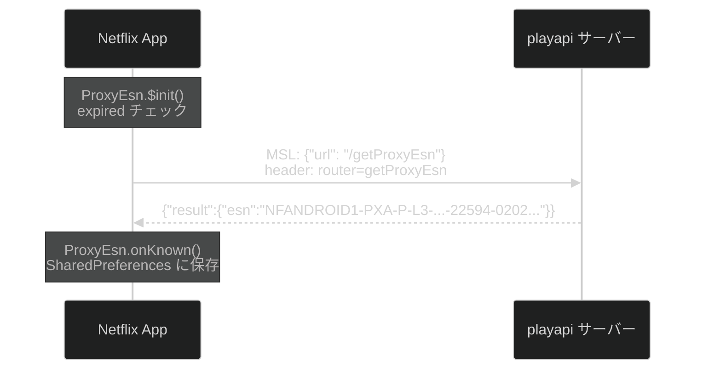
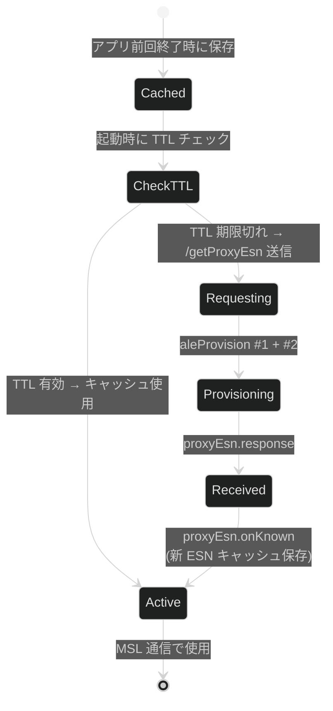

# 3. ESN (Electronic Serial Number) 体系

[← 目次に戻る](specification.md)

---

## 3.1 ESN 種別

Netflix は 4 種類の ESN を用途別に使い分ける:

```mermaid
%%{init: {'theme':'dark'}}%%
graph TB
    subgraph ESN["ESN 体系"]
        PRV["Base ESN (PRV)<br/>ローカル生成<br/>デバイス登録・ライセンス"]
        PXA["Proxy ESN (PXA)<br/>サーバー発行<br/>MSL API・GraphQL"]
        LOG["Logblob ESN<br/>ローカル生成<br/>テレメトリ"]
        MIG["Migration Identity<br/>ローカル生成<br/>アカウント移行"]
    end

    PRV -->|getProxyEsn| PXA
    PRV -->|HMAC-SHA256| LOG
    PRV -->|HMAC-SHA256| MIG

    style PRV fill:#e94560,stroke:#fff
    style PXA fill:#0f3460,stroke:#16213e
    style LOG fill:#533483,stroke:#16213e
    style MIG fill:#533483,stroke:#16213e
```



| 種別 | プレフィックス例 | 用途 | 生成元 |
|---|---|---|---|
| **Base ESN (PRV)** | `NFANDROID1-PRV-P-L3-` | デバイス登録・ライセンス取得 | ローカル生成 |
| **Proxy ESN (PXA)** | `NFANDROID1-PXA-P-L3-` | MSL API・GraphQL リクエスト | サーバー発行 |
| **Logblob ESN** | `NFANDROID1-GOOGLPIXEL=4A==5G=S-` | テレメトリ | ローカル生成 |
| **Migration Identity** | `isWidevine=true:systemId=...` | アカウント移行 | ローカル生成 |

## 3.2 ESN 構造

### Android Base ESN (PRV)

```
NFANDROID1-PRV-P-L3-GOOGLPIXEL=4A==5G=
│          │   │ │  └─ サニタイズ済みデバイスモデル
│          │   │ └─ Widevine Security Level
│          │   └─ デバイスカテゴリ
│          └─ 種別: PRV (Private, ローカル生成)
└─ プラットフォームプレフィックス
```

### Android Proxy ESN (PXA)

```
NFANDROID1-PXA-P-L3-GOOGLPIXEL=4A==5G=-22594-0202{fingerprint}
│          │   │ │  │                   │      └─ サーバー発行 fingerprint (毎回異なる)
│          │   │ │  │                   └─ Widevine systemId
│          │   │ │  └─ サニタイズ済みデバイスモデル
│          │   │ └─ Security Level
│          │   └─ デバイスカテゴリ (P=Phone)
│          └─ 種別: PXA (Proxy, サーバー発行)
└─ プラットフォームプレフィックス
```

### iOS ESN

```
NFAPPL-02-IPHONE9=1-5CB1D229FE1FC4DBA556753BB3D84634599DF9C15AD474BAFBFD37965D4162EC
│      │  │         └─ SHA-256 デバイスハッシュ (64文字)
│      │  └─ デバイスモデル (カンマをエスケープ)
│      └─ FairPlay バージョン (推定)
└─ Apple プラットフォームプレフィックス
```

## 3.3 デバイスカテゴリコード

| コード | デバイス種別 |
|---|---|
| `P` | Phone (スマートフォン) |
| `T` | Tablet |
| `B` | TV |
| `C` | ChromeOS |
| `E` | Display |

## 3.4 ESN 生成アルゴリズム (Android)

### 生成フロー

```mermaid
%%{init: {'theme':'dark'}}%%
graph TB
    XOR["XOR 復号<br/>seed=263"]
    PREFIX["NFANDROID1-"]
    TYPE["PRV / PXA"]
    CAT["デバイスカテゴリ<br/>P / T / B / C / E"]
    SEC["Security Level<br/>L1 / L3"]
    MODEL_RAW["デバイスモデル (raw)"]
    SAN1["jNY.c()<br/>スペース→アンダースコア"]
    SAN2["o.fkW.d()<br/>大文字化 + 無効文字→="]
    MODEL["サニタイズ済みモデル"]
    ESN["Base ESN (PRV)"]

    XOR --> PREFIX
    PREFIX --> ESN
    TYPE --> ESN
    CAT --> ESN
    SEC --> ESN
    MODEL_RAW --> SAN1 --> SAN2 --> MODEL --> ESN

    style XOR fill:#e94560,stroke:#fff
    style ESN fill:#0f3460,stroke:#16213e
```



### XOR 復号定数

ESN 生成に使用される定数は XOR 暗号化で保護されている (`o.feO` クラス / `C12892feO`):

| フィールド | XOR シード | 復号値 | 用途 |
|---|---|---|---|
| プラットフォームプレフィックス | 263 | `NFANDROID1-` | ESN 先頭 |
| HMAC キー | 42043 | `20MNetflix2010` | fingerprint 生成 |
| Alexa Skill ID | 51941 | `amzn1.ask.skill.{uuid}` | Alexa 連携 |
| EC P-256 公開鍵 | 18671 | Base64 検証鍵 | 署名検証 |

### 文字列サニタイズ (2 段階)

1. `jNY.c()`: スペースをアンダースコアに置換
2. `o.fkW.d()` (`C13218fkW`): 大文字化 + 無効文字を `=` に置換

### HMAC-SHA256 によるハッシュ生成

- **HMAC キー:** `20MNetflix2010` (UTF-8: `32304d4e...`)
- **Migration Identity 入力:** `deviceUniqueId` (MediaDrm から取得した 32 バイト)
- **Logblob ESN 入力:** `android_id` 文字列 (UTF-8)
- **出力:** 64 文字 16 進数ハッシュ

### 関連クラス (ProGuard マッピング)

| ランタイム名 | jadx 名 | 役割 |
|---|---|---|
| `o.feO` | `C12892feO` | EsnPrefixConfig (XOR 定数) |
| `o.fkW` | `C13218fkW` | EsnProviderUtils (文字列サニタイズ) |
| `o.fkn` | `C13235fkn` | DeviceModelProvider |
| `o.jNY` | — | 文字列ユーティリティ |

## 3.5 PXA ESN 取得プロトコル

PXA ESN はサーバーから MSL 経由で取得される。



**リクエスト:**
```json
{"url": "/getProxyEsn"}
```

MSL VolleyRequest ヘッダー: `router: getProxyEsn`

**レスポンス:**
```json
{
  "id": 1,
  "version": 2,
  "serverTime": 1773478742949,
  "result": {
    "esn": "NFANDROID1-PXA-P-L3-GOOGLPIXEL=4A==5G=-22594-02028KVLM5OU1MSB..."
  },
  "common": {},
  "from": "playapi"
}
```

### PXA ESN ライフサイクル



### キャッシュ管理

- 設定値: `EsnHendrixConfig.refreshProxyEsnTimeInMs = 0`
- TTL が 0 のため **無期限キャッシュ**
- 再取得条件: 初回インストール / アプリデータクリア / SharedPreferences 消失 / `masterTokenSerialNumber` 変更

### 永続化 (SharedPreferences)

| キー | 型 | 内容 |
|---|---|---|
| `nf_drm_esn` | String | PXA ESN 文字列 |
| `nf_drm_proxy_esn` | String (JSON) | `{"esn":"...","ts":epoch_ms,"sn":serial_number}` |
| `nf_drm_migration_identity` | String | Migration Identity 文字列 |

### fingerprint 特性

- サーバー側で生成され、ローカルでは再現不可
- 同一デバイスでも取得ごとに異なる fingerprint が返される (3 回取得し毎回異なることを確認)

## 3.6 ESN 使用箇所

| ヘッダー / パラメータ | ESN 種別 | 用途 |
|---|---|---|
| `X-Netflix.esn` | PXA | GraphQL / Cronet リクエスト |
| `X-Netflix-ProxyEsn` | PXA | WebSocket / MSL リクエスト |
| `X-Netflix.esnPrefix` | PRV プレフィックス | デバイス識別 |
| `/license` URL パラメータ | PRV | DRM ライセンス取得 |
| `/events` URL パラメータ | PRV | 再生イベント送信 |
| `challengeBase64` protobuf 内 | PRV | DRM チャレンジ |
| MSL MessageHeader `sender` (CBOR キー 20) | — | Android では空文字列 |

---

[← 前章: MSL プロトコル](02_msl_protocol.md) | [次章: 認証フロー →](04_authentication.md)
