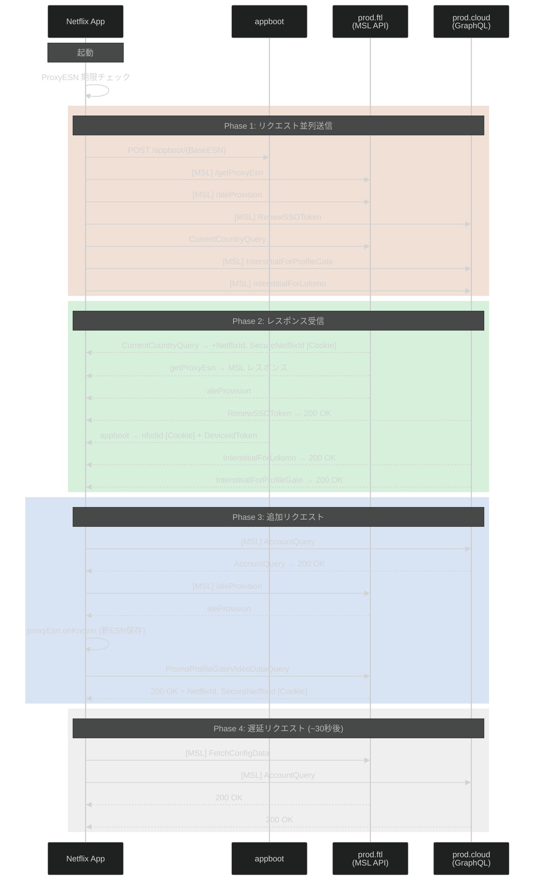
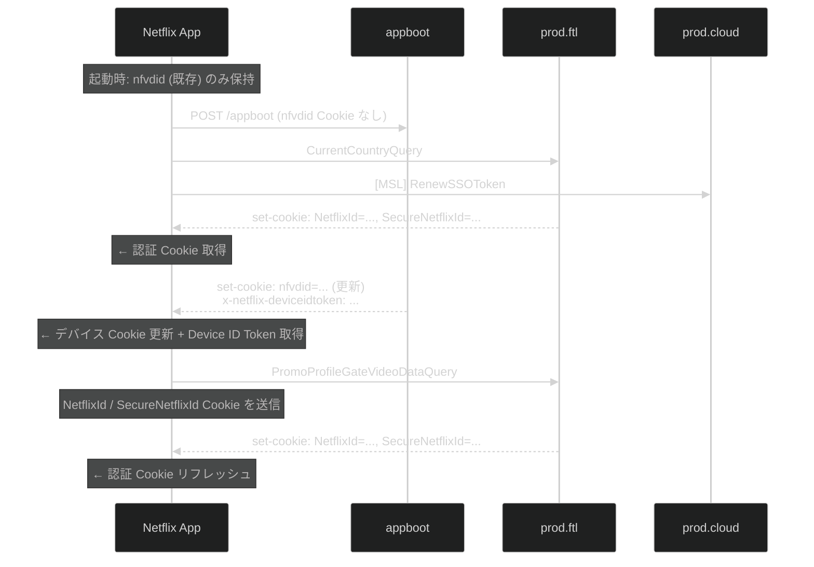
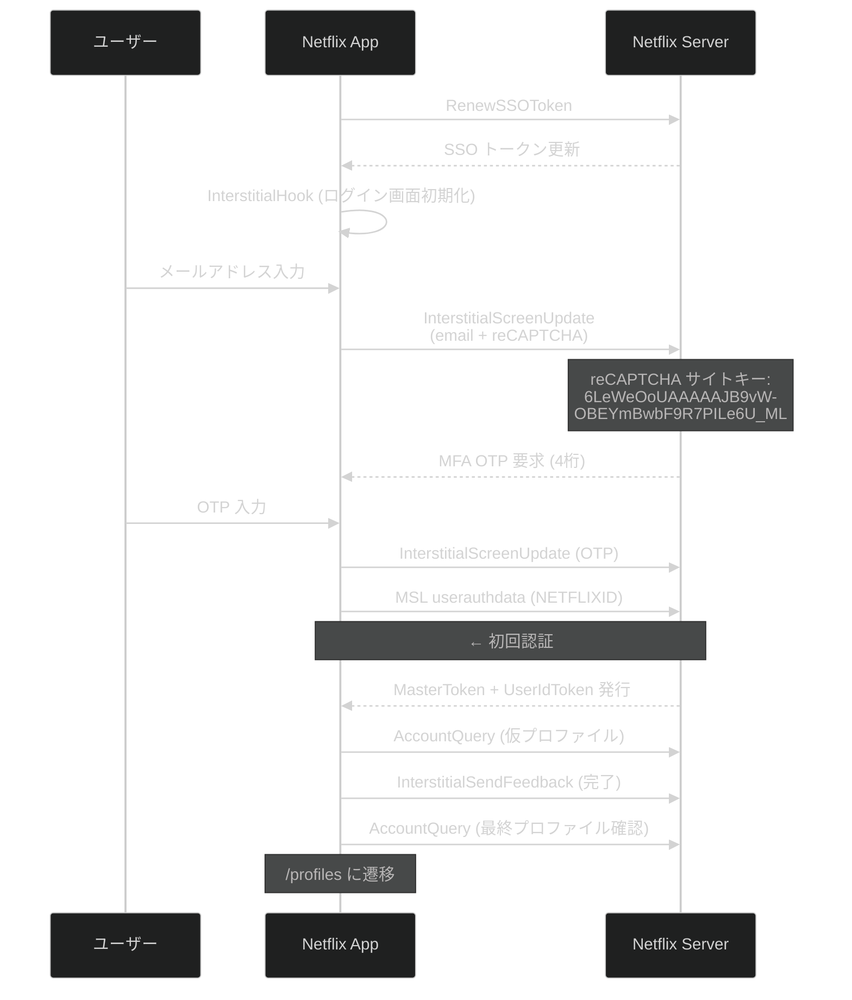

# 4. 認証フロー

[← 目次に戻る](specification.md)

---

## 4.1 Android 起動時認証フロー

アプリ起動時に以下の 4 フェーズで認証・プロビジョニングが行われる。起動時間を最小化するため、Phase 1 の全リクエストは**並列に送信**される。



## 4.2 Cookie フロー



| Cookie 名 | 発行元 | 用途 | 発行タイミング |
|---|---|---|---|
| `nfvdid` | appboot | デバイス識別 | appboot レスポンス (`set-cookie`) |
| `NetflixId` | prod.ftl | ユーザー認証 | CurrentCountryQuery レスポンス |
| `SecureNetflixId` | prod.ftl | セキュア認証 (HTTPS only) | CurrentCountryQuery レスポンス |

**重要な観察:**
- MSL リクエストは Cookie に依存しない (MSL 独自の MasterToken + UserIdToken で認証)
- Non-MSL GraphQL は Cookie (`NetflixId` / `SecureNetflixId`) で認証する
- `nfvdid` は全リクエストに付与されるが、認証には直接使われない (デバイストラッキング用と推定される)

## 4.3 ログインフロー



## 4.4 トークンライフサイクル

```mermaid
%%{init: {'theme':'dark'}}%%
graph LR
    subgraph Tokens["トークン管理"]
        MT["MasterToken<br/>有効期限: 不明<br/>(暗号化データ内)"]
        UIT["UserIdToken<br/>有効期限: 14日間"]
        PXA["PXA ESN<br/>TTL=0 (無期限)"]
    end

    MT -->|renewable + keyrequestdata| MT_NEW["自動更新"]
    UIT -->|サーバー自動更新<br/>(15回の更新を観測)| UIT_NEW["新 UIT"]
    PXA -->|masterTokenSerialNumber<br/>変更時のみ| PXA_NEW["再取得"]

    style MT fill:#e94560,stroke:#fff
    style UIT fill:#0f3460,stroke:#16213e
    style PXA fill:#533483,stroke:#16213e
```

| トークン | 有効期限 | 更新方式 |
|---|---|---|
| MasterToken | 不明 (暗号化されたデータ内) | `renewable` フラグ + `keyrequestdata` で自動更新 |
| UserIdToken | 14 日間 | サーバーが自動更新 (15 回の更新イベントを観測) |
| PXA ESN | 無期限 (TTL=0) | `masterTokenSerialNumber` 変更時のみ再取得 |

---

[← 前章: ESN 体系](03_esn.md) | [次章: API エンドポイント →](05_api_endpoints.md)
