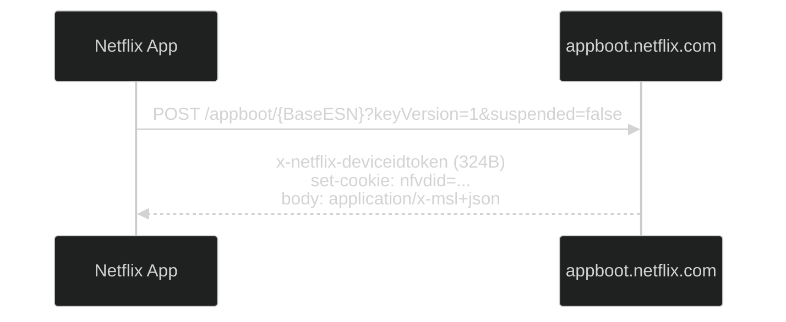
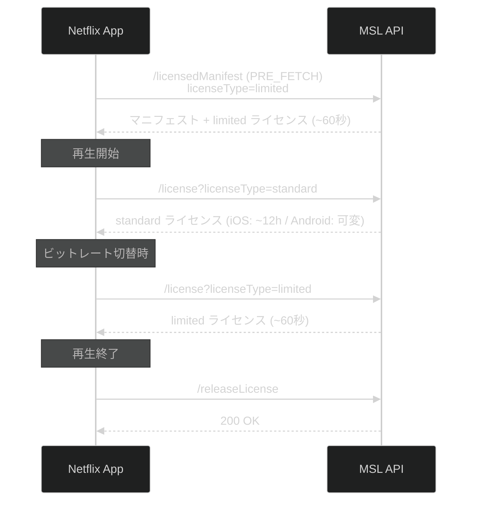

# 5. API エンドポイント

[← 目次に戻る](specification.md)

---

## 5.1 appboot

デバイス登録と初期設定を行う。



**リクエスト:**
```
POST /appboot/{BaseESN}?keyVersion=1&suspended=false
Host: android14.appboot.netflix.com
```

**レスポンス:**
- `x-netflix-deviceidtoken` (324 バイト) ヘッダーで DeviceIdToken を発行
- `set-cookie: nfvdid=...` で デバイス Cookie を更新
- ボディは `application/x-msl+json` 形式

`deviceidtoken` および `ssoToken` は HTTP レベルで他の API に転送される様子は観測されず、MSL レイヤー内部での使用またはローカル保持が示唆される。

## 5.2 getProxyEsn (MSL)

PXA ESN を取得する。詳細は [3.5 PXA ESN 取得プロトコル](03_esn.md#35-pxa-esn-取得プロトコル) を参照。

## 5.3 aleProvision (MSL) — Android 固有

ALE セッション鍵を確立する。詳細は [2.5 ALE](02_msl_protocol.md#ale-application-level-encryption--android-固有) を参照。

**リクエスト:**
```json
{
  "url": "/aleProvision",
  "params": {
    "provisionRequest": {
      "keyx": {
        "scheme": "RSA-OAEP-256",
        "data": {"pubkey": "<RSA-2048 Base64>"}
      },
      "scheme": "A128GCM",
      "type": "SOCKETROUTER",
      "ver": 1
    },
    "netflixClientPlatform": "androidNative",
    "appVer": "63928",
    "mId": "GOOGLPIXEL=4A==5G=S",
    "ffbc": "phone"
  }
}
```

## 5.4 GraphQL (Persisted Query)

Netflix は GraphQL Persisted Query を使用し、クエリ本文をネットワーク上で送信しない。これにより API スキーマの隠蔽に寄与していると推定される。

```mermaid
%%{init: {'theme':'dark'}}%%
graph TB
    subgraph MSL_GQL["MSL GraphQL (prod.cloud)"]
        direction TB
        SSO["RenewSSOToken<br/>a4d00303-..."]
        PG["InterstitialForProfileGate<br/>18f3ae27-..."]
        LO["InterstitialForLolomo<br/>3658ef5b-..."]
        AQ["AccountQuery<br/>4043dd89-..."]
        PB["InterstitialForPlayback<br/>07d88886-..."]
    end

    subgraph NonMSL["Non-MSL GraphQL (prod.ftl)"]
        direction TB
        CC["CurrentCountryQuery"]
        PP["PromoProfileGateVideoDataQuery"]
    end

    MSL_GQL -->|認証: MasterToken + UIT<br/>暗号化: MSL| Cloud["prod.cloud"]
    NonMSL -->|認証: Cookie<br/>暗号化: なし| FTL["prod.ftl"]

    style MSL_GQL fill:#0f3460,stroke:#16213e
    style NonMSL fill:#533483,stroke:#16213e
```



**観測された GraphQL オペレーション:**

| オペレーション | Persisted Query ID | バージョン | プロトコル | エンドポイント |
|---|---|---|---|---|
| `RenewSSOToken` | `a4d00303-b02d-47c9-a53f-776b6a63b001` | 102 | MSL | prod.cloud |
| `InterstitialForProfileGate` | `18f3ae27-a0f1-45c9-88e6-c6bd39159ecb` | 102 | MSL | prod.cloud |
| `InterstitialForLolomo` | `3658ef5b-0c6d-4c7d-a5c0-6ae11405ee1d` | 102 | MSL | prod.cloud |
| `AccountQuery` | `4043dd89-0ed5-4d7f-ac5c-40c7ffcec7ae` | 102 | MSL | prod.cloud |
| `InterstitialForPlayback` | `07d88886-1ec5-4115-98f2-7b6a20dbeae6` | 102 | MSL | prod.cloud |
| `CurrentCountryQuery` | 未キャプチャ | — | Non-MSL | prod.ftl |
| `PromoProfileGateVideoDataQuery` | 未キャプチャ | — | Non-MSL | prod.ftl |

**MSL GraphQL vs Non-MSL GraphQL:**

| 項目 | MSL GraphQL | Non-MSL GraphQL |
|---|---|---|
| エンドポイント | prod.cloud/graphql | prod.ftl/graphql |
| 暗号化 | MSL (CBOR → GZIP → JSON) | なし (平文 JSON) |
| 認証 | MasterToken + UserIdToken | NetflixId / SecureNetflixId Cookie |
| Cookie | nfvdid + flwssn + gsid | nfvdid + flwssn + NetflixId + SecureNetflixId |

## 5.5 Manifest / licensedManifest

ストリーミングマニフェスト (コーデック・品質プロファイル、CDN URL、DRM 情報) を取得する。

### プラットフォーム比較

```mermaid
%%{init: {'theme':'dark'}}%%
graph TB
    subgraph iOS_Flow["iOS: 分離型"]
        direction TB
        IOS_M["/manifest<br/>PRE_FETCH → standard"]
        IOS_L["/license<br/>DRM 鍵取得"]
        IOS_M --> IOS_L
    end

    subgraph Android_Flow["Android: 統合型"]
        direction TB
        AND_LM["/licensedManifest<br/>マニフェスト + ライセンス統合<br/>バッチ viewableId 対応"]
    end

    style iOS_Flow fill:#1a1a4e,stroke:#4a4ae0
    style Android_Flow fill:#1a472a,stroke:#2d6a4f
```



### iOS: `/manifest` + `/license` (分離型)

iOS ではマニフェスト取得とライセンス取得が別リクエスト:

1. `PRE_FETCH` フェーズ: UI 表示時にプリフェッチ
2. `standard` フェーズ: 再生開始時
3. `/license`: DRM 鍵取得

**iOS リクエストパラメータ:**
```json
{
  "viewableId": 81774276,
  "flavor": "PRE_FETCH",
  "profiles": ["h264hpl30-dash", "hevc-main10-L40-dash-cenc-prk"],
  "profileGroups": ["live", "ce3", "ce4"],
  "drmType": "fairplay",
  "manifestVersion": "v2",
  "desiredVmaf": "phone_plus_lts",
  "hardware": "IPHONE9-1",
  "osName": "iOS",
  "osVersion": "15.8.3",
  "platform": "2012.4"
}
```

### Android: `/licensedManifest` (統合型)

Android ではマニフェストとライセンスが**単一リクエストに統合**されている。さらに複数の `viewableId` を**バッチ送信**可能。

**Android リクエストパラメータ:**
```json
{
  "version": 2,
  "url": "/licensedManifest",
  "languages": ["en-JP"],
  "common": {
    "challenge": "<Widevine CDM protobuf (共通チャレンジ)>"
  },
  "params": [
    {
      "viewableId": "81756595",
      "profiles": ["playready-h264hpl30-dash", "vp9-profile0-L30-dash-cenc", "..."],
      "profileGroups": [{"name": "primary", "profiles": ["..."]}],
      "challenges": {
        "primary": [{
          "challengeBase64": "<Widevine CDM protobuf>",
          "drmSessionId": 1,
          "clientTime": 1773373148
        }]
      },
      "method": "licensedManifest",
      "flavor": "PRE_FETCH",
      "drmType": "widevine",
      "licenseType": "limited",
      "manifestVersion": "v2"
    }
  ]
}
```

**Android レスポンス (L3 環境で完全復元, 456KB):**
```json
{
  "id": 1,
  "version": 2,
  "serverTime": 1773373149628,
  "result": [{
    "movieId": "81756595",
    "packageId": "2596051",
    "duration": 8523000,
    "drmContextId": "2596051",
    "playbackContextId": "E3-Bgj5tevc...",
    "video_tracks": [{
      "trackType": "PRIMARY",
      "new_track_id": "V:2:1;2;;primary;-1;none;-1;",
      "streams": [{
        "content_profile": "playready-h264hpl30-dash",
        "bitrate": 1050,
        "peakBitrate": 2250,
        "res_w": 960,
        "res_h": 540,
        "framerate_value": 24000,
        "framerate_scale": 1001,
        "downloadable_id": "1496730611",
        "vmaf": 87,
        "isDrm": true,
        "urls": [{"cdn_id": 140368, "url": "https://ipv4-c062-osa001-ix.1.oca.nflxvideo.net/?o=..."}],
        "moov": {"offset": 108, "size": 1048},
        "sidx": {"offset": 1156, "size": 37036}
      }]
    }],
    "audio_tracks": ["..."],
    "timedtexttracks": ["..."],
    "servers": [{
      "id": 140368,
      "name": "c062.osa001.ix.nflxvideo.net",
      "type": "OPEN_CONNECT_APPLIANCE",
      "rank": 1,
      "dns": {"host": "ipv4-c062-osa001-ix.1.oca.nflxvideo.net", "ipv4": "45.57.82.139"}
    }],
    "links": {
      "events": {"href": "/events?playbackContextId=...&esn=..."},
      "ldl": {"href": "/license?licenseType=limited&playbackContextId=..."},
      "license": {"href": "/license?licenseType=standard&playbackContextId=..."}
    }
  }]
}
```

## 5.6 /license

DRM ライセンスを取得する。



**Android (Widevine):**
```
/nq/androidui/samurai/~9.0.0/api
  ?licenseType=standard
  &playbackContextId=<JWT>
  &esn=NFANDROID1-PRV-P-L3-...
  &drmContextId=2596051
  &challengeBase64=<Widevine protobuf>
  &xid=<トレース ID>
```

**iOS (FairPlay):**
```
/nq/iosplatform/pbo_license/~1.0.0/router
  ?licenseType=standard
  &playbackContextId=<Base64url セッション ID>
  &esn=NFAPPL-02-IPHONE9=1-...
  &drmContextId=<数値>
```

| 種別 | 用途 | 有効期限 |
|---|---|---|
| `standard` | 通常再生 | iOS: 約 12 時間、Android: 可変 |
| `limited` | ビットレート切替・プリフェッチ | 約 60 秒 |
| `release` | 再生終了通知 | — |

## 5.7 FetchConfigData (Samurai Config)

デバイス・ストリーミング設定を取得する。起動後約 30 秒の遅延リクエスト。

```json
{
  "method": "get",
  "path": ["deviceConfig", "hendrixConfig", "networkScoreConfig", "accountConfig"],
  "appType": "samurai"
}
```

## 5.8 /logblob

テレメトリデータを送信する。Android では `android14.logs.netflix.com` に MSL 暗号化で送信される。

---

[← 前章: 認証フロー](04_authentication.md) | [次章: DRM →](06_drm.md)
