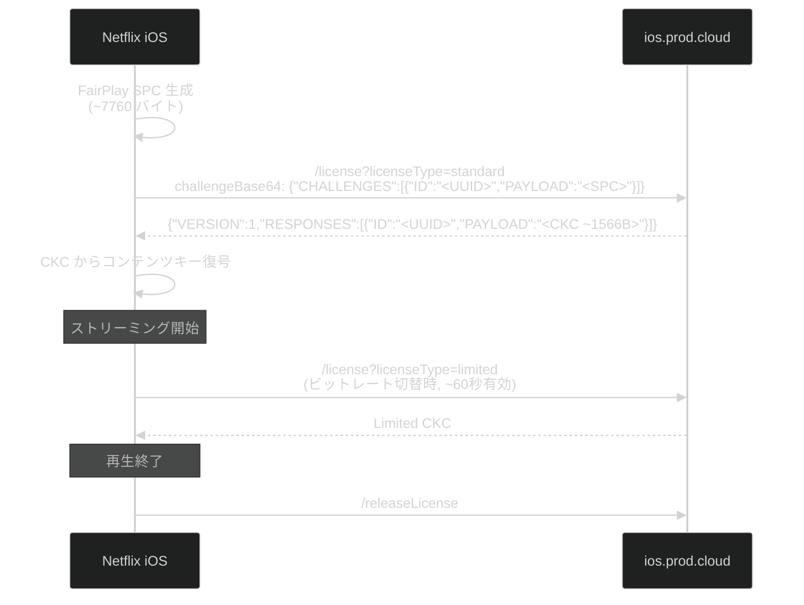
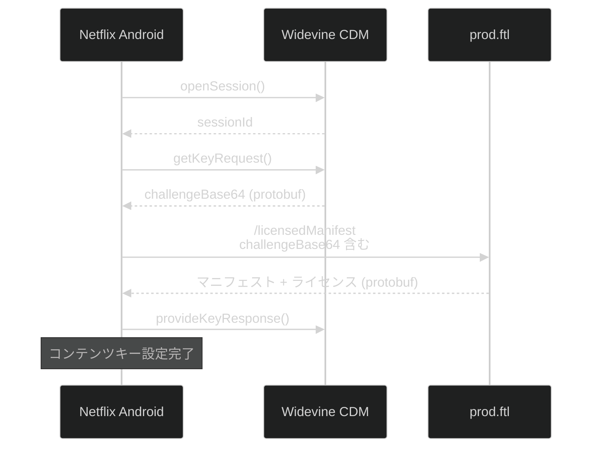

# 6. DRM (Digital Rights Management)

[← 目次に戻る](specification.md)

---

## 6.1 プラットフォーム別 DRM

```mermaid
%%{init: {'theme':'dark'}}%%
graph TB
    subgraph Android["Android: Widevine"]
        direction TB
        WV_CDM["Widevine CDM v17.0.0"]
        WV_OEM["OEMCrypto v1.56"]
        WV_L1["L1 (TEE)<br/>ハードウェア保護<br/>4K HDR / 36 プロファイル"]
        WV_L3["L3 (ソフトウェア)<br/>Frida キャプチャ可能<br/>SD / 14 プロファイル"]
        WV_CDM --> WV_OEM
        WV_OEM --> WV_L1 & WV_L3
    end

    subgraph iOS_DRM["iOS: FairPlay"]
        direction TB
        FP["FairPlay Streaming"]
        FP_SPC["SPC (チャレンジ)"]
        FP_CKC["CKC (ライセンス)"]
        FP --> FP_SPC --> FP_CKC
    end

    style Android fill:#1a472a,stroke:#2d6a4f
    style iOS_DRM fill:#1a1a4e,stroke:#4a4ae0
```



| 項目 | Android (Widevine) | iOS (FairPlay) |
|---|---|---|
| DRM 方式 | Widevine CDM | FairPlay Streaming (FPS) |
| CDM バージョン | v17.0.0 | — |
| OEMCrypto | v1.56 | — |
| セキュリティレベル | L1 (TEE) / L3 (ソフトウェア) | ハードウェア保護 |
| チャレンジ形式 | Protobuf | SPC (Server Playback Context) JSON |
| ライセンス形式 | Protobuf | CKC (Content Key Context) JSON |
| マニフェスト統合 | あり (`/licensedManifest`) | なし (分離) |

## 6.2 Widevine L1 vs L3

```mermaid
%%{init: {'theme':'dark'}}%%
graph LR
    subgraph L1["L1 (TEE)"]
        L1_RES["最大解像度: 4K HDR"]
        L1_PROF["36 プロファイル"]
        L1_HEVC["HEVC HDR10 ✓"]
        L1_DOLBY["Dolby Audio ✓"]
    end

    subgraph L3["L3 (ソフトウェア)"]
        L3_RES["最大解像度: 960x540"]
        L3_PROF["14 プロファイル"]
        L3_HEVC["HEVC HDR10 ✗"]
        L3_DOLBY["Dolby Audio ✗"]
    end

    style L1 fill:#1a472a,stroke:#2d6a4f
    style L3 fill:#4a1a1a,stroke:#e94560
```



| 項目 | L1 (TEE) | L3 (ソフトウェア) |
|---|---|---|
| プロファイル数 | 36 | 14 |
| 最大解像度 | 4K HDR | 960x540 (SD) |
| HEVC HDR10 | 利用可能 (L30-L41) | 利用不可 |
| VP9 最大レベル | L40 | L30 |
| H.264 最大レベル | HPL40 (FHD) | HPL30 (SD) |
| Dolby Audio | 利用可能 | 利用不可 |
| OEMCrypto 情報 | TEE TA バージョン含む | ソフトウェアビルド日のみ |

Netflix はチャレンジ内の `oem_crypto_build_information` からセキュリティレベルを判定し、適切なプロファイル制限を適用すると推定される。

リクエスト構造・Cookie・ヘッダーは L1/L3 で**完全に同一**であり、差異はプロファイルリストとチャレンジのみ。

## 6.3 DRM セッション管理 (Android)

キャプチャで観測された DRM イベント:
- `openSession`: 4 回
- `keyRequest`: 4 回
- `keyResponse`: 2 回
- `propertyString`: 6 回
- セッション ID: `sid74`, `sid75`, `sid77`, `sid78`

## 6.4 drmSessionId フォーマット

| プラットフォーム | フォーマット | 例 |
|---|---|---|
| Android | `V:2:1;2;;primary;-1;none;-1;` | コーデック名の代わりに `primary` |
| iOS | `V:2:1;2;;ce4;-1;none;-1;` | HEVC は `ce4` |

## 6.5 iOS FairPlay ライセンスフロー



**SPC (Server Playback Context) 生成:**
```json
{
  "CHALLENGES": [{
    "ID": "<UUID>",
    "PAYLOAD": "<Base64 FairPlay SPC バイナリ, ~7760 バイト>"
  }]
}
```

**CKC (Content Key Context) 受信:**
```json
{
  "VERSION": 1,
  "MEDIASESSIONID": "<Base64>",
  "RESPONSES": [{
    "ID": "<UUID>",
    "PAYLOAD": "<Base64 FairPlay CKC バイナリ, ~1566 バイト>"
  }]
}
```

## 6.6 Android Widevine チャレンジ protobuf



チャレンジに含まれるフィールド:
- `esn`: PRV ESN
- `movieid`: コンテンツ ID
- `issuetime`: Unix 秒
- `salt`: ランダムソルト
- `oem_crypto_build_information`: OEMCrypto ビルド情報
- `widevine_cdm_version`: CDM バージョン (`17.0.0`)
- `device_name`: デバイスコード名 (`bramble`)
- `architecture_name`: アーキテクチャ (`arm64-v8a`)

---

[← 前章: API エンドポイント](05_api_endpoints.md) | [次章: ストリーミングプロファイル →](07_streaming_profiles.md)
