# 7. ストリーミングプロファイル

[← 目次に戻る](specification.md)

---

## 7.1 映像プロファイル

### プロファイル概要

```mermaid
%%{init: {'theme':'dark'}}%%
graph TB
    subgraph L3_Only["L3 のみ (14 プロファイル)"]
        H264_MP_L30["H.264 MP L3.0"]
        H264_HP_L22["H.264 HP L2.2"]
        H264_HP_L30["H.264 HP L3.0"]
        VP9_L21["VP9 L2.1"]
        VP9_L30["VP9 L3.0"]
        CMAF["CMAF Live"]
    end

    subgraph L1_Add["L1 追加 (+22 プロファイル)"]
        H264_MP_L31["H.264 MP L3.1"]
        H264_MP_L40["H.264 MP L4.0"]
        H264_HP_L31["H.264 HP L3.1"]
        H264_HP_L40["H.264 HP L4.0"]
        VP9_L31["VP9 L3.1"]
        VP9_L40["VP9 L4.0"]
        HEVC_HDR["HEVC HDR10<br/>L3.0 ~ L4.1"]
    end

    L3_Only -->|SD 960x540| Quality_L3["最大 1050 kbps<br/>VMAF 87"]
    L1_Add -->|4K HDR| Quality_L1["高品質ストリーム"]

    style L3_Only fill:#4a1a1a,stroke:#e94560
    style L1_Add fill:#1a472a,stroke:#2d6a4f
```

### Android L3 (14 プロファイル)

| プロファイル | コーデック | 最大解像度 |
|---|---|---|
| `none-h264mpl30-dash` | H.264 MP L3.0 | SD (DRM なし) |
| `playready-h264mpl30-dash` | H.264 MP L3.0 | SD |
| `playready-h264hpl22-dash` | H.264 HP L2.2 | ~352x288 |
| `playready-h264hpl30-dash` | H.264 HP L3.0 | SD |
| `h264hpl22-dash-playready-live` | H.264 HP L2.2 Live | ~352x288 |
| `h264hpl30-dash-playready-live` | H.264 HP L3.0 Live | SD |
| `vp9-profile0-L21-dash-cenc` | VP9 L2.1 | ~480x360 |
| `vp9-profile0-L30-dash-cenc` | VP9 L3.0 | SD |
| `iso_23001_18-dash-live` | CMAF Live | — |
| `heaac-2-dash` | HE-AAC v1 | (音声) |
| `xheaac-dash` | xHE-AAC | (音声) |
| `imsc1.1` | IMSC 1.1 | (字幕) |
| `nflx-cmisc` | Netflix メタデータ | (メタ) |
| `BIF320` | シークサムネイル | (サムネイル) |

### Android L1 追加プロファイル (+22)

| プロファイル | コーデック | 最大解像度 |
|---|---|---|
| `playready-h264mpl31-dash` | H.264 MP L3.1 | 720p |
| `playready-h264mpl40-dash` | H.264 MP L4.0 | FHD |
| `playready-h264hpl31-dash` | H.264 HP L3.1 | 720p |
| `playready-h264hpl40-dash` | H.264 HP L4.0 | FHD |
| `h264hpl31-dash-playready-live` | H.264 HP L3.1 Live | 720p |
| `h264hpl40-dash-playready-live` | H.264 HP L4.0 Live | FHD |
| `vp9-profile0-L31-dash-cenc` | VP9 L3.1 | 720p |
| `vp9-profile0-L40-dash-cenc` | VP9 L4.0 | FHD |
| `hevc-hdr-main10-L30-dash-cenc-prk` | HEVC HDR10 L3.0 | SD |
| `hevc-hdr-main10-L30-dash-cenc-prk-do` | HEVC HDR10 L3.0 DL | SD |
| `hevc-hdr-main10-L31-dash-cenc-prk` | HEVC HDR10 L3.1 | 720p |
| `hevc-hdr-main10-L40-dash-cenc-prk` | HEVC HDR10 L4.0 | FHD |
| `hevc-hdr-main10-L41-dash-cenc-prk` | HEVC HDR10 L4.1 | 4K |
| `hevc-hdr-main10-L30-dash-cenc-live` | HEVC HDR10 L3.0 Live | SD |
| その他 Live / DL バリエーション | — | — |

### iOS プロファイル

| カテゴリ | プロファイル例 |
|---|---|
| H.264 High Profile | `h264hpl22/30/31/40` |
| H.264 Main Profile | `playready-h264mpl30/31/40-dash` |
| HEVC Main 10 | `hevc-main10-L30/31/40/41-dash-cenc-prk(-do)` |
| Live 変種 | `h264hpl*-dash-playready-live`, `hevc-*-live` |

## 7.2 音声プロファイル

| プロファイル | コーデック | チャンネル | プラットフォーム |
|---|---|---|---|
| `heaac-2-dash` | HE-AAC v1 | 2ch ステレオ | 共通 |
| `heaac-2hq-dash` | HE-AAC v1 HQ | 2ch ステレオ | iOS |
| `xheaac-dash` | xHE-AAC | 低ビットレート | Android |
| `dd-5.1-dash` | Dolby Digital (AC-3) | 5.1ch | iOS / Android L1 |
| `ddplus-5.1-dash` | Dolby Digital Plus | 5.1ch | iOS / Android L1 |
| `ddplus-atmos-dash` | Dolby Atmos | オブジェクトベース | iOS / Android L1 |

**Android L3 ビットレート (実測):** 32, 64, 96, 192 kbps
**対応言語 (実測):** ja, en, pt-BR, es, es-ES, fr, de, it, pl, fil, hu (11 言語)

## 7.3 字幕プロファイル

| プロファイル | 形式 | プラットフォーム |
|---|---|---|
| `webvtt-lssdh-ios13` | WebVTT | iOS |
| `webvtt-lssdh-ios8` | WebVTT (レガシー) | iOS |
| `imsc1.1` | IMSC 1.1 | Android |

**Android 実測:** 57 トラック (11 言語 × subtitles/closedcaptions)

## 7.4 その他のプロファイル

| プロファイル | 用途 |
|---|---|
| `BIF240` | シークサムネイル (240px) — iOS |
| `BIF320` | シークサムネイル (320px) — 共通 |
| `nflx-cmisc` | Netflix メタデータ |

## 7.5 品質制御パラメータ

| パラメータ | 値例 | 説明 |
|---|---|---|
| `desiredVmaf` | `phone_plus_lts` / `tablet_plus_lts` / `tv_plus_lts` | VMAF 品質目標 |
| `cellularCap` | `auto` | モバイル回線帯域制限 |
| `netType` | `wifi` / `cellular` | 接続種別 |
| `profiles` | (配列) | 利用可能コーデックのハードリミット |
| `hardware` | `IPHONE9-1` / `lito` | デバイス能力検出 |

## 7.6 プロファイルグループ

| プラットフォーム | グループ名 | 内容 |
|---|---|---|
| iOS | `live` | ライブ/リアルタイムコンテンツ |
| iOS | `ce3` | PlayReady CE 3.0 (H.264) |
| iOS | `ce4` | PlayReady 鍵 + ダウンロードオフライン (HEVC) |
| Android | `primary` | 全プロファイルを含む単一グループ |

## 7.7 L3 ビデオストリーム品質 (実測)

| ビットレート (kbps) | 解像度 | VMAF |
|---|---|---|
| 80 | 480x270 | 32 |
| 100 | — | — |
| 200 | — | — |
| 350 | — | — |
| 560 | — | — |
| 750 | — | — |
| 1050 | 960x540 | 87 |

---

[← 前章: DRM](06_drm.md) | [次章: HTTP ヘッダー・Cookie →](08_http_headers_cookies.md)
