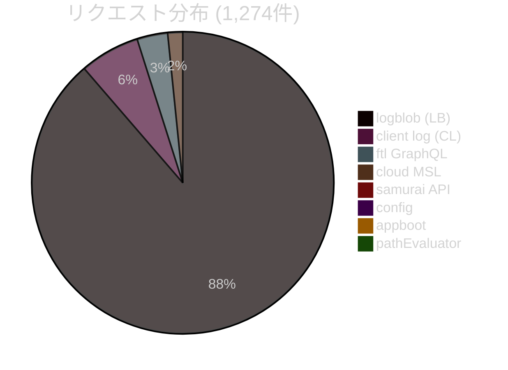

# 8. HTTP ヘッダー・Cookie

[← 目次に戻る](specification.md)

---

## 8.1 キャプチャ統計

1,274 リクエストを 8 エンドポイントにわたってキャプチャした。

| 略称 | エンドポイント | メソッド | 件数 |
|---|---|---|---|
| AB | `appboot.netflix.com/appboot/` | POST | 3 |
| CFG | `prod.ftl.netflix.com/.../config` | GET/POST | 4 |
| API | `prod.ftl.netflix.com/.../samurai/~9.0.0/api` | POST | 7 |
| GQL | `prod.ftl.netflix.com/graphql` | POST | 43 |
| MSL | `prod.cloud.netflix.com/graphql` (MSL) | POST | 21 |
| PE | `prod.cloud.netflix.com/.../pathEvaluator` | POST | 1 |
| CL | `logs.netflix.com/log/android/cl/2` | POST | 84 |
| LB | `logs.netflix.com/log/android/logblob/1` | POST | 1,158 |

## 8.2 共通ヘッダー

| ヘッダー | 値例 | 説明 |
|---|---|---|
| `X-Netflix.Request.Attempt` | `1`, `2`, `3` | リトライカウンター |
| `X-Netflix.Request.Id` | 32 文字 hex UUID | リクエスト固有 ID |
| `X-Netflix.session.id` | 数値 | セッション ID |
| `X-Netflix.zuul.brotli.allowed` | `true` | Brotli 圧縮対応 |
| `X-Netflix.esn` | PXA ESN | Proxy ESN (長い文字列) |
| `X-Netflix.Request.Client.Context` | JSON | UI 状態 (8 パターン) |
| `X-Netflix.clientType` | `samurai` | クライアント種別 |
| `X-Netflix.appVer` | `9.57.0` | アプリバージョン |
| `X-Netflix.androidApi` | `34` | Android API レベル |
| `X-Netflix.esnPrefix` | `NFANDROID1-PRV-P-L3-` | Base ESN プレフィックス |
| `X-Netflix.deviceFormFactor` | `PHONE` | デバイスフォームファクタ |
| `X-Netflix.deviceMemoryLevel` | `HIGH` | メモリレベル |
| `X-Netflix.Client.Request.Name` | `licensedManifest` 等 | リクエスト種別 (35 バリエーション) |
| `x-netflix.client.current-profile-guid` | GUID | プロファイル ID |

## 8.3 コンテキストヘッダー

| ヘッダー | 値例 |
|---|---|
| `x-netflix.context.os-version` | `34` |
| `x-netflix.context.app-version` | `9.57.0` |
| `x-netflix.context.ui-flavor` | `android` |
| `x-netflix.context.form-factor` | `phone` |
| `x-netflix.context.android.installer-source` | `com.android.vending` |
| `x-netflix.context.locales` | `en-US`, `en-JP`, `en` |
| `x-netflix.context.operation-name` | GraphQL オペレーション名 (24 種) |

## 8.4 MSL 固有ヘッダー

| ヘッダー | 値 | 用途 |
|---|---|---|
| `Content-Encoding` | `msl_v1` | MSL 暗号化マーカー |
| `x-netflix.client.android.mslrequest` | `true` | MSL リクエストフラグ |
| `x-netflix.context.hawkins-version` | `5.13.0` | MSL 内部バージョン |

## 8.5 Cookie 送信パターン

```mermaid
%%{init: {'theme':'dark'}}%%
graph TB
    subgraph MSL_Path["MSL 暗号化リクエスト"]
        MSL_C["Cookie: nfvdid + flwssn + gsid<br/>NetflixId ✗ / SecureNetflixId ✗"]
    end

    subgraph NonMSL_Path["Non-MSL リクエスト"]
        NMSL_C["Cookie: nfvdid + flwssn + NetflixId + SecureNetflixId<br/>gsid ✗"]
    end

    subgraph AppBoot["appboot"]
        AB_C["Cookie なし"]
    end

    style MSL_Path fill:#0f3460,stroke:#16213e
    style NonMSL_Path fill:#533483,stroke:#16213e
    style AppBoot fill:#4a1a1a,stroke:#e94560
```

| Cookie | appboot | config | API (samurai) | ftl GraphQL | cloud MSL | CL | LB |
|---|---|---|---|---|---|---|---|
| `nfvdid` | — | ✓ | ✓ | ✓ | ✓ | ✓ | ✓ |
| `flwssn` | — | ✓ | ✓ | ✓ | ✓ | ✓ | ✓ |
| `gsid` | — | ✓ | ✓ | — | ✓ | — | ✓ |
| `NetflixId` | — | ✓ | ✓ | ✓ | — | ✓ | — |
| `SecureNetflixId` | — | ✓ | ✓ | ✓ | — | ✓ | — |

**重要なパターン:** MSL 暗号化リクエスト (`Content-Encoding: msl_v1`) では `NetflixId` / `SecureNetflixId` を送信せず、代わりに `gsid` を使用する。Non-MSL リクエストはその逆。

## 8.6 Cookie フォーマット

| Cookie | 件数 | フォーマット | 例 |
|---|---|---|---|
| `nfvdid` | 1,271/1,274 | Base64url バイナリ | `BQFmAAEBEEPj84LzHGpQ_ldxaVuQv8tg...` |
| `flwssn` | 1,271/1,274 | UUID v4 | `183a999e-9ce9-4f29-ac9f-3f8b3982c817` |
| `gsid` | 1,166/1,274 | UUID v4 (ログイン後) | `d4779eb6-16d4-4179-89af-a069f7f1fc07` |
| `NetflixId` | 105/1,274 | URL エンコード | `v%3D3%26ct%3DBgjHlOvcAxLcAx...` |
| `SecureNetflixId` | 105/1,274 | URL エンコード | `v%3D3%26mac%3DAQEAEQABABTPJ-U...` |

---

[← 前章: ストリーミングプロファイル](07_streaming_profiles.md) | [次章: CDN インフラストラクチャ →](09_cdn.md)
