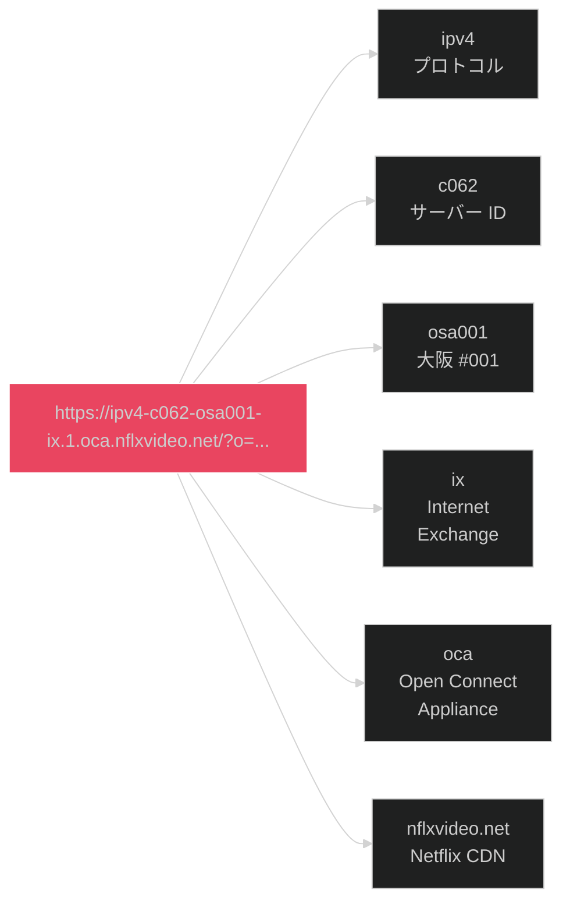

# 9. CDN インフラストラクチャ

[← 目次に戻る](specification.md)

---

## 9.1 Open Connect

Netflix は独自の CDN インフラストラクチャ「Open Connect」を運用する。マニフェストレスポンスの `servers` フィールドに CDN サーバー情報が含まれる。

```mermaid
%%{init: {'theme':'dark'}}%%
graph TB
    App["Netflix App"]
    API["prod.ftl<br/>(MSL API)"]
    OCA1["OCA #140368<br/>c062.osa001.ix<br/>45.57.82.139<br/>rank: 1"]
    OCA2["OCA #140363<br/>osa001<br/>rank: 2"]
    OCA3["OCA #140367<br/>osa001<br/>rank: 3"]

    App -->|/licensedManifest| API
    API -->|servers リスト| App
    App -->|ストリーミング<br/>(優先)| OCA1
    App -.->|フォールバック| OCA2
    App -.->|フォールバック| OCA3

    style App fill:#e94560,stroke:#fff
    style API fill:#0f3460,stroke:#16213e
    style OCA1 fill:#1a472a,stroke:#2d6a4f
    style OCA2 fill:#533483,stroke:#16213e
    style OCA3 fill:#533483,stroke:#16213e
```

**キャプチャで観測された OCA (Open Connect Appliance):**

| サーバー ID | ホスト名 | IP アドレス | ランク | 地域 |
|---|---|---|---|---|
| 140368 | `c062.osa001.ix.nflxvideo.net` | `45.57.82.139` | 1 | 大阪 |
| 140363 | — | — | 2 | 大阪 (推定) |
| 140367 | — | — | 3 | 大阪 (推定) |

サーバーは `rank` フィールドで優先順位付けされ、クライアントは最も rank の低い (高優先度の) サーバーからストリーミングを開始すると推定される。

## 9.2 ストリーミング URL 構造



```
https://ipv4-c062-osa001-ix.1.oca.nflxvideo.net/?o=...
│       │    │    │      │  │ │
│       │    │    │      │  │ └─ nflxvideo.net (Netflix CDN ドメイン)
│       │    │    │      │  └─ oca (Open Connect Appliance)
│       │    │    │      └─ ix (IX = Internet Exchange)
│       │    │    └─ osa001 (大阪リージョン #001)
│       │    └─ c062 (サーバー ID)
│       └─ ipv4 (プロトコル)
└─ HTTPS
```

iOS 画像 CDN: `occ-*.nflxso.net` (50+ 並列リクエストを観測)

## 9.3 ストリームメタデータ

各ストリームには以下のメタデータが付与される:

| フィールド | 説明 |
|---|---|
| `downloadable_id` | ストリーム固有 ID |
| `moov.offset` / `moov.size` | MP4 moov アトムの位置とサイズ |
| `sidx.offset` / `sidx.size` | Segment Index の位置とサイズ |
| `vmaf` | VMAF 品質スコア |
| `peakBitrate` | ピークビットレート |

---

[← 前章: HTTP ヘッダー・Cookie](08_http_headers_cookies.md) | [次章: 付録 →](10_appendix.md)
