# 付録

[← 目次に戻る](specification.md)

---

## 付録 A: キャプチャ統計 (Android)

| カテゴリ | 件数 |
|---|---|
| 総イベント数 | ~943 |
| MSL API リクエスト | 160 |
| Widevine 暗号化 | 322 |
| Widevine 復号 | 36 |
| DRM イベント | 17 |
| ALE イベント | 7 |
| HTTP リクエスト (Cronet) | 28 |
| HmacSha256Signer | 1 |

## 付録 B: 復号ステータス

### Android (L3)

```mermaid
%%{init: {'theme':'dark'}}%%
graph LR
    MSL_ENC["MSL 暗号化<br/>レスポンス"]
    WV_DEC["Widevine<br/>decrypt"]
    CBOR["CBOR デコード<br/>(キー 62)"]
    GZIP["GZIP 展開"]
    JSON["JSON 平文"]

    MSL_ENC --> WV_DEC --> CBOR --> GZIP --> JSON

    style MSL_ENC fill:#4a1a1a,stroke:#e94560
    style JSON fill:#1a472a,stroke:#2d6a4f
```

| データ | サイズ | ステータス |
|---|---|---|
| MSL 平文 (Widevine decrypt) | — | **完全復元** (CBOR キー 62 → GZIP → JSON) |
| config レスポンス | 27KB | **復元済** |
| AccountQuery レスポンス | 15KB | **復元済** |
| licensedManifest レスポンス | 456KB | **復元済** |
| /license レスポンス | 1.9KB | **復元済** |
| /aleProvision レスポンス | 1.3KB | **復元済** |
| logblob ACK | 60KB+ | **復元済** |

### iOS

| データ | 方式 | ステータス |
|---|---|---|
| MSL リクエスト平文 | `sendAPIRequest` フック | **キャプチャ済** |
| MSL レスポンス平文 | `aesCbcDecrypt` フック | **未キャプチャ** (モジュールロード問題) |
| MSL 暗号鍵 | DH / aesKwUnwrap フック | **未キャプチャ** |
| FairPlay SPC | `/license` API | **SPC Base64 のみ** — CKC 未キャプチャ |

### L1 環境

L1 (TEE) 環境では復号平文はセキュアメモリ内で処理されるため、Frida によるキャプチャは不可能。リクエスト構造のみ観測可能。

## 付録 C: Frida フックポイント

### Android (`hook_msl.js`)

| フック対象 | イベント名 | 内容 |
|---|---|---|
| `ProxyEsn.$init` | `proxyEsn.forceExpired` | expired を強制 true にして再取得を発火 |
| `ProxyEsnMslRequest.getBodyForNq` | `proxyEsn.request` | リクエストボディ |
| `ProxyEsnMslRequest.getHeaders` | `proxyEsn.requestHeaders` | リクエストヘッダー |
| `ProxyEsnMslRequest.onSuccess` | `proxyEsn.response` | レスポンス JSON |
| `ProxyEsnMslRequest.e` | `proxyEsn.error` | エラー |
| `ProxyEsn.onKnown` | `proxyEsn.onKnown` | 保存される ESN と serialNumber |

### iOS

| フック対象 | 内容 | ステータス |
|---|---|---|
| `sendAPIRequest` | MSL リクエスト平文 | **有効** |
| `aesCbcDecrypt` | MSL レスポンス復号 | **モジュールロード問題で無効** |
| `SSL_read` | HTTP レスポンスボディ | **無効** (意図的に停止) |

## 付録 D: 関連クラス一覧 (Android)

| クラス | ファイルパス | 役割 |
|---|---|---|
| `ProxyEsnMslRequest` | `mslagent/impl/ProxyEsnMslRequest.java` | MSL リクエスト発行 |
| `ProxyEsn` | `esn/impl/ProxyEsn.java` | キャッシュ管理・永続化 |
| `WidevineEntityAuthEsnProviderImpl` | `esn/impl/WidevineEntityAuthEsnProviderImpl.java` | ESN 統合管理 |
| `EsnHendrixConfig` (`o.fkQ`) | `o/C13212fkQ.java` | TTL 設定 |
| `WidevineCryptoContext` | — | MSL 暗号化/復号 |
| `NetflixIdAuthenticationData` | — | NETFLIXID 認証スキーム |
| `UserIdTokenAuthenticationData` | — | UserIdToken 認証スキーム |
| `C12892feO` (`o.feO`) | — | XOR 暗号化定数 |
| `C13218fkW` (`o.fkW`) | — | 文字列サニタイズ |
| `C13235fkn` (`o.fkn`) | — | デバイスモデル取得 |

---

[← 前章: CDN インフラストラクチャ](09_cdn.md) | [目次に戻る →](specification.md)
