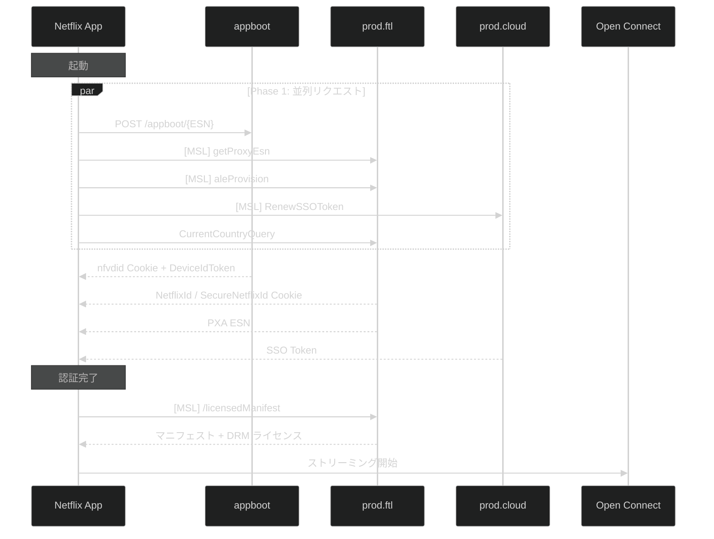

# Netflix クライアント通信仕様書

> **対象アプリケーション:**
> - Netflix Android v9.57.0 (build 63928) — Pixel 4a (5G) / bramble / Android 14
> - Netflix iOS v15.48.1 (Argo.app) — iPhone 7 / iOS 15.8.3
>
> **解析手法:** Frida 動的フック + 静的バイナリ解析 (jadx / ProGuard マッピング)
> **解析日:** 2026-03-12 〜 2026-03-14
>
> **注意:** 本文書はリバースエンジニアリングによる観測結果に基づく。確定的でない事項には「推定される」等の表現を用いている。

---

## 目次

| 章 | 内容 | ファイル |
|---|---|---|
| 1 | [アーキテクチャ概要](01_architecture.md) | 通信スタック、プラットフォーム別実装、エンドポイント一覧 |
| 2 | [MSL プロトコル](02_msl_protocol.md) | メッセージ構造、CBOR キー、暗号化、鍵交換、認証 |
| 3 | [ESN 体系](03_esn.md) | ESN 種別、生成アルゴリズム、PXA ESN 取得 |
| 4 | [認証フロー](04_authentication.md) | 起動時フロー、Cookie、ログイン、トークン管理 |
| 5 | [API エンドポイント](05_api_endpoints.md) | appboot, GraphQL, Manifest, License, Config |
| 6 | [DRM](06_drm.md) | Widevine L1/L3, FairPlay, ライセンスフロー |
| 7 | [ストリーミングプロファイル](07_streaming_profiles.md) | 映像・音声・字幕プロファイル、品質制御 |
| 8 | [HTTP ヘッダー・Cookie](08_http_headers_cookies.md) | ヘッダー一覧、Cookie パターン |
| 9 | [CDN インフラストラクチャ](09_cdn.md) | Open Connect, URL 構造 |
| 付録 | [付録](10_appendix.md) | キャプチャ統計、復号ステータス、Frida フック、クラス一覧 |

---

## アーキテクチャ全体像

```mermaid
%%{init: {'theme':'dark'}}%%
graph TB
    subgraph Client["Netflix Client"]
        App[Netflix App]
        MSL[MSL Layer]
        DRM[DRM Engine]
        HTTP[HTTP Stack]
    end

    subgraph Netflix["Netflix Backend"]
        AB[appboot]
        FTL[prod.ftl<br/>FTL Edge]
        Cloud[prod.cloud<br/>AWS]
        Logs[logs]
    end

    subgraph CDN["Open Connect CDN"]
        OCA[OCA Appliance]
    end

    App --> MSL
    App --> DRM
    MSL --> HTTP
    HTTP -->|デバイス登録| AB
    HTTP -->|MSL API + GraphQL| FTL
    HTTP -->|MSL GraphQL| Cloud
    HTTP -->|テレメトリ| Logs
    HTTP -->|ストリーミング| OCA

    style Client fill:#1a1a2e,stroke:#e94560
    style Netflix fill:#0f3460,stroke:#16213e
    style CDN fill:#533483,stroke:#16213e
```

## 通信フロー概要

---

各章の詳細は上記リンクを参照。
