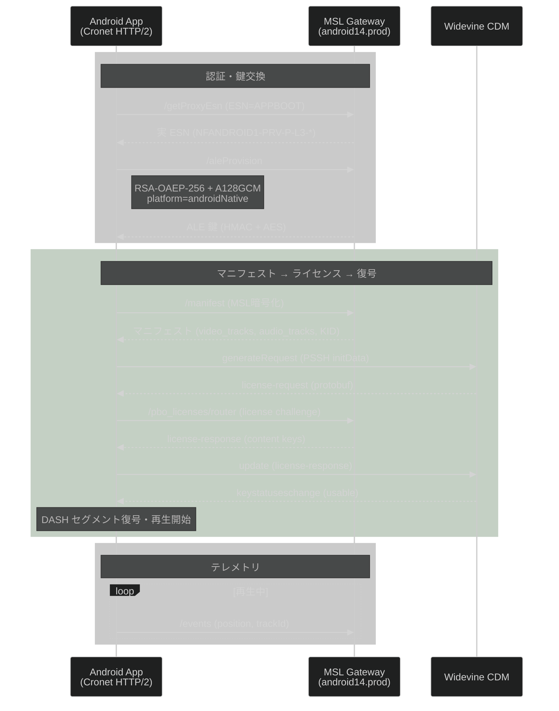
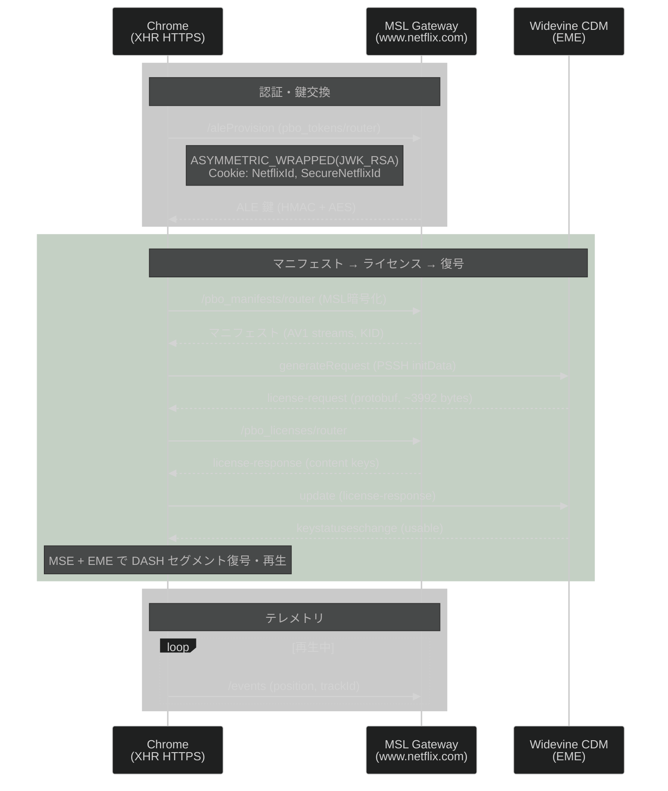
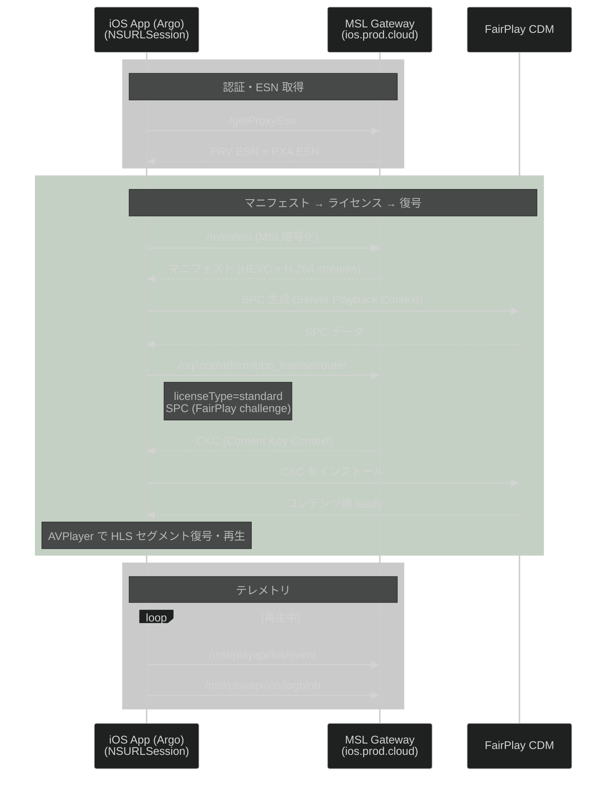
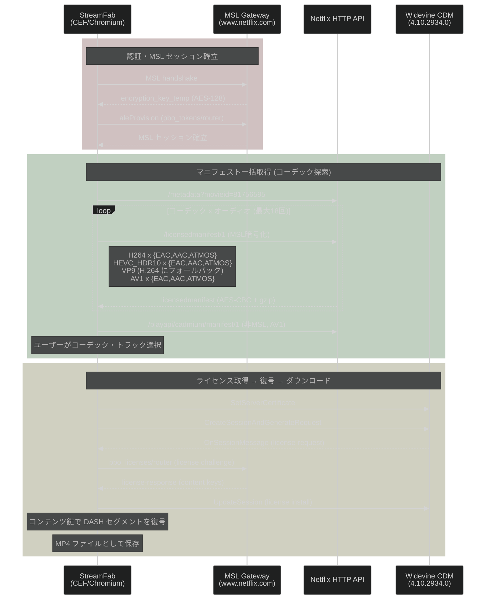

# Netflix MSL プラットフォーム別フロー比較

ログデータ (2026-04-04 ~ 2026-04-05) から各プラットフォームの認証・再生フローを解析し、API エンドポイント・パラメータ・マニフェスト解像度の差異を比較する。

---

## 1. プラットフォーム概要

| 項目 | Android | Chrome | iOS | Stream (StreamFab) |
|------|---------|--------|-----|-------------------|
| ESN プレフィックス | `NFANDROID1-PRV-*` (初期は `APPBOOT`) | `NFCDCH-MC-*` | `NFAPPL-02-IPHONE9=1-*` | `NFCDCH-02-*` |
| ESN (PRV) | `APPBOOT` → ProxyEsn で取得 | `NFCDCH-MC-MW4H1YWDGE9911H107X9CTG5CK58MH` | `NFAPPL-02-IPHONE9=1-AD0455EF27D3A7B8...` | `NFCDCH-02-MUUR2Y0QQ9K5CJNXC9RUU370H3N702` |
| PXA ESN | なし | なし | `NFAPPL-02-IPHONE9=1-PXA-0202P2P3KTB3...` | なし |
| DRM | Widevine (PlayReady) | Widevine | FairPlay | Widevine |
| MSL 暗号化 | AES-CBC | AES-CBC | AES-CBC | AES-CBC |
| 鍵交換方式 | RSA-OAEP-256 + A128GCM | ASYMMETRIC_WRAPPED (JWK_RSA) | 不明 (MSL ペイロード内) | MSL v1 (既存セッション) |
| MSL トランスポート | Cronet (HTTP/2) | XHR (HTTPS) | NSURLSession (HTTPS) | XHR (HTTPS) |
| 認証スキーム | `NETFLIXID` (Cookie) | `NETFLIXID` (Cookie + UIT) | Cookie (HTTP ヘッダー) | `NETFLIXID` (Cookie + UIT) |
| データ API | GraphQL (persisted query) | Falcor (pathEvaluator) + GraphQL | Falcor (iosui/user) | Falcor (pathEvaluator) + GraphQL |

---

## 2. 各プラットフォームのフロー

### 2.1 Android フロー



**特徴:**
- `APPBOOT` ESN で起動し、`/getProxyEsn` で実 ESN を取得する二段階方式
- Widevine L3 の場合、サーバー側で SD (960x540) に制限される
- GraphQL は MSL 経由 (`persisted query` version=102)

### 2.2 Chrome フロー



**特徴:**
- MSL envelope に完全な認証情報 (sender, useridtoken, servicetokens, keyrequestdata) を含む
- EME API 経由で Widevine CDM にアクセス (`com.widevine.alpha`)
- `content-encoding: msl_v1` ヘッダーで MSL トランスポートを指定

### 2.3 iOS フロー



**特徴:**
- PXA ESN (Proxy Auth) と PRV ESN (Private) の二重 ESN 体系
- DRM は **FairPlay** — SPC/CKC 方式 (Widevine とは完全に異なるフロー)
- MSL ペイロードの暗号化は AES-CBC + HMAC-SHA256 (Widevine と同じ MSL レイヤー)

### 2.4 Stream (StreamFab) フロー



**特徴:**
- Chrome と同じ `akira` クライアントタイプだが、`browserversion=144.0.0.0`, `osname=windows` と偽装 (実際は macOS 15.5)
- MSL ハンドシェイクで AES-128 暗号鍵を確立
- **1タイトルに対して最大18回の licensedmanifest 取得** (6コーデック組み合わせ x 3オーディオコーデック)
- VP9 を要求しても H.264 にフォールバック
- Widevine CDM はアプリ内蔵 (4.10.2934.0 等 4バージョン同梱)、`libcefbase.dylib` 経由で制御
- ストリーミング再生ではなく **ダウンロード保存** が目的のため、テレメトリ送信なし

---

## 3. API エンドポイント比較

### 3.1 認証・プロビジョニング

| API | Android | Chrome | iOS | Stream |
|-----|---------|--------|-----|--------|
| `/getProxyEsn` | MSL (prod.ftl) | - | MSL (prod.cloud) | - |
| `/aleProvision` | MSL (prod.ftl) | MSL (`pbo_tokens/router`) | - | - |
| `/config` | MSL (prod.ftl) | - | - | - |

### 3.2 UI データ取得

| API | Android | Chrome | iOS | Stream |
|-----|---------|--------|-----|--------|
| GraphQL | MSL (prod.cloud) | - | - | HTTP (web.prod.cloud) |
| pathEvaluator (Falcor) | - | MSL (www) | - | MSL (www) |
| iosui/user (Falcor) | - | - | HTTP (ios.prod.ftl/cloud) | - |
| loco/lolomo | - | MSL (pathEvaluator) | - | MSL (pathEvaluator) |

### 3.3 再生 (マニフェスト・ライセンス・イベント)

| API | Android | Chrome | iOS | Stream |
|-----|---------|--------|-----|--------|
| manifest | MSL (?) | MSL (`pbo_manifests/router`) | MSL (?) | HTTP (`/playapi/cadmium/manifest/1`) + MSL (`pbo_manifests/router`) |
| license | MSL (?) | MSL (`pbo_licenses/router`) | MSL (`pbo_license/router`) | MSL (?) |
| events | MSL (?) | MSL (events URL) | MSL (`/msl/playapi/ios/event`) | - |
| logblob | - | - | MSL (`/msl/playapi/ios/logblob`) | HTTP (`/log/www/1`) |

### 3.4 ホスト名マッピング

| プラットフォーム | FTL ホスト | Cloud ホスト | Web ホスト |
|----------------|-----------|-------------|-----------|
| Android | `android14.prod.ftl.netflix.com` | `android14.prod.cloud.netflix.com` | - |
| Chrome | - | - | `www.netflix.com` |
| iOS | `ios.prod.ftl.netflix.com` | `ios.prod.cloud.netflix.com` | - |
| Stream | - | `web.prod.cloud.netflix.com` | `www.netflix.com` |

---

## 4. パラメータ比較

### 4.1 MSL Envelope 構造

| フィールド | Android | Chrome | iOS | Stream |
|-----------|---------|--------|-----|--------|
| sender (ESN) | なし (暗黙) | `NFCDCH-MC-*` | なし (暗黙) | なし (暗黙) |
| keyrequestdata | なし (初回のみ) | `ASYMMETRIC_WRAPPED / JWK_RSA` | なし | なし |
| userauthdata | なし (Cookie) | `scheme: NETFLIXID` | なし (Cookie) | なし (Cookie) |
| useridtoken | なし | あり (tokendata + signature) | なし | あり |
| servicetokens | なし | `cad`, `sf` | なし | あり |
| capabilities.compressionalgos | なし | `LZW` | なし | `LZW` |
| handshake | なし | `false` | なし | なし |
| renewable | なし | `true` | なし | なし |

### 4.2 ALE Provision パラメータ

| パラメータ | Android | Chrome |
|-----------|---------|--------|
| netflixClientPlatform | `androidNative` | - (akira) |
| appVer | `63928` | - |
| appVersion | `9.57.0` | - |
| api (Android API level) | `34` | - |
| mnf (Manufacturer) | `Google` | - |
| ffbc (Form Factor) | `phone` | - |
| mId (Model ID) | `GOOGLPIXEL=4A==5G=S` | - |
| devmod (Device Model) | `Google_Pixel 4a (5G)` | - |
| provisionRequest.keyx.scheme | `RSA-OAEP-256` | `RSA-OAEP-256` (推定) |
| provisionRequest.scheme | `A128GCM` | - |
| provisionRequest.type | `SOCKETROUTER` | - |

### 4.3 GraphQL (Android) vs Falcor (Chrome/Stream)

| 項目 | Android (GraphQL) | Chrome/Stream (Falcor) |
|------|-------------------|----------------------|
| エンドポイント | `prod.cloud.netflix.com/graphql` | `www.netflix.com/.../pathEvaluator` |
| リクエスト形式 | `operationName` + `variables` + `persistedQuery` | `paths` 配列 |
| レスポンス形式 | GraphQL | `jsonGraph` (ref/atom) |
| persistedQuery version | 102 | - |
| 主要オペレーション | `InterstitialForLolomo`, `RenewSSOToken`, `InterstitialForProfileGate` | `loco`, `lists`, `videos` |

### 4.4 Cookie 比較

| Cookie | Android | Chrome | iOS | Stream |
|--------|---------|--------|-----|--------|
| NetflixId | あり | あり | あり | あり |
| SecureNetflixId | あり | あり | あり | あり |
| nfvdid | あり | あり | あり | あり |
| gsid | - | あり | - | あり |
| pas | - | あり | - | あり |
| profilesNewSession | - | あり | - | あり |
| OptanonConsent | - | あり | - | あり |
| OTSessionTracking | - | あり | - | あり |

---

## 5. マニフェスト解像度比較

同一タイトル (videoId: 81756595) での比較。

### 5.1 最大解像度

| プラットフォーム | 最大幅 | 最大高 | HD | UHD | ビデオコーデック | DRM |
|----------------|--------|-------|----|----|---------------|-----|
| **Android** | 960 | 540 | **非対応** | 非対応 | PlayReady H.264 HPL22/HPL30 | Widevine (L3) |
| **Chrome** | 1920 | 1080 | 対応 | 非対応 | AV1 Main L30/L31/L40 | Widevine |
| **iOS** | 1920 | 1080 | 対応 | 非対応 | PlayReady H.264 HPL22-40 + HEVC Main10 L30/L31 | FairPlay |
| **Stream** (manifest) | 1920 | 1080 | 対応 | 非対応 | AV1 Main L30/L31/L40 | Widevine |
| **Stream** (pathEval) | 1280 | 720 | 対応 | 非対応 | PlayReady H.264 HPL30/HPL31 | Widevine |
| **Stream** (licensedmanifest) | 1920 | 1080 | 対応 | 非対応 | H.264/HEVC/AV1 (コーデック別) | Widevine |

### 5.2 ビデオストリーム解像度レンジ

| プラットフォーム | 最小解像度 | 最大解像度 | ビデオプロファイル |
|----------------|-----------|-----------|----------------|
| **Android** | 480x270 | **960x540** | `playready-h264hpl22-dash`, `playready-h264hpl30-dash` |
| **Chrome** | 480x270 | **1920x1080** | `av1-main-L30-dash-cbcs-prk`, `av1-main-L31-dash-cbcs-prk`, `av1-main-L40-dash-cbcs-prk` |
| **iOS** | 480x270 | **1920x1080** | `playready-h264hpl22~40-dash`, `hevc-main10-L30~L31-dash-cenc-prk-do` |
| **Stream** (manifest API) | 480x270 | **1920x1080** | `av1-main-L30-dash-cbcs-prk`, `av1-main-L31-dash-cbcs-prk`, `av1-main-L40-dash-cbcs-prk` |
| **Stream** (pathEvaluator inline) | 608x342 | **1280x720** | `playready-h264hpl30-dash`, `playready-h264hpl31-dash` |

**Stream のマニフェストデータソースについて:**

Stream には 3 種類のマニフェスト取得経路がある:

| 経路 | URL | デコード状態 | 含まれるコーデック |
|------|-----|-------------|----------------|
| `licensedmanifest` | `/msl/playapi/cadmium/licensedmanifest/1` | **復号済み** (StreamFab ログの AES 鍵で復号) | H.264, HEVC HDR10, AV1 (コーデック別に個別取得) |
| `manifest` API | `/playapi/cadmium/manifest/1`, `/pbo_manifests/router` | デコード済み → `raws/stream/manifests/http_manifest_*.json` | AV1 のみ (DRM KID なし) |
| `pathEvaluator` inline | `/pathEvaluator` 内の `manifest` フィールド | デコード済み → `raws/stream/msl/response_13878*.json` | **PlayReady H.264** HPL30/HPL31 (max 720p) |

`licensedmanifest` は MSL ペイロードが AES-CBC (gzip 圧縮) で暗号化されている。
StreamFab のアプリケーションログ (`StreamFab.log`) に記録された `encryption_key_temp` (base64url: `YksDoqXmNcg3zGxMhoZWJQ`, hex: `624b03a2a5e635c837cc6c4c86865625`) を用いて復号に成功した。
暗号化形式は各 payload チャンクに `ciphertext` + `iv` + `keyid` フィールドを持つ MSL 固有のフォーマット。

### 5.3 Stream (StreamFab) licensedmanifest コーデック別詳細

StreamFab は 1 タイトルに対して **コーデック × オーディオコーデックの全組み合わせ** で licensedmanifest を取得する。
以下は videoId: 81756595 における各コーデックの復号結果。

#### 5.3.1 StreamFab のマニフェスト取得戦略

StreamFab は `load_manifest` を以下の順序で呼び出す:

| videoCodec | 値 | manifest level 例 |
|------------|---|-------------------|
| 0 | H.264 High Profile | `H264_HP_EAC`, `H264_HP_AAC`, `H264_HP_ATMOS` |
| 2 | HEVC HDR10 | `H265_HDR10_EAC`, `H265_HDR10_AAC`, `H265_HDR10_ATMOS` |
| 4 | VP9 | `VP9_EAC`, `VP9_AAC`, `VP9_ATMOS` |
| 5 | AV1 | `AV1_EAC`, `AV1_AAC`, `AV1_ATMOS` |

| audioCodec | 値 | 意味 |
|------------|---|------|
| 0 | Dolby Atmos | EAC3 + Atmos 拡張 |
| 1 | EAC3 (DD+) | Dolby Digital Plus 5.1 |
| 2 | AAC | AAC ステレオ |

各組み合わせで `/msl/playapi/cadmium/licensedmanifest/1` に POST し、コーデック別のマニフェストを個別に取得する。
同一コーデックであれば audioCodec が異なってもビデオストリームの内容は同一であり、オーディオトラックのみが変わる。

#### 5.3.2 H.264 (PlayReady)

| 解像度 | ビットレート | VMAF | プロファイル | DRM KID |
|--------|------------|------|------------|---------|
| 720x480 | 498 kbps | 72 | `h264mpl30-dash-playready-prk-qc` | `00000000-0968-b9f1-0000-000000000000` |
| 1920x1080 | 4941 kbps | 97 | `h264mpl40-dash-playready-prk-qc` | `00000000-0968-b9f2-0000-000000000000` |

- **ストリーム数: 2** — 480p と 1080p のみで中間解像度がない
- プロファイルは `h264mpl30` (Main Profile Level 3.0) と `h264mpl40` (Level 4.0)
- DRM スキームは **PlayReady** (`playready-prk-qc`: PlayReady Key + Quality Control)
- KID 境界: 480p = SD 鍵 (`...b9f1`)、1080p = HD 鍵 (`...b9f2`)
- ビットレートが 4941 kbps と高いのは、H.264 のコーデック効率が AV1/HEVC より低いため
- manifest API が返す AV1 とは異なり、**DRM Key ID が含まれる**

#### 5.3.3 HEVC HDR10

| 解像度 | ビットレート | VMAF | プロファイル | DRM KID |
|--------|------------|------|------------|---------|
| 608x342 | 92 kbps | 43 | `hevc-main10-L30-dash-cenc-prk-do` | `...b9e7` (SD) |
| 768x432 | 132 kbps | 58 | `hevc-main10-L30-dash-cenc-prk-do` | `...b9e7` (SD) |
| 960x540 | 188 kbps | 68 | `hevc-main10-L30-dash-cenc-prk-do` | `...b9e7` (SD) |
| 1280x720 | 286 kbps | 79 | `hevc-main10-L31-dash-cenc-prk-do` | `...b9e8` (HD) |
| 1280x720 | 433 kbps | 86 | `hevc-main10-L31-dash-cenc-prk-do` | `...b9e8` (HD) |
| 1920x1080 | 788 kbps | 91 | `hevc-main10-L40-dash-cenc-prk-do` | `...b9e8` (HD) |
| 1920x1080 | 1456 kbps | 96 | `hevc-main10-L40-dash-cenc-prk-do` | `...b9e8` (HD) |

- **ストリーム数: 7** — 342p〜1080p まで細かいラダー
- プロファイルは `hevc-main10` (Main 10bit) で **HDR10 対応**
- DRM スキームは **CENC** (`cenc-prk-do`: Common Encryption + PlayReady Key + Download Only)
- H.264 の `playready` とは異なる暗号化スキーム
- KID 境界: 540p 以下 = SD 鍵 (`...b9e7`)、720p 以上 = HD 鍵 (`...b9e8`)
- 1080p で 1456 kbps — H.264 の約 30% のビットレートで同等の VMAF (96 vs 97)
- H.264/AV1 とは **別の DRM KID ペア** が割り当てられている

#### 5.3.4 AV1

| 解像度 | ビットレート | VMAF | プロファイル | DRM KID |
|--------|------------|------|------------|---------|
| 480x270 | 54 kbps | 38 | `av1-main-L30-dash-cbcs-prk` | `...b9db` (SD) |
| 608x342 | 95 kbps | 57 | `av1-main-L30-dash-cbcs-prk` | `...b9db` (SD) |
| 608x342 | 118 kbps | 61 | `av1-main-L30-dash-cbcs-prk` | `...b9db` (SD) |
| 608x342 | 167 kbps | 66 | `av1-main-L30-dash-cbcs-prk` | `...b9db` (SD) |
| 768x432 | 237 kbps | 77 | `av1-main-L30-dash-cbcs-prk` | `...b9db` (SD) |
| 960x540 | 331 kbps | 84 | `av1-main-L30-dash-cbcs-prk` | `...b9db` (SD) |
| 1280x720 | 521 kbps | 91 | `av1-main-L31-dash-cbcs-prk` | `...b9de` (HD) |
| 1920x1080 | 847 kbps | 95 | `av1-main-L40-dash-cbcs-prk` | `...b9de` (HD) |
| 1920x1080 | 1412 kbps | 97 | `av1-main-L40-dash-cbcs-prk` | `...b9de` (HD) |

- **ストリーム数: 9** — 全コーデック中最多。270p〜1080p まで最も細かいビットレートラダー
- DRM スキームは **CBCS** (`cbcs-prk`: Common Encryption Subsample + PlayReady Key)
- KID 境界: 540p 以下 = SD 鍵 (`...b9db`)、720p 以上 = HD 鍵 (`...b9de`)
- 1080p で 1412 kbps — H.264 (4941 kbps) の約 29%、HEVC (1456 kbps) とほぼ同等
- 同一 VMAF 97 を達成するのに H.264 の 1/3.5 のビットレートで済む
- manifest API (`/playapi/cadmium/manifest/1`) で取得できるプロファイルと一致するが、**licensedmanifest にのみ DRM KID が含まれる**

#### 5.3.5 VP9 (フォールバック)

VP9 を要求 (videoCodec=4) しても、**Netflix サーバーは H.264 のマニフェストを返す**。

| 解像度 | ビットレート | VMAF | プロファイル | DRM KID |
|--------|------------|------|------------|---------|
| 720x480 | 498 kbps | 72 | `h264mpl30-dash-playready-prk-qc` | `...b9f1` (SD) |
| 1920x1080 | 4941 kbps | 97 | `h264mpl40-dash-playready-prk-qc` | `...b9f2` (HD) |

- H.264 と完全に同一の内容 — VP9 プロファイルは提供されていない
- StreamFab の ESN (`NFCDCH-02-*`) では VP9 がサポート対象外と判定されている可能性がある
- Chrome ESN (`NFCDCH-MC-*`) では manifest API で AV1 が返されるため、ESN プレフィックスによるコーデック制御が行われている

#### 5.3.6 コーデック別比較サマリ (1080p 最大品質)

| コーデック | 1080p ビットレート | VMAF | ストリーム数 | DRM スキーム | DRM KID (HD) |
|-----------|-------------------|------|------------|-------------|-------------|
| **H.264** | 4941 kbps | 97 | 2 | PlayReady (`playready-prk-qc`) | `...b9f2` |
| **HEVC HDR10** | 1456 kbps | 96 | 7 | CENC (`cenc-prk-do`) | `...b9e8` |
| **AV1** | 1412 kbps | 97 | 9 | CBCS (`cbcs-prk`) | `...b9de` |
| **VP9** | (H.264 にフォールバック) | — | — | — | — |

- **帯域効率**: AV1 ≈ HEVC >> H.264 (AV1 は H.264 の約 1/3.5 のビットレートで同等品質)
- **ラダー粒度**: AV1 (9段) > HEVC (7段) >> H.264 (2段)。H.264 は中間解像度を持たず ABR の品質切り替えが粗い
- **DRM**: コーデックごとに異なる KID ペアが割り当てられる。同一コンテンツでも H.264/HEVC/AV1 で別鍵
- **DRM スキーム**: H.264 = PlayReady、HEVC = CENC、AV1 = CBCS と暗号化方式も異なる

### 5.4 オーディオプロファイル

| プラットフォーム | チャンネル | コーデック | ビットレート |
|----------------|-----------|----------|------------|
| **Android** | 2.0 | xheaac-dash | 32, 64, 96, 192 kbps |
| **Chrome** | 2.0 | xheaac-dash | 32, 64, 96, 192 kbps |
| **iOS** | 5.1 + 2.0 | ddplus-5.1-dash, ddplus-5.1hq-dash, heaac-2-dash, heaac-2hq-dash | 192+ kbps |
| **Stream** (manifest API) | 2.0 | xheaac-dash | 32, 64, 96, 192 kbps |
| **Stream** (licensedmanifest) | 5.1 | ddplus-5.1-dash, ddplus-5.1hq-dash | 192, 256, 384, 448, 640 kbps |

- **manifest API と licensedmanifest でオーディオが大きく異なる**: manifest API は xHE-AAC ステレオのみ、licensedmanifest は DD+ 5.1ch
- licensedmanifest のオーディオは **全19言語** (ja, en, th, pt-BR, pl, hu, it, fr, fil, es, es-ES, de 等) で 5.1ch を提供
- StreamFab の設定で `Audio Codec(Netflix): "Atmos"` を選択しても、実際には DD+ 5.1 が返される (Atmos 非対応アカウント/デバイスの場合)

### 5.5 Badging Info

| フラグ | Android | Chrome | iOS | Stream (manifest) | Stream (pathEval inline) |
|-------|---------|--------|-----|--------|--------|
| sdVideo | true | true | true | true | true |
| hdVideo | **false** | true | true | true | true |
| ultraHdVideo | false | false | false | false | false |
| dolbyVisionVideo | - | - | - | - | - |
| dolbyAtmosAudio | - | - | - | - | - |

### 5.6 Android の解像度制限について

Android (Pixel 4a 5G) で最大 960x540 (SD) に制限されている原因:
- **ESN が `APPBOOT`** のままキャプチャされている → ProxyEsn 取得前のマニフェスト要求
- Widevine **L3** デバイスの場合、Netflix はサーバー側で SD に制限する
- Chrome は L3 でも AV1 プロファイルにより 1080p まで許可される場合がある

---

## 6. フロー相違点まとめ

### 6.1 認証 → 再生の全体フロー比較

```mermaid
%%{init: {'theme': 'dark'}}%%
graph LR
    subgraph Android["Android (Widevine L3)"]
        A1[APPBOOT] --> A2[/getProxyEsn] --> A3[/aleProvision] --> A4[/manifest] --> A5[license challenge] --> A6[CDM decrypt]
    end
    subgraph Chrome["Chrome (Widevine, EME)"]
        C1[Cookie+UIT] --> C2[/aleProvision] --> C3[/pbo_manifests] --> C4["EME generateRequest"] --> C5[/pbo_licenses] --> C6["EME update"]
    end
    subgraph iOS["iOS (FairPlay)"]
        I1[Cookie] --> I2["iosui/user (HTTP)"] --> I3[/manifest] --> I4["SPC 生成"] --> I5[/pbo_license] --> I6["CKC install"]
    end
    subgraph Stream["Stream (Widevine, CEF)"]
        S1[Cookie] --> S2["MSL handshake"] --> S3["licensedmanifest x18"] --> S4["CDM generateRequest"] --> S5[/pbo_licenses] --> S6["CDM update + 保存"]
    end

    style A1 fill:#8B0000,color:#fff
    style A6 fill:#8B0000,color:#fff
    style C1 fill:#00008B,color:#fff
    style C6 fill:#00008B,color:#fff
    style I1 fill:#006400,color:#fff
    style I6 fill:#006400,color:#fff
    style S1 fill:#4B0082,color:#fff
    style S6 fill:#4B0082,color:#fff
```

### 6.2 データ取得パターンの違い

| パターン | プラットフォーム | 説明 |
|---------|---------------|------|
| **MSL-wrapped GraphQL** | Android | GraphQL クエリを MSL ペイロードに包んで送信 |
| **MSL-wrapped Falcor** | Chrome, Stream | pathEvaluator を MSL 経由で呼び出し |
| **Direct HTTP Falcor** | iOS | `iosui/user` を直接 HTTP GET |
| **Direct HTTP GraphQL** | Stream | `web.prod.cloud.netflix.com/graphql` を直接 HTTP |

### 6.3 ESN ライフサイクル

| プラットフォーム | ESN 取得方法 | ESN 形式 |
|----------------|-------------|---------|
| Android | `/getProxyEsn` で動的取得 (初期は APPBOOT) | `NFANDROID1-PRV-P-{L1\|L3}-...` |
| Chrome | 事前割り当て済み | `NFCDCH-MC-{hash}` |
| iOS | `/getProxyEsn` + PXA 派生 | PRV: `NFAPPL-02-{MODEL}-{hash}`, PXA: `NFAPPL-02-{MODEL}-PXA-{hash}` |
| Stream | 事前割り当て済み | `NFCDCH-02-{hash}` |

---

## 7. 備考

- 本ドキュメントは `logs/` および `raws/stream/` ディレクトリ内のキャプチャデータ (2026-04-04 ~ 2026-04-05) に基づく
- Android ログはアプリ起動直後のフローのみキャプチャ、再生フローは未取得
- Chrome ログは再生セッション中のキャプチャ（起動フローは未取得）
- iOS ログは再生中 + 起動のフローを含む
- Stream ログはブラウジング + 再生のフローを含む
  - Proxyman キャプチャ: MSL トラフィック (`netflix-msl-capture.js`) + HTTP マニフェスト (`netflix-manifest-http-capture.js`)
  - StreamFab アプリログ: `raws/stream/StreamFab.log` (内部処理フロー、暗号鍵)
  - licensedmanifest の復号: StreamFab ログの `encryption_key_temp` を使用して AES-CBC + gzip 圧縮のペイロードを復号
  - 復号済みマニフェスト: `raws/stream/manifests/licensedmanifest_decrypted_*.json`
- マニフェストの解像度はアカウントのプラン、デバイスの Widevine レベル、地域により変動する
