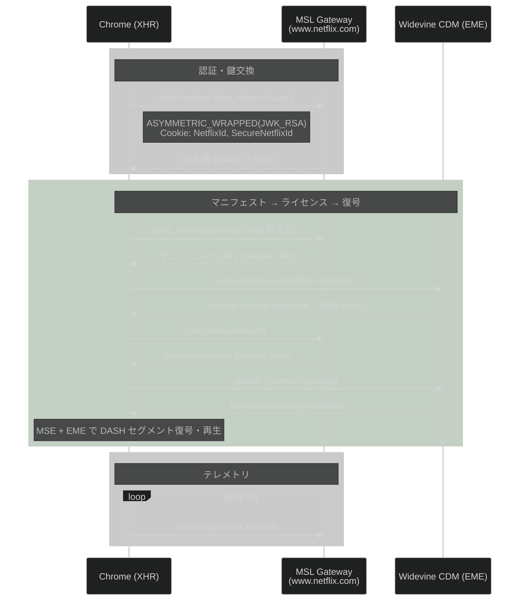

# Netflix MSL クライアント仕様: Chrome

共通仕様: [00_common.md](00_common.md)

---

## 1. フロー



---

## 2. 認証

| 項目 | 値 |
|------|---|
| ESN プレフィックス | `NFCDCH-MC-` |
| ESN 例 | `NFCDCH-MC-MW4H1YWDGE9911H107X9CTG5CK58MH` |
| ESN 取得方法 | 事前割り当て済み (Netflix JS から取得) |
| 認証スキーム | `NETFLIXID` (Cookie + UIT) |
| 鍵交換方式 | `ASYMMETRIC_WRAPPED` (JWK_RSA) |
| MSL 圧縮 | LZW |

### Cookie

```
NetflixId=ct%3DBgjHlOvcAx...
SecureNetflixId=v%3D3%26mac%3DAQEAEQAB...
nfvdid=BQFmAAEBEAQQ...
```

### MSL Envelope 固有フィールド

```json
{
  "sender": "NFCDCH-MC-...",
  "keyrequestdata": [{ "scheme": "ASYMMETRIC_WRAPPED", "keydata": { "keypairid": "...", "mechanism": "JWK_RSA" } }],
  "userauthdata": { "scheme": "NETFLIXID" },
  "useridtoken": { "tokendata": "...", "signature": "..." },
  "servicetokens": [{ "name": "cad" }, { "name": "sf" }],
  "capabilities": { "compressionalgos": ["LZW"] },
  "handshake": false,
  "renewable": true
}
```

---

## 3. マニフェスト取得

**エンドポイント:** `POST /nq/msl_v1/cadmium/pbo_manifests/^1.0.0/router`

MSL 暗号化。レスポンスは LZW 圧縮。

**提供されるコーデック (実測):** AV1 のみ

| 解像度 | ビットレート | プロファイル |
|--------|------------|------------|
| 480x270 | 83 kbps | `av1-main-L30-dash-cbcs-prk` |
| 1920x1080 | 1412 kbps | `av1-main-L40-dash-cbcs-prk` |

---

## 4. ライセンスチャレンジ

**エンドポイント:** `POST /nq/msl_v1/cadmium/pbo_licenses/^1.0.0/router`

### EME フロー

```javascript
// 1. PSSH から initData
const psshBytes = base64Decode(manifest.result.video_tracks[0].drmHeader.bytes);

// 2. EME session
const keySystem = "com.widevine.alpha";
const session = mediaKeys.createSession();
session.generateRequest("cenc", psshBytes);

// 3. session.onmessage → license-request protobuf を MSL 経由で送信
// 4. レスポンスを session.update() に渡す
```

### 実測値

| 項目 | 値 |
|------|---|
| keySystem | `com.widevine.alpha` |
| Session ID 例 | `5F926325C6E5A1FECB33604130D585D5` |
| license-request サイズ | ~3992 bytes |
| license-response サイズ | ~1030 bytes |
| messageType | `license-request`, `license-renewal` |

---

## 5. HTTP ヘッダー

```
Content-Encoding: msl_v1
Content-Type: text/plain
User-Agent: Mozilla/5.0 (Windows NT 10.0; Win64; x64) AppleWebKit/537.36 (KHTML, like Gecko) Chrome/146.0.0.0 Safari/537.36
Cookie: NetflixId=...; SecureNetflixId=...; nfvdid=...
```

**URL クエリパラメータ (全 MSL リクエスト共通):**
```
clienttype=akira
uiversion=v930f5871
browsername=chrome
browserversion=146.0.0.0
osname=windows
osversion=10.0
```
