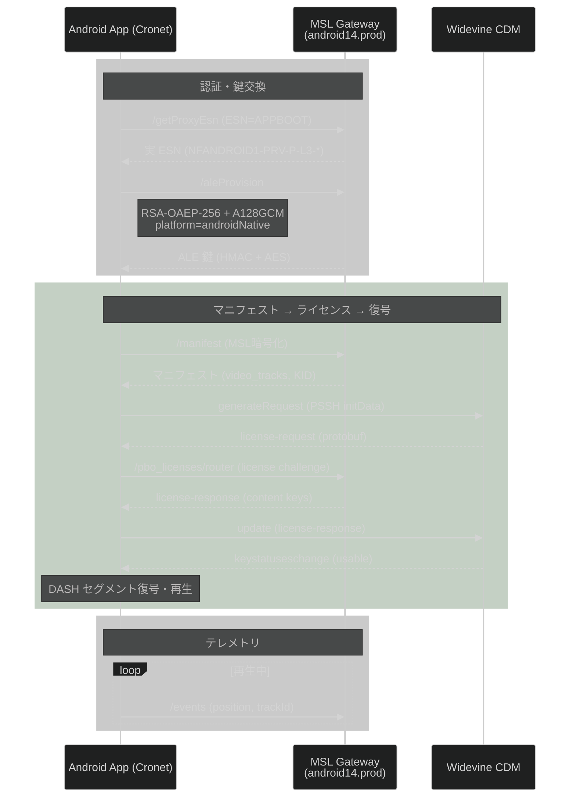

# Netflix MSL クライアント仕様: Android

共通仕様: [00_common.md](00_common.md)

---

## 1. フロー



---

## 2. 認証

| 項目 | 値 |
|------|---|
| ESN プレフィックス | `NFANDROID1-PRV-` |
| 初期 ESN | `APPBOOT` (起動時) |
| ESN 取得方法 | `/getProxyEsn` で動的取得 |
| 認証スキーム | `NETFLIXID` (Cookie) |
| 鍵交換方式 | RSA-OAEP-256 + A128GCM |
| MSL トランスポート | Cronet (HTTP/2) |
| MSL 圧縮 | gzip |

### ESN 二段階取得

1. 起動時は `APPBOOT` ESN で MSL ハンドシェイク
2. `/getProxyEsn` で実 ESN を取得: `NFANDROID1-PRV-P-{L1|L3}-{hash}`
3. 以降は実 ESN で通信

### ALE プロビジョニング固有パラメータ

```json
{
  "netflixClientPlatform": "androidNative",
  "appVer": 63928,
  "appVersion": "9.57.0",
  "api": 34,
  "mnf": "Google",
  "ffbc": "phone",
  "mId": "GOOGLPIXEL=4A==5G=S",
  "devmod": "Google_Pixel 4a (5G)",
  "provisionRequest": {
    "keyx": { "scheme": "RSA-OAEP-256" },
    "scheme": "A128GCM",
    "type": "SOCKETROUTER"
  }
}
```

---

## 3. マニフェスト取得

MSL ゲートウェイ: `android14.prod.ftl.netflix.com` / `android14.prod.cloud.netflix.com`

### 提供されるコーデック (実測, Widevine L3)

| 解像度 | ビットレート | プロファイル |
|--------|------------|------------|
| 480x270 | — | `playready-h264hpl22-dash` |
| 960x540 | — | `playready-h264hpl30-dash` |

**Widevine L3 では最大 960x540 (SD) に制限される。** L1 デバイスであれば 1080p まで取得可能。

---

## 4. ライセンスチャレンジ

**エンドポイント:** MSL 経由 `/pbo_licenses/router`

ホスト: `android14.prod.cloud.netflix.com`

### Widevine CDM 情報 (実測)

| 項目 | 値 |
|------|---|
| OEMCrypto セキュリティレベル | L3 |
| セキュリティパッチ | May 20 2022 |
| デバイス証明書ハッシュ | `KAvwDZh6ZPI16jT59NO7L5XUj7ME5e6KKx0eXz0Zz9A=` |

---

## 5. デバイス構成

`/config` エンドポイントで取得:

```json
{
  "path": ["deviceConfig", "hendrixConfig", "networkScoreConfig", "accountConfig", "streamingConfig2"]
}
```

レスポンスに `retrystrategy`, `truststore`, `jtruststore`, `msltruststore`, TLS cipher suites を含む。

---

## 6. データ API

| API | 方式 | ホスト |
|-----|------|-------|
| GraphQL | MSL 経由 | `android14.prod.cloud.netflix.com/graphql` |
| persisted query | version=102 | |
