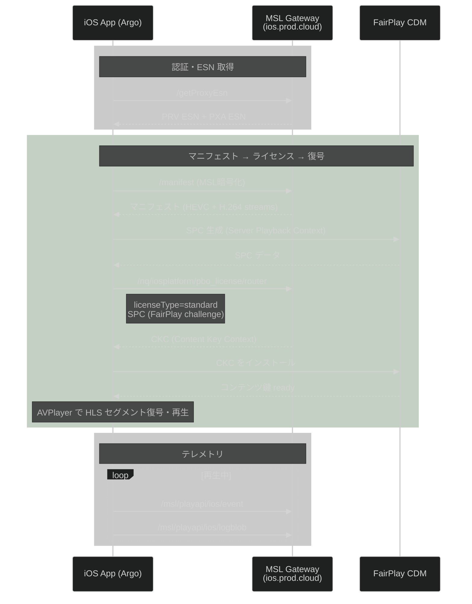

# Netflix MSL クライアント仕様: iOS

共通仕様: [00_common.md](00_common.md)

---

## 1. フロー



---

## 2. 認証

| 項目 | 値 |
|------|---|
| ESN プレフィックス | `NFAPPL-02-` |
| PRV ESN 例 | `NFAPPL-02-IPHONE9=1-AD0455EF27D3A7B8...` |
| PXA ESN 例 | `NFAPPL-02-IPHONE9=1-PXA-0202P2P3KTB3...` |
| ESN 取得方法 | `/getProxyEsn` で動的取得 |
| DRM | **FairPlay** (Widevine ではない) |
| MSL トランスポート | NSURLSession (HTTPS) |
| MSL ペイロード暗号化 | AES-CBC + HMAC-SHA256 |

### 二重 ESN 体系

| ESN 種別 | 用途 | 形式 |
|---------|------|------|
| PRV (Private) | ライセンス取得、MSL 通信 | `NFAPPL-02-{MODEL}-{hash}` |
| PXA (Proxy Auth) | HTTP 直接通信 (Falcor UI) | `NFAPPL-02-{MODEL}-PXA-{hash}` |

### HTTP ヘッダー (Falcor 直接通信時)

```
X-Netflix.client.ftl.esn: {PXA ESN}
X-Netflix.client.type: argo
User-Agent: Argo/15.48.1 (iPhone; iOS 15.8.3; Scale/2.00)
Cookie: NetflixId=...; SecureNetflixId=...; nfvdid=...
```

---

## 3. マニフェスト取得

MSL ゲートウェイ: `ios.prod.ftl.netflix.com` / `ios.prod.cloud.netflix.com`

### 提供されるコーデック (実測)

| 解像度 | プロファイル |
|--------|------------|
| 480x270 〜 1920x1080 | `playready-h264hpl22-dash` 〜 `playready-h264hpl40-dash` |
| 480x270 〜 1920x1080 | `hevc-main10-L30-dash-cenc-prk-do` 〜 `hevc-main10-L31-dash-cenc-prk-do` |

H.264 と HEVC の両方が提供される。

---

## 4. ライセンスチャレンジ (FairPlay)

**エンドポイント:** `POST /nq/iosplatform/pbo_license/~1.0.0/router`

### FairPlay フロー (Widevine とは異なる)

```
SPC (Server Playback Context) → Netflix サーバー → CKC (Content Key Context) → FairPlay CDM
```

1. マニフェストからコンテンツ ID を取得
2. FairPlay CDM に SPC (Server Playback Context) 生成を要求
3. SPC を MSL ペイロードに包んで `/pbo_license/router` に POST
4. レスポンスから CKC (Content Key Context) を取得
5. CKC を FairPlay CDM にインストール → コンテンツ鍵 ready

### ライセンスリクエストパラメータ

```json
{
  "url": "/license?licenseType=standard&playbackContextId=...&esn=NFAPPL-02-...-PRV-...",
  "params": {
    "videoTrackName": "...",
    "preferredlanguages": [...]
  }
}
```

### FairPlay 固有の暗号化操作 (実測)

MSL ペイロード内で以下の暗号化操作が行われる:
- `aesCbcEncrypt`: リクエストペイロードの暗号化
- `aesCbcDecrypt`: レスポンスペイロードの復号
- `hmacSha256`: メッセージ認証コード生成
- `hmacVerify`: メッセージ認証コード検証

---

## 5. 再生方式

- **HLS** (HTTP Live Streaming) — DASH ではない
- **AVPlayer** で再生
- FairPlay DRM で保護されたセグメントを AVPlayer が透過的に復号

---

## 6. テレメトリ

| エンドポイント | 用途 |
|--------------|------|
| `/msl/playapi/ios/event` | 再生イベント (play, pause, stop, position) |
| `/msl/playapi/ios/logblob` | テレメトリデータ (品質指標、バッファリング等) |
