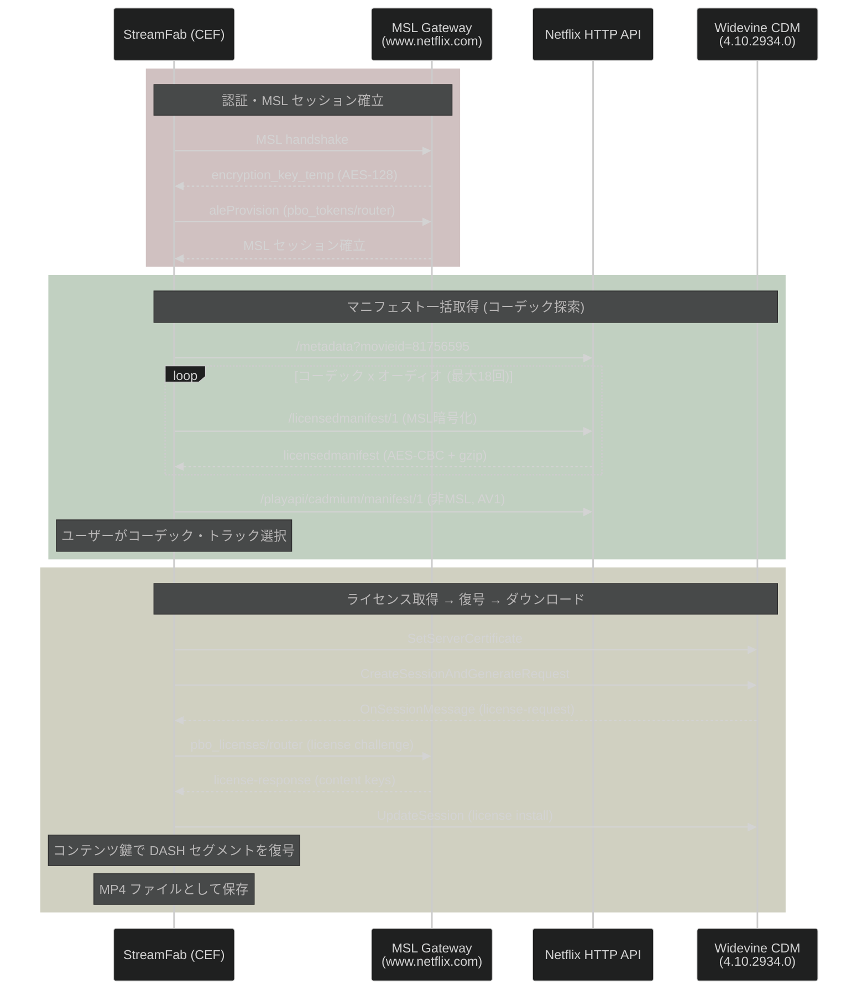

# Netflix MSL クライアント仕様: StreamFab (CEF)

共通仕様: [00_common.md](00_common.md)

---

## 1. フロー



---

## 2. 認証

| 項目 | 値 |
|------|---|
| ESN プレフィックス | `NFCDCH-02-` |
| ESN 例 | `NFCDCH-02-MUUR2Y0QQ9K5CJNXC9RUU370H3N702` |
| ESN 取得方法 | 事前割り当て済み |
| 認証スキーム | `NETFLIXID` (Cookie + UIT) |
| MSL 圧縮 | gzip |

### Cookie

```
NetflixId=ct%3DBgjHlOvcAx...
SecureNetflixId=v%3D3%26mac%3DAQEAEQAB...
nfvdid=BQFmAAEBEAQQ...
gsid=45d701df-...
```

### MSL セッション鍵

ハンドシェイク成功時に `encryption_key_temp` を取得 (base64url, 16バイト AES-128 鍵)。
以降の全 MSL 通信はこの鍵で AES-CBC 暗号化される。

---

## 3. マニフェスト取得

### 3.1 licensedmanifest (メイン)

**エンドポイント:** `POST /msl/playapi/cadmium/licensedmanifest/1`

**クエリパラメータ:**
```
reqAttempt=1
reqPriority=20
reqName=licensedManifest
clienttype=akira
uiversion=v930f5871
browsername=chrome
browserversion=144.0.0.0
osname=windows
osversion=10.0
```

### 3.2 コーデック探索戦略

StreamFab は 1 タイトルに対してコーデック x オーディオの全組み合わせで licensedmanifest を取得する:

| videoCodec | 値 | audioCodec | 値 | manifest level 例 |
|------------|---|------------|---|-------------------|
| H.264 HP | 0 | EAC3 | 1 | `H264_HP_EAC` |
| H.264 HP | 0 | AAC | 2 | `H264_HP_AAC` |
| H.264 HP | 0 | Atmos | 0 | `H264_HP_ATMOS` |
| HEVC HDR10 | 2 | EAC3 | 1 | `H265_HDR10_EAC` |
| HEVC HDR10 | 2 | AAC | 2 | `H265_HDR10_AAC` |
| HEVC HDR10 | 2 | Atmos | 0 | `H265_HDR10_ATMOS` |
| VP9 | 4 | (同上3種) | | VP9 → H.264 フォールバック |
| AV1 | 5 | (同上3種) | | `AV1_EAC`, `AV1_AAC`, `AV1_ATMOS` |

同一コーデックではオーディオが異なるだけでビデオストリームは同一。

### 3.3 コーデック別実測データ (videoId: 81756595)

#### H.264

| 解像度 | ビットレート | VMAF | プロファイル | KID |
|--------|------------|------|------------|-----|
| 720x480 | 498 kbps | 72 | `h264mpl30-dash-playready-prk-qc` | `...b9f1` (SD) |
| 1920x1080 | 4941 kbps | 97 | `h264mpl40-dash-playready-prk-qc` | `...b9f2` (HD) |

ストリーム数 2。中間解像度なし。DRM: PlayReady。

#### HEVC HDR10

| 解像度 | ビットレート | VMAF | プロファイル | KID |
|--------|------------|------|------------|-----|
| 608x342 | 92 kbps | 43 | `hevc-main10-L30-dash-cenc-prk-do` | `...b9e7` (SD) |
| 768x432 | 132 kbps | 58 | `hevc-main10-L30-dash-cenc-prk-do` | `...b9e7` (SD) |
| 960x540 | 188 kbps | 68 | `hevc-main10-L30-dash-cenc-prk-do` | `...b9e7` (SD) |
| 1280x720 | 286 kbps | 79 | `hevc-main10-L31-dash-cenc-prk-do` | `...b9e8` (HD) |
| 1280x720 | 433 kbps | 86 | `hevc-main10-L31-dash-cenc-prk-do` | `...b9e8` (HD) |
| 1920x1080 | 788 kbps | 91 | `hevc-main10-L40-dash-cenc-prk-do` | `...b9e8` (HD) |
| 1920x1080 | 1456 kbps | 96 | `hevc-main10-L40-dash-cenc-prk-do` | `...b9e8` (HD) |

ストリーム数 7。Main 10bit HDR10。DRM: CENC。

#### AV1

| 解像度 | ビットレート | VMAF | プロファイル | KID |
|--------|------------|------|------------|-----|
| 480x270 | 54 kbps | 38 | `av1-main-L30-dash-cbcs-prk` | `...b9db` (SD) |
| 608x342 | 95 kbps | 57 | `av1-main-L30-dash-cbcs-prk` | `...b9db` (SD) |
| 608x342 | 118 kbps | 61 | `av1-main-L30-dash-cbcs-prk` | `...b9db` (SD) |
| 608x342 | 167 kbps | 66 | `av1-main-L30-dash-cbcs-prk` | `...b9db` (SD) |
| 768x432 | 237 kbps | 77 | `av1-main-L30-dash-cbcs-prk` | `...b9db` (SD) |
| 960x540 | 331 kbps | 84 | `av1-main-L30-dash-cbcs-prk` | `...b9db` (SD) |
| 1280x720 | 521 kbps | 91 | `av1-main-L31-dash-cbcs-prk` | `...b9de` (HD) |
| 1920x1080 | 847 kbps | 95 | `av1-main-L40-dash-cbcs-prk` | `...b9de` (HD) |
| 1920x1080 | 1412 kbps | 97 | `av1-main-L40-dash-cbcs-prk` | `...b9de` (HD) |

ストリーム数 9。DRM: CBCS。

#### VP9

Netflix は VP9 を提供しない。要求すると H.264 にフォールバック。

### 3.4 manifest API (補助)

**エンドポイント:** `POST /playapi/cadmium/manifest/1` (非 MSL)

AV1 のみ返される。DRM Key ID なし。リクエスト本文:

```json
{
  "version": 2,
  "url": "manifest",
  "id": 177535606868297730,
  "languages": ["en-JP"],
  "params": {
    "type": "standard",
    "manifestVersion": "v2",
    "viewableId": 82187182,
    "profiles": [
      "heaac-2-dash", "xheaac-dash",
      "playready-h264hpl30-dash", "playready-h264hpl31-dash", "playready-h264hpl40-dash",
      "av1-main-L30-dash-cbcs-prk", "av1-main-L31-dash-cbcs-prk",
      "av1-main-L40-dash-cbcs-prk", "av1-main-L41-dash-cbcs-prk"
    ],
    "flavor": "SUPPLEMENTAL",
    "drmType": "widevine",
    "drmVersion": 0,
    "usePsshBox": true,
    "useHttpsStreams": true,
    "clientVersion": "6.0056.273.911",
    "platform": "144.0.0.0",
    "osVersion": "10.0",
    "osName": "windows",
    "supportsWatermark": true,
    "videoOutputInfo": [{
      "type": "DigitalVideoOutputDescriptor",
      "outputType": "unknown",
      "supportedHdcpVersions": [],
      "isHdcpEngaged": false
    }],
    "maxSupportedLanguages": 2
  }
}
```

---

## 4. ライセンスチャレンジ

**エンドポイント:** MSL 経由 `POST /nq/msl_v1/cadmium/pbo_licenses/^1.0.0/router`

### CDM フロー (CEF 内蔵 Widevine)

| ステップ | CDM API | 説明 |
|---------|---------|------|
| 1 | `SetServerCertificate` | Netflix サーバー証明書をセット |
| 2 | `CreateSessionAndGenerateRequest` | PSSH から license-request 生成 |
| 3 | `OnSessionMessage` | license-request (protobuf) を受け取る |
| 4 | (MSL 送信) | license-request を pbo_licenses に POST |
| 5 | (MSL 受信) | license-response を取得 |
| 6 | `UpdateSession` | license-response をインストール |

### Widevine CDM バージョン (同梱)

| バージョン | パス |
|-----------|------|
| 4.10.2934.0 | `WidevineCdm/4.10.2934.0/_platform_specific/mac_x64/libwidevinecdm.dylib` |
| 4.10.2891.0 | 同上 |
| 4.10.2830.0 | 同上 |
| 4.10.2710.0 | 同上 |

CDM は `libcefbase.dylib` 経由で制御。

### CDM セッション (実測, QCef.log)

1タイトルで複数セッションが生成される:

```
CreateSessionAndGenerateRequest
OnSessionMessage session_id = 040F927F156357E593DB9AD358C08012
CreateSessionAndGenerateRequest
OnSessionMessage session_id = E948DF7EB0DAC44114489546DBB9EF90
CreateSessionAndGenerateRequest
OnSessionMessage session_id = 49818D39487813DB1A6BDC3E21C62DEE
```

---

## 5. 偽装パラメータ

| パラメータ | 実値 | 偽装値 |
|-----------|------|-------|
| User-Agent | macOS 15.5 / CEF | `Windows NT 10.0; Win64; x64` Chrome/144.0.0.0 |
| osname | macOS | `windows` |
| osversion | 15.5 | `10.0` |
| browsername | CEF | `chrome` |
| browserversion | (CEF 内蔵) | `144.0.0.0` |
| clienttype | — | `akira` |

`clientVersion: "6.0056.273.911"` と `uiVersion: "shakti-v930f5871"` は Netflix Web アプリのバージョン。定期的に更新が必要。

---

## 6. ダウンロード実行 (実測)

StreamFab がダウンロード開始時にログに記録するパラメータ:

```
website: "Netflix"
strID: "81756595"
Resolution: "4941:1080:1920"
eVideoCodec: 0 (H.264)
eAudioCodec: 3
```

- ストリーミング再生ではなくダウンロード保存が目的
- テレメトリ (`/events`) は送信しない
- ダウンロード完了後 MP4 ファイルとして保存
