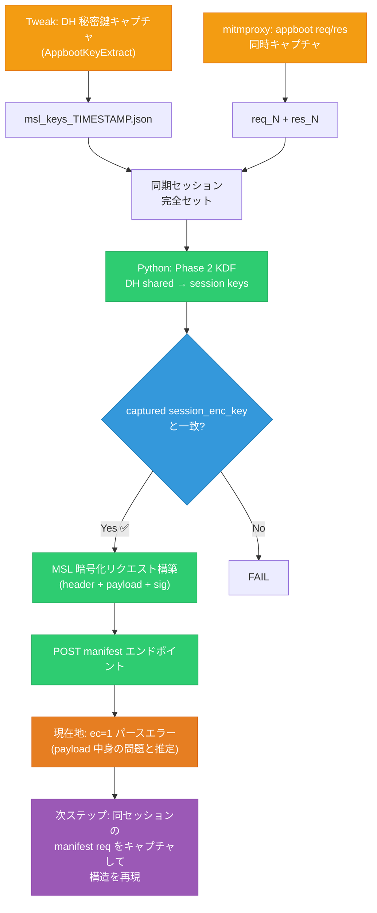

# appboot → MSL エミュレータ — 進捗と課題

作成日: 2026-04-09
更新日: 2026-04-10

---

## 1. フローチャート



---

## 2. 完全に動作するもの

### 2.1 暗号導出チェーン (全て検証済み)

| Phase | 処理 | Python 実装 | 検証 |
|-------|------|-------------|------|
| 0 | TFIT MGK (SHA384(ESN) → WB-AES) | `emulate_tfit.py` | ✅ ライブ値と完全一致 |
| 3 | KDF チェーン (6段 HMAC-SHA256) | `crypto.kdf_renew()` | ✅ 13/13 テスト PASS |
| DH | p/g + 鍵生成 + 共有秘密 | `crypto.compute_dh_shared_secret()` | ✅ ラウンドトリップ |
| 2 | HMAC-SHA384(48B, 0x00‖DH) | `crypto.derive_initial_session_keys()` | ✅ ライブ値と完全一致 |

**検証データ (2026-04-10T06:13 UTC セッション):**
```
MGK:              enc_key_0=0817065e... sign_key_0=91f752f7...
DH shared (keys): 51571f60c2e451894bd0d0ae6e13e7cf... (captured)
DH shared (py):   51571f60c2e451894bd0d0ae6e13e7cf... (computed) ✅
session_enc_key:  2f31028c2fa6387810076a984c1ff47b (both) ✅
session_hmac_key: a73c996991f7f02fd0bfe3322d0cee07... (both) ✅
```

### 2.2 Netflix カスタム CBOR

| 機能 | 実装 | 検証 |
|------|------|------|
| 8 バイト uint64 キーエンコード | `nf_cbor_encode()` | ✅ |
| tag(55799) トップレベル付与 | `nf_cbor_encode(_top=True)` | ✅ |
| キーソート (str 先/int 降順) | 同上 | ✅ |
| entity_auth_data byte-for-byte | 467B 完全一致 | ✅ |
| manifest msg1 byte-for-byte | 1730B 完全一致 | ✅ |

### 2.3 リプレイ動作確認

| 操作 | 結果 |
|------|------|
| appboot req_212 リプレイ | ✅ HTTP 200 CBOR レスポンス |
| 4/8 キャプチャのリプレイ (4/10 実行) | ✅ 成功 (リプレイ保護なし) |
| msg2 (payload chunk) 省略 | ✅ msg1 のみで成功 |
| manifest リクエストのリプレイ | ❌ HTTP 400 (セッション期限切れ) |

---

## 3. 同期セッションのキャプチャ手順

### Step 1: クリーン状態にする

```bash
# Netflix Keychain + NFSharedStore + アプリデータを削除
# → 新しい appboot が実行される
ssh root@device 'killall Argo; clear_caches...; open com.netflix.Netflix'
```

### Step 2: Tweak + mitmproxy で同時キャプチャ

- **AppbootKeyExtract Tweak** → `msl_keys.json` に DH priv/pub/shared を記録
- **mitmproxy** → `raws/ios/YYYYMMDD/raw/req_N_appboot_*.bin` / `res_N_*.bin`

### Step 3: 3 点セットを保存

```
raws/ios/captures/
  ├── msl_keys_TIMESTAMP.json        # Tweak 出力
  ├── appboot_req_TIMESTAMP.bin       # mitmproxy req
  └── (res は raws/ios/YYYYMMDD/raw/)
```

### Step 4: Python で検証

```python
# Load synchronized session
keys = json.load(open("raws/ios/captures/msl_keys_...json"))
res = cbor2.loads(open("raws/ios/20260410/raw/res_212_...bin", "rb").read())

# Extract server DH pub from res
server_pub = cbor2.loads(res[33])[23][31][53][1:]

# Derive session keys from DH shared
dh_shared = NetflixCrypto.compute_dh_shared_secret(server_pub, dh_priv)
session_keys = NetflixCrypto.derive_full_key_chain(MGK_ENC, MGK_SIGN, dh_shared)

# Verify match
assert session_keys.enc_key.hex() == keys["session_enc_key"]
```

---

## 4. 現在の壁: MSL manifest リクエスト

### 4.1 テスト結果

`tools/test_msl_manifest.py` で manifest リクエストを構築:

1. appboot リプレイ → server 新 DH pub 取得 → **新** session keys 導出
2. manifest JSON を AES-CBC 暗号化 → HMAC 署名
3. CBOR msg1 組立 → POST
4. **結果: ec=1 "Error parsing MSL encodable"**

### 4.2 確認済み事項

- ✅ msg1 CBOR バイトは実キャプチャと一致する (byte-for-byte)
- ✅ 署名対象は `HMAC(sign_key, payload_chunk_bytes)` (key 16 が key 33 を署名)
- ✅ header = master_token の CBOR (そのまま)
- ✅ payload_chunk = `{6: IV+ct, 7: b"", 8: keyid, 9: hmac[:16]}`

### 4.3 未確認事項

- ❓ payload 内部の JSON フォーマット (manifest body の正確な構造)
- ❓ keyid suffix (`_1`, `_3`, `_5`, `_8`) のどれが正しいか
- ❓ リプレイでは毎回 server DH が新しくなるため、session keys が元のものと異なる
- ❓ サーバー側が manifest リクエストを復号できているか不明

### 4.4 次のステップ

**同期セッション内の manifest リクエストをキャプチャ**して以下を検証:

1. 実機で Netflix を起動 (新しい appboot 発生)
2. 動画を再生して manifest リクエストを発生させる
3. mitmproxy が `req_N_ios_manifest_*.bin` を保存
4. 同セッションの `msl_keys_*.json` から session keys を導出
5. Python で payload chunk を復号 → 実際の manifest JSON 構造を確認
6. Python で同じ構造の manifest を再構築して送信

---

## 5. 保存済みデータ

```
raws/ios/captures/
  ├── msl_keys_20260410_0613.json     # 同期セッション Tweak キャプチャ
  ├── appboot_req_20260410_0613.bin    # 同期セッション msg1
  ├── dh_keypair.json                  # 旧 DH 鍵ペア
  ├── session_keys.json                # 旧導出セッション鍵
  ├── entityauth_values.json           # ESN, appid, devicetoken 等
  └── devicetoken.bin

raws/ios/20260410/raw/
  ├── req_212_appboot_2026-04-10T06-13-06-314Z.bin  # 同期 msg1
  ├── res_212_appboot_2026-04-10T06-13-06-314Z.bin  # 同期 res
  └── ...
```

---

## 6. TEE 依存の処理 (Python 再現不可)

全ての暗号処理が `AppleTeeApiCryptoShim` 経由で TEE 内実行されるが、**実測では OpenSSL の `DH_generate_key` フックも発火** — TEE が内部的に OpenSSL を使っているか、フォールバックパスがある。

| 処理 | バイナリ関数 | Tweak フック | 実測 |
|------|------------|-------------|------|
| DH 鍵生成 | `DH_generate_key` (OpenSSL) | AppbootKeyExtract | ✅ 発火 |
| DH 共有秘密 | `DH_compute_key` (OpenSSL) | 同上 | ✅ 発火 |
| MGK 導出 | TFIT-WB-AES | Unicorn エミュレーション | ✅ 再現可能 |
| HMAC/AES | 内部実装 | (TEE 経由) | — |

---

## 7. 実行方法

```bash
# KDF 回帰テスト (オフライン、13/13 PASS)
uv run python tools/verify_full_key_chain.py

# E2E appboot テスト (サーバー接続)
uv run python tools/test_appboot_e2e.py --no-proxy

# manifest テスト (ec=1 で止まる、要同期セッション manifest キャプチャ)
uv run python tools/test_msl_manifest.py --live-appboot
```
