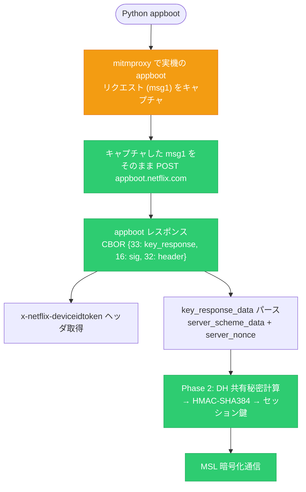

# appboot リクエストエミュレータ — 進捗と課題

作成日: 2026-04-09
更新日: 2026-04-10

---

## 1. フローチャート



## 2. 結論

### Python 単体での appboot は不可能

以下の暗号処理が全て **TEE (Trusted Execution Environment / Secure Enclave)** 内で実行される:

| 処理 | 関数 | TEE 依存 |
|------|------|----------|
| scheme_data の DH 公開鍵暗号化 | `AppleTeeApiCryptoShim::aesecbenc` (0xa24c) | ✅ |
| apphmac (32B) 計算 | `AppleTeeApiCryptoShim::hmac` (0x990c) | ✅ |
| DH 鍵ペア生成 | `AppleTeeApiCryptoShim::dhKeyGen` (0xa35c) | ✅ |
| DH 共有秘密 → セッション鍵導出 | `AppleTeeApiCryptoShim::nflxDhDerive` (0xa524) | ✅ |

TEE 内の鍵はデバイスの Secure Enclave にハードウェア保護されており、ソフトウェアで再現できない。
Unicorn TFIT エミュレーションの出力はサーバーに受理されない (ec=1 "Error decrypting data with cryptex")。

### 動作するアプローチ: mitmproxy キャプチャ + リプレイ

```
実機 (Netflix iOS) ──→ mitmproxy ──→ appboot.netflix.com
                          │
                    msg1 バイト列を保存
                          │
                          ▼
                    Python でリプレイ
                    → CBOR レスポンス取得
                    → DH 共有秘密 → セッション鍵
                    → MSL 暗号化通信
```

**検証済み:**
- mitmproxy キャプチャの msg1 リプレイ → ★ SUCCESS (CBOR レスポンス返却)
- msg2 (payload chunk) は不要 — msg1 のみで成功
- リプレイ保護なし (4/8 キャプチャが 4/10 でも成功)

### 残る課題: DH 秘密鍵の取得

リプレイ方式では **実機の DH 秘密鍵が必要** (Phase 2 でサーバー DH 公開鍵との共有秘密を計算するため)。

取得方法:
1. **Tweak (AppbootKDF)** で `DH_generate_key` フック → `dh_priv_key` をキャプチャ
2. mitmproxy の msg1 と同じセッションの DH 秘密鍵をペアで保存
3. Python で `DH_compute_key(server_pub, client_priv)` → Phase 2 KDF → セッション鍵

## 3. 実装済みコンポーネント

| # | コンポーネント | 状態 |
|---|--------------|------|
| 1 | mitmproxy キャプチャアドオン | ✅ 動作中 |
| 2 | msg1 リプレイ → CBOR レスポンス取得 | ✅ 検証済み |
| 3 | Netflix カスタム CBOR エンコーダ/デコーダ | ✅ |
| 4 | Phase 3 KDF | ✅ 13/13 テスト PASS |
| 5 | Phase 2 KDF (DH → セッション鍵) | ✅ テストベクトル一致 |
| 6 | scheme_data 352B CBOR 構造解析 | ✅ 完全解明 |
| 7 | entity_auth_data CBOR 構造解析 | ✅ 完全解明 |
| 8 | TFIT MGK エミュレーション | ✅ (サーバー検証は不可) |

## 4. TEE 依存で Python 再現不可なもの

| 処理 | バイナリ関数 | 理由 |
|------|------------|------|
| TFIT-WB-AES 暗号化 (scheme_data) | `aesecbenc` (0xa24c) | Sealed key in TEE |
| apphmac 計算 | `hmac` (0x990c) | Sealed AIK in TEE |
| DH 鍵生成 | `dhKeyGen` (0xa35c) | TEE 内で鍵ペア生成 |
| DH 共有秘密導出 | `nflxDhDerive` (0xa524) | TEE 内で HMAC-SHA384 |

**AIK バイト** `38b2030dd55e3367290213ca0d16ee079524ccd24fb7221a52145fb6de016fd8`
(Base64: `OLIDDdVeM2cpAhPKDRbuB5UkzNJPtyIaUhRftt4Bb9g=`) はバイナリに存在するが、
TEE に importKey で sealed された後はデバイス固有の変換を受ける。

## 5. 実行手順

### Step 1: mitmproxy でキャプチャ

```bash
# mitmproxy 起動 (既に動作中)
uv run mitmdump --listen-port 9080 --set block_global=false --ssl-insecure \
    -s packages/mitmproxy/netflix_ios_capture.py
```

### Step 2: 実機で Netflix を操作 → appboot 発生

```bash
# キャプチャ確認
ls raws/ios/*/raw/req_*_appboot_*.bin
```

### Step 3: Python でリプレイ

```python
import requests, cbor2

msg1 = open("raws/ios/20260408/raw/req_1351_appboot_*.bin", "rb").read()
resp = requests.post(
    "https://appboot.netflix.com/appboot/NFAPPL-02-IPHONE9=1-",
    params={"keyVersion": "1"}, data=msg1, verify=False,
)
response_cbor = cbor2.loads(resp.content)
device_id_token = resp.headers.get("x-netflix-deviceidtoken")
```

### Step 4: DH 共有秘密 → セッション鍵 (要 DH 秘密鍵)

```python
# Tweak でキャプチャした DH 秘密鍵が必要
dh_shared = NetflixCrypto.compute_dh_shared_secret(server_pub, client_priv)
session_keys = NetflixCrypto.derive_full_key_chain(enc_key_0, sign_key_0, dh_shared)
```

## 6. テスト

```bash
# KDF 回帰テスト (13/13 PASS)
uv run python tools/verify_full_key_chain.py

# E2E appboot テスト (サーバー接続)
uv run python tools/test_appboot_e2e.py --no-proxy

# mitmproxy キャプチャリプレイ (成功確認済み)
uv run python -c "
import requests, cbor2
data = open('raws/ios/20260408/raw/req_1351_appboot_2026-04-08T13-57-53-350Z.bin', 'rb').read()
resp = requests.post('https://appboot.netflix.com/appboot/NFAPPL-02-IPHONE9=1-',
    params={'keyVersion': '1'}, data=data, verify=False)
r = cbor2.loads(resp.content)
print(f'SUCCESS: keys={list(r.keys())}')
"
```
