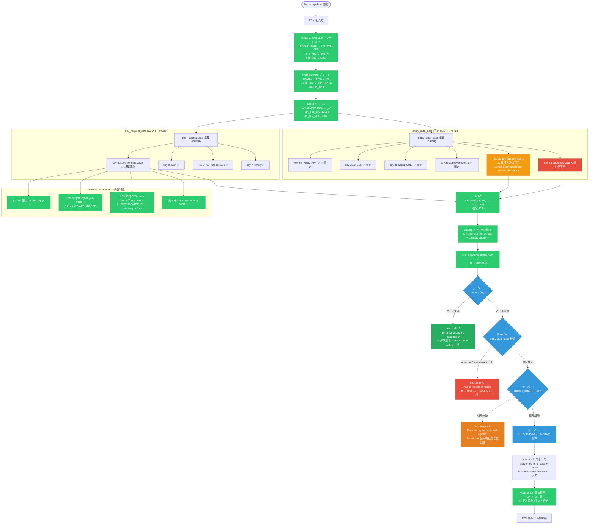

# appboot リクエストエミュレータ — 進捗と課題

作成日: 2026-04-09
更新日: 2026-04-10

---

## 1. appboot フローチャート



### 凡例

- 🟢 緑: 実装済み・動作確認済み
- 🔴 赤: ブロッカー (未解決)
- 🟠 オレンジ: 到達はしたが未解決
- 🟡 黄: 取得方法は判明だが未検証
- 🔵 青: サーバー側処理

---

## 2. 現在の壁

### 壁 1: apphmac (32B) の値が Python で計算できない → errorcode=6

```
entity_auth_data の "apphmac" = HMAC(AIK, devicetoken_216B)
ただし TEE (Trusted Execution Environment) 内で計算されるため、ソフトウェア再現不可。

導出の全容:
  1. AIK (32B) はバイナリ Base64 "OLIDDdVeM2cpAhPK..." = 38b2030d...
  2. importKey() で TEE に sealed される → ハードウェア保護された鍵ハンドル
  3. AppleTeeApiCryptoShim::hmac() が TEE 内で HMAC 計算
  4. TEE 内の鍵は sealed されておりソフトウェアから読み出せない
  5. 標準 HMAC-SHA256(AIK_raw_bytes, devicetoken) では不一致
     → TEE が独自の鍵導出を行っている

Python で再現不可能な理由:
  - TEE (Secure Enclave) のハードウェア鍵がデバイス固有
  - バイナリの AIK バイトは TEE への「入力」であり、TEE 内部で変換される
  - 同じ AIK バイトでも TEE ごとに異なる出力を返す可能性

回避策:
  - mitmproxy で appboot リクエスト CBOR をキャプチャ → apphmac を直接抽出
  - 抽出した apphmac + devicetoken のペアをパラメータとして Python に渡す
  - 同一 devicetoken を使う限り apphmac は再利用可能
```

### 壁 2: TFIT 復号がサーバーで失敗する → errorcode=1

```
壁 1 を real ead で回避しても、次に errorcode=1 で止まる。

分かっていること:
  - "Error decrypting data with cryptex" = サーバーが scheme_data を復号できない
  - 4/8 キャプチャの real krd をリプレイしても同じエラー
  - つまり 4/8 時点の TFIT 暗号化データも今のサーバーでは復号できない

分かっていないこと:
  - サーバー側の TFIT/AES 鍵がいつローテーションされたか
  - 現在のサーバー鍵に対応する TFIT テーブルが何か
  - リプレイ保護 (タイムスタンプ検証) が原因の可能性
```

---

## 3. 実装済みコンポーネント一覧

| # | コンポーネント | 状態 | 検証方法 |
|---|--------------|------|---------|
| 1 | ESN → MGK (TFIT エミュレーション) | ✅ | ライブキャプチャ値と完全一致 |
| 2 | Phase 3 KDF (6段 HMAC チェーン) | ✅ | 13/13 テスト PASS |
| 3 | Phase 2 KDF (HMAC-SHA384) | ✅ | テストベクトル一致 |
| 4 | DH 鍵生成/共有秘密計算 | ✅ | ラウンドトリップ検証 |
| 5 | Netflix カスタム CBOR エンコーダ | ✅ | real ead と 467B byte-for-byte 一致 |
| 6 | entity_auth_data CBOR 構造 | ✅ | 正しい値を入れれば real と一致 |
| 7 | scheme_data 352B 構築 | ✅ | CFB-chain 復号で構造確認済み |
| 8 | HMAC-SHA256 署名 | ✅ | real signature と一致 |
| 9 | HTTP POST + レスポンス解析 | ✅ | サーバー到達、HTTP 200 |
| 10 | apphmac の正しい値 | ❌ | TEE 内 HMAC → Python 再現不可。mitmproxy キャプチャで回避 |
| 11 | TFIT 暗号化がサーバーで復号可能 | ❌ | real krd リプレイでも失敗 |

---

## 4. テスト実行方法

```bash
# KDF 回帰テスト (オフライン、13/13 PASS)
uv run python tools/verify_full_key_chain.py

# E2E appboot テスト (サーバー接続)
uv run python tools/test_appboot_e2e.py --no-proxy

# deviceIdToken 指定
uv run python tools/test_appboot_e2e.py --no-proxy --device-id-token 'Base64文字列'
```
