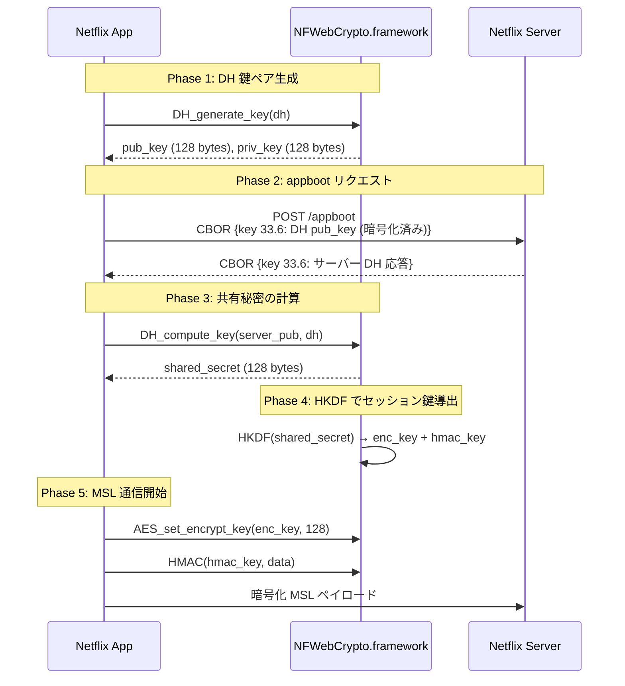

# iOS MSL 復号パイプライン

解析日: 2026-04-08
ツール: AppbootKeyExtract (Tweak) + mitmproxy + Python CborMslDecoder

---

## 1. 概要

Netflix iOS アプリ (Argo) の MSL (Message Security Layer) 通信を、Tweak による鍵キャプチャと
mitmproxy によるトラフィックキャプチャの組み合わせで end-to-end 復号するパイプライン。

```
iOS App (Argo)
  │
  ├── [Tweak] AppbootKeyExtract ──→ msl_keys.json (enc_key, hmac_key, DH keys)
  │
  └── [mitmproxy] HTTPS traffic ──→ .bin files (CBOR MSL captures)
                                          │
                                    Python CborMslDecoder
                                          │
                                    復号済み JSON ペイロード
```

---

## 2. 鍵の取得方法

### 2.1 鍵交換プロトコル (Scheme 3: DH ベース)

iOS Netflix は Scheme 3 (DH ベース鍵交換) を使用する。
Chrome/Android の `ASYMMETRIC_WRAPPED (JWK_RSA)` とは異なる独自プロトコル。



### 2.2 鍵の種類と用途

| 鍵 | サイズ | 用途 | 取得方法 |
|----|--------|------|----------|
| DH 公開鍵 (`dh_pub_key`) | 128 bytes (1024-bit) | 鍵交換リクエストに含まれる | `DH_generate_key` フック |
| DH 秘密鍵 (`dh_priv_key`) | 128 bytes (1024-bit) | 共有秘密計算に使用 (ローカルのみ) | `DH_generate_key` フック |
| DH 共有秘密 (`dh_shared_secret`) | 128 bytes (1024-bit) | HKDF の入力 | `DH_compute_key` フック |
| 暗号化鍵 (`session_enc_key`) | 16 bytes (AES-128) | MSL ペイロードの AES-CBC 暗号化/復号 | `AES_set_encrypt_key` フック |
| 署名鍵 (`session_hmac_key`) | 32 bytes (HMAC-SHA256) | MSL ペイロードの署名/検証 | `HMAC` フック |

### 2.3 フック対象: NFWebCrypto.framework

Netflix は iOS 標準の CommonCrypto / Security.framework を **使用しない**。
代わりに、自前でバンドルした OpenSSL 互換ライブラリ `NFWebCrypto.framework` (約 2.3 MB) を使用する。

```
NFWebCrypto.framework/NFWebCrypto
  ├── DH_generate_key      ← DH 鍵ペア生成
  ├── DH_compute_key       ← DH 共有秘密計算
  ├── DH_get0_key          ← DH 構造体からの鍵取得 (補助)
  ├── BN_num_bits           ← BIGNUM ビット数 (補助)
  ├── BN_bn2bin             ← BIGNUM → バイナリ変換 (補助)
  ├── AES_set_encrypt_key   ← AES 暗号化鍵設定
  ├── AES_set_decrypt_key   ← AES 復号鍵設定
  └── HMAC                  ← HMAC 計算
```

これらは NFWebCrypto のエクスポートシンボルとして公開されているため、
`dlsym` で解決して `MSHookFunction` でフック可能。

> **注意**: `MslClient.framework` 内部の C++ 関数 (`aesCbcEncryptDecrypt` 等) は
> LTO (Link-Time Optimization) によりシンボルが除去されており、直接フックできない。
> NFWebCrypto のエクスポート関数をフックすることで間接的に鍵を取得する。

### 2.4 鍵のライフサイクル

```
アプリ起動
  │
  ├── [pre_appboot] Keychain キャッシュから前回セッション鍵を復元
  │     └── AES_set_encrypt_key / HMAC が呼ばれる (キャッシュ鍵)
  │
  ├── appboot リクエスト送信
  │     └── DH_generate_key → pub_key, priv_key
  │
  ├── appboot レスポンス受信
  │     └── DH_compute_key → shared_secret
  │     └── HKDF → 新しい enc_key, hmac_key
  │
  ├── setDidAppboot: YES  ← ★ appboot 完了マーカー
  │
  └── [post_appboot] 新しいセッション鍵で MSL 通信開始
        ├── AES_set_encrypt_key(enc_key, 128) ← session_enc_key
        ├── HMAC(hmac_key, payload)           ← session_hmac_key
        ├── manifest, license, logblob, graphql 等
        └── 以降の全 MSL リクエスト/レスポンスに使用
```

Tweak は `IosMslClient.setDidAppboot:` を ObjC メソッドフックで監視し、
pre/post appboot のフェーズを区別して鍵を記録する。

### 2.5 鍵の複数出現について

1セッション中に AES/HMAC フックは複数回発火する:

| フェーズ | AES-128 鍵 | HMAC-SHA256 鍵 | 説明 |
|---------|-----------|---------------|------|
| pre_appboot | 0-2 個 | 1-3 個 | Keychain キャッシュからの復元、TFIT 鍵導出 |
| post_appboot | 2-5 個 | 5-11 個 | HKDF 出力、暗号化/復号の各呼び出し |

**最終的な `session_enc_key` / `session_hmac_key` が復号に使用すべき鍵。**
これは `g_keys` 辞書の最新値として Tweak が記録する。

---

## 3. Tweak 実装: AppbootKeyExtract

### 3.1 フックアーキテクチャ

```
AppbootKeyExtract (dylib, Substrate/Orion)
  │
  ├── MSHookMessageEx ─── IosMslClient.setDidAppboot: (ObjC)
  │
  └── MSHookFunction ──── NFWebCrypto exports (C)
        ├── DH_generate_key
        ├── DH_compute_key
        ├── AES_set_encrypt_key
        ├── AES_set_decrypt_key
        └── HMAC
```

### 3.2 DH 鍵のキャプチャ

```c
// DH_generate_key フック
static int hook_DH_generate_key(DH *dh) {
    int ret = orig_DH_generate_key(dh);  // オリジナル関数を呼ぶ
    if (ret == 1) {
        const BIGNUM *pub = NULL, *priv = NULL;
        fn_DH_get0_key(dh, &pub, &priv);  // DH 構造体からキーを取得

        // BIGNUM → バイナリ → hex 文字列に変換して保存
        int pubBytes = (fn_BN_num_bits(pub) + 7) / 8;
        uint8_t *buf = malloc(pubBytes);
        fn_BN_bn2bin(pub, buf);
        g_keys[@"dh_pub_key"] = hexEncode(buf, pubBytes);
        // priv_key も同様に保存
    }
    return ret;
}

// DH_compute_key フック
static int hook_DH_compute_key(unsigned char *key, const BIGNUM *pub_key, DH *dh) {
    int ret = orig_DH_compute_key(key, pub_key, dh);
    if (ret > 0) {
        g_keys[@"dh_shared_secret"] = hexEncode(key, ret);
    }
    return ret;
}
```

**ポイント**: `DH_get0_key` / `BN_num_bits` / `BN_bn2bin` も NFWebCrypto からの
`dlsym` で解決する必要がある (システム OpenSSL とは別のライブラリ)。

### 3.3 セッション鍵のキャプチャ

```c
// AES_set_encrypt_key フック — AES-128 鍵のみ記録
static int hook_AES_set_encrypt_key(const unsigned char *userKey, int bits, void *key) {
    if (bits == 128) {
        NSString *hex = hexEncode(userKey, 16);
        g_keys[g_appbootDone ? @"session_enc_key" : @"pre_session_enc_key"] = hex;
    }
    return orig_AES_set_encrypt_key(userKey, bits, key);
}

// HMAC フック — 32 バイト鍵のみ記録 (HMAC-SHA256)
static unsigned char *hook_HMAC(const void *evp_md, const void *key, int key_len,
                                 const unsigned char *d, size_t n,
                                 unsigned char *md, unsigned int *md_len) {
    if (key_len == 32) {
        NSString *hex = hexEncode((const uint8_t *)key, key_len);
        g_keys[g_appbootDone ? @"session_hmac_key" : @"pre_session_hmac_key"] = hex;
    }
    return orig_HMAC(evp_md, key, key_len, d, n, md, md_len);
}
```

**フィルタ条件**:
- AES: `bits == 128` のみ。AES-256 (鍵導出、TFIT) は除外
- HMAC: `key_len == 32` のみ。HMAC-SHA256 のセッション署名鍵に一致

### 3.4 出力ファイル

Tweak は `NSTemporaryDirectory()/msl_keys.json` に以下の構造で保存する:

```json
{
  "dh_pub_key": "052cf384eed2c4...",
  "dh_priv_key": "5a7dba45126dde...",
  "dh_shared_secret": "159ee6f14fce...",
  "session_enc_key": "893bbf2a18012bdd73628548c4b77827",
  "session_hmac_key": "f5b90484802f0ff688978ea657cb621c446f06d8f0b5cf908620512a8aaf2a59",
  "pre_session_enc_key": "...",
  "pre_session_hmac_key": "...",
  "aes_key_history": [
    {"key": "...", "bits": 128, "phase": "post_appboot"},
    ...
  ],
  "hmac_key_history": [
    {"key": "...", "phase": "post_appboot"},
    ...
  ],
  "timestamp": "2026-04-08T18:20:06"
}
```

デバイスからの取得:

```bash
ssh -p 2222 root@host.docker.internal \
  'cat /private/var/mobile/Containers/Data/Application/*/tmp/msl_keys.json' \
  > raws/msl_keys.json
```

---

## 4. iOS CBOR MSL フォーマット

### 4.1 メッセージ構造 (JSON MSL との差異)

iOS は JSON ではなく **CBOR** (Concise Binary Object Representation) で MSL メッセージをエンコードする。
1つの HTTP ボディに複数の CBOR オブジェクトが連結される。

```
[CBOR Item 0: ヘッダー]  [CBOR Item 1: ペイロード]
  ├── key 32: header           ├── key 64: payload_chunk (暗号化)
  ├── key 33: key_exchange     └── key 16: signature
  ├── key 34: entity_auth
  └── key 16: signature
```

### 4.2 CBOR 数値キーマッピング

| キー | 用途 | JSON MSL 対応 |
|------|------|--------------|
| 32 | header (capabilities) | `headerdata` |
| 33 | key_request/response_data | `keyrequestdata` |
| 34 | entity_auth_data | `entityauthdata` |
| 64 | payload_chunk (暗号化ペイロード) | `payload` |
| 16 | message signature | `signature` |

### 4.3 payload_chunk 内部構造 (CBOR key 64)

key 64 の値はさらに CBOR エンコードされた dict:

| サブキー | 用途 | 値の型 | サイズ |
|---------|------|--------|-------|
| 6 | ciphertext (IV prepend) | bytes | 可変 |
| 7 | IV フラグ | bytes | 0-1 byte |
| 8 | keyid | string | `{ESN}_{N}` or `N` |
| 9 | HMAC | bytes | 16 bytes |

### 4.4 IV の扱い (JSON MSL との最大の差異)

**JSON MSL** では IV は `"iv"` フィールドに Base64 エンコードされた 16 バイトとして格納される。

**iOS CBOR MSL** では IV は ciphertext の先頭 16 バイトに prepend される:

```
CBOR key 7 (IV field):  空 (0 bytes) または 0x00 (1 byte) ← ダミー
CBOR key 6 (ciphertext): [16-byte IV][actual ciphertext]
```

復号時は ciphertext の先頭 16 バイトを IV として分離する:

```python
iv = ciphertext[:16]
actual_ciphertext = ciphertext[16:]
plaintext = aes_cbc_decrypt(actual_ciphertext, key=enc_key, iv=iv)
```

### 4.5 復号後の平文構造

復号後の平文 (PKCS7 アンパディング済み) は、リクエストとレスポンスで異なる構造を持つ。

#### リクエスト: iOS バイナリフレーム

```
[0x49][9-byte header][0x3E][CBOR bstr(N): gzip圧縮データ][trailer]
```

| オフセット | サイズ | 内容 |
|-----------|--------|------|
| 0 | 1 | `0x49` = CBOR bstr(9) |
| 1 | 9 | フレームヘッダー (例: `50 1b 00 00 00 00 00 00 00`) |
| 10 | 1 | `0x3E` (62) = フレームタイプ/デリミタ |
| 11 | 3+ | CBOR bstr ヘッダー (例: `59 02 e7` = 743 bytes) |
| 14 | N | gzip 圧縮された JSON ペイロード |
| 14+N | 可変 | トレーラー (sequence number 等) |

gzip 展開すると JSON ペイロードが得られる:

```json
{
  "esn": "NFAPPL-02-IPHONE9=1-PXA-...",
  "method": "call",
  "locale": "ja-JP",
  "pathFormat": "graph",
  "callPath": "[\"moneyball\",\"appleSignUp\",\"next\"]",
  ...
}
```

#### レスポンス: deflate 圧縮

```
[0x00 0x00][raw deflate 圧縮された JSON]
```

| オフセット | サイズ | 内容 |
|-----------|--------|------|
| 0 | 2 | `0x00 0x00` = ヘッダー |
| 2 | 1 | deflate データの先頭バイト (例: `0xff`) |
| 3 | N | raw deflate 圧縮データ |

`zlib.decompress(plaintext[3:], wbits=-15)` で展開すると JSON ペイロードが得られる:

```json
{
  "value": {"moneyball": {"appleSignUp": {"next": {"mode": "welcomeConsumptionOnly", ...}}}},
  "paths": [...]
}
```

#### レスポンス: 非圧縮

一部のレスポンス (logblob 等) は圧縮なしの CBOR integer (`-3` 等のステータスコード) で返される。

### 4.6 HTTP レスポンスの gzip ラッピング

mitmproxy がキャプチャしたレスポンスファイルは、HTTP Content-Encoding: gzip がそのまま保存される。
そのため `.bin` ファイルの先頭が `1f 8b` (gzip magic) で始まる場合は、
CBOR デコードの前に gzip 展開が必要:

```python
if raw_data[:2] == b"\x1f\x8b":
    raw_data = gzip.decompress(raw_data)
```

---

## 5. Python 復号パイプライン

### 5.1 コンポーネント

| ファイル | 役割 |
|---------|------|
| `src/netflix_msl/crypto.py` | AES-CBC 暗号化/復号、HMAC-SHA256、鍵インポート |
| `src/netflix_msl/cbor_decoder.py` | CBOR MSL メッセージ解析、IV 分離、平文展開 |
| `tools/decrypt_capture.py` | オフライン復号 CLI |

### 5.2 使い方

#### 鍵ファイルからの復号 (CLI)

```bash
# 単一ファイル
python tools/decrypt_capture.py \
  --keys raws/msl_keys.json \
  --input raws/ios/20260408/raw/req_660_iosui_2026-04-08T09-20-06-370Z.bin

# ディレクトリ一括
python tools/decrypt_capture.py \
  --keys raws/msl_keys.json \
  --input-dir raws/ios/20260408/raw/

# hex で鍵を直接指定
python tools/decrypt_capture.py \
  --enc-key 893bbf2a18012bdd73628548c4b77827 \
  --sign-key f5b90484802f0ff688978ea657cb621c446f06d8f0b5cf908620512a8aaf2a59 \
  --input capture.bin
```

#### Python API

```python
from netflix_msl.crypto import NetflixCrypto
from netflix_msl.cbor_decoder import CborMslDecoder

# 鍵をロード
crypto = NetflixCrypto()
crypto.import_keys_from_file("raws/msl_keys.json")

# デコーダーを初期化
decoder = CborMslDecoder(crypto)

# MSL メッセージを復号
with open("capture.bin", "rb") as f:
    result = decoder.process_message(f.read())

# 結果
for payload in result["payloads"]:
    if "body" in payload:
        print(payload["body"])  # 復号済み JSON
```

### 5.3 鍵ファイル互換性

`crypto.import_keys_from_file()` は以下の2形式に対応:

| 形式 | フィールド名 | 生成元 |
|------|------------|--------|
| Frida 形式 | `enc_key`, `sign_key` | Frida フックスクリプト |
| Tweak 形式 | `session_enc_key`, `session_hmac_key` | AppbootKeyExtract |

---

## 6. 運用手順

### 6.1 準備

```bash
# 1. Tweak をビルド・インストール
make -C packages/tweak/AppbootKeyExtract package install THEOS_DEVICE_IP=192.168.0.49

# 2. mitmproxy を起動 (別ターミナル)
# (既に起動済みならスキップ)

# 3. Netflix アプリを起動
ssh -p 2222 root@host.docker.internal \
  'uiopen --bundleid com.netflix.Netflix'

# 4. 5秒待ってから生存確認
ssh -p 2222 root@host.docker.internal \
  'ps aux | grep Argo | grep -v grep'
```

### 6.2 鍵の取得

```bash
# デバイスから鍵ファイルをダウンロード
ssh -p 2222 root@host.docker.internal \
  'cat /private/var/mobile/Containers/Data/Application/*/tmp/msl_keys.json' \
  > raws/msl_keys.json

# 鍵の確認
python3 -c "
import json
with open('raws/msl_keys.json') as f:
    keys = json.load(f)
print(f'enc_key:  {keys.get(\"session_enc_key\", \"N/A\")}')
print(f'hmac_key: {keys.get(\"session_hmac_key\", \"N/A\")}')
print(f'timestamp: {keys.get(\"timestamp\", \"N/A\")}')
"
```

### 6.3 キャプチャの復号

```bash
# 鍵のタイムスタンプとキャプチャファイルの時刻が一致していることを確認
# (異なるセッションの鍵では復号できない)

python tools/decrypt_capture.py \
  --keys raws/msl_keys.json \
  --input-dir raws/ios/20260408/raw/ \
  2>errors.log
```

### 6.4 セッション鍵の更新

**重要**: セッション鍵はアプリ起動ごとに変わる。
新しいキャプチャを復号するには、同一セッションの鍵が必要。

鍵のキャッシュによりアプリが前回の鍵を再利用する場合がある。
新しい鍵交換を強制するには:

```bash
ssh -p 2222 root@host.docker.internal \
  'rm -rf /private/var/mobile/Containers/Data/Application/*/Library/Caches/*'
```

---

## 7. 既知の制限

| 制限 | 詳細 |
|------|------|
| セッション一致が必要 | 鍵とキャプチャは同一セッションのものでなければ復号できない |
| HMAC 検証未実装 | 署名対象データの特定が未完了のため、signature_valid は常に false |
| 一部レスポンスが非 JSON | logblob レスポンス等は CBOR integer (ステータスコード) のみ |
| pre_appboot トラフィック | キャッシュ鍵で暗号化されたトラフィックは `pre_session_*` 鍵で復号可能だが未検証 |
| appboot 自体の復号 | appboot リクエストは entity_auth_data 内の暗号化構造が未解明 |

---

## 8. プラットフォーム別 MSL フォーマット比較

| 項目 | Chrome/Android (JSON) | iOS (CBOR) |
|------|-----------------------|-----------|
| エンコーディング | JSON | CBOR (数値キー) |
| IV 格納 | `"iv"` フィールド (Base64) | ciphertext に prepend |
| ciphertext 格納 | `"ciphertext"` (Base64) | 生バイナリ |
| HMAC サイズ | 32 bytes (SHA-256) | 16 bytes (truncated?) |
| 復号後圧縮 (リクエスト) | gzip (Base64 経由) | gzip (CBOR bstr 直接) |
| 復号後圧縮 (レスポンス) | gzip (Base64 経由) | raw deflate (`00 00` prefix) |
| 鍵交換スキーム | ASYMMETRIC_WRAPPED (JWK_RSA) | Scheme 3 (DH ベース) |
| メッセージ構造 | JSON 連結 | CBOR 連結 |
| HTTP レスポンス圧縮 | なし | gzip (Content-Encoding) |
