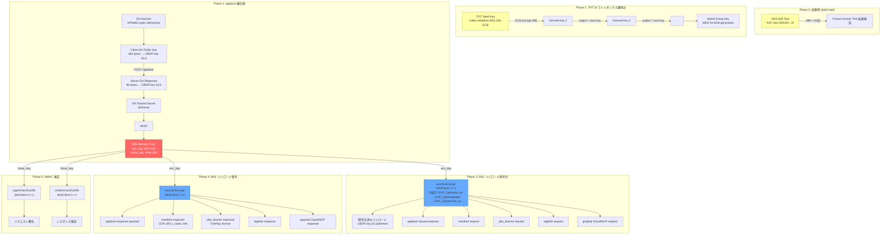

# Netflix iOS MSL 暗号化フロー解析

キャプチャ日: 2026-04-06
Tweak: NetflixSSLBypass (EVP_CipherInit_ex / EVP_CipherUpdate フック)

## 発見事項

### EVP_Cipher で処理されているもの

Tweak の EVP フックで 264 回の `EVP_CipherInit` と 457 回の `EVP_CipherUpdate` をキャプチャした結果、
**EVP_Cipher は MSL ペイロードの暗号化/復号には使われていない**ことが判明。

EVP_Cipher で処理されているのは以下の3種類のみ:

1. **AES セルフテスト (KAT)**: `key=000102030405060708090a0b0c0d0e0f`, `enc=encrypt`, 48 bytes × 40 回
2. **TFIT ホワイトボックス鍵導出チェーン**: 100以上のユニークな鍵で各 48 bytes を暗号化。出力が次の鍵になるチェーン構造
3. **AES-ECB テスト**: `key=fe70779b...`, 16 bytes × 60 回 (繰り返しパターン)

いずれも **固定サイズ (16 or 48 bytes)** のデータのみ。数百〜数千バイトの MSL ペイロード暗号化は含まれない。

### MSL ペイロード暗号化の実体

Frida の既存キャプチャ (`raws/ios/20260404/capture.jsonl`) では `msl.aesCbcEncrypt` / `msl.aesCbcDecrypt` イベントが
486 / 772 回記録されている。これは MslClient.framework 内の C++ 関数:

```
netflix::msl::crypto::aesCbcEncryptDecrypt(EncryptOrDecrypt, vector<uint8_t>&, vector<uint8_t>&, vector<uint8_t>&, vector<uint8_t>&)
```

が呼ばれている。この関数は内部で `EVP_CipherInit_ex` → `EVP_CipherUpdate` → `EVP_CipherFinal_ex` を呼ぶが、
**ElleKit の MSHookFunction ではこのオフセットのフックに失敗している** (Frida の Interceptor は成功する)。

## 暗号鍵のフロー



## 鍵の取得元まとめ

| 鍵 | 取得元 | 用途 |
|----|--------|------|
| TFIT MGK seed | NFWebCrypto.framework にハードコード (per-device-type) | ESN 生成用 Model Group Key 導出 |
| DH 秘密鍵 | NFWebCrypto::dhKeyGen (ランタイム生成) | appboot 鍵交換 |
| kAppBootKey (RSA-4096) | NFWebCrypto.framework にハードコード | DH パラメータの暗号化 (サーバーへ送信) |
| kAppBootEccKey (ECDSA P-256) | NFWebCrypto.framework にハードコード | サーバーレスポンスの署名検証 |
| MSL enc_key (AES-128) | 初回: DH 共有秘密から導出 (方法未解明)。更新: HMAC-SHA256 KDF (解明済み) | MSL ペイロードの AES-128-CBC 暗号化/復号 |
| MSL hmac_key (SHA-256) | 初回: 同上。更新: HMAC-SHA256 KDF (解明済み) | MSL ペイロードの HMAC-SHA256 署名/検証 |
| PSK (16B) | DH 共有秘密から導出? TFIT チェーン出力? (未解明) | KDF 鍵更新のマスター鍵 |
| AES self-test key | 固定値 `000102...0f` | OpenSSL KAT (Known Answer Test) |

## 現状の制限

| アプローチ | 状態 | 問題 |
|-----------|------|------|
| Tweak EVP_Cipher フック | ✓ 動作 | TFIT/KAT のみキャプチャ。MSL ペイロードは見えない |
| Tweak MSHookFunction (オフセット) | ✗ コールバック未発火 | ElleKit が MslClient 内部コードのフックに失敗 |
| Frida Interceptor (attach) | ✓ 動作 | 起動後 attach のため appboot に間に合わない |
| Frida enumerateSymbols | ✓ 動作 | アドレス取得可能だが attach タイミングの問題 |

## 解決済み: KDF 鍵更新アルゴリズム (2026-04-08)

Tweak `AppbootKeyExtract` v39 の HMAC ストリーミングフックにより、
MSL セッション鍵更新の KDF が完全に解明された。

**アルゴリズム**: カスタム HMAC-SHA256 チェーン (標準 HKDF ではない)

```
new_enc_key  = HMAC-SHA256(HMAC-SHA256(PSK, enc_key), nonce)[:16]
new_sign_key = HMAC-SHA256(HMAC-SHA256(PSK, sign_key), nonce)
```

詳細: [msl_kdf_analysis.md](msl_kdf_analysis.md)
Python 実装: `src/netflix_msl/crypto.py` → `NetflixCrypto.kdf_renew()`

## 次のステップ

1. **PSK の由来特定** — `027617984f6227539a630b897c017d69` がどこから来るかを解明
   - Keychain クリア + 新規セッションでキャプチャ
   - TFIT ホワイトボックスチェーンとの関連調査
2. **初期鍵導出 (DH → 初回セッション鍵)** — `DH_compute_key`/`dhDerive` + 直後の HMAC チェーンをキャプチャ
3. **SSL Pinning バイパス** — Netflix ログインに必要。Frida ベースの手法を検討
