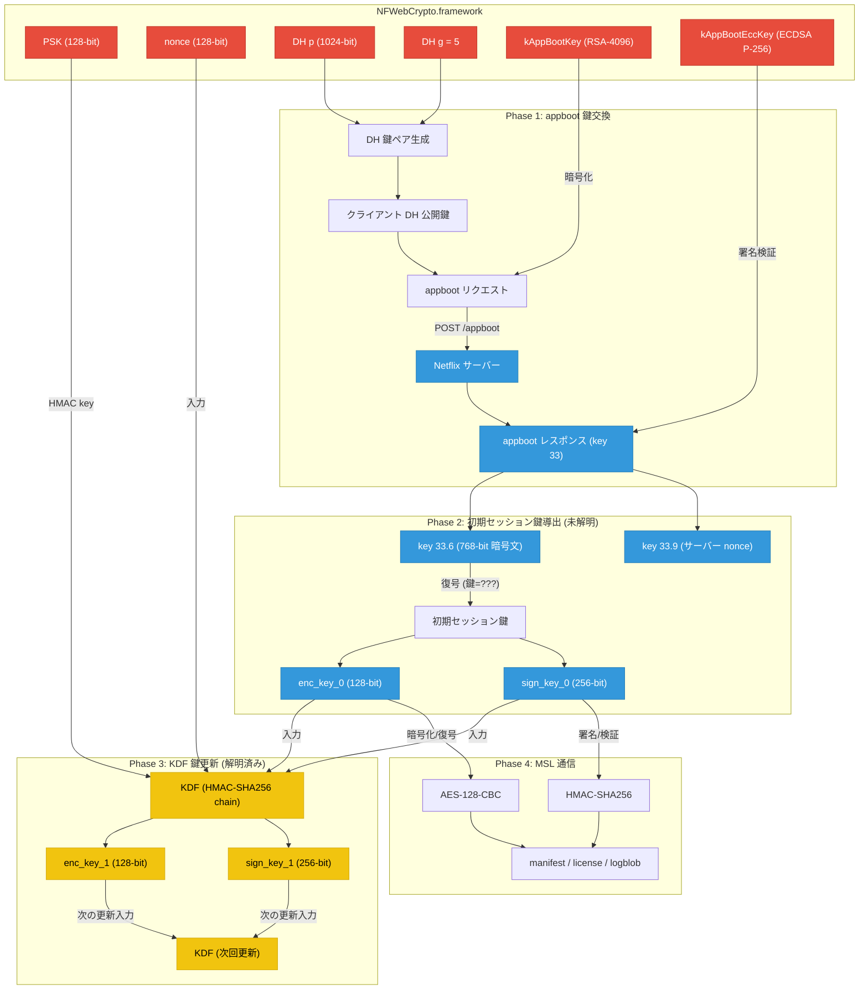
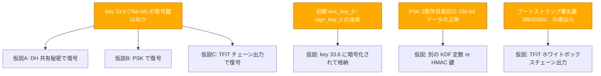

# Netflix iOS MSL 鍵の関係図

作成日: 2026-04-08

---

## 1. 鍵の全体関係

### 凡例

| 色 | 意味 |
|----|------|
| 赤 | バイナリ埋め込み |
| 青 | サーバーレスポンス由来 |
| 黄 | 計算可能 (KDF 出力) |

---

## 2. KDF 鍵更新の詳細フロー

---

## 3. 鍵一覧

| 鍵名 | サイズ | 格納場所 | 用途 | 状態 |
|------|--------|----------|------|------|
| PSK | 128-bit | バイナリ | KDF マスター鍵 | 確定 |
| nonce | 128-bit | バイナリ | KDF 入力 | 確定 |
| enc_key_0 | 128-bit | 不明 | AES-128-CBC 暗号化 | 由来不明 |
| sign_key_0 | 256-bit | 不明 | HMAC-SHA256 署名 | 由来不明 |
| enc_key_1 | 128-bit | KDF 出力 | 更新後の暗号化鍵 | 計算可能 |
| sign_key_1 | 256-bit | KDF 出力 | 更新後の署名鍵 | 計算可能 |
| DH p | 1024-bit | バイナリ | DH 鍵交換 | 確定 |
| DH g | - | バイナリ | DH 鍵交換 | 確定 |
| kAppBootKey | 4096-bit | バイナリ | DH パラメータ暗号化 | 既知 |
| kAppBootEccKey | 256-bit | バイナリ | レスポンス署名検証 | 既知 |

---

## 4. 未解明ポイント

