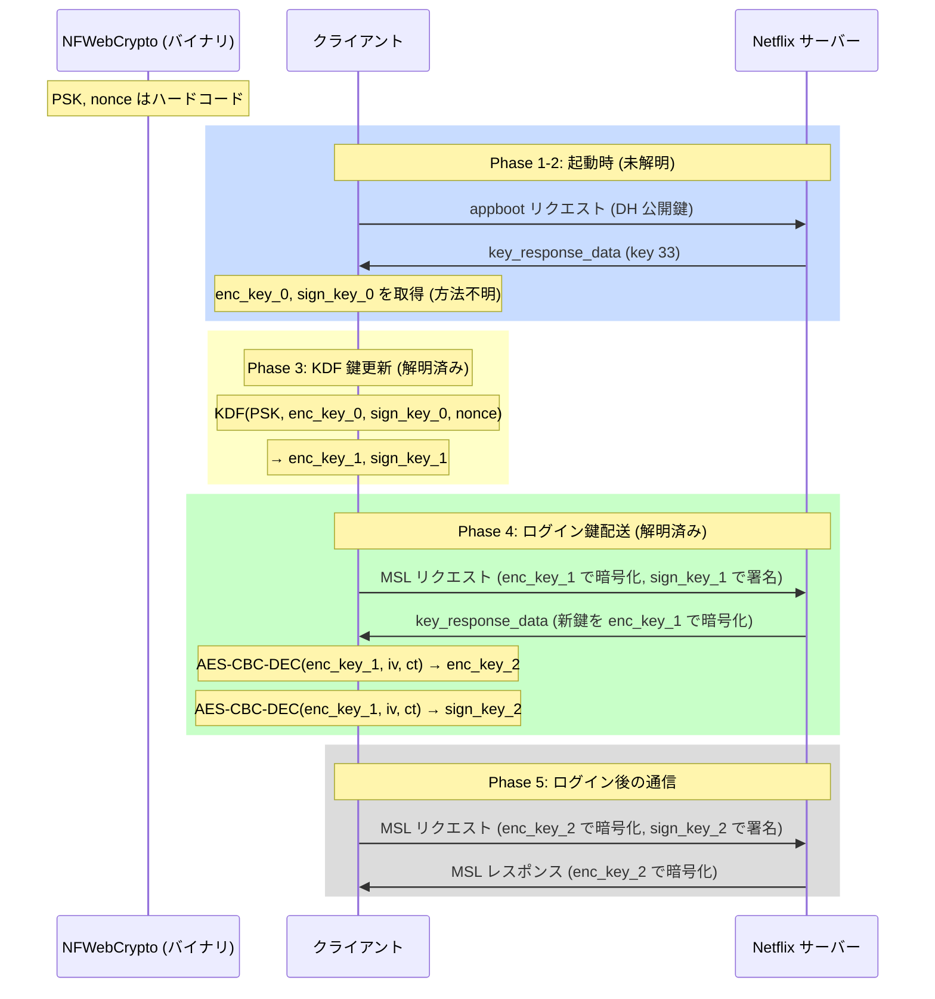
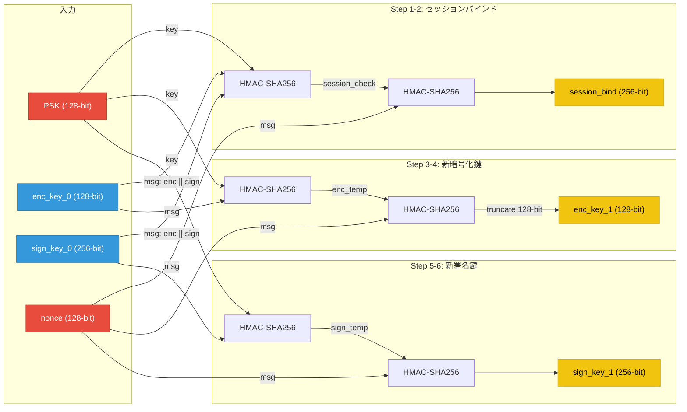
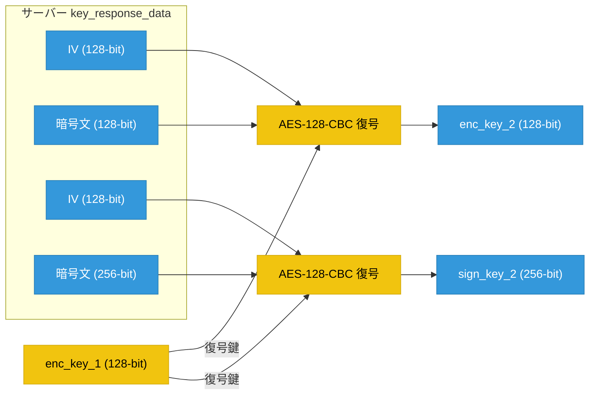
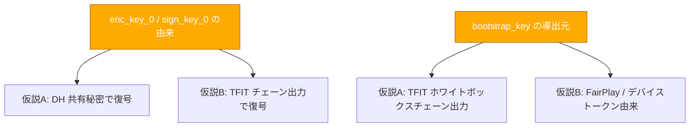

# Netflix iOS MSL 鍵の関係図

作成日: 2026-04-08
更新日: 2026-04-08 (ログイン時の鍵遷移解析結果を反映)

---

## 1. 鍵の全体関係

```mermaid
graph TD
    subgraph "NFWebCrypto.framework"
        PSK["PSK (128-bit)"]
        NONCE_HARD["nonce (128-bit)"]
        DH_P["DH p (1024-bit)"]
        DH_G["DH g = 5"]
        RSA_BOOT["kAppBootKey (RSA-4096)"]
        ECC_BOOT["kAppBootEccKey (ECDSA P-256)"]
    end

    subgraph "Phase 1: appboot 鍵交換"
        DH_P --> DH_GEN["DH 鍵ペア生成"]
        DH_G --> DH_GEN
        DH_GEN --> DH_PUB["クライアント DH 公開鍵"]
        RSA_BOOT -->|暗号化| DH_REQ["appboot リクエスト"]
        DH_PUB --> DH_REQ
        DH_REQ -->|POST /appboot| SERVER["Netflix サーバー"]
        SERVER --> DH_RESP["appboot レスポンス (key 33)"]
        ECC_BOOT -->|署名検証| DH_RESP
    end

    subgraph "Phase 2: 初期セッション鍵導出 (未解明)"
        DH_RESP --> KEY336["key 33.6 (768-bit 暗号文)"]
        DH_RESP --> NONCE_SRV["key 33.9 (サーバー nonce)"]
        KEY336 -->|"復号 (鍵=???)"| INIT_KEYS["初期セッション鍵"]
        INIT_KEYS --> ENC0["enc_key_0 (128-bit)"]
        INIT_KEYS --> SIGN0["sign_key_0 (256-bit)"]
    end

    subgraph "Phase 3: KDF 鍵更新 (解明済み)"
        PSK -->|HMAC key| KDF["KDF (HMAC-SHA256 chain)"]
        ENC0 -->|入力 (常に enc_key_0)| KDF
        SIGN0 -->|入力 (常に sign_key_0)| KDF
        NONCE_HARD -->|入力| KDF
        KDF --> ENC1["enc_key_1 (128-bit)"]
        KDF --> SIGN1["sign_key_1 (256-bit)"]
    end

    subgraph "Phase 4: ログイン鍵配送 (解明済み)"
        SERVER2["Netflix サーバー"] -->|key_response_data| KRD["暗号化された新鍵"]
        ENC1 -->|AES-128-CBC 復号鍵| DECRYPT["AES-CBC 復号"]
        KRD --> DECRYPT
        DECRYPT --> ENC2["enc_key_2 (128-bit)"]
        DECRYPT --> SIGN2["sign_key_2 (256-bit)"]
    end

    subgraph "Phase 5: MSL 通信"
        ENC2 -->|暗号化/復号| MSL_ENC["AES-128-CBC"]
        SIGN2 -->|署名/検証| MSL_SIGN["HMAC-SHA256"]
        BOOT_KEY["bootstrap_key (256-bit)"] -->|ペイロード全体署名| MSL_SIGN2["HMAC-SHA256 (二重署名)"]
        MSL_ENC --> PAYLOAD["manifest / license / logblob"]
        MSL_SIGN --> PAYLOAD
        MSL_SIGN2 --> PAYLOAD
    end

    %% 赤: バイナリ埋め込み
    style PSK fill:#e74c3c,stroke:#c0392b,color:#fff
    style NONCE_HARD fill:#e74c3c,stroke:#c0392b,color:#fff
    style DH_P fill:#e74c3c,stroke:#c0392b,color:#fff
    style DH_G fill:#e74c3c,stroke:#c0392b,color:#fff
    style RSA_BOOT fill:#e74c3c,stroke:#c0392b,color:#fff
    style ECC_BOOT fill:#e74c3c,stroke:#c0392b,color:#fff

    %% 青: サーバーレスポンス由来
    style SERVER fill:#3498db,stroke:#2980b9,color:#fff
    style SERVER2 fill:#3498db,stroke:#2980b9,color:#fff
    style DH_RESP fill:#3498db,stroke:#2980b9,color:#fff
    style KEY336 fill:#3498db,stroke:#2980b9,color:#fff
    style NONCE_SRV fill:#3498db,stroke:#2980b9,color:#fff
    style ENC0 fill:#3498db,stroke:#2980b9,color:#fff
    style SIGN0 fill:#3498db,stroke:#2980b9,color:#fff
    style KRD fill:#3498db,stroke:#2980b9,color:#fff
    style ENC2 fill:#3498db,stroke:#2980b9,color:#fff
    style SIGN2 fill:#3498db,stroke:#2980b9,color:#fff

    %% 黄: 計算可能 (KDF 出力)
    style KDF fill:#f1c40f,stroke:#d4ac0f,color:#000
    style ENC1 fill:#f1c40f,stroke:#d4ac0f,color:#000
    style SIGN1 fill:#f1c40f,stroke:#d4ac0f,color:#000
    style DECRYPT fill:#f1c40f,stroke:#d4ac0f,color:#000

    %% オレンジ: 由来不明
    style BOOT_KEY fill:#fa0,stroke:#a60,color:#fff
```

### 凡例

| 色 | 意味 |
|----|------|
| 赤 | バイナリ埋め込み |
| 青 | サーバーレスポンス由来 |
| 黄 | 計算可能 |
| オレンジ | 由来不明 |

---

## 2. 鍵のライフサイクル



---

## 3. KDF 鍵更新の詳細フロー



**注意**: KDF は常に enc_key_0 / sign_key_0 を入力とする。enc_key_1 からのチェーン更新は行われない。

---

## 4. ログイン時の鍵配送



### 検証データ

```
enc_key_2 の復号:
  key = enc_key_1 = 97b99f4e88e8e73779aa20ac11877c5d
  iv  = d85aee3d39bfb1a6a38307fc61cbcccf
  ct  = 004e5f4b76443f81337c63ccc90be86e
  pt  = 0d968f3aa8cb79f85d9135760d63c93a  (enc_key_2)

sign_key_2 の復号:
  key = enc_key_1 = 97b99f4e88e8e73779aa20ac11877c5d
  iv  = d9ce8161058196b60cee9b81e8fff399
  ct  = 830fdc90b712b43d60087887f7aef42a956fd8ad92dd9b82fcc771a247a3f5b3
  pt  = 4eea8df1b3a59b20690739dc2e4080813438ef172c80ea8d0cc3d5298dd05a4e  (sign_key_2)
```

---

## 5. 鍵一覧

| 鍵名 | サイズ | 格納場所 | 用途 | 状態 |
|------|--------|----------|------|------|
| PSK | 128-bit | バイナリ | KDF マスター鍵 | 確定 |
| nonce | 128-bit | バイナリ | KDF 入力 | 確定 |
| enc_key_0 | 128-bit | 不明 | AES-128-CBC 暗号化 (起動時) | 由来不明 |
| sign_key_0 | 256-bit | 不明 | HMAC-SHA256 署名 (起動時) | 由来不明 |
| enc_key_1 | 128-bit | KDF 出力 | 暗号化 + ログイン鍵配送の復号鍵 | 計算可能 |
| sign_key_1 | 256-bit | KDF 出力 | 署名 (ログイン前) | 計算可能 |
| enc_key_2 | 128-bit | サーバー配送 | 暗号化 (ログイン後) | enc_key_1 で復号可能 |
| sign_key_2 | 256-bit | サーバー配送 | 署名 (ログイン後) | enc_key_1 で復号可能 |
| bootstrap_key | 256-bit | 不明 | ペイロード全体の二重署名 | 由来不明 |
| DH p | 1024-bit | バイナリ | DH 鍵交換 | 確定 |
| DH g | - | バイナリ | DH 鍵交換 | 確定 |
| kAppBootKey | 4096-bit | バイナリ | DH パラメータ暗号化 | 既知 |
| kAppBootEccKey | 256-bit | バイナリ | レスポンス署名検証 | 既知 |

---

## 6. 署名の二重構造

MSL メッセージには2種類の HMAC 署名が付与される:

| 署名鍵 | 対象データサイズ | 用途 |
|--------|----------------|------|
| sign_key (セッション鍵) | 76-499 bytes | MSL メッセージヘッダー/チャンク署名 |
| bootstrap_key | 6000-8500 bytes | ペイロード全体の署名 |

---

## 7. 未解明ポイント



### 解決済みの疑問

- ~~key 33.6 の復号鍵は何か~~ → ログイン時は enc_key_1 で復号 (Phase 4 で確認)
- ~~PSK 2箇所目直前の 256-bit データ~~ → 調査優先度低 (鍵フローに影響なし)

### Tweak フックの制約

| フック対象 | MSHookFunction | 理由 |
|-----------|:-:|------|
| DH_generate_key | OK | |
| DH_compute_key | OK | |
| AES_set_encrypt_key | OK | |
| AES_set_decrypt_key | OK | |
| HMAC | OK | |
| HMAC_Init_ex / Update / Final | OK | |
| AES_cbc_encrypt | NG | トランポリンが関数を破壊 |
| EVP_CipherInit_ex / Update | NG | RSA 鍵処理に干渉 |
| EVP_DecryptInit_ex / Update | NG | 同上 |
