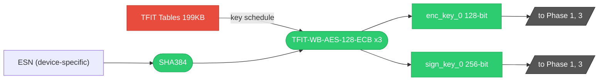
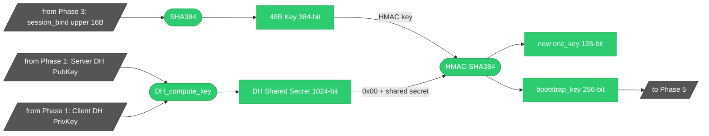
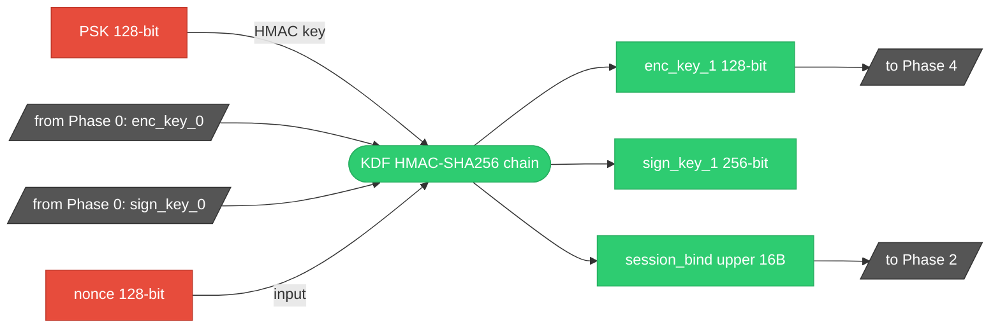
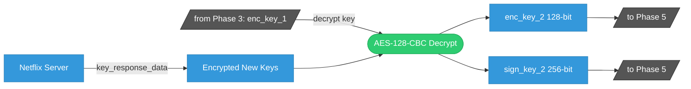
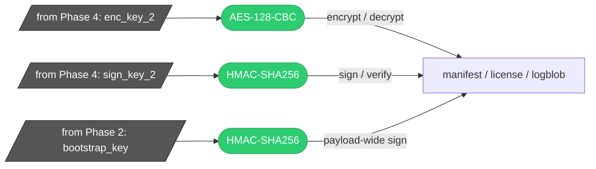
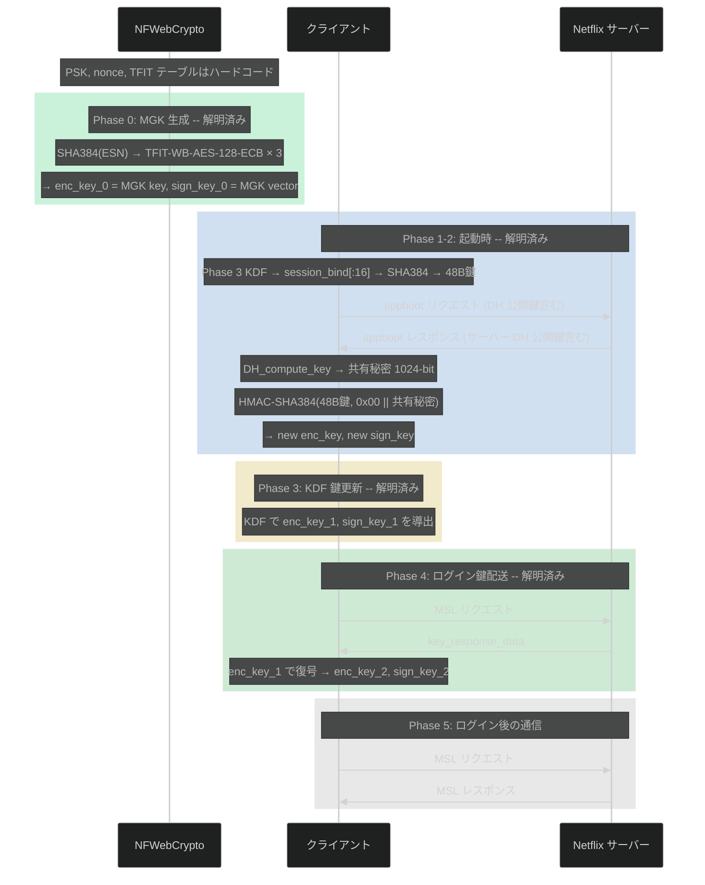
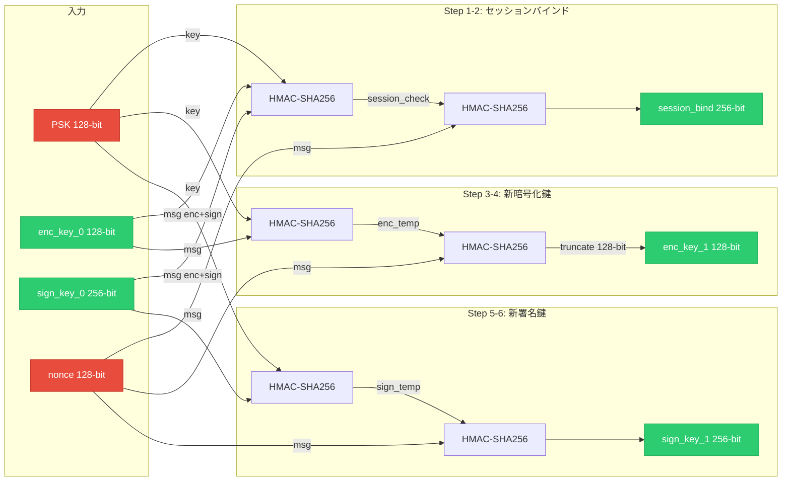
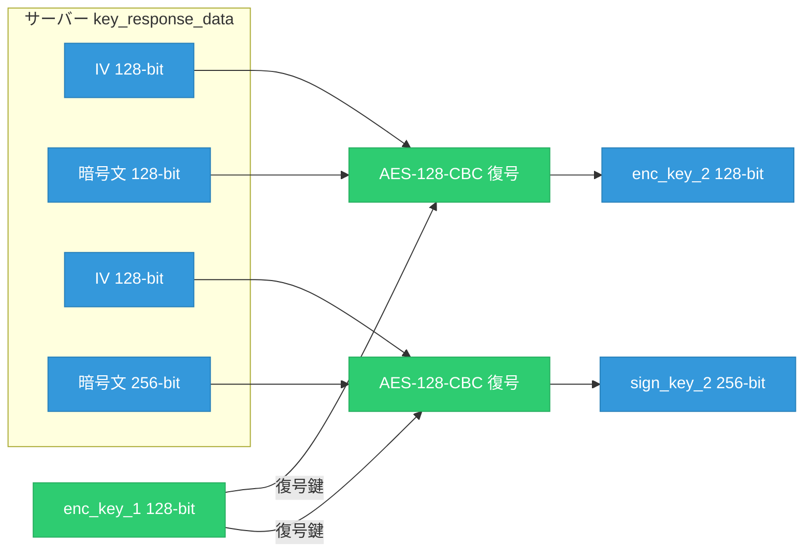

# Netflix iOS MSL 鍵の関係図

作成日: 2026-04-08
更新日: 2026-04-09 (全鍵導出チェーン解明: ESN → MGK → Phase 2/3/4/5)

---

## 1. 鍵の全体関係

> **実行順序**: Phase 0 → Phase 3 → Phase 1 → Phase 2 → Phase 4 → Phase 5
>
> Phase 番号は MSL 仕様上の論理的な分類であり、実行順とは一致しない。
> Phase 3 (KDF) が Phase 1-2 (DH 鍵交換) より**先に**実行され、
> session_bind を Phase 2 の入力として渡す。

### Phase 0: MGK Generation (Resolved)



### Phase 1: appboot Key Exchange

```mermaid
graph LR
    DH_P["DH p 1024-bit"] --> OP_DHGEN(["DH_generate_key"])
    DH_G["DH g = 5"] --> OP_DHGEN
    OP_DHGEN --> DH_PUB["Client DH PubKey 128B"]
    OP_DHGEN --> DH_PRIV["Client DH PrivKey 128B"]
    DH_PRIV --> TO_P2a[/"to Phase 2"/]
    DH_PUB --> OP_TFIT1(["TFIT-WB-AES-128-ECB x8"])
    OP_TFIT1 --> KEY336_PT["key 33.6 plaintext 352B"]
    FROM_P0a[/"from Phase 0: enc_key_0"/] --> KEY336_PT
    FROM_P0b[/"from Phase 0: sign_key_0 upper 16B"/] --> KEY336_PT
    NONCE_SRV["key 33.9 nonce 16B"] --> OP_XOR(["XOR Encode"])
    KEY336_PT --> OP_XOR
    OP_XOR --> KEY336_ENC["key 33.6 ciphertext"]
    KEY336_ENC -->|POST /appboot| SERVER["Netflix Server"]
    SERVER --> DH_RESP["appboot Response key 33"]
    DH_RESP --> TO_P2b[/"to Phase 2"/]
    ECC_BOOT["kAppBootEccKey P-256"] -.->|verify?| DH_RESP

    style DH_P fill:#e74c3c,stroke:#c0392b,color:#fff
    style DH_G fill:#e74c3c,stroke:#c0392b,color:#fff
    style ECC_BOOT fill:#e74c3c,stroke:#c0392b,color:#fff
    style NONCE_SRV fill:#2ecc71,stroke:#27ae60,color:#fff
    style SERVER fill:#3498db,stroke:#2980b9,color:#fff
    style DH_RESP fill:#3498db,stroke:#2980b9,color:#fff
    style DH_PUB fill:#2ecc71,stroke:#27ae60,color:#fff
    style DH_PRIV fill:#2ecc71,stroke:#27ae60,color:#fff
    style TO_P2a fill:#555,stroke:#333,color:#fff
    style TO_P2b fill:#555,stroke:#333,color:#fff
    style OP_DHGEN fill:#2ecc71,stroke:#27ae60,color:#fff
    style OP_TFIT1 fill:#2ecc71,stroke:#27ae60,color:#fff
    style OP_XOR fill:#2ecc71,stroke:#27ae60,color:#fff
    style KEY336_PT fill:#2ecc71,stroke:#27ae60,color:#fff
    style KEY336_ENC fill:#2ecc71,stroke:#27ae60,color:#fff
    style FROM_P0a fill:#555,stroke:#333,color:#fff
    style FROM_P0b fill:#555,stroke:#333,color:#fff
```



> **Note**: key 33.9 nonce is a 16B random value generated per-session by the client. Distinct from the hardcoded nonce at 0x1AC905.

### Phase 2: Initial Session Key Derivation (Resolved)



### Phase 3: KDF Key Renewal (Resolved)



### Phase 4: Login Key Distribution (Resolved)



### Phase 5: MSL Communication



### 凡例

| 形状 | 意味 |
|----|------|
| `["..."]` 四角 | データ (鍵, 秘密, ESN 等) |
| `(["..."])` 角丸 | 暗号操作 (SHA384, HMAC, AES 等) |
| `[/"..."/]` 平行四辺形 | Phase 間参照 (from/to Phase N) |

| 色 | 意味 |
|----|------|
| 赤 | バイナリ埋め込み定数 |
| 青 | サーバーレスポンス由来 |
| 緑 | 解明済み (Python + Unicorn で計算可能) |
| グレー | Phase 間参照ノード |

| 線種 | 意味 |
|----|------|
| `-->` 実線 | 確認済みのデータフロー |
| `-.->` 点線 | 推定 (未実証) |
| `-->｜label｜` エッジラベル | データの役割 (HMAC key, decrypt key 等) |

---

## 2. 鍵のライフサイクル



---

## 3. KDF 鍵更新の詳細フロー



**注意**: KDF は常に enc_key_0 / sign_key_0 を入力とする。enc_key_1 からのチェーン更新は行われない。

---

## 4. ログイン時の鍵配送



### 検証データ

```
enc_key_2 の復号:
  key = enc_key_1 = 97b99f4e88e8e73779aa20ac11877c5d
  iv  = d85aee3d39bfb1a6a38307fc61cbcccf
  ct  = 004e5f4b76443f81337c63ccc90be86e
  pt  = 0d968f3aa8cb79f85d9135760d63c93a  (enc_key_2)

sign_key_2 の復号:
  key = enc_key_1 = 97b99f4e88e8e73779aa20ac11877c5d
  iv  = d9ce8161058196b60cee9b81e8fff399
  ct  = 830fdc90b712b43d60087887f7aef42a956fd8ad92dd9b82fcc771a247a3f5b3
  pt  = 4eea8df1b3a59b20690739dc2e4080813438ef172c80ea8d0cc3d5298dd05a4e  (sign_key_2)
```

---

## 5. 鍵一覧

| 鍵名 | サイズ | 格納場所 | 用途 | 状態 |
|------|--------|----------|------|------|
| ESN | 可変 | デバイス固有 | MGK 生成の入力 | デバイスから取得 |
| PSK | 128-bit | バイナリ 0x1AC8F5 | KDF マスター鍵 | 確定 |
| nonce | 128-bit | バイナリ 0x1AC905 | KDF 入力 | 確定 |
| TFIT テーブル | 199KB | バイナリ 0x1ACF28-0x1DEBA8 | MGK 生成 (WB-AES) | 確定 |
| enc_key_0 (=MGK key) | 128-bit | TFIT(SHA384(ESN))[0:16] | AES-128-CBC 暗号化 (初期) | **Unicorn で計算可能** |
| sign_key_0 (=MGK vec) | 256-bit | TFIT(SHA384(ESN))[16:48] | HMAC-SHA256 署名 (初期) | **Unicorn で計算可能** |
| 48B 鍵 | 384-bit | SHA384(session_bind[:16]) | Phase 2 HMAC-SHA384 の鍵 | **計算可能** |
| enc_key_1 | 128-bit | KDF 出力 | 暗号化 + ログイン鍵配送の復号鍵 | 計算可能 |
| sign_key_1 | 256-bit | KDF 出力 | 署名 (ログイン前) | 計算可能 |
| enc_key_2 | 128-bit | サーバー配送 | 暗号化 (ログイン後) | enc_key_1 で復号可能 |
| sign_key_2 | 256-bit | サーバー配送 | 署名 (ログイン後) | enc_key_1 で復号可能 |
| bootstrap_key | 256-bit | Phase 2 KDF 出力 [16:48] | ペイロード全体署名 | **= Phase 2 sign_key** |
| DH p | 1024-bit | バイナリ | DH 鍵交換 | 確定 |
| DH g | - | バイナリ | DH 鍵交換 | 確定 |
| kAppBootKey | 4096-bit | バイナリ | 用途未確認 (RSA 暗号化は未使用) | 既知 |
| kAppBootEccKey | 256-bit | バイナリ | 用途未確認 (署名検証?) | 既知 |

---

## 6. 署名の二重構造

MSL メッセージには2種類の HMAC 署名が付与される:

| 署名鍵 | 対象データサイズ | 用途 |
|--------|----------------|------|
| sign_key (セッション鍵) | 76-499 bytes | MSL メッセージヘッダー/チャンク署名 |
| bootstrap_key | 6000-8500 bytes | ペイロード全体の署名 |

---

## 7. 解決済みの疑問

- ~~enc_key_0 / sign_key_0 の由来~~ → MGK = TFIT-WB-AES-128-ECB(SHA384(ESN)) (Phase 0 で確認)
- ~~48B HMAC 鍵の由来~~ → **SHA384(session_bind[:16])** で導出。session_bind は Phase 3 KDF の中間値
- ~~bootstrap_key の由来~~ → **Phase 2 KDF 出力の sign_key (dh_kdf_out[16:48])** と同一
- ~~HKDF で導出?~~ → NFWebCrypto に HKDF エクスポートなし。HMAC-SHA384 を使用
- ~~kAppBootKey で DH 公開鍵を RSA 暗号化?~~ → RSA_public_encrypt / EVP_PKEY_encrypt ともに未呼び出し
- ~~key 33.6 の構成方法~~ → CBOR ヘッダ (128B) + TFIT(DH_pub, 8ブロック) (128B) + MGK ペア (32B) + リクエスト固有 (64B)、全体を XOR(nonce) でエンコード
- ~~key 33.6 の復号鍵は何か~~ → ログイン時は enc_key_1 で復号 (Phase 4 で確認)

## 8. key 33.6 リクエストの構造 (352B 版)

```
key_33_6[i:i+16] = plaintext[i:i+16] XOR nonce(key_33_9)   # 全ブロック同一 nonce で XOR

plaintext (352B):
┌─────────────────────────────────────────────────┐
│ [0:128]   CBOR ヘッダ (128B)                    │ ← 固定 (Argo バイナリ構築)
│           d9d9f7a7 + CBOR スキャフォールド       │
├─────────────────────────────────────────────────┤
│ [128:256] TFIT 暗号化 DH 公開鍵 (128B)          │ ← TFIT-WB-AES-128-ECB × 8 ブロック
│           同じ iPhone 鍵スケジュールで暗号化      │
├─────────────────────────────────────────────────┤
│ [256:288] MGK ペア (32B)                         │ ← enc_key_0 (16B) + sign_key_0[:16] (16B)
│           サーバー側デバイス検証用                │
├─────────────────────────────────────────────────┤
│ [288:352] リクエスト固有データ (64B)              │ ← メッセージ ID / タイムスタンプ
└─────────────────────────────────────────────────┘
```

## 9. 残りの未解明ポイント

| 項目 | 詳細 |
|------|------|
| CBOR ヘッダの構成ロジック | Argo バイナリ内。固定値なのでキャプチャからコピー可能 |
| リクエスト固有領域 | メッセージ ID / タイムスタンプの生成ロジック。Argo バイナリ内 |
| 144B バリアントの構造 | map(6) vs map(7)。セッション領域が短縮される条件は未特定 |
| kAppBootKey / kAppBootEccKey | バイナリに存在するが appboot 中に使われていない。別用途? |

### Tweak フックの制約

| フック対象 | MSHookFunction | 理由 |
|-----------|:-:|------|
| DH_generate_key | OK | クライアント DH 公開鍵/秘密鍵キャプチャ |
| DH_compute_key | OK | DH 共有秘密キャプチャ |
| AES_set_encrypt_key / decrypt_key | OK | TFIT チェーン追跡、セッション鍵検出 |
| AES_encrypt | OK | TFIT 単一ブロック ECB 入出力キャプチャ |
| HMAC | OK | one-shot HMAC キャプチャ |
| HMAC_Init_ex / Final | OK | streaming HMAC + 48B 鍵の caller 取得 |
| SHA384 | OK | 48B 鍵生成の入出力キャプチャ |
| RSA_public_encrypt | OK | 未呼び出しを確認 |
| EVP_PKEY_encrypt | OK | 未呼び出しを確認 |
| AES_cbc_encrypt | NG | トランポリンが関数を破壊 |
| EVP_CipherInit_ex / Update | NG | RSA 鍵処理に干渉 |
| _TFIT_wbaes_ecb_encrypt_iAES11 | NG | シンボル未エクスポート (オフセットフック要) |
