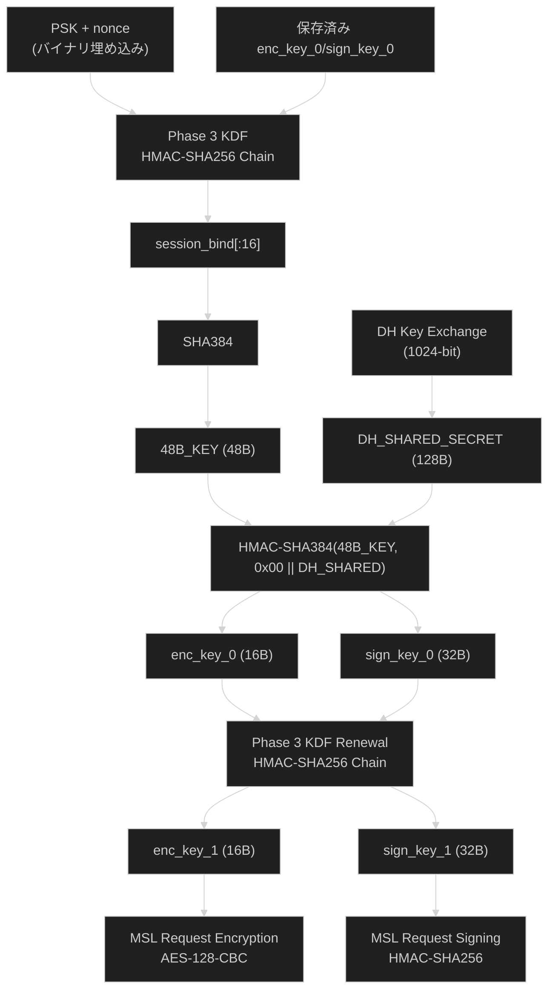

# Phase 2 KDF: DH 共有秘密 → 初期セッション鍵

## 概要

Netflix iOS アプリの MSL (Message Security Layer) において、DH 鍵交換で得られた共有秘密から初期セッション鍵 (enc_key, sign_key) を導出するアルゴリズムを解明した。

## アルゴリズム

```
HMAC-SHA384(TFIT_KEY_48B, 0x00 || DH_SHARED_SECRET_128B) → 48 bytes
  enc_key  = output[0:16]    (AES-128 暗号化鍵)
  sign_key = output[16:48]   (HMAC-SHA256 署名鍵)
```

### パラメータ

| パラメータ | サイズ | 説明 |
|-----------|--------|------|
| 48B_KEY | 48 bytes | `SHA384(session_bind[:16])` — Phase 3 KDF の中間値から導出 |
| DH_SHARED_SECRET | 128 bytes | `DH_compute_key()` の出力 (1024-bit DH) |
| 0x00 prefix | 1 byte | 固定プレフィックスバイト |

### 48B 鍵の導出 (解明済み)

```
session_check = HMAC-SHA256(PSK, enc_key_0 || sign_key_0)
session_bind  = HMAC-SHA256(session_check, nonce)
48B_KEY       = SHA384(session_bind[:16])
```

保存済みの enc_key_0/sign_key_0 + PSK + nonce (全て既知) から純粋に Python で計算可能。
TFIT ホワイトボックスは関与しない。`nflxDhDerive` (0x0FEEC) 内部で `SHA384` (0x10174) が呼ばれる。

### 重要な発見

1. **HKDF は存在しない**: NFWebCrypto.framework には `HKDF`, `HKDF_extract`, `HKDF_expand` のいずれもエクスポートされていない
2. **HMAC-SHA384**: Phase 3 KDF (HMAC-SHA256) とは異なるハッシュアルゴリズムを使用
3. **48B 鍵 = SHA384(session_bind[:16])**: TFIT ではなく、Phase 3 KDF の中間値から導出
4. **0x00 プレフィックス**: 共有秘密の前に `0x00` が付加される (data = 129 bytes)

## 検証済みテストベクタ

### セッション (2026-04-09)

```
TFIT_KEY   = 268ab8d5d6cb36781f4d9b7fdaccd2d6
             92c5b6af0161e640efad7a3bd4958b42
             efc7f6ce89f84c0e37bb66794d972819

DH_SHARED  = 6854f0b80187914f2e110cb07fb25e8c
             65c5a0f591aaf48dec8701128ceefa4f
             3aa623796400a6f97e0b6c271c2e39d3
             9432c3c5a82dd1e1301470ae418678b1
             b4df554027f35bc872c27de42edea18a
             928541dfec8c9388b788876529c87eec
             0bc71936013df12d366008005ef4e9f7
             905520da5170a6e15ae584415fdd175a

enc_key    = d7835418df48f1d54ab54e210cf40fc6
sign_key   = 794e627118ad213532399d2ecd0c85f9
             0d6739aca767db24d98ef9360bfd956e
```

## 鍵導出フロー全体



## タイムライン (ログから)

| 時刻 | イベント | 詳細 |
|------|---------|------|
| 01:08:57.661 | Phase 3 KDF | 保存済み enc_key_0/sign_key_0 から enc_key_1/sign_key_1 を導出 |
| 01:08:57.754 | TFIT KAT | Known Answer Test 開始 (AES-256) |
| 01:08:57.978 | appboot リクエスト | enc_key_0 でリクエスト暗号化 |
| 01:08:58.539 | TFIT チェーン | 100+ AES-256 ホワイトボックス操作 |
| 01:08:59.010 | **DH 鍵交換** | shared_secret(128B) 取得 |
| 01:08:59.025 | **Phase 2 KDF** | HMAC-SHA384(TFIT_KEY, 0x00 \|\| shared) → 新 enc_key/sign_key |
| 01:08:59.032 | Phase 3 KDF | 新鍵で即座に更新 |
| 01:08:59.052 | MSL 通信開始 | 更新済み enc_key_1 で暗号化 |

## 解明済み事項 (2026-04-09 更新)

### 48B 鍵の生成メカニズム — 完全解明

```
session_check = HMAC-SHA256(PSK, enc_key_0 || sign_key_0)
session_bind  = HMAC-SHA256(session_check, nonce)
48B_KEY       = SHA384(session_bind[:16])
```

- **TFIT は関与しない**: 48B 鍵は Phase 3 KDF の中間値 (session_bind) の SHA384 ハッシュ
- **純粋 Python で計算可能**: 保存済み enc_key_0/sign_key_0 + PSK + nonce から導出
- 静的解析 (`nflxDhDerive` at 0x0FEEC) でも SHA384 呼び出し (0x10174) を確認
- `AppleNativeKey::getBytes()` (0xD7E0) で XOR デコードされた鍵バイトが SHA384 の入力

### 初回セッション鍵の生成 — 解明済み (2026-04-09)

```
enc_key_0 || sign_key_0 = genModelGroupKeys(iPhone, ESN)
  = TFIT-WB-AES-128-ECB(SHA384(ESN)[0:16])
  || TFIT-WB-AES-128-ECB(SHA384(ESN)[16:32])
  || TFIT-WB-AES-128-ECB(SHA384(ESN)[32:48])
```

- **MGK (Model Group Key) = 初回 enc_key_0 + sign_key_0**
- ESN + TFIT テーブル (バイナリ埋め込み 199KB) から Unicorn エミュレーションで導出可能
- `tools/emulate_tfit.py` で実装済み、テストベクタで検証済み

### 残りの未解明事項

- **key 33.6 の TFIT エンコード**: DH 公開鍵 (128B) → 352B/144B の変換ロジック
  - TFIT テーブルの場所は特定済み (0x1ACF28 - 0x1DEBA8)
  - key 33.6 の平文構造 (XOR エンコード) は解明済み
  - 平文内の 160B セッション領域が TFIT 変換された DH データ
- **bootstrap_key の由来**: 未調査

## 関連ファイル

| ファイル | 説明 |
|---------|------|
| `src/netflix_msl/crypto.py` | `derive_initial_session_keys()` 実装 |
| `tools/verify_phase2_kdf.py` | 回帰テスト |
| `packages/tweak/AppbootKDF/` | TFIT キーキャプチャ Tweak |
| `packages/frida/hook_phase2_kdf.js` | 包括的暗号トレーサー |
| `raws/appboot_kdf_fresh.log` | 検証用ログ |
