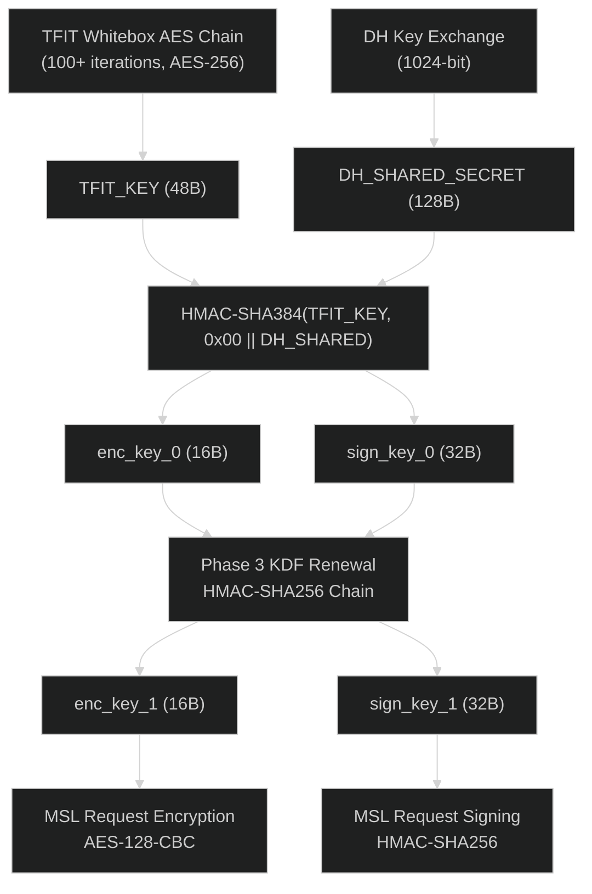

# Phase 2 KDF: DH 共有秘密 → 初期セッション鍵

## 概要

Netflix iOS アプリの MSL (Message Security Layer) において、DH 鍵交換で得られた共有秘密から初期セッション鍵 (enc_key, sign_key) を導出するアルゴリズムを解明した。

## アルゴリズム

```
HMAC-SHA384(TFIT_KEY_48B, 0x00 || DH_SHARED_SECRET_128B) → 48 bytes
  enc_key  = output[0:16]    (AES-128 暗号化鍵)
  sign_key = output[16:48]   (HMAC-SHA256 署名鍵)
```

### パラメータ

| パラメータ | サイズ | 説明 |
|-----------|--------|------|
| TFIT_KEY | 48 bytes | TFIT ホワイトボックス AES チェーンの出力。セッション毎に異なる |
| DH_SHARED_SECRET | 128 bytes | `DH_compute_key()` の出力 (1024-bit DH) |
| 0x00 prefix | 1 byte | 固定プレフィックスバイト |

### 重要な発見

1. **HKDF は存在しない**: NFWebCrypto.framework には `HKDF`, `HKDF_extract`, `HKDF_expand` のいずれもエクスポートされていない
2. **HMAC-SHA384**: Phase 3 KDF (HMAC-SHA256) とは異なるハッシュアルゴリズムを使用
3. **TFIT キーはセッション固有**: Irdeto TFIT ホワイトボックス AES チェーン (100+ iterations) によって生成される
4. **0x00 プレフィックス**: 共有秘密の前に `0x00` が付加される (data = 129 bytes)

## 検証済みテストベクタ

### セッション (2026-04-09)

```
TFIT_KEY   = 268ab8d5d6cb36781f4d9b7fdaccd2d6
             92c5b6af0161e640efad7a3bd4958b42
             efc7f6ce89f84c0e37bb66794d972819

DH_SHARED  = 6854f0b80187914f2e110cb07fb25e8c
             65c5a0f591aaf48dec8701128ceefa4f
             3aa623796400a6f97e0b6c271c2e39d3
             9432c3c5a82dd1e1301470ae418678b1
             b4df554027f35bc872c27de42edea18a
             928541dfec8c9388b788876529c87eec
             0bc71936013df12d366008005ef4e9f7
             905520da5170a6e15ae584415fdd175a

enc_key    = d7835418df48f1d54ab54e210cf40fc6
sign_key   = 794e627118ad213532399d2ecd0c85f9
             0d6739aca767db24d98ef9360bfd956e
```

## 鍵導出フロー全体



## タイムライン (ログから)

| 時刻 | イベント | 詳細 |
|------|---------|------|
| 01:08:57.661 | Phase 3 KDF | 保存済み enc_key_0/sign_key_0 から enc_key_1/sign_key_1 を導出 |
| 01:08:57.754 | TFIT KAT | Known Answer Test 開始 (AES-256) |
| 01:08:57.978 | appboot リクエスト | enc_key_0 でリクエスト暗号化 |
| 01:08:58.539 | TFIT チェーン | 100+ AES-256 ホワイトボックス操作 |
| 01:08:59.010 | **DH 鍵交換** | shared_secret(128B) 取得 |
| 01:08:59.025 | **Phase 2 KDF** | HMAC-SHA384(TFIT_KEY, 0x00 \|\| shared) → 新 enc_key/sign_key |
| 01:08:59.032 | Phase 3 KDF | 新鍵で即座に更新 |
| 01:08:59.052 | MSL 通信開始 | 更新済み enc_key_1 で暗号化 |

## 未解明事項

### TFIT 48B キーの生成メカニズム

- TFIT キーは AES-256 ホワイトボックスチェーン (Irdeto) の出力
- セッション毎に異なる値を生成
- TFIT 内部の入力が何か（乱数？デバイス固有値？）は未特定
- 48B キーは `AES_set_*_key` フックでは捕捉不可能（暗号化出力として生成される）
- **Tweak の HMAC_Init_ex フックで毎セッション取得可能**

### 純粋 Python シミュレーションの制限

現時点では、TFIT 48B キーの取得に以下のいずれかが必要:

1. **Tweak フック** (推奨): AppbootKDF Tweak が HMAC_Init_ex で 48B キーをキャプチャ
2. **Frida フック**: hook_phase2_kdf.js で同等のキャプチャが可能
3. **TFIT リバースエンジニアリング** (未達): ホワイトボックス内部の完全な解析

## 関連ファイル

| ファイル | 説明 |
|---------|------|
| `src/netflix_msl/crypto.py` | `derive_initial_session_keys()` 実装 |
| `tools/verify_phase2_kdf.py` | 回帰テスト |
| `packages/tweak/AppbootKDF/` | TFIT キーキャプチャ Tweak |
| `packages/frida/hook_phase2_kdf.js` | 包括的暗号トレーサー |
| `raws/appboot_kdf_fresh.log` | 検証用ログ |
