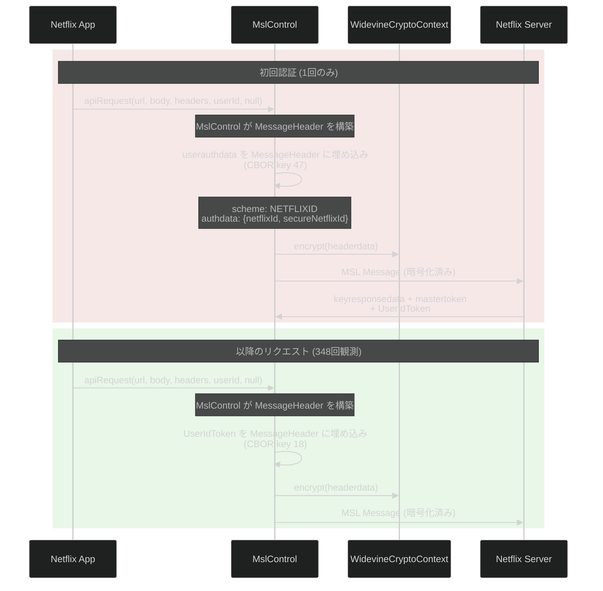
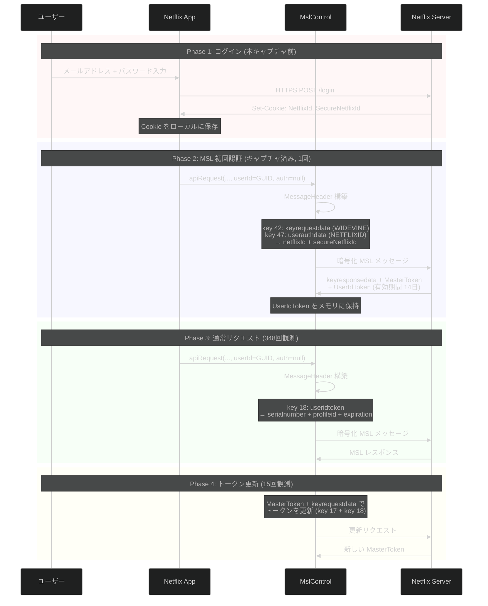

# Netflix MSL UserAuthData — Android 動的解析レポート

Netflix Android アプリ (`com.netflix.mediaclient` v9.57.0) の MSL 通信におけるユーザー認証データ (`userauthdata`) の生成・送信メカニズムを、Frida フックおよびキャプチャ済み暗号平文の CBOR 解析により明らかにした結果をまとめる。

---

## 1. 結論サマリー

| 項目 | 内容 |
|---|---|
| **userauthdata の送信タイミング** | **初回認証時のみ 1 回** (鍵交換 + エンティティ認証) |
| **使用される認証スキーム** | `NETFLIXID` (netflixId + secureNetflixId) |
| **通常リクエストの認証方式** | `UserIdToken` (key 18) — サーバー発行のトークン |
| **CBOR キー** | userauthdata = **key 47**, useridtoken = **key 18** |
| **apiRequest 第5引数** | 常に `null` — userauthdata は MslControl 層で MSL MessageHeader に直接埋め込まれ、apiRequest パラメータとしては渡されない |

---

## 2. ユーザー認証フロー



---

## 3. キャプチャデータによる証明

### 3.1 MSL MessageHeader の認証キー分布

353 件の暗号化前 MSL MessageHeader (Widevine encrypt 平文) を CBOR 解析した結果:

| 認証方式 | CBOR キー | 件数 | 割合 |
|---|---|---|---|
| **UserIdToken のみ** | key 18 | 348 | 98.6% |
| **userauthdata のみ** (NETFLIXID) | key 47 | 1 | 0.3% |
| **どちらもなし** (鍵交換 handshake) | — | 5 | 1.1% |
| **両方** | key 18 + 47 | 0 | 0% |

### 3.2 userauthdata が送信されたヘッダー (1件)

ファイル: `logs/android_20260313/android14.prod.ftl.netflix.com/0052_msl.widevine.encrypt.json`

```
MSL MessageHeader CBOR キー:
  [17, 19, 20, 21, 22, 24, 36, 40, 41, 42, 47]
    17: mastertoken (list)
    19: renewable = false
    20: sender = "" (ESN)
    21: handshake = true        ← 鍵交換ハンドシェイク
    22: messageid = 2491352839960294
    24: timestamp = 1773392548
    40: peer = true
    41: nonreplayable_id = 10
    42: keyrequestdata (WIDEVINE)
    47: userauthdata            ← ★ ここにユーザー認証データ
```

### 3.3 userauthdata の構造 (CBOR key 47)

```json
{
  "30": "NETFLIXID",
  "35": {
    "56": "<netflixId>",
    "60": "<secureNetflixId>"
  }
}
```

| CBOR キー | フィールド名 | 値 |
|---|---|---|
| `30` | `scheme` | `NETFLIXID` |
| `35` | `authdata` | (dict) |
| `35.56` | `netflixId` | `v=3&mac=AQEAEQABABQxZyPp7r91RNj4pmPTIatYcL3jjIUVbvQ.&dt=1773392547767` |
| `35.60` | `secureNetflixId` | `v=3&ct=<暗号化トークン 672文字>&pg=ZEULH5S2GNGCRAABCSG6J2EGGA&ch=<HMAC>` |

### 3.4 netflixId の構造

```
v=3&mac=AQEAEQABABQxZyPp7r91RNj4pmPTIatYcL3jjIUVbvQ.&dt=1773392547767
```

| パラメータ | 値 | 意味 |
|---|---|---|
| `v` | `3` | バージョン |
| `mac` | `AQEAEQABABQxZyPp7r91RNj4pmPTIatYcL3jjIUVbvQ.` | HMAC 署名 (改ざん検知) |
| `dt` | `1773392547767` | デバイスタイムスタンプ (Unix ms) |

### 3.5 secureNetflixId の構造

```
v=3&ct=<暗号化トークン>&pg=ZEULH5S2GNGCRAABCSG6J2EGGA&ch=<HMAC>
```

| パラメータ | 値 | 意味 |
|---|---|---|
| `v` | `3` | バージョン |
| `ct` | `BgjHlOvcAxLcA5Nne...` (672 文字) | 暗号化された認証トークン (protobuf base64url) |
| `pg` | `ZEULH5S2GNGCRAABCSG6J2EGGA` | プロファイル GUID |
| `ch` | `AQEAEAABABTp79nN9l_2MuRhqTXl0-SjAqcm83QU8vw.` | チャネル HMAC |

---

## 4. UserIdToken の構造 (通常リクエスト)

初回認証後、サーバーから発行された `UserIdToken` が以降の全リクエストで使用される。

### 4.1 CBOR 構造 (key 18)

```json
{
  "15": "<tokendata (bytes, CBOR エンコード)>",
  "16": "<signature (bytes, 44B HMAC)>"
}
```

### 4.2 tokendata の CBOR 構造

| CBOR キー | フィールド名 | 値 (キャプチャ例) |
|---|---|---|
| `29` | `userdata` | `<bytes 217>` (暗号化されたユーザーデータ) |
| `25` | `serialnumber` | `5970945423176003` |
| `11` | `issuedate` | `1773420422` (2026-03-13 16:47:02 UTC) |
| `12` | `mtserialnum` | `8079134327147185` (紐づく MasterToken のシリアル) |
| `profileid` | `profileid` | `ZEULH5S2GNGCRAABCSG6J2EGGA` |
| `13` | `expiration` | `1774601222` (2026-03-27 08:47:02 UTC, **14日後**) |

### 4.3 トークンライフサイクル

```
発行: 2026-03-13 16:47:02 UTC
有効期限: 2026-03-27 08:47:02 UTC
有効期間: 14日間
```

同一セッション内で全 348 リクエストが同じ UserIdToken (serialnumber: `5970945423176003`) を使用。

---

## 5. 認証スキーム一覧

Netflix MSL は 5 つのユーザー認証スキームをサポート (iOS ドキュメントから):

| スキーム | クラス (Android) | 送信データ | 用途 |
|---|---|---|---|
| **`NETFLIXID`** | `com.netflix.msl.userauth.NetflixIdAuthenticationData` (ProGuard 難読化) | netflixId, secureNetflixId | **本キャプチャで観測** — Cookie ベース認証 |
| `EMAIL_PASSWORD` | ProGuard 難読化 (ClassNotFound) | email, password | ログインフォーム認証 |
| `USER_ID_TOKEN` | `com.netflix.msl.userauth.UserIdTokenAuthenticationData` | 既存 UserIdToken | トークン再認証 |
| `SSO_TOKEN` | ProGuard 難読化 (ClassNotFound) | ssoToken | SSO 認証 |
| `SWITCH_PROFILE` | ProGuard 難読化 (ClassNotFound) | switchGUID, originalGUID | プロファイル切替 |

### 5.1 ProGuard 難読化の影響

| クラス | 状態 |
|---|---|
| `UserAuthenticationData` (基底クラス) | **存在確認済み** — メソッド `a(2)`, `b(2)`, `c(2)` に難読化 |
| `UserIdTokenAuthenticationData` | **存在確認済み** — コンストラクタフック成功 (ただし呼び出しなし) |
| `EmailPasswordAuthenticationData` | ClassNotFoundException |
| `NetflixIdAuthenticationData` | ClassNotFoundException |
| `SsoTokenAuthenticationData` | ClassNotFoundException |
| `SwitchProfileAuthenticationData` | ClassNotFoundException |

→ 4 つのサブクラスが ProGuard で難読化/インライン化されている。`UserIdTokenAuthenticationData` のみ元のクラス名が残存。

---

## 6. MSL CBOR 整数キーマッピング (固定値)

MSL プロトコルは JSON と CBOR の 2 つのエンコーディングをサポートする。CBOR エンコード時は、JSON の文字列キーが**プロトコル仕様で定義された固定の整数キー**に置換される。これはメッセージサイズ削減のための最適化であり、Netflix の MSL ライブラリ (`MslEncoderFactory`) にハードコードされている。

以下のマッピングは、353 件の暗号化前 MSL MessageHeader と 403 件の PayloadChunk の CBOR 解析、および iOS 版 MSL ドキュメント (`msl_ios.md` §3) の JSON フィールド名との照合により確定したものである。

### 6.1 MSL メッセージ外殻 (Header / MasterToken / EntityAuthData)

JSON 構造:
```json
{
  "headerdata": "<Base64 暗号文>",
  "signature": "<Base64 HMAC-SHA256>",
  "mastertoken": { "tokendata": "...", "signature": "..." }
}
```

| CBOR キー | JSON フィールド名 | 型 | 説明 | 観測値例 |
|---|---|---|---|---|
| `15` | `tokendata` | bytes | トークンデータ (CBOR エンコード、暗号化済み) | `<bytes 153〜296>` |
| `16` | `signature` | bytes | HMAC 署名 | `<bytes 44>` (HMAC-SHA256) |

> **注**: key 15/16 は MasterToken, UserIdToken, keyrequestdata 等の**トークン系構造体で共通使用**される汎用キー。

### 6.2 MessageHeader (復号後の headerdata)

JSON 構造 (iOS 版 `msl_ios.md` §3.2):
```json
{
  "messageid": 12345,
  "sender": "NFANDROID1-PRV-P-...",
  "renewable": false,
  "handshake": false,
  "timestamp": 1773392401,
  "capabilities": { ... },
  "useridtoken": { "tokendata": "...", "signature": "..." },
  "userauthdata": { "scheme": "NETFLIXID", "authdata": { ... } },
  "keyrequestdata": [ ... ],
  "nonreplayableid": 10
}
```

| CBOR キー | JSON フィールド名 | 型 | 説明 | 観測数 |
|---|---|---|---|---|
| `17` | `mastertoken` | list[dict{15,16}] | MasterToken (tokendata + signature) | 18 件 |
| `18` | `useridtoken` | dict{15,16} | UserIdToken (tokendata + signature) | 348 件 |
| `19` | `renewable` | bool | トークン更新可能フラグ | 353 件 (全ヘッダー) |
| `20` | `sender` | string | 送信者 ESN (空文字列 = デフォルト) | 353 件 |
| `21` | `handshake` | bool | ハンドシェイクメッセージフラグ | 353 件 |
| `22` | `messageid` | int | メッセージ一意 ID | 353 件 |
| `24` | `timestamp` | int | Unix タイムスタンプ (秒) | 353 件 |
| `36` | `capabilities` | dict | クライアント能力情報 | 353 件 |
| `40` | `peer` | bool | ピアツーピアフラグ | 353 件 |
| `41` | `nonreplayableid` | int | リプレイ防止 ID | 2 件 |
| `42` | `keyrequestdata` | list[dict{30,31}] | 鍵交換リクエストデータ | 3 件 |
| `47` | `userauthdata` | dict{30,35} | **ユーザー認証データ** | 1 件 |

### 6.3 capabilities (key 36 の内部)

| CBOR キー | JSON フィールド名 | 型 | 説明 | 観測値 |
|---|---|---|---|---|
| `37` | `compressionalgos` | list[string] | サポート圧縮アルゴリズム | `[]` (空) |
| `38` | `languages` | list[string] | サポート言語 | `["GZIP", "LZW"]` |
| `39` | `encoders` | list[string] | サポートエンコーダー | `["CBOR"]` |
| `maxpayloadchunksize` | `maxpayloadchunksize` | int | 最大ペイロードチャンクサイズ | `-1` (無制限) |

> **注**: `maxpayloadchunksize` は文字列キーのまま。Netflix 独自拡張のため整数キーが未割当と推定。

### 6.4 keyrequestdata / keyresponsedata (key 42 の内部要素)

| CBOR キー | JSON フィールド名 | 型 | 説明 | 観測値 |
|---|---|---|---|---|
| `30` | `scheme` | string | 鍵交換スキーム | `"WIDEVINE"` |
| `31` | `keydata` | dict | 鍵データ | Widevine デバイス証明書 |
| `31.duid` | `keydata.duid` | bytes | デバイス一意 ID (32B) | Widevine deviceUniqueId |
| `31.50` | `keydata.cdmsg` | bytes | CDM メッセージ (protobuf) | Widevine ライセンスチャレンジ (~2577B) |

### 6.5 userauthdata (key 47 の内部)

| CBOR キー | JSON フィールド名 | 型 | 説明 | 観測値 |
|---|---|---|---|---|
| `30` | `scheme` | string | 認証スキーム | `"NETFLIXID"` |
| `35` | `authdata` | dict | スキーム固有の認証データ | dict{56, 60} |

#### NETFLIXID スキームの authdata (key 35 の内部)

| CBOR キー | JSON フィールド名 | 型 | 説明 |
|---|---|---|---|
| `56` | `netflixid` | string | NetflixId Cookie (URL エンコード) |
| `60` | `securenetflixid` | string | SecureNetflixId Cookie (URL エンコード) |

### 6.6 MasterToken tokendata (key 17[].15 を CBOR デコード)

| CBOR キー | JSON フィールド名 | 型 | 説明 | 観測値例 |
|---|---|---|---|---|
| `25` | `serialnumber` | int | MasterToken シリアル番号 | `5970945423176003` |
| `26` | `renewable` | bool | 更新可能フラグ | `true` |
| `27` | `issuer` | string | 発行者 | `"sf"`, `"cad"` |
| `28` | `identity` | bytes | エンティティ ID (暗号化済み) | `<bytes 125〜226>` |
| `43` | `sequencenumber` | int | シーケンス番号 | `8079134327147185` |

### 6.7 UserIdToken tokendata (key 18.15 を CBOR デコード)

| CBOR キー | JSON フィールド名 | 型 | 説明 | 観測値例 |
|---|---|---|---|---|
| `11` | `issuedate` | int | 発行日 (Unix タイムスタンプ秒) | `1773420422` |
| `12` | `mtserialnum` | int | 紐づく MasterToken のシリアル番号 | `8079134327147185` |
| `13` | `expiration` | int | 有効期限 (Unix タイムスタンプ秒) | `1774601222` |
| `25` | `serialnumber` | int | UserIdToken シリアル番号 | `5970945423176003` |
| `29` | `userdata` | bytes | 暗号化されたユーザーデータ | `<bytes 217>` |
| `profileid` | `profileid` | string | プロファイル GUID | `"ZEULH5S2GNGCRAABCSG6J2EGGA"` |

> **注**: `profileid` は文字列キーのまま。Netflix 独自拡張フィールド。

### 6.8 PayloadChunk (暗号化前)

| CBOR キー | JSON フィールド名 | 型 | 説明 | 観測値例 |
|---|---|---|---|---|
| `14` | `sequencenumber` | int | チャンクシーケンス番号 | `1`, `2`, ... `8` |
| `22` | `messageid` | int | メッセージ ID (MessageHeader と一致) | `1170337128274032` |
| `44` | `compressionalgo` | string | 圧縮アルゴリズム | `"GZIP"` |
| `62` | `data` | bytes | ペイロードデータ (GZIP 圧縮) | `<bytes 40〜3497>` |
| `63` | `endofmsg` | bool | 最終チャンクフラグ | `true` / `false` |

### 6.9 全整数キー一覧 (ソート順)

キャプチャデータから観測された全 28 整数キーの完全一覧:

| CBOR キー | JSON フィールド名 | 使用コンテキスト |
|---|---|---|
| `11` | `issuedate` | UserIdToken.tokendata |
| `12` | `mtserialnum` | UserIdToken.tokendata |
| `13` | `expiration` | UserIdToken.tokendata |
| `14` | `sequencenumber` | PayloadChunk |
| `15` | `tokendata` | MasterToken, UserIdToken, keyrequestdata (共通) |
| `16` | `signature` | MasterToken, UserIdToken, keyrequestdata (共通) |
| `17` | `mastertoken` | MessageHeader |
| `18` | `useridtoken` | MessageHeader |
| `19` | `renewable` | MessageHeader |
| `20` | `sender` | MessageHeader |
| `21` | `handshake` | MessageHeader |
| `22` | `messageid` | MessageHeader, PayloadChunk |
| `24` | `timestamp` | MessageHeader |
| `25` | `serialnumber` | MasterToken.tokendata, UserIdToken.tokendata |
| `26` | `renewable` | MasterToken.tokendata |
| `27` | `issuer` | MasterToken.tokendata |
| `28` | `identity` | MasterToken.tokendata |
| `29` | `userdata` | UserIdToken.tokendata |
| `30` | `scheme` | keyrequestdata, userauthdata |
| `31` | `keydata` | keyrequestdata |
| `35` | `authdata` | userauthdata |
| `36` | `capabilities` | MessageHeader |
| `37` | `compressionalgos` | capabilities |
| `38` | `languages` | capabilities |
| `39` | `encoders` | capabilities |
| `40` | `peer` | MessageHeader |
| `41` | `nonreplayableid` | MessageHeader |
| `42` | `keyrequestdata` | MessageHeader |
| `43` | `sequencenumber` | MasterToken.tokendata |
| `44` | `compressionalgo` | PayloadChunk |
| `47` | `userauthdata` | MessageHeader |
| `50` | `cdmsg` | keyrequestdata.keydata (Widevine) |
| `56` | `netflixid` | userauthdata.authdata (NETFLIXID) |
| `60` | `securenetflixid` | userauthdata.authdata (NETFLIXID) |
| `62` | `data` | PayloadChunk |
| `63` | `endofmsg` | PayloadChunk |

### 6.10 文字列キー (整数マッピングなし)

| キー | 使用コンテキスト | 説明 |
|---|---|---|
| `maxpayloadchunksize` | capabilities | 最大ペイロードチャンクサイズ |
| `profileid` | UserIdToken.tokendata | プロファイル GUID |
| `duid` | keyrequestdata.keydata | デバイス一意 ID |

> これらは Netflix 独自の拡張フィールドであり、MSL 標準の整数キーが割り当てられていないと推定される。

---

## 7. userauthdata の生成メカニズム

### 7.1 生成レイヤー

`userauthdata` は `apiRequest` のパラメータとしてではなく、**MslControl 層で MSL MessageHeader に直接埋め込まれる**:

```
Netflix App
  ↓ apiRequest(url, body, headers, userId=GUID, auth=null)
ApiHandlerImpl
  ↓ (auth は null のまま渡される)
MslControl
  ↓ MessageHeader を構築
  ↓ ← ここで userauthdata を設定
  ↓   (初回: NETFLIXID スキーム)
  ↓   (以降: UserIdToken を使用)
WidevineCryptoContext.encrypt(headerdata)
  ↓
暗号化された MSL メッセージ → サーバー送信
```

### 7.2 netflixId / secureNetflixId の生成元

これらの値は **Android の Cookie ストレージ** から取得される:

| Cookie 名 | 生成元 | 保存場所 |
|---|---|---|
| `netflixId` (=`NetflixId`) | サーバーが Set-Cookie で発行 | Android CookieManager / SharedPreferences |
| `secureNetflixId` (=`SecureNetflixId`) | サーバーが Set-Cookie で発行 (Secure 属性) | Android CookieManager / SharedPreferences |

ログイン成功時にサーバーからこれらの Cookie が発行され、MSL ユーザー認証に使用される。

### 7.3 RenewSSOToken との関係

キャプチャで `RenewSSOToken` GraphQL オペレーションが観測されている:

```json
{
  "operationName": "RenewSSOToken",
  "variables": {
    "ssoToken": "BgiHtuvcAxL4AWLUqSE7W14gsbHZBDGMle4StHvRnr70..."
  }
}
```

これは MSL レベルの `userauthdata` とは別の、**GraphQL レベルの SSO トークン更新**。MSL 層では既に UserIdToken で認証されており、SSO トークン更新は MSL ペイロード内で行われる。

---

## 8. 認証フロー全体図



---

## 9. iOS 版との比較

| 観点 | Android | iOS |
|---|---|---|
| **userauthdata スキーム** | `NETFLIXID` (netflixId + secureNetflixId) | `NETFLIXID` (同一) |
| **CBOR キー** | 整数キー (47, 18, etc.) | 整数キー (同一仕様) |
| **apiRequest パラメータ** | 第5引数 `UserAuthenticationData auth` = null | `makeUserAuthData()` メソッドで生成 |
| **userauthdata 設定レイヤー** | MslControl (Java) | IosMslClient (C++) |
| **暗号化** | WidevineCryptoContext | AES-CBC (C++) |
| **UserIdToken 有効期間** | 14 日 | 不明 |
| **ProGuard 影響** | サブクラス 4/5 が難読化で ClassNotFound | N/A (C++ バイナリ) |

---

## 10. 解析に使用したコード

### 10.1 CBOR デコードスクリプト

```python
import base64, json, cbor2
from urllib.parse import unquote

# Widevine encrypt 平文から MSL MessageHeader を解析
with open("logs/android_20260313/android14.prod.ftl.netflix.com/0052_msl.widevine.encrypt.json") as f:
    data = json.load(f)

raw = base64.b64decode(data["plaintext_b64"])
header = cbor2.loads(raw)

# userauthdata (key 47) を取得
if 47 in header:
    uad = header[47]
    scheme = uad[30]           # "NETFLIXID"
    authdata = uad[35]
    netflix_id = unquote(authdata[56])
    secure_netflix_id = unquote(authdata[60])
    print(f"scheme: {scheme}")
    print(f"netflixId: {netflix_id}")
    print(f"secureNetflixId: {secure_netflix_id}")

# UserIdToken (key 18) を取得
if 18 in header:
    uit = header[18]
    tokendata = cbor2.loads(uit[15])
    print(f"profileid: {tokendata.get('profileid')}")
    print(f"serialnumber: {tokendata.get(25)}")
    print(f"expiration: {tokendata.get(13)}")
```

### 10.2 Frida フックによるキャプチャ

`hook_netflix_android.js` に以下のフックを実装:

| フック対象 | 目的 | 結果 |
|---|---|---|
| `ApiHandlerImpl.apiRequest` 第5引数 | UserAuthenticationData オブジェクト取得 | **常に null** (MslControl 層で設定されるため) |
| `UserIdTokenAuthenticationData.$init` | コンストラクタ監視 | **フック成功、呼び出しなし** (トークンはサーバーから受信) |
| `EmailPasswordAuthenticationData.$init` | コンストラクタ監視 | ClassNotFoundException (ProGuard) |
| `NetflixIdAuthenticationData.$init` | コンストラクタ監視 | ClassNotFoundException (ProGuard) |
| `SsoTokenAuthenticationData.$init` | コンストラクタ監視 | ClassNotFoundException (ProGuard) |
| `SwitchProfileAuthenticationData.$init` | コンストラクタ監視 | ClassNotFoundException (ProGuard) |
| `UserAuthenticationData.getScheme` | スキーム名取得 | メソッド名が難読化 (ProGuard) |
| `WidevineCryptoContext.encrypt` | 暗号化前平文取得 | **成功** — CBOR 解析で userauthdata 発見 |

---

## 11. まとめ

1. **`userauthdata` は MSL MessageHeader の CBOR key 47 として暗号化前に埋め込まれる**。`apiRequest` のパラメータ（第5引数）としては渡されず、`MslControl` 層が Cookie ストレージから `netflixId` / `secureNetflixId` を読み取って設定する。

2. **NETFLIXID スキーム**が使用され、`netflixId` (HMAC 付きデバイストークン) と `secureNetflixId` (暗号化認証トークン + プロファイル GUID) の 2 つの値で構成される。

3. **初回の MSL ハンドシェイク時に 1 回だけ送信**される。サーバーは応答として `UserIdToken` (有効期間 14 日) を発行し、以降の全リクエストはこの `UserIdToken` (key 18) で認証される。

4. **353 件の MSL ヘッダーのうち userauthdata を含むのは 1 件のみ** (0.3%)。残りの 98.6% は `UserIdToken` による認証。

5. ProGuard 難読化により `NetflixIdAuthenticationData` 等のサブクラスは直接フックできないが、**Widevine encrypt の平文データを CBOR 解析することで userauthdata の完全な内容を取得できた**。
